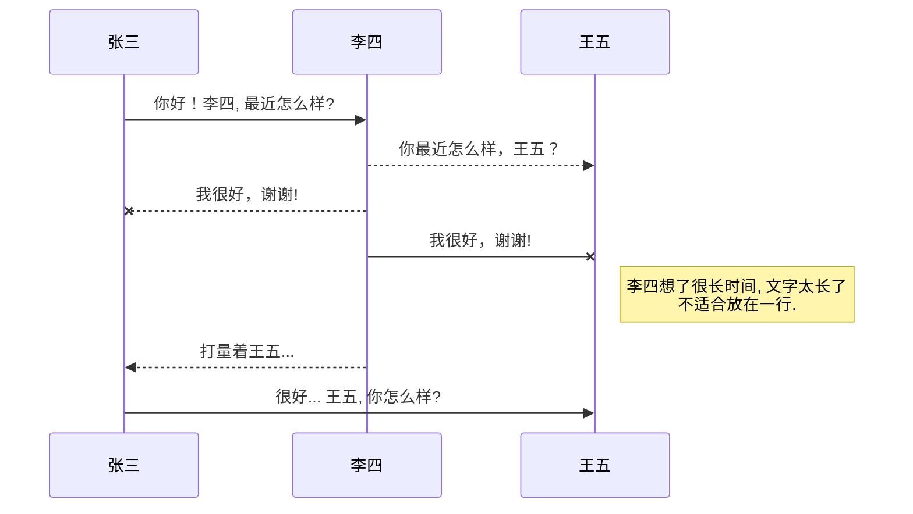

# 全局生成目录


## 一、标题

注：标准语法一般在#后跟个空格再写文字

```
# 这是一级标题
## 这是二级标题
### 这是三级标题
#### 这是四级标题
##### 这是五级标题
###### 这是六级标题
```

# 这是一级标题
## 这是二级标题
### 这是三级标题
#### 这是四级标题
##### 这是五级标题
###### 这是六级标题

---


## 二、字体

```
**这是加粗的文字**
*这是倾斜的文字*
***这是斜体加粗的文字***
~~这是加删除线的文字~~
==高亮== 
```

效果如下：

**加粗**	*倾斜*	***斜体加粗***	~~删除线~~	==高亮== `gaoliang`

---


## 三、引用

```
>这是引用的内容
>>这是引用的内容
>>>>>>>>>>这是引用的内容
```

效果如下：

> 引用
> > 引用
> >
> > > 引用

---


## 四、分割线

````
---
````

---


## 五、图片

````


图片alt就是显示在图片下面的文字，相当于对图片内容的解释。
图片title是图片的标题，当鼠标移到图片上时显示的内容。title可加可不加
````

示例：

```

```

[参考图床](https://www.jianshu.com/p/ea1eb11db63f)

```html

<!--html格式更通用-->


```


---


## 六、超链接

```
[超链接名](超链接地址 "超链接title")
title可加可不加
```

`[百度](http://baidu.com)`

[百度](http://baidu.com)

---


## 七、列表

### 无序列表

```
- 列表内容
+ 列表内容
* 列表内容

注意：- + * 跟内容之间都要有一个空格
```

- 列表内容
+ 列表内容

* 列表内容

### 有序列表

```
1. 列表内容
2. 列表内容
3. 列表内容

注意：序号跟内容之间要有空格
```

1. 列表内容
2. 列表内容
3. 列表内容

### 列表嵌套

上一级和下一级之间三个空格

- 一级列表 
   - 二级列表
      - 三级
   - 二级列表
      - 三级列表

---


## 八、表格

```
表头|表头|表头
---|:--:|---:
内容|内容|内容
内容|内容|内容

第二行分割表头和内容。
- 有一个就行，为了对齐，多加了几个
文字默认居左
-两边加：表示文字居中
-右边加：表示文字居右
注：原生的语法两边都要用 | 包起来。此处省略
```

| 表头 | 表头 | 表头 |
| ---- | :--: | ---: |
| 内容 | 内容 | 内容 |
| 内容 | 内容 | 内容 |

---


## 九、代码

单行代码

`Hello World!`

```
`代码内容`
```

代码块

````
```
	代码
```
````

```java
public static void main(String[] args){
	sout;
}
```

---


## 十、UML图

````

````


---

## 十一、流程图

````
```flow
st=>start: 开始框
op=>operation: 处理框
cond=>condition: 判断框(是或否?)
sub1=>subroutine: 子流程
io=>inputoutput: 输入输出框
e=>end: 结束框
st->op->cond
cond(yes)->io->e
cond(no)->sub1(right)->op
```
````


```flow
st=>start: 开始框
op=>operation: 处理框
cond=>condition: 判断框(是或否?)
sub1=>subroutine: 子流程
io=>inputoutput: 输入输出框
e=>end: 结束框
st->op->cond
cond(yes)->io->e
cond(no)->sub1(right)->op
```

