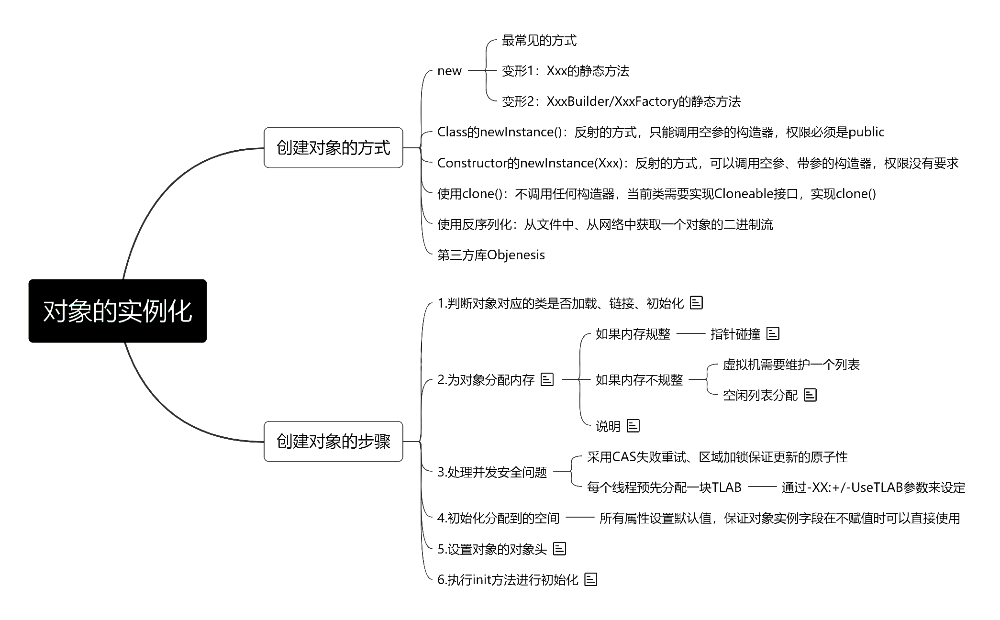
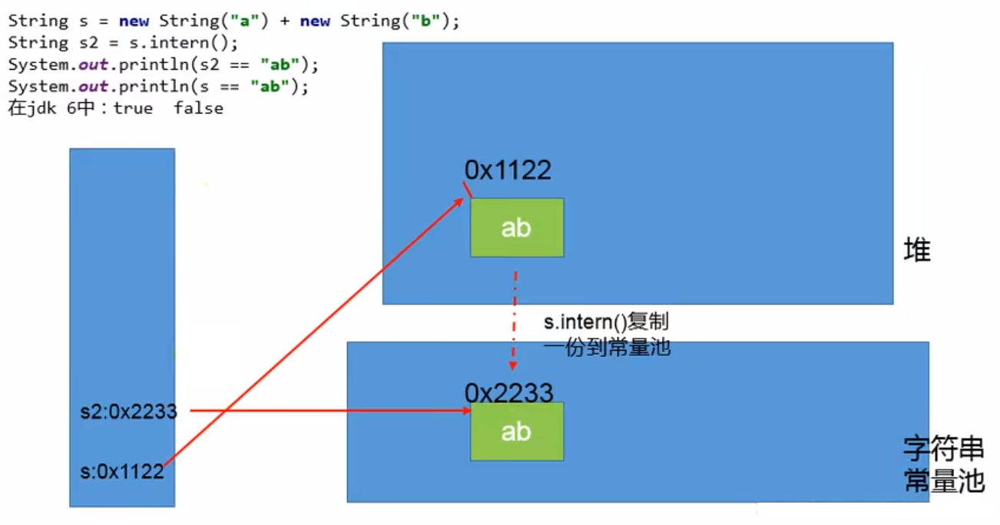
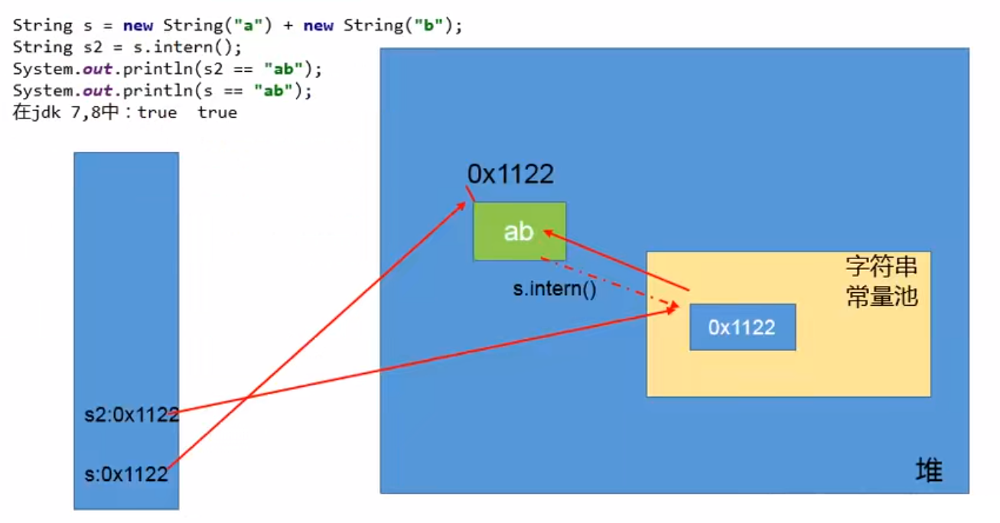
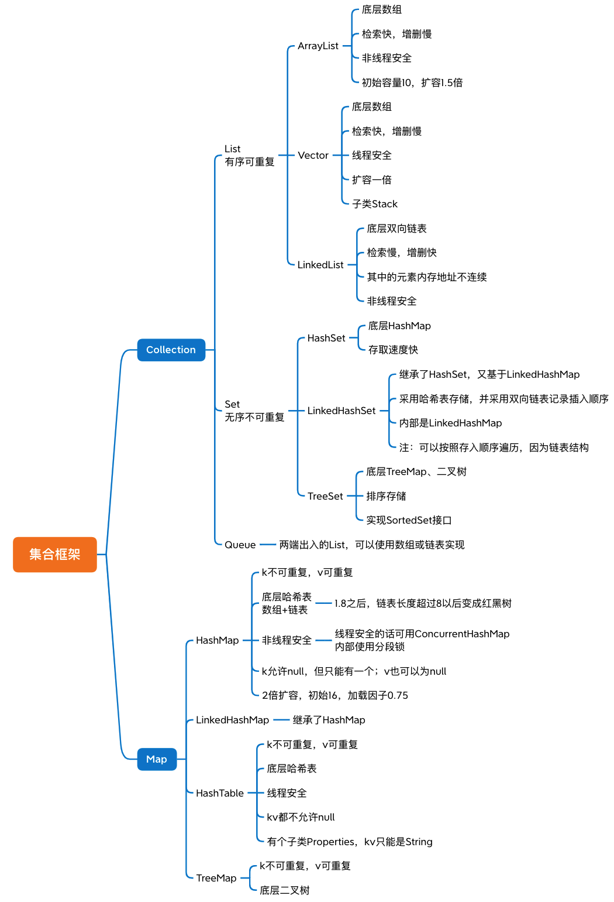
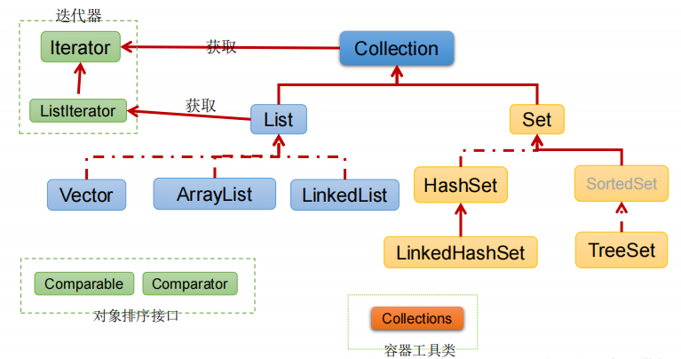
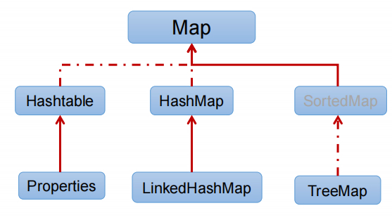
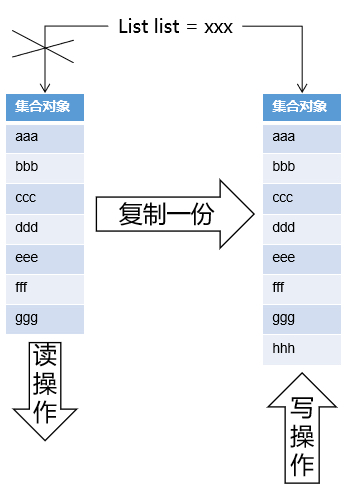
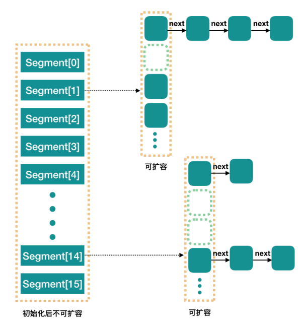

# 基础的基础

JRE 是 java 运行时环境

JDK 是 java 开发工具包，JDK 包含 JRE。

**JRE(Java Runtime Enviroment)** 是 Java 的运行环境。面向 Java 程序的使用者，而不是开发者。如果你仅下载并安装了 JRE，那么你的系统只能运行 Java 程序。JRE 是运行 Java 程序所必须环境的集合，包含 JVM 标准实现及 Java 核心类库。它包括 Java 虚拟机、Java 平台核心类和支持文件。它不包含开发工具(编译器、调试器等)。

**JDK(Java Development Kit)** 又称 J2SDK(Java2 Software Development Kit)，是 Java 开发工具包，它提供了 Java 的开发环境(提供了编译器 javac 等工具，用于将 java 文件编译为 class 文件)和运行环境(提 供了 JVM 和 Runtime 辅助包，用于解析 class 文件使其得到运行)。如果你下载并安装了 JDK，那么你不仅可以开发 Java 程序，也同时拥有了运行 Java 程序的平台。JDK 是整个 Java 的核心，包括了 Java 运行环境(JRE)，一堆 Java 工具 tools.jar 和 Java 标准类库 (rt.jar)。

## 优先级

! > 算术运算符 > 关系运算符 > 位与或 > 逻辑与或 > 赋值运算符

## Java的三大特性

1. 封装：是指隐藏对象的属性和实现细节，仅对外提供公共访问方式；
2. 继承：从已有的类中派生出新的类，新的类能获得已有类的数据属性和行为，并能扩展新的能力；
3. 多态：一个方法可以有多种实现版本，即“一种定义，多种实现”。
	- 继承是多态的基础
	- 要有方法的重写
	- 要有父类引用指向子类对象（向上转型）
	- 重载是编译时多态，重写是运行时多态

#### Java实现多态的机制

靠的是父类或接口定义的引用变量可以指向子类或具体实现类的实例对象，在运行期才动态绑定，就是引用变量所指向的具体实例对象的方法。

## Java程序编译解释过程

不准确的：Java 源文件 → 编译器 → JVM可以理解的字节码文件 .class → JVM解释/JIT编译器 →机器可以执行的二进制机器码

**解释器**：当Java虚拟机启动时会根据预定义的规范**对字节码采用逐行解释的方式执行**，将每条字节码文件中的内容“解释”为对应平台的**本地机器指令执行**。

JIT(Just In Time Compiler)**编译器**：虚拟机将源代码直接编译成和本地机器平台相关的机器语言。

- 即时编译器在编译代码后，可以对编译后的**机器指令**进行**缓存**的操作，存储**在方法区**中，这样执行效率就变高了。所以一些被频繁调用的**热点代码**就可以通过JIT进行编译，**提高程序性能**。


### Java语言为什么是半编译半解释？

执行引擎中同时存在解释器和编译器，JVM处理字节码文件的时候，通常是解释和即时编译两者结合起来实现的。


## 基本数据类型

java中整数默认为int，小数默认为double

```java
short a=1;
// a= (a + 1); //报错：类型不匹配：不能从 int 转换为 short
a=(short)(a + 1);
a+=1; 
// java编译器会对+=进行特殊处理，进行了类型转换，
// 通过反编译.class源码可以看到a+=1被编译为：
// a=(short)(a + 1);

// 有些浮点数不能完全精确的表示出来
System.out.println(3 * 0.1); // 0.30000000000000004
System.out.println(4 * 0.1); // 0.4
System.out.println(3 * 0.1 == 0.3); // false
System.out.println(13 * 0.1 == 1.3); // true
System.out.println(9 * 0.1 == 0.9); // true
System.out.println(3 * 0.1 / 3); // 0.10000000000000002
```

## 类中代码执行顺序

### 1、首先声明

1. 静态内容包括**静态代码块**和**静态变量**，静态变量先执行。
2. 实例内容包括**实例代码块**和**实例变量**（不包括构造方法），它们的执行顺序处在同一级别，谁写在前面谁先执行。

### 2、执行顺序

父类的（静态变量、静态初始化块）=> 子类的（静态变量、静态初始化块）

> 如果只是调用类的静态变量，则只进行类加载初始化，到此处截止
>
> 若有构造器的使用，再进行下面的操作，**构造器是在变量和初始块后执行的**

=> 父类的（变量、初始化块、构造器）=> 子类的（变量、初始化块、构造器）。

> 静态先执行，再执行其他的

## 类加载

Class.forName() 得到的 Class 是经过 加载、连接 和 初始化 三个阶段。**执行类中的static块**，**给静态变量 和 静态代码块 赋值**。

Classloder.loaderClass() 得到的 Class 是**只进行 加载** ，并没有进行 连接 和 初始化。**不会执行类中的 静态变量 和 静态代码块 的赋值**。


## 一、变量类型

第一种（按照位置）：局部变量 vs 成员变量（或属性）

- **局部变量**
	- 方法内部，生命周期与方法一致
	- 没有默认值，若使用，`必须在使用前显式赋值`
	- **栈**内存中
	
- **成员变量**
	- 再分：
		- **类变量**/**静态变量**（static）
			- 准备阶段，默认赋值 —> 初始化阶段，显式赋值
		- **实例变量**（无static）
			- 随对象的创建，会在堆空间中分配实例变量空间，并进行默认赋值
	
	- 类中，方法外
	- 有默认值，规则和数组一致
	- **堆**内存中

第二种（按照类型）：基本数据类型 vs 引用数据类型变量（类、数组、接口）


## 二、字面量和符号引用

- 字面量包括：
	- 文本字符串 
	- 八种基本类型的值 
	- 被声明为final的常量等;
- 符号引用包括：
	- 类和方法的全限定名 
	- 字段（属性field）的名称和描述符 
	- 方法的名称和描述符。

## 三、关键字修饰

### 1、final

**final：属性不可变、方法不可重写、类不可继承**

final修饰的方法不能重写，但可以继承、重载

**重载**：方法名字相同，而参数不同。返回类型可以相同也可以不同。

每个重载的方法（或者构造函数）都必须有一个独一无二的参数类型列表。

**重写**：方法名和参数列表必须相同，返回值范围和异常范围必须比父类小

> 基本数据类型，初始化之后不可改变
>
> 引用数据类型，初始化之后**引用的对象不能改变，但是引用的对象的值可以改变**


**Note**：内部类只能访问局部final变量（因为内部类和外部类的生命周期可能不同）

> 1.8之后不用加，默认不能修改，语法糖


### 2、transient

不可序列化

### 3、static

静态的，表示该属性只跟类相关，直接"类名.静态属性"就可以调用。

> static修饰的访问非static修出现的问题，以及为什么会出现这个问题，那么应该如何访问？static修饰的无法访问非static修饰的，需要先创建非静态的实例才可以访问

1. 静态变量在类加载的时候，就初始化static的成员，在此时，static已经分配内存空间，所以可以被直接访问
2. 非静态变量在通过new创建对象而初始化，所以在对象创建之前，是不可以访问非静态变量的
3. 总结：静态变量属于类，不需要生成对象就存在了，而非静态变量需要生成对象才能产生，所以静态变量不能直接访问。
	

<br>

## 四、接口与抽象类

接口是一种约束，抽象类是为了复用

- 接口是特殊的抽象类
- 抽象类可以存在普通成员函数/变量，而接口只能存在 public abstract 方法/public abstract final 成员变量
- 抽象类只能继承一个，接口可以实现多个

> 接口可以继承接口
>
> 抽象类可以实现接口
>
> 抽象类可以继承具体类
>
> 抽象类可以有静态的main方法

### 1、抽象类

不能有抽象构造方法或抽象静态方法（这两个都不能被继承），如果子类不能实现所有父类抽象方法，那么子类也必须是抽象类。

## 五、内部类

创建内部类的实例对象时，需要先创建外部类的实例对象，然后用外部类的实例对象去创建内部类的实例对象

```java
Outer outer = new Outer();
Outer.Inner inner = outer.new Inner();
```

在方法外部定义的内部类前面加上static，从而成为Static Nested Class，不再具有内部类的特性，运行时的行为和功能和普通类无区别。

无需创建外部类，就可以直接创建。

```java
Outer.Inner inner = new Outer.Inner();
```

Static Nested Class不依赖于外部类的实例对象，所以可以访问外部类的非static成员变量

> 外部类的加载不会影响到内部类，非静态内部类的加载依赖于外部类的加载
>
> 非静态内部类的实例化是在外部类实例的基础上

- 如果调用了**外部类**的静态属性、静态方法或者构造器，那么**外部类将会被加载而内部类并不会加载**。
- 如果调用了**静态内部类**的静态属性、静态方法或者构造器，那么**内部类将会被加载**而**外部类并不会被加载**。

> NOTE
>
> 内部类也是外部类的一个成员变量，内部类里的private属性，外部类也可以使用（必须实例化之后才可以）

```java
// m和inner都是成员变量，m n k是同级的
class Outer{
    private int m;
    private class Inner{
        private int n;
        private int k;
    }
}
```


## 六、重载和重写

### 重载overload

重载就是**同一个类**中多个**同名方法**根据**不同的传参**来执行**不同的逻辑处理**。

比如构造器，String类中有四个indexOf方法

```
方法签名：完整描述一个方法，要指出方法名以及参数类型，返回值不用标出。
indexOf(int)
indexOf(int, int)
indexOf(String)
indexOf(String, int)
```

编译期间

### 重写override

重写就是子类**对父类方法的重新改造**，外部样子不能改变，**内部逻辑可以改变**。

运行期间

> 注：如果方法的返回类型是**void和基本数据类型**，则返回值重写时**不可修改**。但是如果方法的返回值是**引用类型**， 重写时是可以返回该引用类型的**子类**的。

**@Override可以不写**

- 编译器可以给你验证@Override下面的方法名是否是你父类中所有的，如果没有则报错。
- 你如果没写@Override，而你下面的方法名又写错了，这时你的编译器是可以编译通过的，因为编译器以为这个方法是你的子类中自己增加的方法，而不是重写的父类方法。

### 对比

|            | 重载     | 重写                                                         |
| ---------- | -------- | ------------------------------------------------------------ |
| 发生范围   | 同类     | 子类                                                         |
| 参数列表   | 必须修改 | 不能修改                                                     |
| 返回类型   | 可修改   | 子类方法返回值类型应比父类方法返回值类型更小或相等           |
| 异常       | 可修改   | 子类方法声明抛出的异常类应比父类方法声明抛出的异常类更小或相等; |
| 访问修饰符 | 可修改   | 一定不能做更严格的限制(可以降低限制)；                       |
| 发生阶段   | 编译期   | 运行期                                                       |

## 七、枚举

枚举编译之后也是生成class文件。

可以理解成一种特殊的类。

枚举类型天生单例

枚举类就是静态常量`static final`。

```java
// web中经常这么用
public enum ResponseDto {
    //定义两个实例，一个表示请求成功，一个表示请求失败
    HTTP_200(200,"请求成功"), HTTP_500(500,"请求失败");
 
    //枚举和普通的类一样，可以定义属性，构造函数，getter setter，普通方法，
    private Integer code;
    private String msg;
 
    ResponseDto(Integer code, String msg) {
        this.code = code;
        this.msg = msg;
    }
 
    /*省略getset方法*/
}
```

## 八、作用域

|                  | 当前类 | 同一package | 子孙类 | 其他package |
| ---------------- | ------ | ----------- | ------ | ----------- |
| public           | √      | √           | √      | √           |
| protected        | √      | √           | √      | ×           |
| friendly/default | √      | √           | ×      | ×           |
| private          | √      | ×           | ×      | ×           |

> note：外部类可以访问内部类的private，内部类和外部类的成员变量是同一级别的。
>
> 不加默认是default

# 对象的实例化



# Java只支持值传递

- **值传递** ：方法接收的是实参值的拷贝，会创建副本。
- **引用传递** ：方法接收的直接是实参所引用的对象在堆中的地址，不会创建副本，对形参的修改将影响到实参。

> 引用在栈中，对象在堆中。

**基本数据类型传递时，是将实参的副本传递给形参。**

```java
public static void main(String[] args) {
    Person p = new Person("张三");
    f(p);
    System.out.println("实参: " + p);
}
public static void f(Person p) {
    p.name = "李四";
    System.out.println("形参: " + p);
}

// 打印结果
// 形参: Person{name='李四'}
// 实参: Person{name='李四'}
```

上述看似是引用传递，传递p的时候是创建了一个p的引用副本，同时都指向堆中的同一个对象。

下述中，重新将p指向了堆中的新建对象。

```java
public static void main(String[] args) {
    Person p = new Person("张三");
    f(p);
    System.out.println("实参: " + p);
}
public static void f(Person p) {
    p = new Person("李四");
    System.out.println("形参: " + p);
}

// 打印结果
// 形参: Person{name='李四'}
// 实参: Person{name='张三'}
```

**综上：形参操作的始终是实参的副本。**

# 异常体系

## 一、error

**程序无法处理的错误**，一旦出现，程序就**会被迫停止**。

OutOfMemoryError（内存溢出）

StackOverflowError（栈溢出）

## 二、exception

**设计或实现上的问题**，代码编写或逻辑上的，**可以进行异常处理**

- 编译时异常(checked)：编译器会提示trycatch或者向上抛出
	- IOException
		- FileNotFoundException
	- ClassNotFoundException
- 运行时异常(unchecked)：编译时不会提示
	- NullPointerException
	- ArrayIndexOutOfBoundsException
	- ClassCastException（数据类型转换异常）
	- NumberFormatException
	- InputMismatchException
	- ArithmeticException（数学运算异常）
	- IllegalArgumentException（方法的参数错误）

## 三、try、catch、finally

*try是必须的，catch、finally必须有一个或都有*

finally一定会执行，catch或try中有return也会执行finally

```java
public class ExceptionInterviewTest {
    public static void main(String[] args) {
        int result = m();
        System.out.println(result); //100
    }

    /*
    java语法规则（有一些规则是不能破坏的，一旦这么说了，就必须这么做！）：
        java中有一条这样的规则：
            方法体中的代码必须遵循自上而下顺序依次逐行执行（亘古不变的语法！）
        java中还有一条语法规则：
            return语句一旦执行，整个方法必须结束（亘古不变的语法！）
     */
    public static int m(){
        int i = 100;
        try {
            // 这行代码出现在int i = 100;的下面，所以最终结果必须是返回100
            // return语句还必须保证是最后执行的。一旦执行，整个方法结束。
            return i;
        } finally {
            i++;
        }
    }
}

/*
反编译之后的效果
public static int m(){
    int i = 100;
    int j = i;
    i++;
    return j;
}
 */

```


# String

## 一、String的不可变

```java
public final class String implements java.io.Serializable, Comparable<String>, CharSequence {
    /* 
    	String本质是个char数组，而且用final修饰 
    	jdk9之后换成了byte数组，为了减少存储的占用空间
    */
    private final char value[];
}
```

首先String类是用final关键字修饰，这说明String不可继承。且value也用final修饰value这个引用地址不可变。

引用不可变，如果更改value内容不也是可以的吗？

在源码中没有对value里的元素进行操作；并且string类是final不可继承，避免被别人继承后破坏。

综上，才使得String是不可变的。

### 补充：jdk9的改变

采用Latin-1和UTF-16字符集共存，Latin-1字符集可以用一个字节保存拉丁文字符

jdk9中还有个coder字段，标识判断字符串中是否包含非拉丁文字符，如果有就使用UTF-16

不使用UTF-8（其也可以用一个字节到四个字节保存）是因为str.charAt(6)需要随机访问。

UTF-8不定长，处理起来会影响性能，频繁计算。

## 二、StringTable

### 1、字符串的拼接

1. 常量与常量的拼接结果在字符串常量池，原理是编译期优化
2. 字符串常量池中不会存在相同内容的常量
3. 只要其中有一个是变量，结果就在堆中（但不是字符串常量池所在的空间），原理是StringBuilder；final除外
4. 如果拼接的结果调用intern()方法，则主动将字符串常量池中还没有的字符串对象放入池中，并返回此对象的地址，如存在了就直接返回地址

```java
String s1 = "a" + "b" + "c";
String s2 = "abc";
/*
	编译阶段
	s1 = "abc";
	s2 = "abc";
	编译期就完成了拼接
*/
System.out.println(s1 == s2);// true
System.out.println(s2.equals(s1););// true

/*
	如下的 s1 + s2 的执行细节
	1、StringBuilder s = new StringBuilder();
	2、s.append("Java");
	3、s.append("Go");
	4、s.toString(); ——> 约等于new String("ab");
	JDK5.0之前用的buffer
*/

String s1 = "Java";
String s2 = "Go";
String s3 = "JavaGo";
String s4 = "Java" + "Go";
String s5 = s1 + "Go";
String s6 = "Java" + s2;
String s7 = s1 + s2;
final String s8 = "Java";
final String s9 = "Go";
String s10 = s8 + s9;

System.out.println(s3 == s4);// true
System.out.println(s3 == s5);// false
System.out.println(s3 == s6);// false
System.out.println(s3 == s7);// false
System.out.println(s5 == s6);// false
System.out.println(s5 == s7);// false
System.out.println(s6 == s7);// false
System.out.println(s10 == s3);// true

String s11 = s6.intern();
System.out.println(s3 == s11);// true


```


### 2、intern()

native方法

如果拼接的结果调用intern()方法，查看字符串常量池

- 如存在字符串就直接返回地址
- 如果不存在
	- ≤1.6 放入字符串池
	- ≥1.7 将对象的引用地址复制放入池

Interned String就是确保字符串在内存中只有一份拷贝

调用Intern()可以保证变量s指向的是字符串常量池中的数据

<br>

**题目**

```java
/**
 * 题目：
 * new String("ab")会创建几个对象？
 *     一个对象是：new关键字在堆空间创建的
 *     另一个对象是：字符串常量池中的对象"ab" 
 *
 *
 * 思考：
 * new String("a") + new String("b")呢？
 *  对象1：new StringBuilder()
 *  对象2：new String("a")
 *  对象3：常量池中的"a"
 *  对象4：new String("b")
 *  对象5：常量池中的"b"
 *
 *  深入剖析： StringBuilder的toString():
 *      对象6 ：new String("ab")
 *      强调一下，toString()的调用，在字符串常量池中，没有生成"ab"
 *
 */
```


```java
String s1 = new String("a");
s1.intern(); // 调用之前已经存在了a
String s2 = "a";
System.out.println(s1 == s2);
// jdk1.6 false, jdk7/8 false

String s3 = new String("a") + new String("a");
// s3变量记录的地址：new String("aa")
// 执行完后，字符串常量池中没有"aa"
s3.intern();
// jdk6:创建了一个新的对象"aa"，也有了新的地址
// jdk7:常量池放进堆里了，常量池中并没有创建"aa",
// 而是创建一个指向堆空间中new String("aa")的地址
// 因为堆中已经有了，节省空间，常量池中就不创建了
String s4 = "aa";
// s4变量记录的地址：使用的是intern()后在常量池中生成的"aa"的地址
System.out.println(s3 == s4);
// jdk1.6 false, jdk7/8 true

```


补充：






---

# 集合框架



threshold：扩容的阈值，=容量*加载因子，超过阈值就扩容

工具类：Collections操作集合、Arrays操作数组

### 无序性和不可重复性的含义是什么

- 无序性不等于随机性 ，无序性是指存储的数据在底层数组中并非按照数组索引的顺序添加 ，而是根据数据的哈希值决定的。
- 不可重复性是指添加的元素按照 `equals()` 判断时 ，返回 false，需要同时重写 `equals()` 方法和 `hashCode()` 方法。

## 一、Collection



### 1、Arrays.sort()

`Arrays类`

使用的是经过调优的**快速排序**算法

对基本数据类型`byte[] int[] double[] char[]`进行升序排序

对引用数据类型进行降序，如`Integer[]，Double[]，Character[]`等

```java
// 1、对list排序的时候需要保证list中的元素实现了Comparable接口
// 2、或者自定义一个比较器对象Comparator
// [参数1] <、=、> [参数2]的时候，分别返回-1、0、1。
// 表示将[参数1]和[参数2]按照-1、0、1的顺序排序
class cmp implements Comparator<Integer>{
	public int compare(Ingeger n1, Ingeger n2){
		if (n1 < n2){
			return -1;
		}else{
			return 1;
		}
	}
}

```

### 2、集合的remove()

```
关于集合元素的remove
    重点：当集合的结构发生改变时，迭代器必须重新获取，如果还用旧的迭代器，会出现
    异常：java.util.ConcurrentModificationException

    重点：在迭代集合元素的过程中，不能调用集合对象的remove方法，删除元素：
        c.remove(o); 迭代过程中不能这样。
    	会出现：java.util.ConcurrentModificationException

```


> **注**：在迭代元素的过程当中，一定要使用迭代器**Iterator的remove方法**，删除元素，不要使用集合自带的remove方法删除元素。
>
> 集合结构只要发生改变，迭代器必须重新获取。
>
> 通过迭代器删除时，会自动更新迭代器，并且更新集合

```java
public static void main(String[] args) {
    // 创建集合
    Collection c = new ArrayList();

    // 注意：此时获取的迭代器，指向的是那是集合中没有元素状态下的迭代器。
    // 一定要注意：集合结构只要发生改变，迭代器必须重新获取。
    // 当集合结构发生了改变，迭代器没有重新获取时，
    // 调用next()方法时：java.util.ConcurrentModificationException
    Iterator it = c.iterator();

    // 添加元素
    c.add(1); // Integer类型
    c.add(2);
    c.add(3);

    // 获取迭代器
    //Iterator it = c.iterator();
    /*while(it.hasNext()){
            // 编写代码时next()方法返回值类型必须是Object。
            // Integer i = it.next();
            Object obj = it.next();
            System.out.println(obj);
        }*/

    Collection c2 = new ArrayList();
    c2.add("abc");
    c2.add("def");
    c2.add("xyz");

    Iterator it2 = c2.iterator();
    while(it2.hasNext()){
        Object o = it2.next();
        // 删除元素之后，集合的结构发生了变化，应该重新去获取迭代器
        // 但是，循环下一次的时候并没有重新获取迭代器，
        // 所以会出现异常：java.util.ConcurrentModificationException
        // 出异常根本原因是：集合中元素删除了，但是没有更新迭代器（迭代器不知道集合变化了）
        // c2.remove(o); // 直接通过集合去删除元素，没有通知迭代器。（导致迭代器的快照和原集合状态不同。）
        // 使用迭代器来删除可以吗？
        // 迭代器去删除时，会自动更新迭代器，并且更新集合（删除集合中的元素）。
        // *****通过迭代器删除时，会自动更新迭代器，并且更新集合
        it2.remove(); // 删除的一定是迭代器指向的当前元素。
        System.out.println(o);
        // System.out.println(it2.next());
    }
    System.out.println(c2.size()); //0
}
```

### 3、ArrayList

[底层](./collection/arraylist-source-code.md)

初始容量为10；

扩容1.5倍；

底层用Object数组来存放。

可以指定初始容量（通过含参的构造函数）。


### 4、HashSet

底层使用的也是HashMap，其用key存放不可重复的值，value是一个Object对象。

- 为什么使用Object而不是null？

> HashSet.add() 方法需要在加入新元素时返回 true，加入重复元素时返回 false
>
> HashMap.add() 方法返回的是上一次以同一 key 加入的 value
>
> 若从未以该 key 加入任何数据，则返回 null
>
> 然而 HashMap 允许 null 作为 value
>
> 所以如果使用 null 作为 value 利用 HashMap 
>
> 当返回 null 的时候我们就无法得知 null 究竟意味着这个 key 是第一次加入
>
> 还是上一次使用了 null 作为 value 加入


### 5、比较 HashSet、LinkedHashSet 和 TreeSet 三者的异同

- `HashSet`、`LinkedHashSet` 和 `TreeSet` 都是 `Set` 接口的实现类，都能保证元素唯一，并且都不是线程安全的。
- `HashSet`、`LinkedHashSet` 和 `TreeSet` 的主要区别在于底层数据结构不同。`HashSet` 的底层数据结构是哈希表（基于 `HashMap` 实现）。`LinkedHashSet` 的底层数据结构是链表和哈希表，元素的插入和取出顺序满足 FIFO。`TreeSet` 底层数据结构是红黑树，元素是有序的，排序的方式有自然排序和定制排序。
- 底层数据结构不同又导致这三者的应用场景不同。`HashSet` 用于不需要保证元素插入和取出顺序的场景，`LinkedHashSet` 用于保证元素的插入和取出顺序满足 FIFO 的场景，`TreeSet` 用于支持对元素自定义排序规则的场景。

### 6、comparable和comparator

comparable是待排序的类实现的接口，在类中需要重写compareTo方法

comparator是个比较器接口，实现该接口的类是个比较器，其中可以实现compare方法，进行定制排序。

### 7、集合的遍历

- for与foreach都可以遍历数组/集合，不过for则在较复杂的循环中效率更高。
- foreach不可以删除/修改集合元素，而for可以
- foreach和for都可以修改元素里面的属性

## 二、Map

[哈希冲突](./哈希冲突.md)

### Map



### HashMap 和 Hashtable 的区别

> **共同点**：hashmap和Hashtable都实现了map、Cloneable（可克隆）、Serializable（可序列化）这三个接口

- **底层数据结构不同**：jdk1.7底层都是数组+链表，但jdk1.8 HashMap加入了红黑树

- Hashtable 是不允许键或值为 null 的，HashMap 的键值则都可以为 null。

- **添加key-value的hash值算法不同**：HashMap添加元素时，是使用自定义的哈希算法，而HashTable是直接采用key的hashCode()

- **实现方式不同**：Hashtable 继承的是 Dictionary类，而 HashMap 继承的是 AbstractMap 类。

- **初始化容量不同**：HashMap 的初始容量为：16，Hashtable 初始容量为：11，两者的负载因子默认都是：0.75。

- **扩容机制不同**：当已用容量>总容量 * 负载因子时，HashMap 扩容规则为当前容量翻倍，Hashtable 扩容规则为当前容量翻倍 +1。

- **支持的遍历种类不同**：HashMap只支持Iterator遍历，而HashTable支持Iterator和Enumeration两种方式遍历

- **迭代器不同**：HashMap的迭代器(Iterator)是fail-fast迭代器，而Hashtable的enumerator迭代器不是fail-fast的。所以当有其它线程改变了HashMap的结构（增加或者移除元素），将会抛出ConcurrentModificationException，但迭代器本身的remove()方法移除元素则不会抛出ConcurrentModificationException异常。但这并不是一个一定发生的行为，要看JVM。而Hashtable 则不会。

- **部分API不同**：HashMap不支持contains(Object value)方法，没有重写toString()方法，而HashTable支持contains(Object value)方法，而且重写了toString()方法

- **同步性不同**: Hashtable是同步(synchronized)的，所有方法都加上了synchronized，线程安全，因此效率慢。

	

### HashMap 和 HashSet 区别

`HashSet` 底层就是基于 `HashMap` 实现的。（`HashSet` 的源码非常非常少，因为除了 `clone()`、`writeObject()`、`readObject()`是 `HashSet` 自己不得不实现之外，其他方法都是直接调用 `HashMap` 中的方法。

|               `HashMap`                |                          `HashSet`                           |
| :------------------------------------: | :----------------------------------------------------------: |
|           实现了 `Map` 接口            |                       实现 `Set` 接口                        |
|               存储键值对               |                          仅存储对象                          |
|     调用 `put()`向 map 中添加元素      |             调用 `add()`方法向 `Set` 中添加元素              |
| `HashMap` 使用键（Key）计算 `hashcode` | `HashSet` 使用成员对象来计算 `hashcode` 值，对于两个对象来说 `hashcode` 可能相同，所以`equals()`方法用来判断对象的相等性 |

### TreeMap

**相比于`HashMap`来说 `TreeMap` 主要多了对集合中的元素根据键排序的能力以及对集合内元素的搜索的能力。**

### 1、HashMap

[底层](./collection/hashmap-source-code.md)

初始容量16，因为hashcode是与length-1求与，16或2^n减一后的二进制都是1

元素超过8个会变成红黑树，小于6再变回链表

加载因子0.75，2倍扩容

key和value允许null

#### 提问：初始化HashMap容量为10000后存入10000数据会不会扩容

不会，传入10000，底层会将容量初始化为大于10000且为最接近的2的n次方，即16384（2的14次方，2的13次方为8192），算上加载因子0.75，扩容的上限为12288。


#### a>添加过程

> put的时候，如果数组为空的话，会先去初始化。

```
map.put(key1,value1):
1、首先，调用key1所在类的hashCode()计算key1哈希值，
此哈希值经过某种算法计算以后，得到在Entry数组中的存放位置。
2、
如果此位置上的数据为空，此时的key1-value1添加成功。 ----情况1
如果此位置上的数据不为空，(意味着此位置上存在一个或多个数据(以链表形式存在)),
比较key1和已经存在的一个或多个数据的哈希值：
	2.1、如果key1的哈希值与已经存在的数据的哈希值都不相同，
	此时key1-value1添加成功。----情况2
	2.2、如果key1的哈希值和已经存在的某一个数据(key2-value2)的哈希值相同，
	继续比较：调用key1所在类的equals(key2)方法，比较：
		如果equals()返回false:此时key1-value1添加成功。----情况3
		如果equals()返回true:使用value1替换value2。
```

[深入浅出HashMap详解（JDK7）](https://blog.csdn.net/qq_29051413/article/details/107860264)

[深入浅出ConcurrentHashMap详解](https://blog.csdn.net/qq_29051413/article/details/107869427)

1.7 头插

1.8 尾插：可以维护链表原本的顺序

> 头插法的初衷是设计者遵循一个新加进来的元素可能被使用的频率更高，这其实是一个伪命题，因为在hashmap扩容的时候，**链表也是会发生颠倒的**，因为是先从头节点开始转移掉新的hash表中。
>
> 头插法还有一个致命的缺点，就是在多线程下会出现循环链的情况，导致死循环
>
> 之所以会出现这个情况，核心在于这样一句代码，e.next = newTable[i];
>
> 这也就是**头插法**的代码。

```
移动和插入节点都从头节点开始,假设迁移后AB仍然在同一索引
T1,T2同时指向A
T1: A->B => 扩容后 B->A
此时T2指向的还是A，然后A.next = newTable[i]
即A.next = B
成环了。。。
```


> jdk1.8之后改为尾插法
>

#### b>为什么是16？减少hash碰撞，充分散列，同时提升效率

为了能让 HashMap 存取高效，尽量较少碰撞，也就是要尽量把数据分配均匀。我们上面也讲到了过了，Hash 值的范围值-2147483648 到 2147483647，前后加起来大概 40 亿的映射空间，只要哈希函数映射得比较均匀松散，一般应用是很难出现碰撞的。但问题是一个 40 亿长度的数组，内存是放不下的。所以这个散列值是不能直接拿来用的。用之前还要先做对数组的长度取模运算，得到的余数才能用来要存放的位置也就是对应的数组下标。这个数组下标的计算方法是“ `(n - 1) & hash`”。（n 代表数组长度）。这也就解释了 HashMap 的长度为什么是 2 的幂次方。

**这个算法应该如何设计呢？**

我们首先可能会想到采用%**取余**的操作来实现。但是，重点来了：**“取余(%)操作中如果除数是 2 的幂次则等价于与其除数减一的与(&)操作（也就是说 hash%length==hash&(length-1)的前提是 length 是 2 的 n 次方；）。”** 并且 **采用二进制位操作 &，相对于%能够提高运算效率，这就解释了 HashMap 的长度为什么是 2 的幂次方。**

初始容量：16（为了服务于hash函数）

```java
index = HashCode（Key） & （Length - 1）;
```

> 下面我们以值为“book”的Key来演示整个过程：
>
> 1. 计算book的hashcode，结果为十进制的3029737，二进制的101110001110101110 1001。
>
> 2. 假定HashMap长度是默认的16，计算Length-1的结果为十进制的15，二进制的1111。
>
> 3. 把以上两个结果做与运算，101110001110101110 1001 & 1111 = 1001，十进制是9，所以 index=9。
>
> 可以说，Hash算法最终得到的index结果，完全取决于Key的Hashcode值的最后几位。
>
> 长度16或者其他2的幂，Length-1的值是所有二进制位全为1

如果输入的不是2的n次方，底层会扩到大于该数的第一个2的n次方。

#### c>扩容机制

1.7版本

> 1. 先**⽣成新数组**
>
> 2. 遍历⽼数组中的每个位置上的链表上的每个元素
>
> 3. 取每个元素的key，并基于新数组⻓度，计算出每个元素在新数组中的下标
>
> 4. 将元素添加到新数组中去
>
> 5. 所有元素转移完了之后，将新数组赋值给HashMap对象的table属性

1.8版本

> 1. 先**⽣成新数组**
> 2. 遍历⽼数组中的每个位置上的链表或红⿊树
> 3. 如果是链表，则直接将链表中的每个元素重新计算下标，并添加到新数组中去
> 4. 如果是红⿊树，则先遍历红⿊树，先计算出红⿊树中每个元素对应在新数组中的下标位置
> 	- 统计每个下标位置的元素个数
> 	- 如果该位置下的元素个数超过了8，（先判断数组长度是否大于64，没有的话先扩容），则⽣成⼀个新的红⿊树，并将根节点的添加到新数组的对应位置
> 	- 如果该位置下的元素个数没有超过8，那么则⽣成⼀个链表，并将链表的头节点添加到新数组的对应位置
> 5. 所有元素转移完了之后，将新数组赋值给HashMap对象的table属性
>
> 如果小于6，会转回链表，为什么是6？
>
> - 如果是7，会发生频繁的切换，6给了个缓冲


### 2、Map的方法

```java
boolean containsKey(Object key);
// 判断Map中是否包含某个key

boolean containsValue(Object value); 
// 判断Map中是否包含某个value

boolean isEmpty();   
// 判断Map集合中元素个数是否为0

V remove(Object key); 
// 通过key删除键值对

int size(); 
// 获取Map集合中键值对的个数。

Collection<V> values(); 
// 获取Map集合中所有的value，返回一个Collection
ArrayList<String> arrayList = new ArrayList<String>(collection);

Set<K> keySet(); 
// 获取Map集合所有的key（所有的键是一个set集合）

Set<Map.Entry<K,V>> entrySet(); 
// 将Map集合转换成Set集合
```


### 3、Entry

```java
Set<Map.Entry<Integer,String>> set = map.entrySet();
// set里的对象是key=value的形式

// foreach
// 这种方式效率比较高，因为获取key和value都是直接从node对象中获取的属性值。
// 这种方式比较适合于大数据量。
for(Map.Entry<Integer,String> node : set){
    System.out.println(node.getKey() + "--->" + node.getValue());
}
```


### 4、hashCode()和equals()的关系

**hashCode()**的作用是获取哈希码，也称散列码；实际上是一个int整数

哈希码的作用是确定该对象在哈希表中的索引位置。

- 先比较 hashcode，再看需求比较 equals
- 两个对象相等，则 hashcode 一定也是相同的
- 两个对象相等，equals 方法返回 true
- 两个对象拥有相同的 hashcode，也不一定相等
- equals() 重写，hashCode() 也一定要重写
- hashCode() 的**默认**⾏为是对堆上的对象的**地址**产⽣独特值。如果没有重写hashCode()，则该class的两个对象⽆论如何都不会相等（即使这两个对象指向相同的数据）


# 集合线程安全问题

## Collections方法

```java
Collections.synchronizedMap(map);
Collections.synchronizedList(list);

```

就是给所有方法加锁，底层是个SynchronizedMap，和HashTable没区别。

这个方法可以动态的生成一个线程安全的集合。

## 一、CopyOnWriteArrayList

```java
// 具体集合类型ArrayList：
// 抛出java.util.ConcurrentModificationException异常

// 具体集合类型Vector：
// 不会抛异常，线程安全，但是这个类太古老

Collections.synchronizedList(new ArrayList<>())：
// 不会抛异常，但是锁定范围大，性能低
public void add(int index, E element) { 
    synchronized (mutex) {
        list.add(index, element);
    } 
}
public E get(int index) { 
    synchronized (mutex) {
        return list.get(index);
    } 
}

// 具体集合类型CopyOnWriteArrayList：
// 使用了写时复制技术，兼顾了线程安全和并发性能
List<String> list = new CopyOnWriteArrayList<>();
```

### 写时复制技术



使用写时复制技术要向集合对象中写入数据时：

> - 先把整个集合数组复制一份，将新数据写入复制得到的新集合数组
> - 写操作（加锁）在新数组上进行，读操作在旧数组上进行
> - 再让指向集合数组的变量指向新复制的集合数组

优缺点：

- 优点：兼顾了性能和线程安全，允许同时进行读写操作；适合读多写少的情况
- 缺点：
	- 由于需要把集合对象整体复制一份，所以对内存的消耗很大
	- 读到的数据可能不是最新的，不适合实时性很高的场景

对应类中的源代码：

- 所在类：java.util.concurrent.**CopyOnWriteArrayList**

```java
public boolean add(E e) {
    final ReentrantLock lock = this.lock;
    lock.lock();
    try {
        Object[] elements = getArray();
        int len = elements.length;
        Object[] newElements = Arrays.copyOf(elements, len + 1);
        newElements[len] = e;
        setArray(newElements);
        return true;
    } finally {
        lock.unlock();
    }
}
```


## 二、CopyOnWriteArraySet

采用了写时复制技术的Set集合：java.util.concurrent.CopyOnWriteArraySet

```java
// 测试
// 1、创建集合对象
Set<String> set = new CopyOnWriteArraySet<>();
// 2、创建多个线程，每个线程中读写 List 集合
for (int i = 0; i < 5; i++) {
    new Thread(()->{
        for (int j = 0; j < 5; j++) {
            // 写操作：随机生成字符串存入集合
            set.add(UUID.randomUUID().toString().
                    replace("-","").substring(0, 5));
            // 读操作：打印集合整体
            System.out.println("set = " + set);
        }
    }, "thread-"+i).start();
}
```

源码

- 所在类：java.util.concurrent.CopyOnWriteArraySet

```java
public boolean add(E e) {
    return al.addIfAbsent(e);
}
```

- 所在类：java.util.concurrent.CopyOnWriteArrayList

```java
private boolean addIfAbsent(E e, Object[] snapshot) {
    final ReentrantLock lock = this.lock;
    lock.lock();
    try {
        Object[] current = getArray();
        int len = current.length;
        if (snapshot != current) {
            // Optimize for lost race to another addXXX operation
            int common = Math.min(snapshot.length, len);
            for (int i = 0; i < common; i++)
                if (current[i] != snapshot[i] && eq(e, current[i]))
                    return false;
            if (indexOf(e, current, common, len) >= 0)
                return false;
        }
        Object[] newElements = Arrays.copyOf(current, len + 1);
        newElements[len] = e;
        setArray(newElements);
        return true;
    } finally {
        lock.unlock();
    }
}
```


## 三、ConcurrentHashMap

[底层](./collection/concurrent-hash-map-source-code.md)

```java
java.util.concurrent.ConcurrentHashMap
```

```java
// 1、创建集合对象
Map<String, String> map = new ConcurrentHashMap<>();
// 2、创建多个线程执行读写操作
for (int i = 0; i < 5; i++) {
    new Thread(()->{
        for (int j = 0; j < 5; j++) {
            String key = UUID.randomUUID()
                .toString().replace("-","").substring(0, 5);
            String value = UUID.randomUUID()
                .toString().replace("-","").substring(0, 5);
            map.put(key, value);
            System.out.println("map = " + map);
        }
    }, "thread" + i).start();
}

```

### 1、jdk1.7之前Segment

#### 1.1、Segment段

ConcurrentHashMap，它内部细分了若干个小的 HashMap，称之为`段(Segment)`。默认情况下一个 ConcurrentHashMap 被进一步细分为 16 个段，既就是锁的并发度。

如果需要在 ConcurrentHashMap 中添加put一个新的表项，并不是将整个 HashMap 加锁，而是首先**根据 hashcode 得到该表项应该存放在哪个段中**，然后**对该段加锁**，并完成 put 操作。

在多线程环境中，如果多个线程同时进行 put操作，只要被加入的表项不存放在同一个段中，则线程间可以做到真正的并行。

> 扩容的时候，不会扩容16，只会扩增segment

#### 1.2、线程安全（Segment 继承 ReentrantLock 加锁）

简单理解就是，ConcurrentHashMap 是一个 Segment 数组，Segment 通过继承ReentrantLock 来进行加锁，所以每次需要加锁的操作**锁住的是一个 segment**，这样只要保证每个 Segment 是线程安全的，也就实现了全局的线程安全。



每个segment也具有红黑树结构

ConcurrentHashMap 是由 Segment 数组结构和 HashEntry 数组结构组成。

Segment 是一种可重入锁 ReentrantLock，在 ConcurrentHashMap 里扮演锁的角色，HashEntry 则用于存储键值对数据。

每个 Segment 守护一个 HashEntry 数组里的元素，当对 HashEntry 数组的数据进行修改时，必须首先获得它对应的 Segment 锁。

> HashTable只能由一个线程操作。 ConcurrentHashMap可以让一个线程操作第一个Segment，另一个线程操作另一个Segment。

#### 1.3、并行度（默认16）

concurrencyLevel：并行级别、并发数、Segment 数。

也就是说 ConcurrentHashMap 有 16 个 Segments，所以理论上，这个时候，最多可以同时支持 16 个线程并发写，只要它们的操作分别分布在不同的 Segment 上。

`可以初始化赋值，但是初始化后不可扩容`

每个 Segment 很像之前介绍的 HashMap，不过它要保证线程安全，所以处理起来要麻烦些。

### 2、jdk1.8之后Node数组

抛弃了 Segment，改为数组+链表+红黑树的数据结构，乐观锁+synchronized

> 1.7数组存的是HashEntry，1.8数组存的是Node，功能一样

对头节点加锁，从而实现了对每一列数据进行加锁，降低锁粒度

并发控制使用Synchronized和CAS来操作

> 当多线程并发向同一个散列桶添加元素时。
>
> - 若散列桶为空，此时触发乐观锁机制，线程会获取到桶中的版本号，在添加节点之前，判断线程中获取的版本号与桶中实际存在的版本号是否一致，若一致,则添加成功，若不一致，则让线程自旋。
> - 若散列桶不为空，此时使用Synchronized来保证线程安全，先访问到的线程会给桶中的**头节点**加锁，从而保证线程安全。

#### 2.1、为什么是synchronized，而不是ReentrantLock

- **减少内存开销** 

假设使用可重入锁来获得同步支持，那么**每个节点都需要通过继承AQS来获得同步支持**。但并不是每个节点都需要获得同步支持的，**只有链表的头节点（红黑树的根节点）需要同步**，这无疑带来了巨大内存浪费。 

- **获得JVM的支持** 

可重入锁毕竟是API这个级别的，后续的性能优化空间很小。 

synchronized则是JVM直接支持的，JVM能够在运行时作出相应的优化措施：锁粗化、锁消除、锁自旋等等。这就使得**synchronized能够随着JDK版本的升级而不改动代码的前提下获得性能上的提升**。


# 泛型

允许在定义类、接口时通过一个**标识表示**类中某个属性的类型或者是某个方法的返回值及参数**类型**。

这个类型参数将在使用时（例如，继承或实现这个接口，用这个类型声明变量、创建对象时）确定（即传入实际的类型参数，也称为类型实参）。

> JVM对泛型其实一无所知，所有的工作都是**编译器**做的。编译阶段，编译器会进行类型检测。

## 一、基本概念

### 泛型在继承上的体现

虽然类A是类B的父类，但是`G<A>`和`G<B>`二者不具备子父类关系，二者是并列关系

### 泛型中entends和super的区别

1. 上限<? extends T>表示包括T在内的任何T的⼦类`(无穷小, T] `
2. 下限<? super T>表示包括T在内的任何T的⽗类`[T, 无穷大]` 

### 通配符

约定俗成

- ? 表示不确定的 java 类型
- T (type) 表示具体的一个java类型
- K V (key value) 分别代表java键值中的Key Value
- E (element) 代表Element

## 二、范型擦除

### 概念

编译阶段，编译器会进行类型检测，不符合就会报错，一旦编译通过，编译器就会将泛型擦除，对于JVM来讲，没有泛型类型的对象。

```java
List<Integer> ints = new ArraysList<>();
List<String> strs = new ArraysList<>();
System.out.println(ints.getClass == strs.getClass()); // true

// 编译器通过后，进行类型擦除
// JVM中是如下的感觉
List ints = new ArraysList();
List strs = new ArraysList();
/**
 * 不存在List<Integer>类型以及List<String>类型
 */
```

> - **Raw Type 原始类型**：泛型擦除后的类型被称为原始类型。

**范型擦除后**，**所有范型会被替换成他的第一个上界**；没有边界时，就会被替换成顶层父类Object。

- 若范型类型没有指定具体类型，用`Object`作为原始类型。
- 若有限定类型`<T extends XClass>`，会将边界XClass作为原始类型。
- 若有多个限定类型`<T extends XClass1 & XClass2>`，会将第一个边界`XClass1`作为原始类型。

```java
public class NumberHandler<T extends Number> {
    public final T number;
    public NumberHandler(T number) {
        this.number = number;
    }
}

// 范型擦除后，所有范型会被替换成他的第一个上界
public class NumberHandler {
    public final Number number;
    public NumberHandler(Number number) {
        this.number = number;
    }
}

```

> 泛型擦除后的代码和JDK1.5之前的代码是一致的，因为**类型擦除的目的**就是**向低版本兼容**。


### 弊端

1、**泛型不支持基本数据类型**，只支持引用类型，因为泛型最终会被擦除成Object，其不能存储基本数据类型。

2、运行时只能对原始类型进行类型检测

```java
if (obj instanceof List) {}
if (obj instanceof List<String>) {} // 编译错误
if (obj instanceof T) {} // 编译错误
```

3、不能实例化具体参数，因为运行时无法确定具体类型，也无法知道是不是存在无参构造器。

```java
T data = new T(); // 编译错误
```

4、不能实例化范型数组，因为最终会被擦除成Object，数组返回的时候无法变成String类型会报错。

```java
public static <T> T[] randomTwo(T... t) {
    T[] array = new T[2];
    return array;
}
public static void main(String[] args) {
    // ClassCastException: Object cannot be cast to String
    String[] strings = randomTwo("1", "2");
}
```


### 细节

泛型擦除只是运行时对于JVM而言，泛型参数被擦除掉了，但**泛型信息还是会被保留在.class字节码文件中**，即可以通过反射机制去恢复范型信息。

