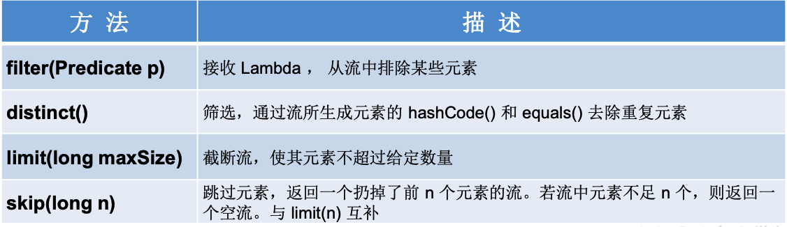

# Lambda表达式

**举例**

```java
 (o1,o2) -> Integer.compare(o1,o2);
```


**格式**

- -> :lambda操作符 或 箭头操作符

- ->左边：lambda形参列表 （其实就是接口中的抽象方法的形参列表）

- ->右边：lambda体 （其实就是重写的抽象方法的方法体）

##  1、Lambda表达式的使用：（分为6种情况介绍）

```java
public class LambdaTest1 {
    //语法格式一：无参，无返回值
    @Test
    public void test1(){
        Runnable r1 = new Runnable() {
            @Override
            public void run() {
                System.out.println("我爱北京天安门");
            }
        };
		//
        Runnable r2 = () -> {
            System.out.println("我爱北京故宫");
        };
    }
````
//
```java
    //语法格式二：Lambda 需要一个参数，但是没有返回值。
    @Test
    public void test2(){
        Consumer<String> con = new Consumer<String>() {
            @Override
            public void accept(String s) {
                System.out.println(s);
            }
        };
        //
        Consumer<String> con1 = (String s) -> {
            System.out.println(s);
        };
    }
````
//
```java
    //语法格式三：数据类型可以省略，因为可由编译器推断得出，称为“类型推断”
    @Test
    public void test3(){
        Consumer<String> con1 = (String s) -> {
            System.out.println(s);
        };
        //
        Consumer<String> con2 = (s) -> {
            System.out.println(s);
        };
    }
````
//
```java
    //语法格式四：Lambda 若只需要一个参数时，参数的小括号可以省略
    @Test
    public void test4(){
        Consumer<String> con1 = (s) -> {
            System.out.println(s);
        };
      	//
        Consumer<String> con2 = s -> {
            System.out.println(s);
        };
    }
````
//
```java
    //语法格式五：Lambda 需要两个或以上的参数，多条执行语句，并且可以有返回值
    @Test
    public void test5(){
        Comparator<Integer> com1 = new Comparator<Integer>() {
            @Override
            public int compare(Integer o1, Integer o2) {
                return o1.compareTo(o2);
            }
        };
		//
        Comparator<Integer> com2 = (o1,o2) -> {
            return o1.compareTo(o2);
        };
    }
````
//
```java
    // 语法格式六：当 Lambda 体只有一条语句时，return 与大括号若有，都可以省略
    // 省略{}后，return必须拿掉，否则不能省略
    @Test
    public void test6(){
        Comparator<Integer> com1 = (o1,o2) -> {
            return o1.compareTo(o2);
        };
		//
        Comparator<Integer> com2 = (o1,o2) -> o1.compareTo(o2);
    }
}

```


**总结**

 *    ->左边：lambda形参列表的参数类型可以省略(类型推断)；如果lambda形参列表只有一个参数，其一对()也可以省略；省略{}后，return必须拿掉，否则不能省略
 *    ->右边：lambda体应该使用一对{}包裹；如果lambda体只有一条执行语句（可能是return语句），省略这一对{}和return关键字


> Lambda 表达式的本质：作为函数式接口的实例

## 2、函数式接口

**如果一个接口中，只声明了一个抽象方法**，则此接口就称为函数式接口。

可以在一个接口上使用 @FunctionalInterface 注解，这样做可以检查它是否是一个函数式接口。

> 以前用匿名实现类表示的现在都可以用Lambda表达式来写


### 内置四大核心函数式接口


**其他接口**


## 3、方法引用

- 当要传递给Lambda体的操作，已经有实现的方法了，可以使用方法引用!
- **要求**：实现接口的抽象方法的参数列表和返回值类型，必须与方法引用的方法的参数列表和返回值类型保持一致!（仅针对情况1和2）

### 对象::实例方法名

```java
// 情况一：对象 :: 实例方法
//Consumer中的void accept(T t)
//PrintStream中的void println(T t)
@Test
public void test1() {
    Consumer<String> con1 = str -> System.out.println(str);
    con1.accept("北京");

    System.out.println("*******************");
    PrintStream ps = System.out;
    Consumer<String> con2 = ps::println;
    con2.accept("beijing");
}

//Supplier中的T get()
//Employee中的String getName()
@Test
public void test2() {
    Employee emp = new Employee(1001,"Tom",23,5600);

    Supplier<String> sup1 = () -> emp.getName();
    System.out.println(sup1.get());

    System.out.println("*******************");
    Supplier<String> sup2 = emp::getName;
    System.out.println(sup2.get());

}
```


### 类::静态方法名

```java
// 情况二：类 :: 静态方法
//Comparator中的int compare(T t1,T t2)
//Integer中的int compare(T t1,T t2)
@Test
public void test3() {
    Comparator<Integer> com1 = (t1,t2) -> Integer.compare(t1,t2);
    System.out.println(com1.compare(12,21));

    System.out.println("*******************");

    Comparator<Integer> com2 = Integer::compare;
    System.out.println(com2.compare(12,3));

}

//Function中的R apply(T t)
//Math中的Long round(Double d)
@Test
public void test4() {
    Function<Double,Long> func = new Function<Double, Long>() {
        @Override
        public Long apply(Double d) {
            return Math.round(d);
        }
    };

    System.out.println("*******************");

    Function<Double,Long> func1 = d -> Math.round(d);
    System.out.println(func1.apply(12.3));

    System.out.println("*******************");

    Function<Double,Long> func2 = Math::round;
    System.out.println(func2.apply(12.6));
}

```


### 类::实例方法名

> 当函数式接口方法的第一个参数是需要引用方法的调用者，并且第二个参数是需要引用方法的参数(或无参数)时：`ClassName::methodName`

```java
// 情况三：类 :: 实例方法  (有难度)
// Comparator中的int comapre(T t1,T t2)
// String中的int t1.compareTo(t2)
@Test
public void test5() {
    Comparator<String> com0 = new Comparator<String>() {
        @Override
        public int compare(String o1, String o2) {
            return o1 - o2;
        }
    };
    Comparator<String> com1 = (s1,s2) -> s1.compareTo(s2);
    System.out.println(com1.compare("abc","abd"));

    System.out.println("*******************");

    Comparator<String> com2 = String :: compareTo;
    System.out.println(com2.compare("abd","abm"));
}

// Function中的R apply(T t)
// Employee中的String getName();
@Test
public void test7() {
    Employee employee = new Employee(1001, "Jerry", 23, 6000);

    Function<Employee,String> func1 = e -> e.getName();
    System.out.println(func1.apply(employee));

    System.out.println("*******************");

    Function<Employee,String> func2 = Employee::getName;
    System.out.println(func2.apply(employee));

}
```


## 4、构造器引用

**格式**

ClassName :: new

**要求**

构造器参数列表要与接口中抽象方法的参数列表一致!

且方法的返回值为构造器对应类的对象。

```java
//构造器引用
//Supplier中的T get()
//Employee的空参构造器：Employee()
@Test
public void test1(){

    Supplier<Employee> sup = new Supplier<Employee>() {
        @Override
        public Employee get() {
            return new Employee();
        }
    };

    Supplier<Employee>  sup1 = () -> new Employee();

    Supplier<Employee>  sup2 = Employee :: new;
}
```

//

```java
//数组引用
//Function中的R apply(T t)
@Test
public void test4(){
    Function<Integer,String[]> func1 = length -> new String[length];
    String[] arr1 = func1.apply(5);

    Function<Integer,String[]> func2 = String[] :: new;
    String[] arr2 = func2.apply(10);
}
```


# Stream API

使用 Stream API 对集合数据进行操作，就类似于使用 SQL 执行的数据库查询。

是数据渠道，用于操作数据源(集合、数组等)所生成的元素序列。

 “集合讲的是数据，Stream讲的是计算!”

```java
stack.stream().mapToInt(i->i).toArray();
// or
String[] numsStr = new String[]{...};
int[] nums = Arrays.asList(numsStr)
    .stream().mapToInt(Integer::parseInt).toArray();
```


**Note**：

① Stream 自己不会存储元素。

② Stream 不会改变源对象。相反，他们会返回一个持有结果的新Stream。

③ Stream 操作是延迟执行的。这意味着他们会等到需要结果的时候才执行


**操作步骤**

- **创建 Stream** 

	一个数据源(如:集合、数组)，获取一个流

- **中间操作** 

	一个中间操作链，对数据源的数据进行处理

- **终止操作(终端操作)** 

	一旦执行终止操作，就执行中间操作链，并产生结果。之后，不会再被使用


> 执行时延迟的，只有执行终止操作之后才会去执行中间操作链


## 1、创建 Stream

### a>方式一：通过集合

```java
// Collection的stream()
List<Employee> employees = EmployeeData.getEmployees();

// default Stream<E> stream() : 返回一个顺序流
// 取得时候挨个取
Stream<Employee> stream = employees.stream();

// default Stream<E> parallelStream() : 返回一个并行流
// 取得时候并行取，多线程的感觉
Stream<Employee> parallelStream = employees.parallelStream();
```


### b>方式二：通过数组

```java
// Arrays的stream()
int[] arr = new int[]{1,2,3,4,5,6};
//调用Arrays类的static <T> Stream<T> stream(T[] array): 返回一个流
IntStream stream = Arrays.stream(arr);
// 放入long[]返回LongStream
// 放入double[]返回DoubleStream

// 自定义情况
Employee e1 = new Employee(1001,"Tom");
Employee e2 = new Employee(1002,"Jerry");
Employee[] arr1 = new Employee[]{e1,e2};
Stream<Employee> stream1 = Arrays.stream(arr1);
```


### c>方法三：通过Stream的of()

```java
Stream<Integer> stream = Stream.of(1, 2, 3, 4, 5, 6);
```


### d>方式四：创建无限流

```java
// 迭代
// public static<T> Stream<T> iterate(final T seed, final UnaryOperator<T> f)
// Stream.iterate(0, t -> t + 2)无限流
//遍历前10个偶数
Stream.iterate(0, t -> t + 2).limit(10).forEach(System.out::println);

// 生成
// public static<T> Stream<T> generate(Supplier<T> s)
Stream.generate(Math::random).limit(10).forEach(System.out::println);

```


## 2、中间操作

多个中间操作可以连接起来形成一个流水线，除非流水线上触发终止操作，否则中间操作不会执行任何的处理!而在终止操作时一次性全部处理，称为“惰性求值”。

### a>筛选与切片




```java
//1-筛选与切片
@Test
public void test1(){
    List<Employee> list = EmployeeData.getEmployees();
   
    // filter(Predicate p)——接收 Lambda ， 从流中排除某些元素。
    // 练习：查询员工表中薪资大于7000的员工信息
    list.stream().filter(e -> e.getSalary() > 7000).forEach(System.out::println);
    
    // limit(n)——截断流，使其元素不超过给定数量。
    list.stream().limit(3).forEach(System.out::println);
    
    // skip(n) —— 跳过元素，返回一个扔掉了前 n 个元素的流。
    // 若流中元素不足 n 个，则返回一个空流。与 limit(n) 互补
    list.stream().skip(3).forEach(System.out::println);

    // distinct()——筛选，
    // 通过流所生成元素的 hashCode() 和 equals() 去除重复元素

    list.add(new Employee(1010,"刘强东",40,8000));
    list.add(new Employee(1010,"刘强东",41,8000));

    list.stream().distinct().forEach(System.out::println);
}
```


### b>映射


```java
//映射

// map(Function f)——接收一个函数作为参数，
// 将元素转换成其他形式或提取信息，该函数会被应用到每个元素上，并将其映射成一个新的元素。
List<String> list = Arrays.asList("aa", "bb", "cc", "dd");
list.stream().map(str -> str.toUpperCase()).forEach(System.out::println);

// 练习1：获取员工姓名长度大于3的员工的姓名。
List<Employee> employees = EmployeeData.getEmployees();
Stream<String> namesStream = employees.stream().map(Employee::getName);
namesStream.filter(name -> name.length() > 3).forEach(System.out::println);


//将字符串中的多个字符构成的集合转换为对应的Stream的实例
public static Stream<Character> fromStringToStream(String str){//aa
    ArrayList<Character> list = new ArrayList<>();
    for(Character c : str.toCharArray()){
        list.add(c);
    }
    return list.stream();
}

// 练习2：map和flatMap的区别
Stream<Stream<Character>> streamStream = list.stream().map(StreamAPITest1::fromStringToStream);
// stream构成的stream
// 外层的forEach是四个stream，内部的forEach才是stream里的元素
streamStream.forEach(s ->{
    s.forEach(System.out::println);
});

// flatMap(Function f)——接收一个函数作为参数，
// 将流中的每个值都换成另一个流，然后把所有流连接成一个流。
Stream<Character> characterStream = list.stream().flatMap(StreamAPITest1::fromStringToStream);
characterStream.forEach(System.out::println);


```


### c>排序


```java
// sorted()——自然排序
List<Integer> list = Arrays.asList(12, 43, 65, 34, 87, 0, -98, 7);
list.stream().sorted().forEach(System.out::println);

// 抛异常，原因:Employee没有实现Comparable接口
// List<Employee> employees = EmployeeData.getEmployees();
// employees.stream().sorted().forEach(System.out::println);

// sorted(Comparator com)——定制排序
List<Employee> employees = EmployeeData.getEmployees();
employees.stream().sorted( (e1,e2) -> {
    int ageValue = Integer.compare(e1.getAge(),e2.getAge());
    if(ageValue != 0){
        return ageValue;
    }else{
        return -Double.compare(e1.getSalary(),e2.getSalary());
    }
}).forEach(System.out::println);

```


## 3、终止操作

- 终端操作会从流的流水线生成结果。其结果可以是任何不是流的值，例 如:List、Integer，甚至是 void 。

- 流进行了终止操作后，不能再次使用。


### a>匹配与查找


```java
List<Employee> employees = EmployeeData.getEmployees();

// allMatch(Predicate p)——检查是否匹配所有元素。
// 练习：是否所有的员工的年龄都大于18
boolean allMatch = employees.stream().allMatch(e -> e.getAge() > 18);
System.out.println(allMatch);

// anyMatch(Predicate p)——检查是否至少匹配一个元素。
// 练习：是否存在员工的工资大于 10000
boolean anyMatch = employees.stream().anyMatch(e -> e.getSalary() > 10000);
System.out.println(anyMatch);

// noneMatch(Predicate p)——检查是否没有匹配的元素。
// 练习：是否存在员工姓“雷”
boolean noneMatch = employees.stream().noneMatch(e -> e.getName().startsWith("雷"));
System.out.println(noneMatch);
// findFirst——返回第一个元素
Optional<Employee> employee = employees.stream().findFirst();
System.out.println(employee);
// findAny——返回当前流中的任意元素
Optional<Employee> employee1 = employees.parallelStream().findAny();
System.out.println(employee1);

...

```


### b>归约


备注：map 和 reduce 的连接通常称为 map-reduce 模式，因 Google 用它来进行网络搜索而出名。

```java
// reduce(T identity, BinaryOperator)——可以将流中元素反复结合起来，得到一个值。返回 T
// 练习1：计算1-10的自然数的和
List<Integer> list = Arrays.asList(1,2,3,4,5,6,7,8,9,10);
// 0是初始值
Integer sum = list.stream().reduce(0, Integer::sum);
System.out.println(sum);

// reduce(BinaryOperator) ——可以将流中元素反复结合起来，得到一个值。返回 Optional<T>
// 练习2：计算公司所有员工工资的总和
List<Employee> employees = EmployeeData.getEmployees();
Stream<Double> salaryStream = employees.stream().map(Employee::getSalary);
// Optional<Double> sumMoney = salaryStream.reduce(Double::sum);
Optional<Double> sumMoney = salaryStream.reduce((d1,d2) -> d1 + d2);
System.out.println(sumMoney.get());

```


### c>收集


Collector 接口中方法的实现决定了如何对流执行收集的操作(如收集到 List、Set、 Map)。

```java
// collect(Collector c)——将流转换为其他形式。
// 接收一个 Collector接口的实现，用于给Stream中元素做汇总的方法
// 练习1：查找工资大于6000的员工，结果返回为一个List或Set

List<Employee> employees = EmployeeData.getEmployees();
List<Employee> employeeList = employees.stream().filter(e -> e.getSalary() > 6000).collect(Collectors.toList());
// List自身的forEach
employeeList.forEach(System.out::println);


Set<Employee> employeeSet = employees.stream().filter(e -> e.getSalary() > 6000).collect(Collectors.toSet());
employeeSet.forEach(System.out::println);

```


另外， Collectors 实用类提供了很多静态方法，可以方便地创建常见收集器实例， 具体方法与实例如下表:


# Optional类

Optional\<T> 类(java.util.Optional) 是一个容器类，它可以保存类型T的值，代表 这个值存在。或者仅仅保存null，表示这个值不存在。原来用 null 表示一个值不 存在，现在 Optional 可以更好的表达这个概念。并且可以避免空指针异常。

> 这是一个可以为null的容器对象。如果值存在 则isPresent()方法会返回true，调用get()方法会返回该对象。


```java

// 以前优化以后的getGirlName():
public String getGirlName1(Boy boy){
    if(boy != null){
        Girl girl = boy.getGirl();
        if(girl != null){
            return girl.getName();
        }
    }
    return null;
}

//使用Optional类的getGirlName():
public String getGirlName2(Boy boy){

    Optional<Boy> boyOptional = Optional.ofNullable(boy);
    //此时的boy1一定非空
    Boy boy1 = boyOptional.orElse(new Boy(new Girl("迪丽热巴")));

    Girl girl = boy1.getGirl();

    Optional<Girl> girlOptional = Optional.ofNullable(girl);
    //girl1一定非空
    Girl girl1 = girlOptional.orElse(new Girl("古力娜扎"));

    return girl1.getName();
}
```

