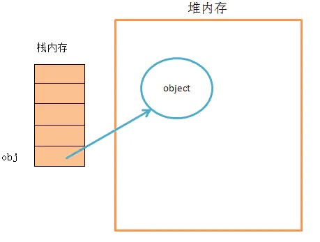
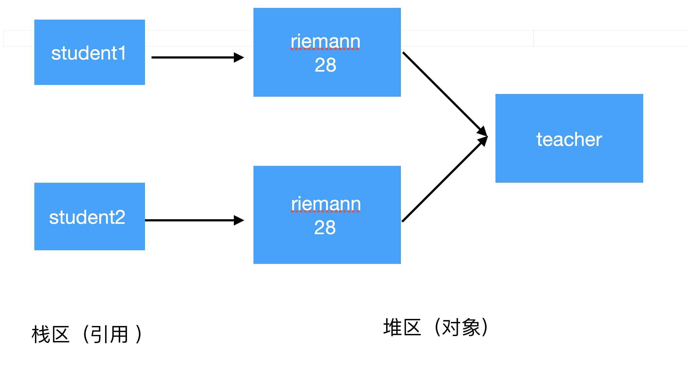
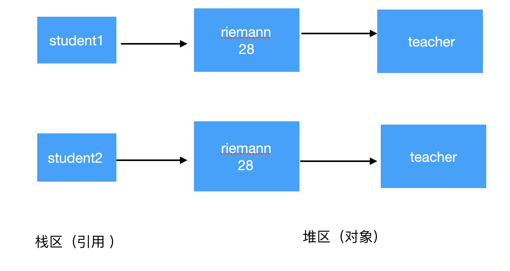

## 1、数据类型

基本数据类型：直接存储在栈中的数据

引用数据类型：存储的是该对象在**栈中的引用**，**真实数据**存放在对**内存里**

引用数据类型在栈中存储了指针，该指针指向堆中该实体的起始地址。当解释器寻找引用值时，会首先检索其在栈中的地址，取得地址后从堆中获得实体。




## 2、浅拷贝

- 对引用数据类型进行引用传递般的拷贝
- 被复制对象的所有变量都含有与原来的对象相同的值，而所有的对其他对象的引用仍然指向原来的对象。即对象的浅拷贝会对“主”对象进行拷贝，但不会复制主对象里面的对象。”里面的对象“会在原来的对象和它的副本之间共享。
- 浅拷贝仅仅复制所考虑的对象，而不复制它所引用的对象。

```java
public class ShallowCopy {
    public static void main(String[] args) throws CloneNotSupportedException {
        Teacher teacher = new Teacher();
        teacher.setName("riemann");
        teacher.setAge(28);

        Student student1 = new Student();
        student1.setName("edgar");
        student1.setAge(18);
        student1.setTeacher(teacher);

        Student student2 = (Student) student1.clone();
        System.out.println("-------------拷贝后-------------");
        System.out.println(student2.getName());
        System.out.println(student2.getAge());
        System.out.println(student2.getTeacher().getName());
        System.out.println(student2.getTeacher().getAge());

        System.out.println("-------------修改老师的信息后-------------");
        // 修改老师的信息
        teacher.setName("jack");
        System.out.println("student1的teacher为： " + student1.getTeacher().getName());
        System.out.println("student2的teacher为： " + student2.getTeacher().getName());

    }
}

class Teacher implements Cloneable {
    private String name;
    private int age;
	/* Get/Set方法略 */
}

class Student implements Cloneable {
    private String name;
    private int age;
    private Teacher teacher;
    /* Get/Set方法略 */
    public Object clone() throws CloneNotSupportedException {
        Object object = super.clone();
        return object;
    }
}

```

```shell
-------------拷贝后-------------
edgar
18
riemann
28
-------------修改老师的信息后-------------
student1的teacher为： jack
student2的teacher为： jack

```




两个引用`student1`和`student2`指向不同的两个对象，但是两个引用`student1`和`student2`中的两个`teacher`**引用指向的是同一个对象**，所以说明是`浅拷贝`。


## 3、深拷贝

- 对基本数据类型进行值传递，对引用数据类型，创建一个新的对象，并复制其内容
- 深拷贝是一个整个独立的对象拷贝，深拷贝会拷贝所有的属性,并拷贝属性指向的动态分配的内存。当对象和它所引用的对象一起拷贝时即发生深拷贝。深拷贝相比于浅拷贝速度较慢并且花销较大。
- **深拷贝把要复制的对象所引用的对象都复制了一遍**

```java
public class DeepCopy {
    public static void main(String[] args) 
        throws CloneNotSupportedException {
        Teacher teacher = new Teacher();
        teacher.setName("riemann");
        teacher.setAge(28);

        Student student1 = new Student();
        student1.setName("edgar");
        student1.setAge(18);
        student1.setTeacher(teacher);

        Student student2 = (Student) student1.clone();
        System.out.println("-------------拷贝后-------------");
        System.out.println(student2.getName());
        System.out.println(student2.getAge());
        System.out.println(student2.getTeacher().getName());
        System.out.println(student2.getTeacher().getAge());

        System.out.println("----------修改老师的信息后--------");
        // 修改老师的信息
        teacher.setName("jack");
        System.out.println("student1的teacher为： " 
                           + student1.getTeacher().getName());
        System.out.println("student2的teacher为： " 
                           + student2.getTeacher().getName());

    }
}

class Teacher implements Cloneable {
    private String name;
    private int age;
	/* Get/Set方法略 */
    public Object clone() throws CloneNotSupportedException {
        Object object = super.clone();
        return object;
    }
}

class Student implements Cloneable {
    private String name;
    private int age;
    private Teacher teacher;
    /* Get/Set方法略 */
    public Object clone() throws CloneNotSupportedException {
        // 浅复制时：
        // Object object = super.clone();
        // return object;

        // 改为深复制：
        Student student = (Student) super.clone();
        // 本来是浅复制，现在将Teacher对象复制一份并重新set进来
        student.setTeacher((Teacher) student.getTeacher().clone());
        return student;
    }
}

```

```

-------------拷贝后-------------
edgar
18
riemann
28
-------------修改老师的信息后-------------
student1的teacher为： jack
student2的teacher为： riemann

```




两个引用`student1`和`student2`指向不同的两个对象，两个引用`student1`和`student2`中的两个`teacher`引用指向的是两个对象，但对`teacher`对象的修改只能影响`student1`对象,所以说是`深拷贝`。


---

参考[https://blog.csdn.net/riemann_/article/details/87217229](https://blog.csdn.net/riemann_/article/details/87217229)

