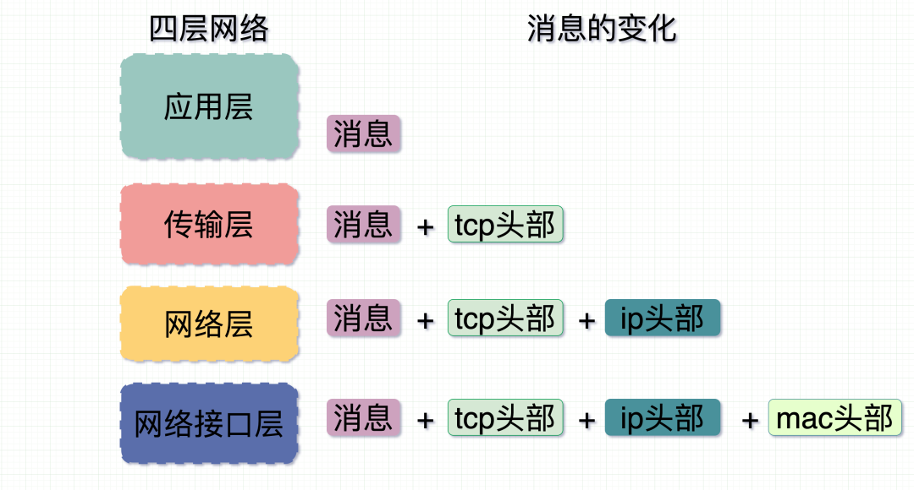
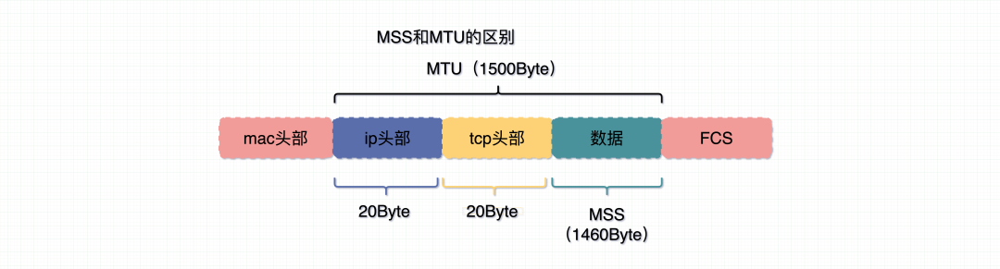
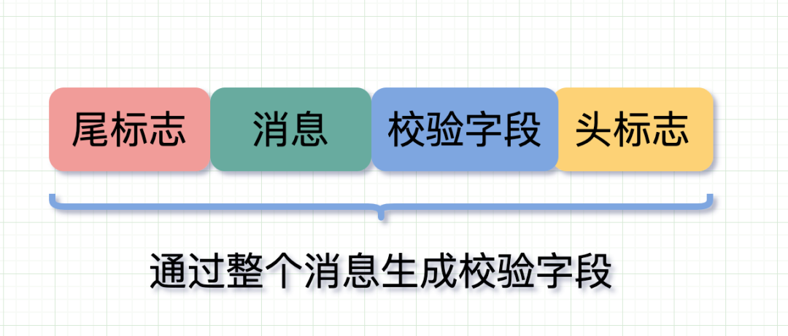
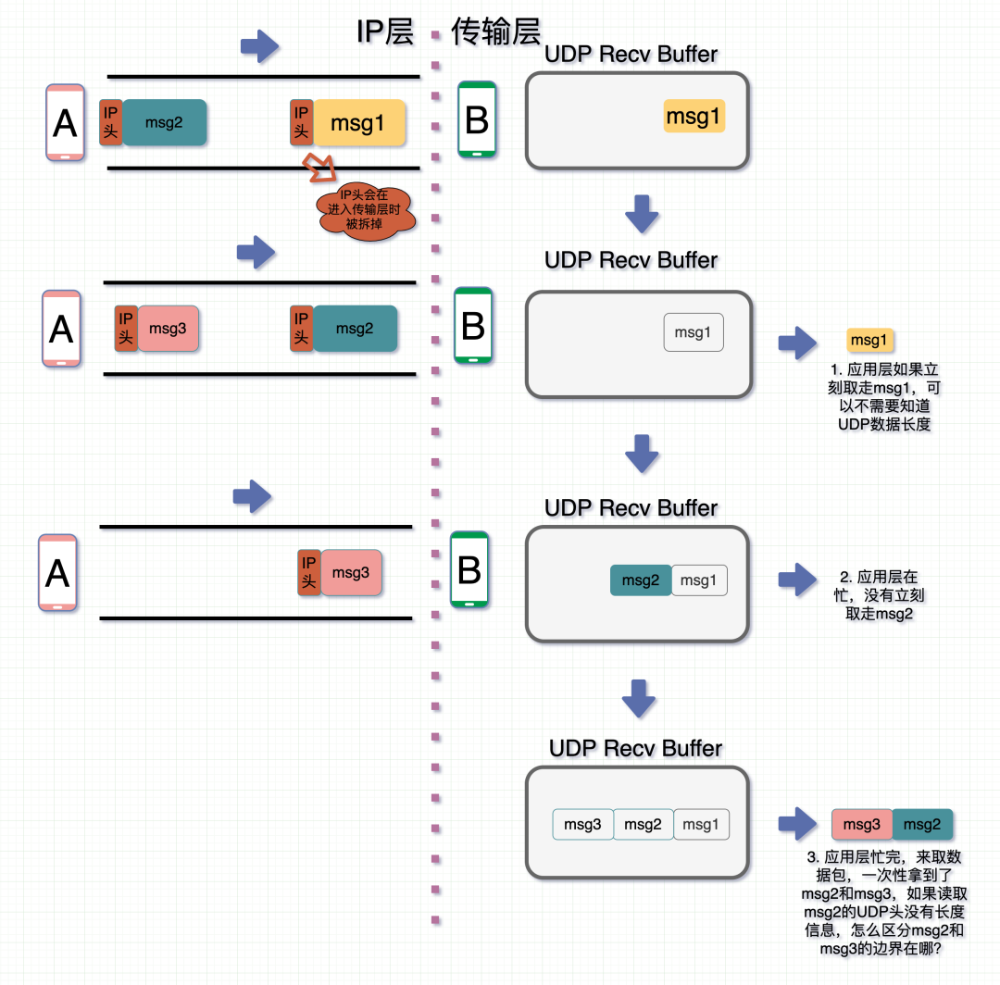
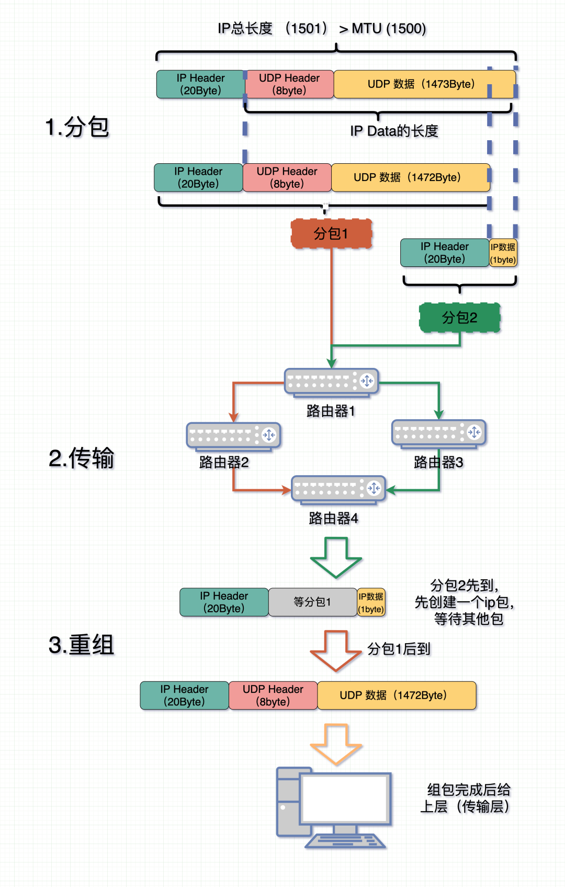

# 什么是拆包与粘包

假设客户端向服务端连续发送了两个数据包，用 packet1 和 packet2 来表示，那么服务端收到的数据可以分为三种，现列举如下

- 第一种：服务端正常接收到这两个数据包 package1 和 package2，即没有发生拆包和粘包
- 第二种：接收端只接收到一个包，由于tcp不会出现丢包的现象。所以这一个数据包中包含了发送端发送的两个数据包的信息，这种现象即为粘包。这种情况由于接收端不知道这两个数据包的界限，所以对于接收端来说很难处理。
- 第三种：这种情况有两种表现形式，接收端收到了两个数据包，但是这两个数据包一个少一块，一个多一块，这种情况即发生了拆包和粘包。（package1不完整，package2多了package1一部分；或者package1多了package2的一部分，package2不完整）

# 消息的变化

四层网络模型每层各司其职，消息在进入每一层时都会多加一个**报头**，每多一个报头可以理解为**数据报多戴一顶帽子**。这个报头上面记录着消息从哪来，到哪去，以及消息多长等信息。比如，**`mac头`记录的是硬件的唯一地址，`IP头`记录的是从哪来和到哪去，`tcp头`记录到是到达目的主机后具体去哪个进程（端口）**。

# [TCP分段和IP分片](https://mp.weixin.qq.com/s/YpQGsRyyrGNDu1cOuMy83w)

网络像一根管子，管子有粗细，数据包大小不定，要经过管子，数据包就不能大于管子粗细程度，当数据包过大时，就会将其切分。

数据先过传输层，再到网络层。

这个行为在**传输层和网络层**都有可能发生。

在传输层（`TCP`协议）里，叫**分段**。

在网络层（`IP`层），叫**分片**。（注意以下提到的IP没有特殊说明的情况下，都是指**IPV4**）

那么不管是分片还是分段，肯定需要**按照一定的长度**切分。

在`TCP`里，这个长度是`MSS`。在`IP`层里，这个长度是`MTU`。

- **MTU**: Maximum Transmit Unit，最大传输单元。一般 MTU = 1500 Byte。

- **MSS**：Maximum Segment Size，最大分段大小。

假设 MTU= 1500 byte，那么 **MSS = 1500- 20(IP Header) -20 (TCP Header) = 1460 byte**，如果应用层有 **2000 byte** 发送，那么需要两个切片才可以完成发送，第一个 TCP 切片 = 1460，第二个 TCP 切片 = 540。

个人理解：因为最终会到IP层，所以最终发出去的都以片为单位了。

# 为什么会发生粘包和拆包？

可以发生拆包、粘包原理是因为TCP是基于字节流传输的，字节流的0和1没有界限,数据可能被**切割和组装**成各种数据包。

## 1、滑动窗口

**粘包**：假设发送方的每256 bytes表示一个完整的报文，接收方由于数据处理不及时，这256个字节的数据都会被缓存到接收缓存区中。如果接收方的接收缓存区中缓存了多个报文，那么对于接收方而言，这就是粘包。

>   比如，传输字节为
>
>   `用IDEA` `敲代码`，但因为粘包，会变成`用IDEA敲` `代码`

**拆包**：考虑另外一种情况，假设接收方的窗口只剩了128，意味着发送方最多还可以发送128字节，而由于发送方的数据大小是256字节，因此只能发送前128字节，等到接收方ack后，才能发送剩余字节。这就造成了拆包。

## 2、MTU/MSS的限制

略

## 3、Nagle算法

避免数据过小，而产生多个包传输，会将多个小包整合成一个大包。

在 Nagle 算法开启的状态下，数据包在以下两个情况会被发送：

-   如果包长度达到`MSS`（或含有`Fin`包），立刻发送，否则**等待**下一个包到来；如果下一包到来后两个包的总长度超过`MSS`的话，就会进行拆分发送；
-   等待超时（一般为`200ms`），第一个包没到`MSS`长度，但是又迟迟等不到第二个包的到来，则立即发送。

>   目前基本都是关闭的，因为网络效率高了，不需要这样做了。
>
>   关闭后，如果接收方没有及时取走，还是会发生粘包，即两个消息挤在一起，然后再一起取走。

# 解决办法

### 1、加入消息头尾标记位

比如当收到了`0xfffffe`或者回车符，则认为收到了新消息的头，此时继续取数据，直到收到下一个头标志`0xfffffe`或者尾部标记，才认为是一个完整消息。

### 2、消息长度信息

HTTP 中的`Content-Length`就起了类似的作用，当接收端收到的消息长度小于 Content-Length 时，说明还有些消息没收到。那接收端会一直等，直到拿够了消息或超时

### 3、校验字段（判断是否为一个完整消息）

>   采用`0xfffffe`标志位，用来标志一个数据包的开头，可能数据中就包含`0xfffffe`

# UDP会粘包拆包吗

UDP 是基于数据报的传输协议，不会有粘包拆包问题。

基于**数据报**是指无论应用层交给 UDP 多长的报文，UDP 都照样发送，即一次发送一个报文。至于如果数据包太长，需要分片，那也是IP层的事情，大不了效率低一些。

### UDP长度冗余了，为什么还需要加入长度

冗余见UDP报文与IP报文的关系，可以计算得出长度

IP 层是网络层的，而 UDP 是传输层的，到了传输层，数据包就已经不存在IP头信息了，那么此时的UDP数据会被放在 UDP 的  `Socket Buffer` 中。当应用层来不及取这个 UDP 数据报，那么两个数据报在数据层面其实都是一堆 01 串。此时读取第一个数据报的时候，会先读取到 UDP 头部，**如果这时候 UDP 头不含 UDP 长度信息，那么应用层应该取多少数据才算完整的一个数据报呢**？也可以用来计算校验和。

# IP层切片分包会有粘包问题吗

IP层分包

-   如果消息过长，`IP层`会按 **MTU 长度**把消息分成 **N 个切片**，每个切片带有自身在**包里的位置（offset）**和**同样的IP头信息**。
-   各个切片在网络中进行传输。每个数据包切片可以在不同的路由中流转，然后**在最后的终点汇合后再组装**。
-   在接收端收到第一个切片包时会申请一块新内存，创建IP包的数据结构，等待其他切片分包数据到位。
-   等消息全部到位后就把整个消息包给到上层（传输层）进行处理。

可以看出整个过程，`IP 层`从按长度切片到把切片组装成一个数据包的过程中，都只管运输，都不需要在意消息的边界和内容，都不在意消息内容了，那就不会有粘包一说了。

---

- [参考](https://mp.weixin.qq.com/s?__biz=Mzg5NDY2MDk4Mw==&mid=2247486377&idx=1&sn=bdc4b8b71559193b29aa0f54b95973db&chksm=c01d73b1f76afaa708145a0d9af91de719cf7d0beb4c2945319bbd6d7a1a017bb03833c84b9c&scene=126&&sessionid=1659942401#rd)