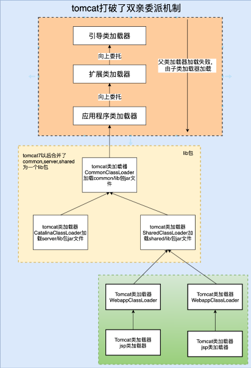
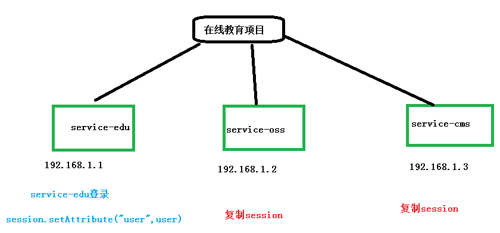
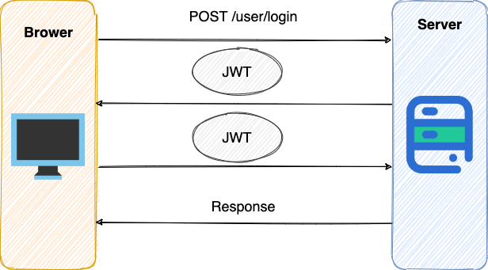

# Java Web 的三层架构

**业务层（逻辑层、service层）**

采用事务脚本模式。将一个业务中所有的操作封装成一个方法，同时保证方法中所有的数据库更新操作，即保证同时成功或同时失败。避免部分成功部分失败引起的数据混乱操作。

**表述层**

采用MVC模式。  

M称为模型，也就是实体类。用于数据的封装和数据的传输。 

V为视图，也就是GUI组件，用于数据的展示。  

C为控制，也就是事件，用于流程的控制。

**持久层（DAO）**

采用DAO模式，建立实体类和数据库表映射（ORM映射，Object Relationship Mapping）。也就是哪个类对应哪个表，哪个属性对应哪个列。

持久层的目的就是，完成对象数据和关系数据的转换。

>TIP
>
>**SSM框架**
>
>- 业务层——Spring
>- 表现层——SpringMVC
>- 持久层——MyBatis
>
>**SSH框架**
>
>- 业务层——Spring
>- 表现层——Struts
>- 持久层——Hibernate


# Session、Cookie和Token

## Session

实现原理：

1. 客户对向服务器端发送请求后，**Session 创建在服务器端**，**返回Sessionid给客户端**浏览器保存在本地，
2. 当下次发送请求的时候，**在请求头中传递sessionId**获取对应的从服务器上获取对应的Sesison

把客户端浏览器与服务器之间一系列交互的动作称为一个 Session。

如果是微服务，session不会共享（除非通过一些手段共享session）

- 在**服务器端保存数据**（客户端只有Session ID）的一个数据结构，用来**跟踪用户的状态**，这个数据可以保存在集群、数据库、文件中
- 可以持久化保存在：内存、Cookie中、redis或memcached等缓存中、数据库中
- 客户端只会保存sessionid在cookie中

**钝化**：服务器关闭，但是浏览器没关闭，会话仍继续，需要将session中的内容序列化保存在磁盘上

**活化**：服务器又重启了，将磁盘中的内容反序列化至session

生命周期：默认20分钟

[根据sessionId获取session](https://blog.csdn.net/sihai12345/article/details/81098765)

```java
// java不建议使用
HttpSession sess = session.getSessionContext().getSession(sid)  
// 实现自己的sessionContext并创建HttpSessionListener
```


## Cookie

- **客户端**（浏览器）保存**用户信息**的一种机制，通常在Cookie中**记录Session ID**。
- 7天内不需要登陆，就可以用cookie保存，然后设置过期时间。


## Token

- token是用户身份的验证方式，我们通常叫它：令牌。
- 最简单的token组成：uid(用户唯一的身份标识)、time(当前时间的时间戳)、sign(签名，由token的前几位 + 以哈希算法压缩成一定长的十六进制字符串，可以防止恶意第三方拼接token请求服务器)。还可以把不变的参数也放进token，避免多次查库。
- 是否授权给软件
- 服务器端会有校验机制，校验token是否合法


## Cookie和Session的区别

1）cookie数据存放在客户的浏览器上，session数据放在服务器上；

2）cookie不是很安全，别人可以分析存放在本地的cookie并进行cookie欺骗，考虑到安全应当使用session；

3）session会在一定时间内保存在服务器上。当访问增多，会比较占用你服务器的性能,考虑到减轻服务器性能方面，应当使用cookie；

4）单个cookie保存的数据不能超过4K，很多浏览器都限制一个站点最多保存20个cookie。

> 将登陆信息等重要信息存放为session；
>
> 其他信息如果需要保留，可以放在cookie中。
>
> 第一次请求的响应中会生成一个对应session的cookie：JSESSIONID，下一次请求的响应不会生成，但是请求会将JSESSIONID传过去，寻找相应的session

5）session不支持跨域名使用，cookie得设置。

www.baidu.com与blog.baidu.com（对应的一级域名也是baidu.com）是不同的域名，他们之间相互请求cookie是请求不到的。如果想要跨域请求cookie，需要将这两个设置成相同域名。即在存储cookie时使用domain设置域名即可，如下：

```js
//设置cookie，使之能跨域获取
function setCookie(name, value) {
    var Days = 30;
    var exp = new Date();
    exp.setTime(exp.getTime() + Days * 24 * 60 * 60 * 1000);
    document.cookie = name + "=" + value + ";expires=" 
        + exp.toGMTString() + "; path=/" + ";domain=.baidu.com";
}
```


## 没有Cookie，session还能进行身份验证吗

当服务器tomcat第一次接收到客户端的请求时，会开辟一块独立的session空间，建立一个session对象，同时会生成一个session id，通过响应头的方式保存到客户端浏览器的cookie当中。以后客户端的每次请求，都会在请求头部带上这个session id，这样就可以对应上服务端的一些会话的相关信息，比如用户的登录状态。

如果没有客户端的Cookie， Session是无法进行身份验证的。

当服务端从单体应用升级为分布式之后，cookie+session这种机制要怎么扩展？

1. session粘贴：在负载均衡中，通过一个机制保证同一个客户端的所有请求都会转发到同一个tomcat实例当中。问题：当这个tomcat实例出现问题之后，请求就会被转发到其他实例，这时候用户的session信息就丟了。
2. session复制：当一个tomcat实例上保存了session信息后，主动将session 复制到集群中的其他实例。问题：复制是需要时间的，在复制过程中，容易产生session信息丢失。
3. session共享： 就是将服务端的session信息保存到一个第三方中，比如Redis。


# Tomcat

轻量级Web应用服务器（web容器）

具备web服务器的所有功能，不仅可以监听接收请求并响应静态资源，而且可以在后端运行特定规范的Java代码servlet，同时将执行的结果以HTML代码的形式返回客户端。

## 核心组件

**1、web容器**

实现服务器功能

**2、servlet容器**

处理servlet代码

**3、jsp容器**

将jsp动态网页翻译成servlet代码

## 打破双亲委派机制

问题：同一个web容器中可能有多个web程序，不同的web程序中可能会用到同个第三方类库的不同版本。



>  如上图，上面的橙色部分还是和原来一样，采用双亲委派机制，而黄色部分是tomcat第一部分自定义的类加载器，这部分主要加载tomcat包中的类，这一部分依然采用的是双亲委派机制，而绿色部分是tomcat第二部分自定义类加载器，正是这一部分，打破了类的双亲委派机制。

java项目在打war包的时候，tomcat自动生成的类加载器，也就是说，每一个项目打成一个war包，tomcat都会自动生成一个类加载器，专门用来加载这个war包。而这个类加载器打破了双亲委派机制。

- tomcat加载自身的api的时候使用双亲委派
- 加载webapp的时候使用自定义的加载器

> **看两个类对象是否是同一个，除了看类的包名和类名是否都相同之外，还需要他们的类加载器也是同一个才能认为他们是同一个。**

# JavaWeb的三大规范

Servlet程序、Listener监听器、Filter过滤器

初始化顺序：listener -> filter -> servlet

## 1、Servlet

用 Java 编写的服务器端程序

## 2、Listener


## 3、Filter


# Servlet的三大域对象

| 对象名称    | 对应类型           |
| ----------- | ------------------ |
| request     | HttpServletRequest |
| session     | HttpSession        |
| Application | ServletContext     |

## 1、request

**生命周期**

- 创建：客户端向服务器发送一次请求,服务器就会创建request对象
- 销毁：服务器对这次请求作出响应后就会销毁request对象
- 有效：仅在当前请求中有效

**作用**

1. 获取表单提交参数： request.getParameter()

2. 传值到表单： request.setAttribute()

## 2、session

**生命周期**

- 创建：服务器端第一次调用getSession();(保存在服务器内存中)

- 销毁：

	1. 非正常关闭服务器(正常关闭session会序列化，再次启动服务器session会被反序列化)；
	2. session过期了默认30分钟.
	3. 手动调用session.invalidate();

	- 注意：关闭浏览器再次访问会找不到session的会话id而不是session被销毁了。

- 有效：用户打开浏览器会话开始，直到关闭浏览器会话才会结束。一次会话期间只会创建一个session对象。

**作用**

1. 读取生成的验证码信息

```java
// 图片的验证码
String imageMsg = (String) request.getSession().getAttribute(“imageMsg”);
```

2. 用户保持登录状态

```java
//登录成功 保存用户登录状态
request.getSession().setAttribute(“user”, user)；
```

3. 购物车物品保存

```java
//将cart放入session中
request.getSession().setAttribute(“cart”, cart);
```


## 3、application

生命周期

- 创建：服务器启动的时候,服务器为每个WEB应用创建一个属于该web项目的对象ServletContext类.
- 销毁：服务器关闭或者项目从服务器中移除的时候.
- 有效：此信息在整个服务器上被保留。


## 4、区别

**request**：

每一次请求都是一个新的request对象，如果在web组件之间需要共享同一个请求中的数据，只能使用请求转发.

**session**：

每一次会话都是一个新的session对象，如果如果需要在一次会话中的多个请求之间需要共享数据，只能使用session.

**application**：

应用对象，Tomcat启动到关闭，表示一个应用，在一个应用中有且只有一个application对象，作用于整个Web应用，可以实现多次会话之间的数据共享.

## 5、补充：page

对应pageContext，仅jsp有效

生命周期

- 当对JSP的请求开始，当相应结束时销毁。
- jsp页面被执行，声明周期开始；
- jsp页面执行完毕，声明周期结束；

作用范围：整个JSP页面，是四大作用域中最小的一个。

# GET和POST的区别

1. GET用于获取信息，是无副作用的，是幂等的；POST用于修改服务器上的数据，有副作用，非幂等。都是Http协议中的两种请求方式，传输上没有区别。
2. 浏览器回退的时候get不会重新请求，post会
3. get请求会被部分浏览器主动缓存，post不会 
4. get的参数是直接暴露在url上的，相对不安全。post的请求参数是在请求体中的。
4. get到参数有大小限制1k，post没有

# 服务器内部转发和客户端重定向

## 1、服务器内部转发 

```java
request.getRequestDispatcher("...").forward(request,response);
```

- 一次请求响应的过程，对于客户端而言，内部经过了多少次转发，客户端是不知道的

- 由...响应

- **地址栏没有变化**
- 同一个request和response

## 2、客户端重定向

```java
 response.sendRedirect("....");
```

- 两次请求响应的过程。客户端肯定知道请求URL有变化

- **地址栏有变化**
- 不同的request和response


# Kaptcha验证码

1、kaptcha如何使用:

   - 添加jar
   - 在web.xml文件中注册KaptchaServlet，并设置验证码图片的相关属性
   - 在html页面上编写一个img标签，然后设置src等于KaptchaServlet对应的url-pattern

2、kaptcha验证码图片的各个属性在常量接口：Constants中

3、KaptchaServlet在生成验证码图片时，会同时将验证码信息保存到session中

因此，在注册请求时，首先将用户文本框中输入的验证码值和session中保存的值进行比较，相等，则进行注册


# 单点登录SSO(Single Sign On)

## 单一服务器模式登录

使用session对象实现

登录成功之后，把用户数据放到session里面

判断是否登录，从session获取数据，可以获取到就登录

```java
session.setAttribute("user", user);
session.getAttribute("user");
```


## 单点登录的三种常用方式

分布式集群部署的时候，一个模块登陆，其余模块也同样登陆。

### 1、session广播机制实现

session复制



### 2、cookie+redis实现***

1. 在项目中任何一个模块进行登录，登录之后，把数据放到两个地方

	redis：key -> 生成唯一随机值（ip、用户id等等），value -> 用户数据

	cookie：把redis里面生成key值放到cookie里面

2. 访问项目中其他模块，发送请求带着cookie进行发送，获取cookie中的key，到redis进行查询，如果查询数据就是登录

### 3、token实现***



1. 用户向服务器发送用户名、密码以及验证码用于登陆系统。

2. 如果用户用户名、密码以及验证码校验正确的话，服务端会返回已经签名的 `Token`。
3. 用户以后每次向后端发请求都在 Header 中带上这个 `Token`。
4. 服务端检查 `Token` 并从中获取用户相关信息。

两点建议：

1. 建议将 `Token` 存放在 localStorage 中，放在 Cookie 中会有 CSRF 风险。
2. 请求服务端并携带 Token 的常见做法是将 `Token` 放在 HTTP Header 的 `Authorization` 字段中（`Authorization: Bearer Token`）。

> 在HTML5中，新加入了一个**localStorage**特性，这个特性主要是用来作为本地存储来使用的，解决了cookie存储空间不足的问题(cookie中每条cookie的存储空间为4k)，localStorage中一般浏览器支持的是5M大小，这个在不同的浏览器中localStorage会有所不同。

# JWT

## [简介](https://blog.csdn.net/weixin_45070175/article/details/118559272)

JWT 就是一种生成 token 的规则。

JWT（Json Web Token）是为了在网络应用环境间传递声明而执行的一种基于 JSON 的开放标准。

JWT 最重要的作用就是对 token信息的**防伪**作用。 

JWT 最大的优势是**服务器不再需要存储 Session**，使得服务器认证鉴权业务可以方便扩展。但这也是 JWT 最大的缺点：由于服务器不需要存储 Session 状态，因此**使用过程中无法废弃某个 Token 或者更改 Token 的权限**。也就是说一旦 JWT 签发了，到期之前就会始终有效，除非服务器部署额外的逻辑。

## JWT 的原理

一个 JWT 由三个部分组成：Header、Payload、Signature。

最后由这三者组合进行 base64 编码得到 JWT。

JWT 通常是这样的：`xxxxx.yyyyy.zzzzz`。

```
JWTString = 
Base64(Header)
.Base64(Payload)
.HMACSHA256(base64UrlEncode(header)+"."+base64UrlEncode(payload),secret)
```

> base64编码，**并不是加密**，只是把明文信息变成了不可见的字符串。但是其实只要用一些工具就可以把base64编码解成明文，所以不要在JWT中放入涉及私密的信息。

### 1、Header 

 描述 JWT 的元数据，定义了生成签名的算法以及 `Token` 的类型。

- `typ`（Type）：令牌类型，也就是 JWT。
- `alg`（Algorithm） ：签名算法，比如 HS256。

### 2、Payload 

**用来存放实际需要传递的数据**

主要存一些Claim：

- Registered Claims（注册声明） ：预定义的一些声明，建议使用，但不是强制性的。
- Public Claims（公有声明） ：JWT 签发方可以自定义的声明，但是为了避免冲突，应该在 IANA JSON Web Token Registry 中定义它们。
- Private Claims（私有声明） ：JWT 签发方因为项目需要而**自定义的声明**，更符合实际项目场景使用。用户名信息等

下面是一些常见的注册声明：

- `iss`（issuer）：JWT 签发方。
- `iat`（issued at time）：JWT 签发时间。
- `sub`（subject）：JWT 主题。
- `aud`（audience）：JWT 接收方。
- `exp`（expiration time）：JWT 的**过期时间**。
- `nbf`（not before time）：JWT 生效时间，早于该定义的时间的 JWT 不能被接受处理。
- `jti`（JWT ID）：JWT 唯一标识。

> Payload 部分默认是不加密的，一定不要将隐私信息存放在 Payload 当中！！！

### 3、Signature（签名） 

服务器通过 Payload、Header 和一个密钥(Secret)使用 Header 里面指定的签名算法（默认是 HMAC SHA256）生成。

Signature 部分是对前两部分的签名，作用是防止 Token（主要是 payload） 被篡改。

这个签名的生成需要用到：

- Header + Payload。
- 存放在服务端的密钥(一定不要泄露出去)。
- 签名算法。

签名的计算公式如下：

```
HMACSHA256(
  base64UrlEncode(header) + "." +
  base64UrlEncode(payload),
  secret)
```

> HMACSHA256是通过不可逆的加密算法。

### 重点：JWT每部分的作用

注意JWT每部分的作用，在服务端接收到客户端发送过来的JWT token之后：

- header和payload可以直接利用base64解码出原文，从header中获取哈希签名的算法，从payload中获取有效数据。
- signature由于使用了**不可逆的加密算法**，**无法解码出原文**，它的作用是校验token有没有被篡改。服务端获取header中的加密算法之后，利用该算法加上secretKey对header、payload进行加密，比对加密后的数据和客户端发送过来的是否一致。注意secretKey只能保存在服务端，而且对于不同的加密算法其含义有所不同，一般对于MD5类型的摘要加密算法，secretKey实际上代表的是盐值。

## JWT 如何防止 Token 被篡改？

有了签名之后，即使 Token 被泄露或者解惑，黑客也没办法同时篡改 Signature 、Header 、Payload。

这是为什么呢？因为服务端拿到 Token 之后，会解析出其中包含的 Header、Payload 以及 Signature 。服务端会根据 Header、Payload、密钥再次生成一个 Signature。拿新生成的 Signature 和 Token 中的 Signature 作对比，如果一样就说明 Header 和 Payload 没有被修改。

不过，如果服务端的密钥也被泄露的话，黑客就可以同时篡改 Signature 、Header 、Payload 了。黑客直接修改了 Header 和 Payload 之后，再重新生成一个 Signature 就可以了。

> 密钥一定保管好，一定不要泄露。JWT 安全的核心在于签名，签名安全的核心在密钥。

## 如何加强 JWT 的安全性？

1. 使用安全系数高的加密算法。
2. 使用成熟的开源库，没必要造轮子。
3. Token 存放在 localStorage 中而不是 Cookie 中，避免 CSRF 风险。
4. 一定不要将隐私信息存放在 Payload 当中。
5. 密钥一定保管好，一定不要泄露出去。JWT 安全的核心在于签名，签名安全的核心在密钥。
6. Payload 要加入 `exp` （JWT 的过期时间），永久有效的 JWT 不合理。并且，JWT 的过期时间不易过长。

## 注销登录等场景下 JWT 还有效

### 1、将 JWT 存入内存数据库

如果需要让某个 JWT 失效就直接从 Redis 中删除这个 JWT 即可。

### 2、黑名单机制

使用内存数据库比如 Redis 维护一个黑名单，如果想让某个 JWT 失效的话就直接将这个 JWT 加入到 **黑名单** 即可。然后，每次使用 JWT 进行请求的话都会先判断这个 JWT 是否存在于黑名单中。

### 3、保持令牌的有效期限短并经常轮换

会导致用户登录状态不会被持久记录，而且需要用户经常登录。

## JWT 的续签问题

### 1、类似于 Session 认证中的做法

假设服务端给的 JWT 有效期设置为 30 分钟，服务端每次进行校验时，如果发现 JWT 的有效期**马上快过期**了，服务端就**重新生成** JWT 给客户端。客户端每次请求都检查新旧 JWT，如果不一致，则更新本地的 JWT。这种做法的问题是仅仅在快过期的时候请求才会更新 JWT，对客户端不是很友好。

### 2、每次请求都返回新 JWT

开销会比较大，尤其是在服务端要存储维护 JWT 的情况下。

### 3、JWT 有效期设置到半夜

一种折衷的方案，保证了大部分用户白天可以正常登录，适用于对安全性要求不高的系统。

### 4、用户登录返回两个 JWT

第一个是 accessJWT ，它的过期时间比如半个小时，

另外一个是 refreshJWT 它的**过期时间更长**一点比如为 1 天。

客户端登录后，将 accessJWT 和 refreshJWT 保存在本地，每次访问将 accessJWT 传给服务端。服务端校验 accessJWT 的有效性，**如果过期**的话，就**将 refreshJWT 传给服务端**。如果有效，服务端就生成新的 accessJWT 给客户端。否则，客户端就重新登录即可。

这种方案的不足是：

- 需要客户端来配合；
- 用户注销的时候需要同时保证两个 JWT 都无效；
- 重新请求获取 JWT 的过程中会有短暂 JWT 不可用的情况（可以通过在客户端设置定时器，当 accessJWT 快过期的时候，提前去通过 refreshJWT 获取新的 accessJWT）。

## 优缺点

**主要**：

无状态：服务器不存储session会话状态，减轻了服务器压力，但是同时也不可控（一旦JWT签发，在有效期内将会一直有效）。

优点

- 生产的token可以**包含基本信息**，比如id等，**减少数据库的查询**
- **存储在客户端，不占用服务端的内存资源**
- **JWT默认不加密**，**但可以加密**。生成原始令牌后，可以再次对其进行加密。
- 因为可以不需要cookie，所以可以避免CSRF攻击

缺点

- JWT的最大缺点是**服务器不保存session会话状态**（也是优点），所以在使用期间不可能取消令牌或更改令牌的权限。也就是说，一旦JWT签发，在有效期内将会一直有效。容易泄漏。
- JWT本身包含认证信息，token是经过base64编码，所以可以解码，因此token加密前的对象不应该包含敏感信息，**一旦信息泄露**，任何人都**可以获得令牌的所有权限**。为了减少盗用，JWT的有效期不宜设置太长。对于某些重要操作，用户在使用时应该每次都进行进行身份验证。

> 为了减少盗用和窃取，JWT不建议使用HTTP协议来传输代码，而是使用加密的HTTPS协议进行传输。


# 跨域问题

`No 'Access-Control-Allow-Origin'`

### 概念

出于浏览器的同源策略限制。

**同源策略**会阻止一个域的javascript脚本和另外一个域的内容进行交互。所谓同源（即指在同一个域）就是两个页面具有相同的协议（protocol），主机（host）和端口号（port）

**跨域问题**，三个地方，任何一个不相同都会产生跨域，不能访问

- 访问协议：http 访问 https
- 访问地址：192.128.1.1 访问 172.11.1.1
- 访问端口：9528 访问 8201

### 解决方式

1、**返回新的CorsFilter（全局跨域）**

2、重写 WebMvcConfigurer（全局跨域）

3、**使用注解 @CrossOrigin**（在Controller类或方法上）（局部跨域）

4、手动设置响应头 (HttpServletResponse)（局部跨域）

5、自定web filter 实现跨域


> - 上面前两种方式属于全局 CORS 配置，后两种属于局部 CORS配置。如果使用了局部跨域是会覆盖全局跨域的规则，所以可以通过 @CrossOrigin 注解来进行细粒度更高的跨域资源控制。
> - 其实无论哪种方案，最终目的都是**修改响应头**，向响应头中添加浏览器所要求的数据，进而实现跨域


### 具体实现

#### 1、返回新的 CorsFilter(全局跨域)

在任意配置类，返回一个新的CorsFIlter Bean ，并添加映射路径和具体的CORS配置路径。

> gateway网关中使用

```java
@Configuration
public class GlobalCorsConfig {
    @Bean
    public CorsFilter corsFilter() {
        //1. 添加 CORS配置信息
        CorsConfiguration config = new CorsConfiguration();
        //放行哪些原始域
        config.addAllowedOrigin("*");
        //是否发送 Cookie
        config.setAllowCredentials(true);
        //放行哪些请求方式
        config.addAllowedMethod("*");
        //放行哪些原始请求头部信息
        config.addAllowedHeader("*");
        //暴露哪些头部信息
        config.addExposedHeader("*");
        //2. 添加映射路径
        UrlBasedCorsConfigurationSource corsConfigurationSource = new UrlBasedCorsConfigurationSource();
        corsConfigurationSource.registerCorsConfiguration("/**",config);
        //3. 返回新的CorsFilter
        return new CorsFilter(corsConfigurationSource);
    }
}
```


#### 2、重写 WebMvcConfigurer(全局跨域)

```java
@Configuration
public class CorsConfig implements WebMvcConfigurer {
    @Override
    public void addCorsMappings(CorsRegistry registry) {
        registry.addMapping("/**")
                //是否发送Cookie
                .allowCredentials(true)
                //放行哪些原始域
                .allowedOrigins("*")
                .allowedMethods(new String[]{"GET", "POST", "PUT", "DELETE"})
                .allowedHeaders("*")
                .exposedHeaders("*");
    }
}
```


#### 3、使用注解 (局部跨域)

在控制器(类上)上使用注解 @CrossOrigin:，表示该类的所有方法允许跨域。

```java
@RestController
@CrossOrigin(origins = "*")
public class HelloController {
    @RequestMapping("/hello")
    public String hello() {
        return "hello world";
    }
}
```

在方法上使用注解 @CrossOrigin:

```java
@RequestMapping("/hello")
@CrossOrigin(origins = "*")
//@CrossOrigin(value = "http://localhost:8081") //指定具体ip允许跨域
public String hello() {
    return "hello world";
}
```


#### 4、手动设置响应头(局部跨域)

使用 HttpServletResponse 对象添加响应头(Access-Control-Allow-Origin)来授权原始域，这里 Origin的值也可以设置为 “*”,表示全部放行。

```java
@RequestMapping("/index")
public String index(HttpServletResponse response) {
    response.addHeader("Access-Allow-Control-Origin","*");
    return "index";
}
```


#### 5、使用自定义filter实现跨域

首先编写一个过滤器，可以起名字为MyCorsFilter.java

```java
@Component
public class MyCorsFilter implements Filter {
  public void doFilter(ServletRequest req, ServletResponse res, FilterChain chain) throws IOException, ServletException {
    HttpServletResponse response = (HttpServletResponse) res;
    response.setHeader("Access-Control-Allow-Origin", "*");
    response.setHeader("Access-Control-Allow-Methods", "POST, GET, OPTIONS, DELETE");
    response.setHeader("Access-Control-Max-Age", "3600");
    response.setHeader("Access-Control-Allow-Headers", "x-requested-with,content-type");
    chain.doFilter(req, res);
  }
  public void init(FilterConfig filterConfig) {}
  public void destroy() {}
}
```

在web.xml中配置这个过滤器，使其生效

```xml
<!-- 跨域访问 START-->
<filter>
 <filter-name>CorsFilter</filter-name>
 <filter-class>com.mesnac.aop.MyCorsFilter</filter-class>
</filter>
<filter-mapping>
 <filter-name>CorsFilter</filter-name>
 <url-pattern>/*</url-pattern>
</filter-mapping>
<!-- 跨域访问 END  -->
```

