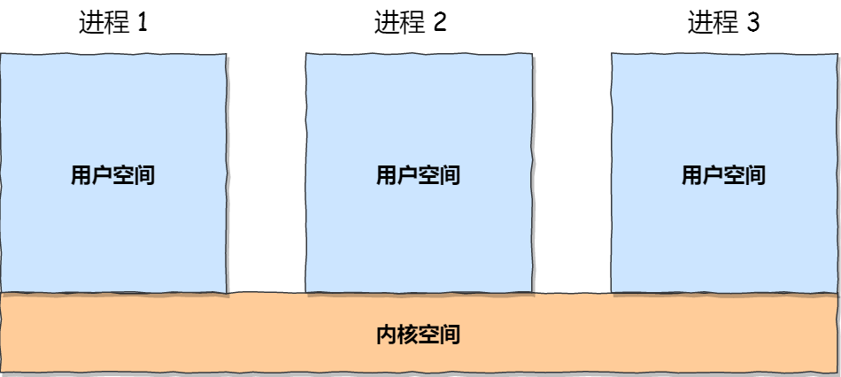
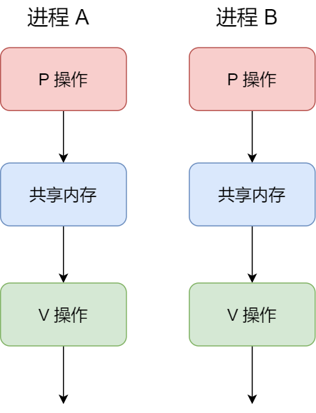
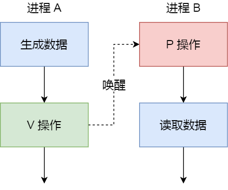
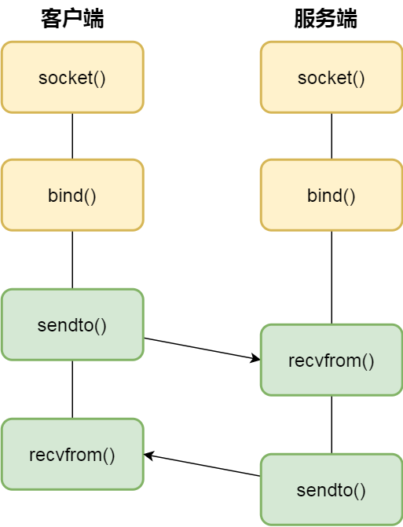

# 进程间通信方式

>   例如：微博词条分享给微信

- 管道
- 消息队列
- 共享内存
- 信号量
- 信号
- Socket



**每个进程都有自己的内存地址空间（用户空间，相互独立）**，而内核空间是每个进程共享的。因此进程之间想要进行通信，就需要通过**内核**来实现。

## 管道

管道是最简单，效率最差的一种通信方式。


管道是一个特殊的共享文件，又名pipe文件，本质上就是**在内核中开辟一个内存缓冲区**，当进程创建一个管道后，Linux会返回两个文件描述符，一个是**写入端**的描述符，一个是**输出端**的描述符，可以通过这两个描述符往管道写入或者读取数据。

管道是通过调用 pipe 函数创建的，fd[0] 用于读，fd[1] 用于写。

```c
#include <unistd.h>
int pipe(int fd[2]);
```

如果想要实现两个进程通过管道来通信，则需要让创建管道的进程fork子进程，这样子进程们就拥有了父进程的文件描述符，这样子进程之间也就有了对同一管道的操作。

缺点：

- 半双工通信，一条管道只能一个进程写，一个进程读。
- 各进程互斥地访问管道，一个进程写完后，另一个进程才能读，反之同理。

>   与共享内存的区别
>
>   共享内存读写都可以随意进行，存储也可以随意，但是管道同一时刻只能读或取，而且只能按照循环队列的形式读写


## 消息传递

>   管道的通信方式效率是低下的，不适合进程间频繁的交换数据。

### 1、直接通信方式

进程A往进程B的消息队列(**在内核空间中**)写入数据后就可以正常返回，进程B需要时再去读取就可以了，效率比较高。

```c
// A
send(B, msg);
// B
receive(A, &msg)
```


数据以**格式化的消息** (由**消息头**和**消息体**组成) 为单位

-   消息头：发送进程ID、接受进程ID、消息长度等

消息发送方和接收方约定好消息体的数据类型，不像管道是无格式的字节流类型，这样的好处是可以边发送边接收，而不需要等待完整的数据。


### 2、间接通信方式

内核空间中存有信箱，通过信箱这个中间实体进行消息传递，没有指名道姓是哪个进程。

进程A写好数据后发送给信箱P，进程B从信箱P读取msg

```c
// A
send(P, msg);
// B
receive(P, &msg)
```


### 3、缺点

- 每个消息体有一个**最大长度的限制**，并且队列/信箱所包含消息体的总长度也是有上限的。

- **消息传递通信过程中，存在用户态与内核态之间的数据拷贝开销**，因为进程写入数据到内核中的消息队列/信箱时，会发生从用户态拷贝数据到内核态的过程，同理另一进程读取内核中的消息数据时，会发生从内核态拷贝数据到用户态的过程。


## 共享内存

共享内存解决了消息队列存在的内核态和用户态之间数据拷贝的问题。

>   现代操作系统，对于内存管理，采用的是虚拟内存技术，也就是每个进程都有自己独立的虚拟内存空间，不同进程的虚拟内存映射到不同的物理内存中。所以，即使进程 A 和 进程 B 的虚拟地址是一样的，其实访问的是不同的物理内存地址，对于数据的增删查改互不影响。

**共享内存的机制**，**就是拿出一块虚拟地址空间来**，**映射到相同的物理内存中**。当进程A写入的东西，进程B马上就能看到了，大大提高了进程间通信的速度。

>   通过pv互斥进行读写


---


## 信号量

当使用共享内存的通信方式，如果有多个进程同时往共享内存写入数据，有可能先写的进程的内容被其他进程覆盖了。

因此需要一种保护机制，信号量本质上是一个整型的计数器，用于实现进程间的互斥和同步。

信号量代表着资源的数量，操作信号量的方式有两种：

- P操作：这个操作会将信号量减一，相减后信号量如果小于0，则表示资源已经被占用了，进程需要阻塞等待；如果大于等于0，则说明还有资源可用，进程可以正常执行。

- V操作：这个操作会将信号量加一，相加后信号量如果小于等于0，则表明当前有进程阻塞，于是会将该进程唤醒；如果大于0，则表示当前没有阻塞的进程。

### 信号量实现互斥

信号量初始化为1



- 进程 A 在访问共享内存前，先执行了 P 操作，由于信号量的初始值为 1，故在进程 A 执行 P 操作后信号量变为 0，表示共享资源可用，于是进程 A 就可以访问共享内存。
- 若此时，进程 B 也想访问共享内存，执行了 P 操作，结果信号量变为了 -1，这就意味着临界资源已被占用，因此进程 B 被阻塞。
- 直到进程 A 访问完共享内存，才会执行 V 操作，使得信号量恢复为 0，接着就会唤醒阻塞中的线程 B，使得进程 B 可以访问共享内存，最后完成共享内存的访问后，执行 V 操作，使信号量恢复到初始值 1。

### 信号量实现同步

信号量初始化为0



- 如果进程 B 比进程 A 先执行了，那么执行到 P 操作时，由于信号量初始值为 0，故信号量会变为 -1，表示进程 A 还没生产数据，于是进程 B 就阻塞等待；
- 接着，当进程 A 生产完数据后，执行了 V 操作，就会使得信号量变为 0，于是就会唤醒阻塞在 P 操作的进程 B；
- 最后，进程 B 被唤醒后，意味着进程 A 已经生产了数据，于是进程 B 就可以正常读取数据了。

## 信号

在Linux中，为了响应各种事件，提供了几十种信号，可以通过kill -l命令查看。

如果是运行在shell终端的进程，可以通过键盘组合键来给进程发送信号，例如使用Ctrl+C产生SIGINT信号，表示终止进程。

如果是运行在后台的进程，可以通过命令来给进程发送信号，例如使用kill -9 PID产生SIGKILL信号，表示立即结束进程。

## Socket

前面提到的管道、消息队列、共享内存、信号量和信号都是在同一台主机上进行进程间通信，那要想**跨网络与不同主机上的进程之间通信，就需要 Socket 通信了。**

实际上，Socket 通信不仅可以跨网络与不同主机的进程间通信，还可以在同主机上进程间通信。

```java
int socket(int domain, int type, int protocal)
```

三个参数分别代表：

- domain 参数用来指定协议族，比如 AF_INET 用于 IPV4、AF_INET6 用于 IPV6、AF_LOCAL/AF_UNIX 用于本机；
- type 参数用来指定通信特性，比如 SOCK_STREAM 表示的是字节流，对应 TCP、SOCK_DGRAM 表示的是数据报，对应 UDP、SOCK_RAW 表示的是原始套接字；
- protocal 参数原本是用来指定通信协议的，但现在基本废弃。因为协议已经通过前面两个参数指定完成，protocol 目前一般写成 0 即可；

根据创建 socket 类型的不同，通信的方式也就不同：

- 实现 TCP 字节流通信： socket 类型是 AF_INET 和 SOCK_STREAM；
- 实现 UDP 数据报通信：socket 类型是 AF_INET 和 SOCK_DGRAM；
- 实现本地进程间通信： 「本地字节流 socket 」类型是 AF_LOCAL 和 SOCK_STREAM，「本地数据报 socket 」类型是 AF_LOCAL 和 SOCK_DGRAM。另外，AF_UNIX 和 AF_LOCAL 是等价的，所以 AF_UNIX 也属于本地 socket；


### 基于TCP的socket


- 服务端和客户端初始化 socket，得到文件描述符；
- 服务端调用 bind，将绑定在 IP 地址和端口;
- 服务端调用 listen，进行监听；
- 服务端调用 accept，等待客户端连接；
- 客户端调用 connect，向服务器端的地址和端口发起连接请求；
- 服务端 accept 返回用于传输的 socket 的文件描述符；
- 客户端调用 write 写入数据；服务端调用 read 读取数据；
- 客户端断开连接时，会调用 close，那么服务端 read 读取数据的时候，就会读取到了 EOF，待处理完数据后，服务端调用 close，表示连接关闭。

这里需要注意的是，服务端调用 accept 时，连接成功了会返回一个已完成连接的 socket，后续用来传输数据。

所以，监听的 socket 和真正用来传送数据的 socket，是「两个」 socket，一个叫作监听 socket，一个叫作已完成连接 socket。

成功连接建立之后，双方开始通过 read 和 write 函数来读写数据，就像往一个文件流里面写东西一样。

### 基于UDP的socket



UDP 是没有连接的，所以不需要三次握手，也就不需要像 TCP 调用 listen 和 connect，但是 UDP 的交互仍然需要 IP 地址和端口号，因此也需要 bind。

对于 UDP 来说，不需要要维护连接，那么也就没有所谓的发送方和接收方，甚至都不存在客户端和服务端的概念，只要有一个 socket 多台机器就可以任意通信，因此每一个 UDP 的 socket 都需要 bind。

另外，每次通信时，调用 sendto 和 recvfrom，都要传入目标主机的 IP 地址和端口。

### 针对本地通信的socket

本地 socket 被用于在同一台主机上进程间通信的场景：

- 本地 socket 的编程接口和 IPv4 、IPv6 套接字编程接口是一致的，可以支持「字节流」和「数据报」两种协议；

- 本地 socket 的实现效率大大高于 IPv4 和 IPv6 的字节流、数据报 socket 实现；

对于本地字节流 socket，其 socket 类型是 AF_LOCAL 和 SOCK_STREAM。

对于本地数据报 socket，其 socket 类型是 AF_LOCAL 和 SOCK_DGRAM。

本地字节流 socket 和 本地数据报 socket 在 bind 的时候，不像 TCP 和 UDP 要绑定 IP 地址和端口，而是绑定一个本地文件，这也就是它们之间的最大区别。


# 进程调度算法

## 一、优先调度算法

1. 先来先服务调度算法（FCFS）
2. 短作业（进程）优先调度算法

## 二、高优先权优先调度算法

紧迫型作业优先处理，优先分配给就绪队列中优先权最高的进程

### 1、非抢占式优先权算法

**一旦分配给当前队列中优先权最高的进程后，就会一直执行下去**

主要用于批处理系统、也可用于实时性要求不严的实时系统

### 2、抢占式优先权算法

**分配给**当前队列中**优先权最高**的进程，但是若队列中进来一个**优先权更高**的，则会**重新分配**给新的更高优先权的

用于严格的实时系统、以及对性能要求高的批处理系统和分时系统

### 3、高响应比优先调度算法

`Rp = (等待时间 + 要求服务时间) / 要求服务时间 = 响应时间 / 要求服务时间`

- 若等待时间相同，要求服务时间越短，其优先权越高，有利于短作业
- 若要求服务时间相同，等待时间越长，其优先权越高，有利于先来先服务

## 三、基于时间片的轮转调度算法

### 1、时间片轮转法

当执行的**时间片用完**时，停止该进程的执行，并将它送往**就绪队列的末尾**；

然后，再把处理机**分配给**就绪队列中新的**队首进程**，同时也让它执行一个时间片。

这样就可以保证就绪队列中的所有进程在一给定的时间内均能获得一时间片的处理机执行时间。

### 2、多级反馈队列调度算法

- 设置**n个就绪队列**，赋予**不同的优先级**
- **第一个队列的优先级最高**，依次降低；**优先级越高**的队列，为每个进程的**时间片越小**
- 当一个进程进入内存后，首先放入**第一队列的末尾**，排队执行，如果能用第一队列的时间片执行完就撤出系统；**执行不完则转入第二队列**，依次降入后面的队列；
- 若**降入第n队列后**，则采用**时间片轮转**的方式
- 仅当第一队列空闲时，才会调用第二队列，依次；
- 若执行第 i 队列的进程时，**有进程进入高优先级的队列时**，会停止当前进程，将其放入 i 的**队尾**，**先去执行那个高优先级队列的进程**

