## 2-3-4树

2-3-4树是**阶数**为4的B树（平衡多路查找树）。这种结构主要用来做查找。

- 2节点中存放着一个key[X]，两个指针，分别指向小于X的子节点和大于X的子节点；

- 3节点中存放在两个key[X,Y],三个指针，分别指向小于X的子节点，介于X~Y之间的子节点和大于Y的子节点；
- 4节点可依此类推。

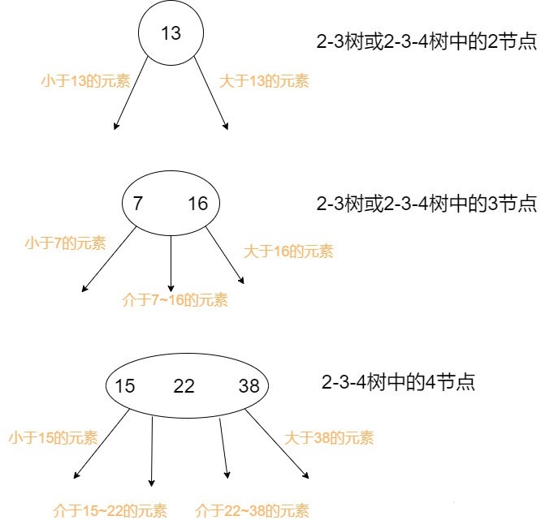

### 2-3树的插入删除操作

#### 1、插入

插入操作需要遵循一个**原则**：

- 先将这个元素尝试性地放在**已经存在的节点中**，
- 如果要存放的节点是2节点，那么插入后会变成3节点，
- 如果要存放的节点是3节点，那么插入后会变成4节点（**临时**）。
- 然后，我们对可能生成的临时4节点进行分裂处理，使得临时4节点消失。

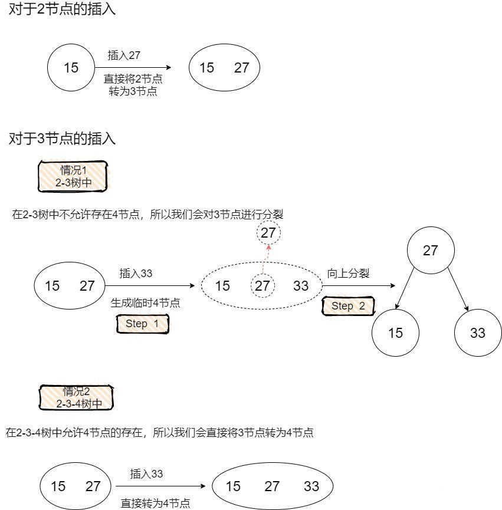


这正对应了红黑树在插入的时候一定会把待插入节点涂成红色，因为红色节点的意义是**与父节点进行关联**，形成概念模型2-3树中的3节点或者临时4节点。

而红黑树之所以需要在插入后进行调整，正是因为可能存在着**概念模型中的临时4节点**（反应在红黑树中是双红的情况）。

#### 2、删除

对于2-3树的删除我们主要要考虑待删除元素在2节点这种情况，因为如果待删除元素在3节点，那么可以直接将这个元素删除，而不会破坏2-3树的任何性质（删除这个元素不会引起高度的变化）。

当待删除元素在2节点的时候，由于删除这个元素会导致2节点失去自己**唯一的元素**，引发2节点自身的删除，会使得树中某条路径的高度发生变化，树变得**不平衡**。

因此我们有两种方案去解决这个问题：

- 第一种方案，先删除这个2节点，然后对树进行平衡调整。
- 第二种方案，我们想办法让这个被删除的元素不可能出现在2节点中。

此处选择第二种方案，我们在搜索到这个节点的路径中，不断地判断当前节点是否为2节点，如果是，就从它的兄弟节点或者它的父节点借一个元素，使得当前节点由2节点成为一个3节点或者一个临时4节点（视具体情况而定，在后面的红黑树部分会详细介绍）

**情况1**

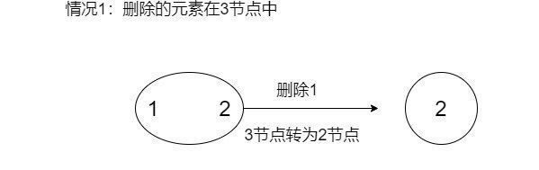

**情况2**

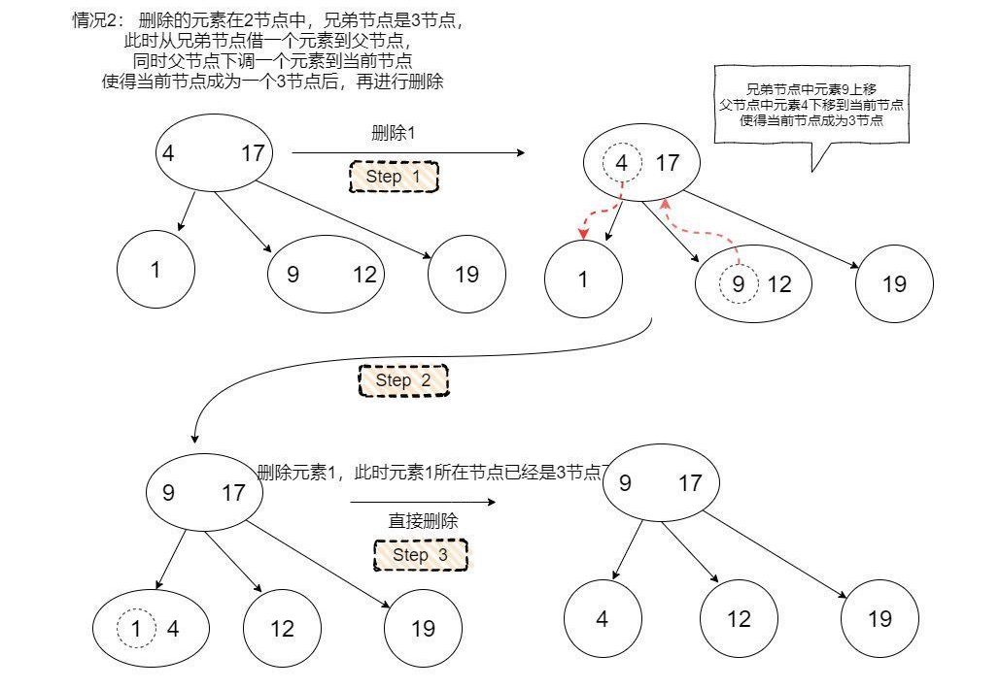

**情况3**


**情况4**

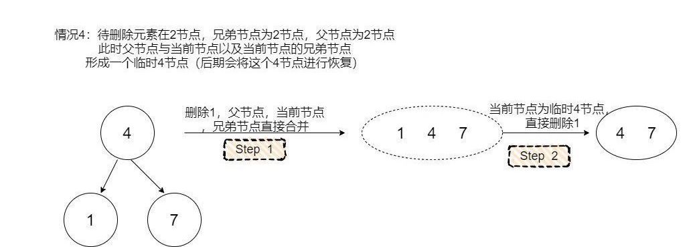


## 红黑树

**AVL**是强平衡二叉搜索树

- 所有节点的左右子树高度差的绝对值不超过1

**红黑树**是弱平衡二叉搜索树

- 红黑树确保没有一条路径会比其它路径长出两倍**（即同一父节点出发到叶子节点，所有路径上的黑色节点数目一样）**
- 红黑树避免了更多的旋转操作，比AVL的插入删除开销小

### 定义

> 二叉查找树
>
> left <= root <= right

红黑树的定义是含有红黑链并满足下列条件的二叉查找树：

- 红链接均为左链接；（算法4中是这样，算法导论中可以是左右；左倾开销小）
- **根节点必为黑色**
- 没有任何一个结点同时和两条红链接相连（**红节点不会相连**）；
- 该树是**完美黑色平衡**的，即任意空链接到根结点的路径上的黑链接数量相同。
	- 【红黑树中的红节点是和黑色父节点绑定的，在2-3树中本来就是同一层的，只有黑色节点才会在2-3树中真正**贡献高度**，由于2-3树的任一节点到空链接距离相同，因此反应在红黑树中就是**黑色完美平衡**】
- **红黑树确保没有一条路径会比其它路径长出两倍（即同一父节点出发到叶子节点，所有路径上的黑色节点数目一样）**

> 红黑树是2-3树（或2-3-4树）概念模型的实现

### 颜色表示

- 每个结点都只会有一条指向自己的链接（从它的父结点指向它），我们将链接的颜色保存在表示结点`Node`数据类型的布尔变量`color`中；
- 如果指向当前结点的链接是红色的，那么布尔变量`color`的值就为`true`，黑色则为`false`，**我们约定空链接为黑色**。

> 可以简单的将链接的颜色认为是节点颜色

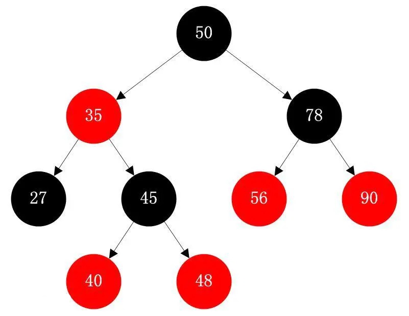

### 2-3-4树到红黑树到转换

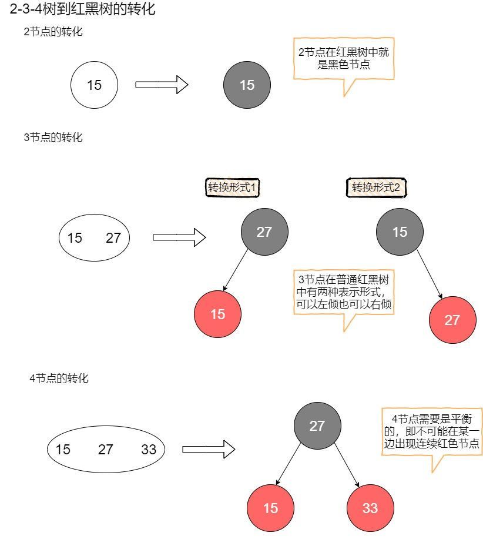


### 二叉查找树的插入删除

#### 1、插入

因此对二叉树进行平衡调整是很重要的一个环节，无论是AVL还是红黑树，它们本质上都是希望尽可能保证这颗二叉查找树中的元素尽量均衡的分布在树的两侧。

当我们向一颗二叉查找树中插入一个元素Y的时候，我们会一直与树中的节点进行大小**比较**，如果Y小于当前元素，就往左走，如果Y大于当前元素，就往右走，直到达到叶子节点，这个时候我们可以把Y插入这颗二叉查找树了。

由于这次的插入动作，整棵树可能会发生一些不平衡，因此我们需要在插入后进行一次**平衡调整**，使得整棵树恢复到平衡的状态（具体如何调整，要看树是AVL还是红黑树亦或是其他的平衡树）。

#### 2、删除

二叉查找树的删除是一个很有意思的问题，不同于插入的是，待删除的元素并不能保证一定出现在树中的叶子节点。这将带来一个棘手的情景，即我们需要从树的中间部分取走一个元素，而且在取走后还需要经过调整来使得**整颗树满足平衡**的性质。从树的中间部分直接取走一个节点的场景实在是太多，也牵扯到了太多相关的节点，这种操作很难实现。

好在有人提出了一个观点，我们对查找树中一个节点的删除，其实可以不必真的改动这个节点的位置。由于查找树的特殊性质，将某个元素节点删除后，它有两个最佳替代者，分别是有序序列中的**前驱元素和后继元素**。

我们还是以一个包含元素1~10的二叉查找树为例，如果我们希望删除5所在的节点，那么让4或者6替代它的位置都是可行的。作为前驱元素的4，会存放在5所在节点的左子树的最右侧；作为后继元素的6，会存放在5所在节点的右子树的最左侧。

> 删除某个节点的时候，我们先找到它的前驱元素或者后继元素（随便选一个），将它的前驱元素直接填到待删除的节点，然后再把它的前驱元素或者后继元素删除。

这个时候问题就转化成了在二叉查找树中删除一个没有左子树的节点（或者是一个没有右子树的节点），我们只需要将这个节点删除再进行对应的平衡调整即可（虽然还是需要调平，但是比直接在树中层删除一个同时具备左右儿子的节点要容易很多）。

注意，此处并没有强调是**针对**红黑树的操作，因为红黑树和AVL都是**二叉查找树**，它们都适用这个方法。


### 树的旋转

1、左旋

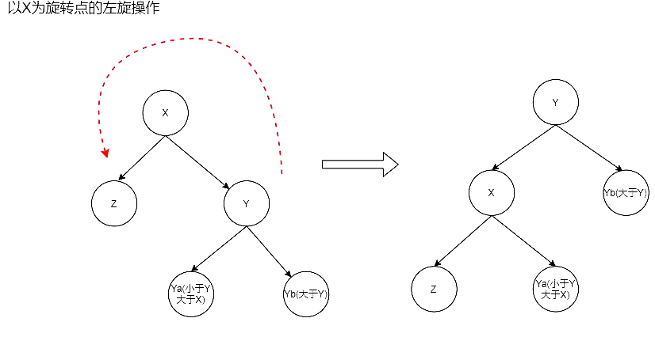

2、右旋

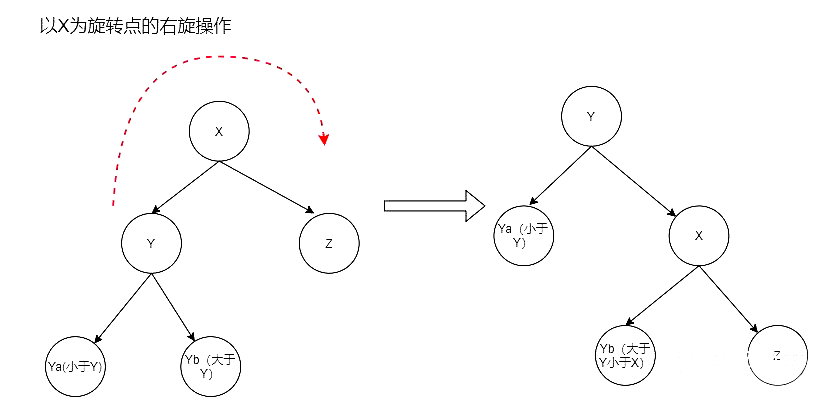


### 左倾红黑树的插入

以左倾红黑树为例

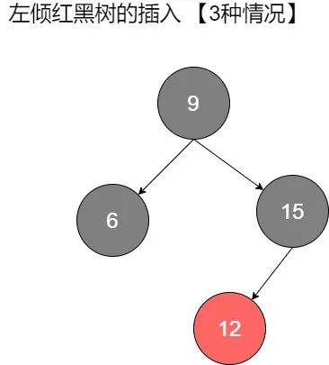


如图所示，对于左倾红黑树的插入一共有三种可能的情况。

- **第一种，待插入元素比黑父大，插在了黑父的右边，而黑父左边是红色儿子。**

	这种情况会导致在红黑树中出现右倾红节点。

	注意，这种情况对应着2-3树中出现了**临时4节点**，我们在2-3树中的处理是将这个临时4节点分裂，左右元素各自形成一个2节点，中间元素**上升**到上层跟父节点结合。所以，我们在红黑树中的动作是，将原本红色的左右儿子染黑（左右分裂），将黑父染红（等待上升结合）。

	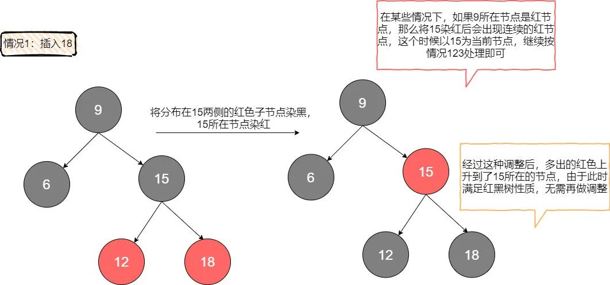

- **第二种情况，待插入元素比红父小，且红父自身就是左倾。**

	其实就是说红父和待插入元素**同时靠在了左边**，形成了连续的红节点。

	这种情况我们需要用两步来调整。由于我们插入的是红色节点，其实不会破坏黑色完美平衡，所以要注意的是在旋转和染色的过程种继续保持这种**完美黑色平衡**。

	首先对红父的父亲进行一次右旋，这次右旋不会破坏黑色平衡，但是也没有解决连续红色的问题。

	接下来将12所在节点与15所在节点交换颜色，这样的目的是为了消除连续红色，并且这个操作依旧维持了黑色平衡。现在我们已经得到了情况1的场景，直接按**情况1**处理即可。

	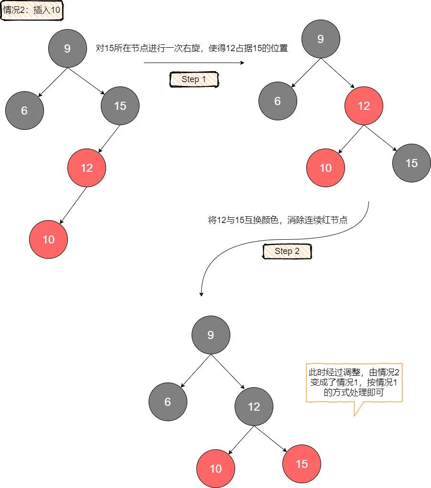

- 第三种情况，待插入元素比红父大，且红父自身就是左倾。

	也就是说插入的这个节点形成了一个右倾的红色节点，对**右倾**的处理很简单，将红父进行一次左旋，就能使得右倾红节点变为左倾，现在出现了连续的左倾红节点，直接按**情况2**处理即可。

	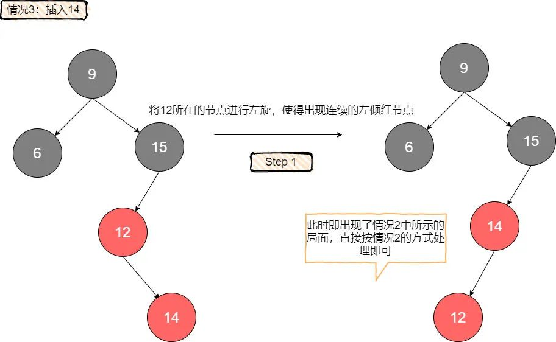

在插入时，可以体会到左倾红黑树对于左倾的限制带来的好处，因为在原树符合红黑树定义的情况下，如果父亲是红的，那么它**一定左倾**，同时也不用考虑可能存在的右倾兄弟（如果有，那说明**原树不满足红黑树定义**）。

这种限制消除了很多需要考虑的场景，让插入变得更加简单。


> 红黑树的**插入操作**遵守以下规则：
>
> - 如果右子结点是红色而左子结点是黑色的，进行左旋转；
> - 如果左子结点是红色的且它的左子结点也是红色的，进行右旋转；
> - 如果左右子结点均为红色，进行颜色转换。

---

### 左倾红黑树的删除

当我们要删除某个节点的时候选择它的前驱节点或者后继节点元素来**替代**它，转而删除它的前驱/后继节点。

在这个例子中，我选择用后继节点来替代被删除节点。

我们从当前的根节点出发，利于2-3树中预合并的策略逐层对红黑树进行调整。具体的做法是，每次都保证当前的节点是2-3树中的非2节点，如果当前节点已经是非2节点，那么直接跳过；如果当前节点是2节点，那么根据兄弟节点的状况来进行调整：

- 如果兄弟是2节点，那么从父节点借一个元素给当前节点，然后与兄弟节点一起形成一个临时4节点。
- 如果兄弟是非2节点，那么兄弟上升一个元素到父节点，同时父节点下降一个元素到当前节点，使得当前节点成为一个3节点。

**这样的策略能够保证最后走到待删除节点的时候，它一定是一个非2节点，我们可以直接将其元素删除。**

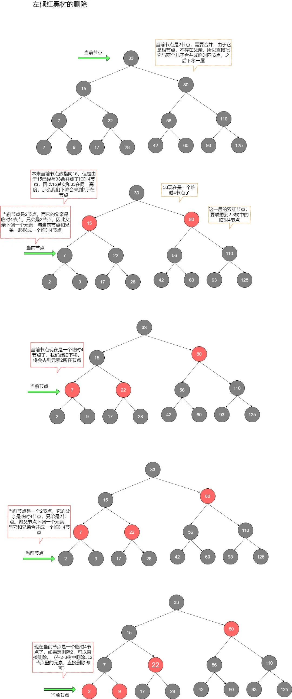


接下来要考虑的是**修复工作**，由于红黑树定义的限制，我们在调整的过程中出现了一些本不该存在的**红色右倾节点**（因为生成了概念模型中的临时4节点），于是我们顺着搜索的方向向上**回溯**，如果遇到当前节点具备右倾的红色儿子，那么对当前节点进行一次左旋，这时原本的右儿子会来到当前节点的位置，然后将右儿子与当前节点交换颜色，我们就将右倾红节点修复成了左倾红节点，同时我们并没有破坏黑色节点的平衡。

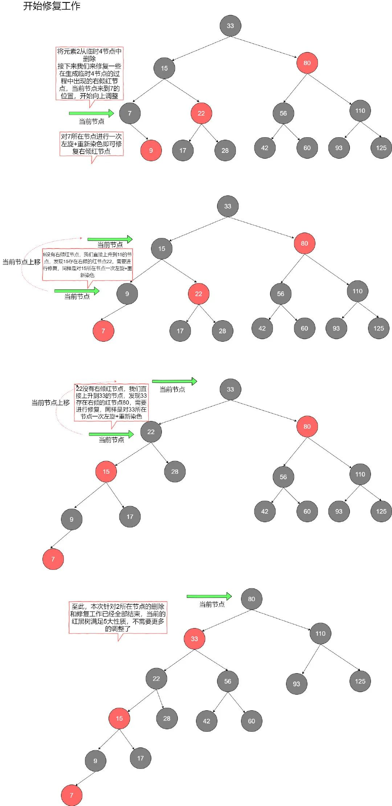

右倾转左倾是一个很基本的操作，我们以35，44为例，你既可以将35作为黑节点，44作为右倾红色儿子；也可以将44作为黑节点，35作为左倾红儿子。事实上我们对于右倾的修复就是换了一种**树形**而已。一路回溯到当前根节点，直至路径中不再包含**任何**的红色右倾节点，至此修复工作全部完成。

### 代码实现

```java
package com.ymy.search;

/**
 * 红黑树
 *
 * @param <Key>   键
 * @param <Value> 值
 */
public class RedBlackBST<Key extends Comparable<Key>, Value> {

    private static final boolean RED = true;    // 红链接
    private static final boolean BLACK = false; // 黑链接

    /**
     * 定义结点Node
     */
    private class Node {
        Key key;           // 键
        Value val;         // 值
        Node left, right;  // 指向子树的链接
        int N;             // 以该节点为根的子树中的结点总数
        boolean color;     // 其父结点指向它的链接的颜色

        public Node(Key key, Value val, int N, boolean color) {
            this.key = key;
            this.val = val;
            this.N = N;
            this.color = color;
        }
    }

    /**
     * 定义红黑树根结点
     */
    private Node root;

    /**
     * @return 红黑树结点总数
     */
    public int size() {
        return size(root);
    }

    /**
     * 红黑树的root为根结点查找key所对应的值
     *
     * @param key 键
     * @return 值 val
     */
    public Value get(Key key) {
        return get(root, key);
    }

    /**
     * 在以h为根结点的子树中查找Key所对应的值
     *
     * @param h   子树的根结点
     * @param key 键
     * @return 值 val
     */
    private Value get(Node h, Key key) {
        if (h == null) return null;
        int cmp = key.compareTo(h.key);
        if (cmp < 0)
            return get(h.left, key);
        else if (cmp > 0)
            return get(h.right, key);
        else
            return h.val;
    }

    /**
     * 红黑树根结点下插入键值
     *
     * @param key 键
     * @param val 值
     */
    public void put(Key key, Value val) {
        root = put(root, key, val);
        root.color = BLACK;
    }


    /**
     * 红黑树中当前结点下插入键值
     *
     * @param h   当前结点
     * @param key 键
     * @param val 值
     * @return 当前结点
     */
    private Node put(Node h, Key key, Value val) {
        if (h == null)
            return new Node(key, val, 1, RED);
        int cmp = key.compareTo(h.key);
        if (cmp < 0)
            h.left = put(h.left, key, val);
        else if (cmp > 0)
            h.right = put(h.right, key, val);
        else
            h.val = val;
        if (isRed(h.right) && !isRed(h.left)) h = rotateLeft(h);
        if (isRed(h.left) && isRed(h.left.left)) h = rotateRight(h);
        if (isRed(h.left) && isRed(h.right)) flipColors(h);

        h.N = size(h.left) + size(h.right) + 1;

        return h;
    }

    /**
     * @param x 当前结点Node
     * @return 获得以当前结点为根的子树中节点总数
     */
    private int size(Node x) {
        if (x == null)
            return 0;
        else
            return x.N;
    }

    /**
     * 指向当前结点的链接是否是红链接
     *
     * @param x 当前结点Node
     * @return true表示是红链接;false表示是黑链接
     */
    private boolean isRed(Node x) {
        if (x == null)
            return false;
        return x.color == RED;
    }

    /**
     * 左旋
     *
     * @param h 当前结点
     * @return 左旋后的父结点
     */
    private Node rotateLeft(Node h) {
        Node x = h.right;
        h.right = x.left;
        x.left = h;
        x.color = h.color;
        h.color = RED;
        x.N = h.N;
        h.N = 1 + size(h.left) + size(h.right);
        return x;
    }

    /**
     * 右旋
     *
     * @param h 当前结点
     * @return 右旋后的父结点
     */
    private Node rotateRight(Node h) {
        Node x = h.left;
        h.left = x.right;
        x.right = h;
        x.color = h.color;
        h.color = RED;
        x.N = h.N;
        h.N = 1 + size(h.left) + size(h.right);
        return x;
    }

    /**
     * 颜色转换
     *
     * @param h 当前结点
     */
    private void flipColors(Node h) {
        h.color = RED;
        h.left.color = BLACK;
        h.right.color = BLACK;
    }
}
```

