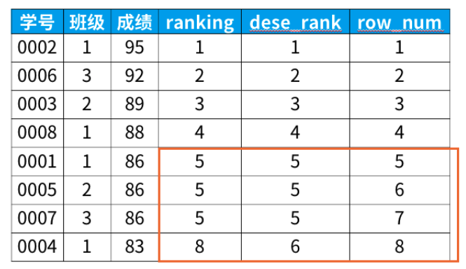

# SELECT的执行过程

### 查询的结构

```mysql
#方式1：
SELECT ...,....,...
FROM ...,...,....
WHERE 多表的连接条件
AND 不包含组函数的过滤条件
GROUP BY ...,...
HAVING 包含组函数的过滤条件
ORDER BY ... ASC/DESC
LIMIT ...,...
#方式2：
SELECT ...,....,...
FROM ... JOIN ...
ON 多表的连接条件
JOIN ...
ON ...
WHERE 不包含组函数的过滤条件
AND/OR 不包含组函数的过滤条件
GROUP BY ...,...
HAVING 包含组函数的过滤条件
ORDER BY ... ASC/DESC
LIMIT ...,...
#其中：
#（1）from：从哪些表中筛选
#（2）on：关联多表查询时，去除笛卡尔积
#（3）where：从表中筛选的条件
#（4）group by：分组依据
#（5）having：在统计结果中再次筛选
#（6）order by：排序
#（7）limit：分页
```

**需要记住 SELECT 查询时的两个顺序：**

<font color=red>1. 关键字的顺序是不能颠倒的：</font>

```mysql
SELECT ... 
FROM ... 
WHERE ... 
GROUP BY ... 
HAVING ... 
ORDER BY ... 
LIMIT...
```

<font color=red>1. SELECT 语句的执行顺序</font>（在 MySQL 和 Oracle 中，SELECT 执行顺序基本相同）：

```mysql
FROM -> WHERE -> GROUP BY 
-> HAVING -> SELECT 的字段 
-> DISTINCT -> ORDER BY -> LIMIT
```

比如你写了一个 SQL 语句，那么它的关键字顺序和执行顺序是下面这样的：

```mysql
SELECT DISTINCT player_id, player_name, count(*) as num # 顺序 5
FROM player JOIN team ON player.team_id = team.team_id # 顺序 1
WHERE height > 1.80 # 顺序 2
GROUP BY player.team_id # 顺序 3
HAVING num > 2 # 顺序 4
ORDER BY num DESC # 顺序 6
LIMIT 2 # 顺序 7
```

在 SELECT 语句执行这些步骤的时候，每个步骤都会产生一个 虚拟表 ，然后将这个虚拟表传入下一个步 骤中作为输入。需要注意的是，这些步骤隐含在 SQL 的执行过程中，对于我们来说是不可见的。


# GROUP BY

结论1：**SELECT中出现的非组函数（不是SUM这种的）的字段必须声明在GROUP BY中**。

> **GROUP BY中声明的字段可以不出现在SELECT中**。

结论2：GROUP BY声明在FROM后面、WHERE后面、ORDER BY前面、LIMIT前面。


# HAVING

过滤分组：HAVING子句 

1. 行已经被分组。 
2. 使用了聚合函数。 
3. 满足HAVING 子句中条件的分组将被显示。 
4. **HAVING 不能单独使用，必须要跟 GROUP BY 一起使用。**

```mysql
SELECT department_id, MAX(salary)
FROM employees
GROUP BY department_id
HAVING MAX(salary)>10000 ;
```

**要求**

+ 如果**过滤条件中使用了聚合函数**，则**必须使用HAVING来替换WHERE**。否则，报错。
+ 当过滤条件中没有聚合函数时，则次过滤条件声明在WHERE中或HAVING中都可以。但是，建议声明在WHERE中的执行效率高。
+ **HAVING必须声明在GROUP BY 的后面**
+ 使用HAVING的前提是SQL中使用了GROUP BY。


# 聚合函数

### 1) AVG和SUM函数

```mysql
SELECT AVG(salary), MAX(salary),MIN(salary), SUM(salary)
FROM employees
WHERE job_id LIKE '%REP%';
```

### 2) MIN和MAX函数

可以对任意数据类型的数据使用 MIN 和 MAX 函数。

```mysql
SELECT MIN(hire_date), MAX(hire_date)
FROM employees;
```

### 3) COUNT函数

COUNT(*)返回表中记录总数，适用于任意数据类型。

```mysql
SELECT COUNT(*)
FROM employees
WHERE department_id = 50;
```


## 4) [窗口函数***](https://mp.weixin.qq.com/s?__biz=MzAxMTMwNTMxMQ==&mid=2649247566&idx=1&sn=f9c7018c299498673b38221db2ecd5cd&chksm=835fc77eb4284e68b7528fd7f75eedb8868a6740704af8559f8a5cbdd2867a49ffa21bf4e531&token=426730634&lang=zh_CN#rd)

```sql
<窗口函数> over (partition by <用于分组的列名>
                order by <用于排序的列名>)
```

### 基本概念

1. <窗口函数>的位置，可以放以下两种函数：

- 专用窗口函数，比如rank, dense_rank, row_number等

- 聚合函数，如sum. avg, count, max, min等
	- 使用聚合函数的时候，计算的是该数据及该数据以上的数据


2. 窗口函数有以下功能：

- 同时具有分组（partition by）和排序（order by）的功能

- 不减少原表的行数，所以经常用来在每组内排名


**窗口函数原则上只能写在select子句中**


3. 使用场景

- 在每组内排名：每个部门按照业绩排名；找出每个部门排名前N的员工


```sql
select *,
   rank() over (partition by 班级
                 order by 成绩 desc) as ranking
from 班级表
```


### 专业窗口函数

```sql
select *,
   rank() over (order by 成绩 desc) as ranking,
   dense_rank() over (order by 成绩 desc) as dese_rank,
   row_number() over (order by 成绩 desc) as row_num
from 班级表

# 三个排名的区别见图
```




# 多表联查

* WHERE：适用于所有关联查询 
* ON ：只能和JOIN一起使用，只能写关联条件。虽然关联条件可以并到WHERE中和其他条件一起写，但分开写可读性更好。

区别***

```sql
select ... from a left join b on a.id = b.id and b.status = '1'
where b.status = '1'
```

1、 on条件是在生成临时表时使用的条件，它不管on中的条件是否为真，**都会返回左边表中的记录。**

2、where条件是在临时表生成好后，再对临时表进行过滤的条件。这时已经没有left join的含义（必须返回左边表的记录）了，条件不为真的就**全部过滤掉**。

### 1、内连接


### 2、外连接


# [经典SQL](https://zhuanlan.zhihu.com/p/38354000)

已知有如下4张表：

学生表：student(学号,学生姓名,出生年月,性别)

成绩表：score(学号,课程号,成绩)

课程表：course(课程号,课程名称,教师号)

教师表：teacher(教师号,教师姓名)


### 分组查询

#### 1、查询平均成绩大于60分学生的学号和平均成绩

```sql
/* 
题目翻译成大白话：
平均成绩：展开来说就是计算每个学生的平均成绩
这里涉及到“每个”就是要分组了
平均成绩大于60分，就是对分组结果指定条件

分析思路
select 查询结果 [学号，平均成绩：汇总函数avg(成绩)]
from 从哪张表中查找数据 [成绩在成绩表中，所以查找的是成绩表score]
where 查询条件 [没有]
group by 分组 [平均成绩：先按学号分组，再计算平均成绩]
having 对分组结果指定条件 [平均成绩大于60分]
*/
select 学号, avg(成绩)
from score
group by 学号
having avg(成绩)>60;
```


#### 2、查询同名同姓学生名单并统计同名人数

```sql
/* 
翻译成大白话，问题解析：
1）查找出姓名相同的学生有谁，每个姓名相同学生的人数
查询结果：姓名,人数
条件：怎么算姓名相同？按姓名分组后人数大于等于2，因为同名的人数大于等于2
分析思路
select 查询结果 [姓名,人数：汇总函数count(*)]
from 从哪张表中查找数据 [学生表student]
where 查询条件 [没有]
group by 分组 [姓名相同：按姓名分组]
having 对分组结果指定条件 [姓名相同：count(*)>=2]
order by 对查询结果排序[没有];
*/

select 姓名,count(*) as 人数
from student
group by 姓名
having count(*)>=2;
```


### 连接查询

#### 1、查询所有学生的学号、姓名、选课数、总成绩

```sql
select a.学号,a.姓名,count(b.课程号) as 选课数,sum(b.成绩) as 总成绩
from student as a left join score as b
on a.学号 = b.学号
group by a.学号;
```

#### 2、查询出每门课程的及格人数和不及格人数

```sql
select 课程号,
sum(case when 成绩>=60 then 1 
	 else 0 
    end) as 及格人数,
sum(case when 成绩 <  60 then 1 
	 else 0 
    end) as 不及格人数
from score
group by 课程号;
```

#### 3、查询平均成绩大于85的所有学生的学号、姓名和平均成绩

```sql
select a.学号,a.姓名, avg(b.成绩) as 平均成绩
from student as a left join score as b
on a.学号 = b.学号
group by a.学号
having avg(b.成绩)>85;
```

