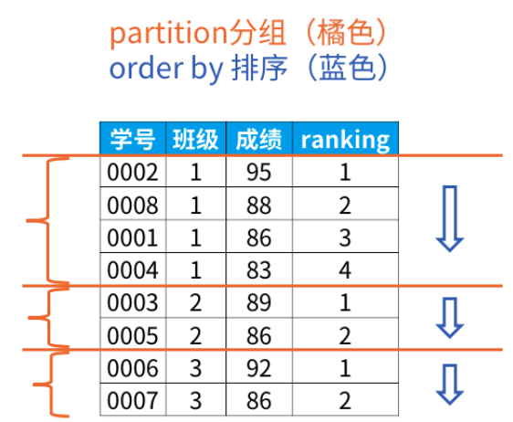
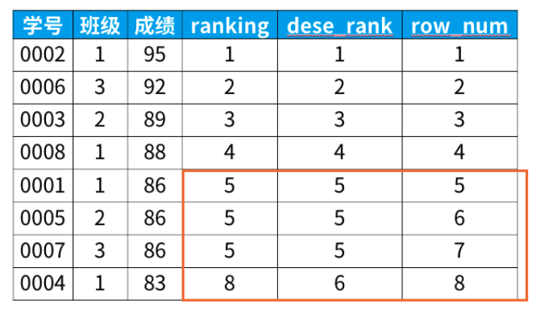

# 第七章_单行函数

## 1. 数值函数

### 1) 基本函数

| 函数                | 用法                                                         |
| ------------------- | ------------------------------------------------------------ |
| ABS(x)              | 返回x的绝对值                                                |
| SIGN(X)             | 单元格                                                       |
| PI()                | 返回圆周率的值                                               |
| CEIL(x)，CEILING(x) | 返回大于或等于某个值的最小整数                               |
| FLOOR(x)            | 返回小于或等于某个值的最大整数                               |
| LEAST(e1,e2,e3…)    | 返回列表中的最小值                                           |
| GREATEST(e1,e2,e3…) | 返回列表中的最大值                                           |
| MOD(x,y)            | 返回X除以Y后的余数                                           |
| RAND()              | 返回0~1的随机值                                              |
| RAND(x)             | 返回0~1的随机值，其中x的值用作种子值，相同的X值会产生相同的随机 数 |
| ROUND(x)            | 返回一个对x的值进行四舍五入后，最接近于X的整数               |
| ROUND(x,y)          | 返回一个对x的值进行四舍五入后最接近X的值，并保留到小数点后面Y位 |
| TRUNCATE(x,y)       | 返回数字x截断为y位小数的结果                                 |
| SQRT(x)             | 返回x的平方根。当X的值为负数时，返回NULL                     |

### 2) 角度与弧度互换函数

| 函数       | 用法                                  |
| ---------- | ------------------------------------- |
| RADIANS(x) | 将角度转化为弧度，其中，参数x为角度值 |
| DEGREES(x) | 将弧度转化为角度，其中，参数x为弧度值 |

### 3) 三角函数

| 函数       | 用法                                                         |
| ---------- | ------------------------------------------------------------ |
| SIN(x)     | 将角度转化为弧度，其中，参数x为角度值                        |
| ASIN(x)    | 将弧度转化为角度，其中，参数x为弧度值                        |
| COS(x)     | 返回x的余弦值，其中，参数x为弧度值                           |
| ACOS(x)    | 返回x的反余弦值，即获取余弦为x的值。如果x的值不在-1到1之间，则返回NULL |
| TAN(x)     | 返回x的正切值，其中，参数x为弧度值                           |
| ATAN(x)    | 返回x的反正切值，即返回正切值为x的值                         |
| ATAN2(m,n) | 返回两个参数的反正切值                                       |
| COT(x)     | 返回x的余切值，其中，X为弧度值                               |

### 4) 指数与对数函数

| 函数                 | 用法                                                 |
| -------------------- | ---------------------------------------------------- |
| POW(x,y)，POWER(X,Y) | 返回x的y次方                                         |
| EXP(X)               | 返回e的X次方，其中e是一个常数，2.718281828459045     |
| LN(X)，LOG(X)        | 返回以e为底的X的对数，当X <= 0 时，返回的结果为NULL  |
| LOG10(X)             | 返回以10为底的X的对数，当X <= 0 时，返回的结果为NULL |
| LOG2(X)              | 返回以2为底的X的对数，当X <= 0 时，返回NULL          |

### 5) 进制间的转换

| 函数          | 用法                     |
| ------------- | ------------------------ |
| BIN(x)        | 返回x的二进制编码        |
| HEX(x)        | 返回x的十六进制编码      |
| OCT(x)        | 返回x的八进制编码        |
| CONV(x,f1,f2) | 返回f1进制数变成f2进制数 |

## 2. 字符串函数

| 函数                              | 用法                                                         |
| --------------------------------- | ------------------------------------------------------------ |
| ASCII(S)                          | 返回字符串S中的第一个字符的ASCII码值                         |
| CHAR_LENGTH(s)                    | 返回字符串s的字符数。作用与CHARACTER_LENGTH(s)相同           |
| LENGTH(s)                         | 返回字符串s的字节数，和字符集有关                            |
| CONCAT(s1,s2,......,sn)           | 连接s1,s2,......,sn为一个字符串                              |
| CONCAT_WS(x, s1,s2,......,sn)     | 同CONCAT(s1,s2,...)函数，但是每个字符串之间要加上x           |
| INSERT(str, idx, len, replacestr) | 将字符串str从第idx位置开始，len个字符长的子串替换为字符串replacestr |
| REPLACE(str, a, b)                | 用字符串b替换字符串str中所有出现的字符串a                    |
| UPPER(s) 或 UCASE(s)              | 将字符串s的所有字母转成大写字母                              |
| LOWER(s) 或LCASE(s)               | 将字符串s的所有字母转成小写字母                              |
| LEFT(str,n)                       | 返回字符串str最左边的n个字符                                 |
| RIGHT(str,n)                      | 返回字符串str最右边的n个字符                                 |
| LPAD(str, len, pad)               | 用字符串pad对str最左边进行填充，直到str的长度为len个字符     |
| RPAD(str ,len, pad)               | 用字符串pad对str最右边进行填充，直到str的长度为len个字符     |
| LTRIM(s)                          | 去掉字符串s左侧的空格                                        |
| RTRIM(s)                          | 去掉字符串s右侧的空格                                        |
| TRIM(s)                           | 去掉字符串s开始与结尾的空格                                  |
| TRIM(s1 FROM s)                   | 去掉字符串s开始与结尾的s1                                    |
| TRIM(LEADING s1 FROM s)           | 去掉字符串s开始处的s1                                        |
| TRIM(TRAILING s1 FROM s)          | 去掉字符串s结尾处的s1                                        |
| REPEAT(str, n)                    | 返回str重复n次的结果                                         |
| SPACE(n)                          | 返回n个空格                                                  |
| STRCMP(s1,s2)                     | 比较字符串s1,s2的ASCII码值的大小                             |
| SUBSTR(s,index,len)               | 返回从字符串s的index位置其len个字符，作用与SUBSTRING(s,n,len)、 MID(s,n,len)相同 |
| LOCATE(substr,str)                | 返回字符串substr在字符串str中首次出现的位置，作用于POSITION(substr IN str)、INSTR(str,substr)相同。未找到，返回0 |
| ELT(m,s1,s2,…,sn)                 | 返回指定位置的字符串，如果m=1，则返回s1，如果m=2，则返回s2，如果m=n，则返回sn |
| FIELD(s,s1,s2,…,sn)               | 返回字符串s在字符串列表中第一次出现的位置                    |
| FIND_IN_SET(s1,s2)                | 返回字符串s1在字符串s2中出现的位置。其中，字符串s2是一个以逗号分隔的字符串 |
| REVERSE(s)                        | 返回s反转后的字符串                                          |
| NULLIF(value1,value2)             | 比较两个字符串，如果value1与value2相等，则返回NULL，否则返回 value1 |

> 注意：MySQL中，字符串的位置是从1开始的。

## 3. 日期和时间函数

### 1) 获取日期、时间

| 函数                                                         | 用法                            |
| ------------------------------------------------------------ | ------------------------------- |
| CURDATE() ，CURRENT_DATE()                                   | 返回当前日期，只包含年、 月、日 |
| CURTIME() ， CURRENT_TIME()                                  | 返回当前时间，只包含时、 分、秒 |
| NOW() / SYSDATE() / CURRENT_TIMESTAMP() / LOCALTIME() / LOCALTIMESTAMP() | 返回当前系统日期和时间          |
| UTC_DATE()                                                   | 返回UTC（世界标准时间） 日期    |
| UTC_TIME()                                                   | 返回UTC（世界标准时间） 时间    |

### 2) 日期与时间戳的转换

| 函数                     | 用法                                                         |
| ------------------------ | ------------------------------------------------------------ |
| UNIX_TIMESTAMP()         | 以UNIX时间戳的形式返回当前时间。SELECT UNIX_TIMESTAMP() - >1634348884 |
| UNIX_TIMESTAMP(date)     | 将时间date以UNIX时间戳的形式返回。                           |
| FROM_UNIXTIME(timestamp) | 将UNIX时间戳的时间转换为普通格式的时间                       |

### 3) 获取月份、星期、星期数、天数等函数

| 函数                                     | 用法                                             |
| ---------------------------------------- | ------------------------------------------------ |
| YEAR(date) / MONTH(date) / DAY(date)     | 返回具体的日期值                                 |
| HOUR(time) / MINUTE(time) / SECOND(time) | 返回具体的时间值                                 |
| FROM_UNIXTIME(timestamp)                 | 将UNIX时间戳的时间转换为普通格式的时间           |
| MONTHNAME(date)                          | 返回月份：January，...                           |
| DAYNAME(date)                            | 返回星期几：MONDAY，TUESDAY.....SUNDAY           |
| WEEKDAY(date)                            | 返回周几，注意，周1是0，周2是1，。。。周日是6    |
| QUARTER(date)                            | 返回日期对应的季度，范围为1～4                   |
| WEEK(date) ， WEEKOFYEAR(date)           | 返回一年中的第几周                               |
| DAYOFYEAR(date)                          | 返回日期是一年中的第几天                         |
| DAYOFMONTH(date)                         | 返回日期位于所在月份的第几天                     |
| DAYOFWEEK(date)                          | 返回周几，注意：周日是1，周一是2，。。。周六是 7 |

### 4) 日期的操作函数

| 函数                    | 用法                                       |
| ----------------------- | ------------------------------------------ |
| EXTRACT(type FROM date) | 返回指定日期中特定的部分，type指定返回的值 |

EXTRACT(type FROM date)函数中type的取值与含义：


### 5) 时间和秒钟转换的函数

| 函数                 | 用法                                                         |
| -------------------- | ------------------------------------------------------------ |
| TIME_TO_SEC(time)    | 将 time 转化为秒并返回结果值。转化的公式为： 小时*3600+分钟 *60+秒 |
| SEC_TO_TIME(seconds) | 将 seconds 描述转化为包含小时、分钟和秒的时间                |

### 6) 计算日期和时间的函数

| 函数                                                         | 用法                                           |
| ------------------------------------------------------------ | ---------------------------------------------- |
| DATE_ADD(datetime, INTERVAL expr type)， ADDDATE(date,INTERVAL expr type) | 返回与给定日期时间相差INTERVAL时间段的日期时间 |
| DATE_SUB(date,INTERVAL expr type)， SUBDATE(date,INTERVAL expr type) | 返回与date相差INTERVAL时间间隔的日期           |

上述函数中type的取值：


| 函数                         | 用法                                                         |
| ---------------------------- | ------------------------------------------------------------ |
| ADDTIME(time1,time2)         | 返回time1加上time2的时间。当time2为一个数字时，代表的是 秒 ，可以为负数 |
| SUBTIME(time1,time2)         | 返回time1减去time2后的时间。当time2为一个数字时，代表的 是 秒 ，可以为负数 |
| DATEDIFF(date1,date2)        | 返回date1 - date2的日期间隔天数                              |
| TIMEDIFF(time1, time2)       | 返回time1 - time2的时间间隔                                  |
| FROM_DAYS(N)                 | 返回从0000年1月1日起，N天以后的日期                          |
| TO_DAYS(date)                | 返回日期date距离0000年1月1日的天数                           |
| LAST_DAY(date)               | 返回date所在月份的最后一天的日期                             |
| MAKEDATE(year,n)             | 针对给定年份与所在年份中的天数返回一个日期                   |
| MAKETIME(hour,minute,second) | 将给定的小时、分钟和秒组合成时间并返回                       |
| PERIOD_ADD(time,n)           | 返回time加上n后的时间                                        |

### 7)  日期的格式化与解析

| 函数                              | 用法                                       |
| --------------------------------- | ------------------------------------------ |
| DATE_FORMAT(date,fmt)             | 按照字符串fmt格式化日期date值              |
| TIME_FORMAT(time,fmt)             | 按照字符串fmt格式化时间time值              |
| GET_FORMAT(date_type,format_type) | 返回日期字符串的显示格式                   |
| STR_TO_DATE(str, fmt)             | 按照字符串fmt对str进行解析，解析为一个日期 |

上述 非GET_FORMAT 函数中fmt参数常用的格式符：

| 格式符 | 说明                                                         | 格式符  | 说明                                                         |
| ------ | ------------------------------------------------------------ | ------- | ------------------------------------------------------------ |
| %Y     | 4位数字表示年份                                              | %y      | 表示两位数字表示年份                                         |
| %M     | 月名表示月份（January,....）                                 | %m      | 两位数字表示月份 （01,02,03。。。）                          |
| %b     | 缩写的月名（Jan.，Feb.，....）                               | %c      | 数字表示月份（1,2,3,...）                                    |
| %D     | 英文后缀表示月中的天数 （1st,2nd,3rd,...）                   | %d      | 两位数字表示月中的天数(01,02...)                             |
| %e     | 数字形式表示月中的天数 （1,2,3,4,5.....）                    |         |                                                              |
| %H     | 两位数字表示小数，24小时制 （01,02..）                       | %h 和%I | 两位数字表示小时，12小时制 （01,02..）                       |
| %k     | 数字形式的小时，24小时制(1,2,3)                              | %l      | 数字形式表示小时，12小时制 （1,2,3,4....）                   |
| %i     | 两位数字表示分钟（00,01,02）                                 | %S 和%s | 两位数字表示秒(00,01,02...)                                  |
| %W     | 一周中的星期名称（Sunday...）                                | %a      | 一周中的星期缩写（Sun.， Mon.,Tues.，..）                    |
| %w     | 以数字表示周中的天数 (0=Sunday,1=Monday....)                 |         |                                                              |
| %j     | 以3位数字表示年中的天数(001,002...)                          | %U      | 以数字表示年中的第几周， （1,2,3。。）其中Sunday为周中第一 天 |
| %u     | 以数字表示年中的第几周， （1,2,3。。）其中Monday为周中第一 天 |         |                                                              |
| %T     | 24小时制                                                     | %r      | 12小时制                                                     |
| %p     | AM或PM                                                       | %%      | 表示%                                                        |

## 4. 流程控制函数

流程处理函数可以根据不同的条件，执行不同的处理流程，可以在SQL语句中实现不同的条件选择。 MySQL中的流程处理函数主要包括IF()、IFNULL()和CASE()函数。

| 函数                                                         | 用法                                             |
| ------------------------------------------------------------ | ------------------------------------------------ |
| IF(value,value1,value2)                                      | 如果value的值为TRUE，返回value1， 否则返回value2 |
| IFNULL(value1, value2)                                       | 如果value1不为NULL，返回value1，否则返回value2   |
| CASE WHEN 条件1 THEN 结果1 WHEN 条件2 THEN 结果2 .... [ELSE resultn] END | 相当于Java的if...else if...else...               |
| CASE expr WHEN 常量值1 THEN 值1 WHEN 常量值1 THEN 值1 .... [ELSE 值n] END | 相当于Java的switch...case...                     |

## 5. 加密与解密函数

加密与解密函数主要用于对数据库中的数据进行加密和解密处理，以防止数据被他人窃取。这些函数在保证数据库安全时非常有用。

| 函数                        | 用法                                                         |
| --------------------------- | ------------------------------------------------------------ |
| PASSWORD(str)               | 返回字符串str的加密版本，41位长的字符串。加密结果不可逆 ，常用于用户的密码加密 |
| MD5(str)                    | 返回字符串str的md5加密后的值，也是一种加密方式。若参数为 NULL，则会返回NULL |
| SHA(str)                    | 从原明文密码str计算并返回加密后的密码字符串，当参数为 NULL时，返回NULL。 SHA加密算法比MD5更加安全 。 |
| ENCODE(value,password_seed) | 返回使用password_seed作为加密密码加密value                   |
| DECODE(value,password_seed) | 返回使用password_seed作为加密密码解密value                   |

## 6. MySQL信息函数

MySQL中内置了一些可以查询MySQL信息的函数，这些函数主要用于帮助数据库开发或运维人员更好地 对数据库进行维护工作。

| 函数                                                   | 用法                                                      |
| ------------------------------------------------------ | --------------------------------------------------------- |
| VERSION()                                              | 返回当前MySQL的版本号                                     |
| CONNECTION_ID()                                        | 返回当前MySQL服务器的连接数                               |
| DATABASE()，SCHEMA()                                   | 返回MySQL命令行当前所在的数据库                           |
| USER()，CURRENT_USER()、SYSTEM_USER()， SESSION_USER() | 返回当前连接MySQL的用户名，返回结果格式为 “主机名@用户名” |
| CHARSET(value)                                         | 返回字符串value自变量的字符集                             |
| COLLATION(value)                                       | 返回字符串value的比较规则                                 |

MySQL中有些函数无法对其进行具体的分类，但是这些函数在MySQL的开发和运维过程中也是不容忽视 的。

| 函数                           | 用法                                                         |
| ------------------------------ | ------------------------------------------------------------ |
| FORMAT(value,n)                | 返回对数字value进行格式化后的结果数据。n表示 四舍五入 后保留 到小数点后n位 |
| CONV(value,from,to)            | 将value的值进行不同进制之间的转换                            |
| INET_ATON(ipvalue)             | 将以点分隔的IP地址转化为一个数字                             |
| INET_NTOA(value)               | 将数字形式的IP地址转化为以点分隔的IP地址                     |
| BENCHMARK(n,expr)              | 将表达式expr重复执行n次。用于测试MySQL处理expr表达式所耗费 的时间 |
| CONVERT(value USING char_code) | 将value所使用的字符编码修改为char_code                       |

# 第八章_聚合函数

## 1. 聚合函数介绍

* 什么是聚合函数

聚合函数作用于一组数据，并对一组数据返回一个值。

* 聚合函数类型
	* AVG()
	* SUM()
	* MAX()
	* MIN()
	* COUNT()

### 1) AVG和SUM函数

```mysql
SELECT AVG(salary), MAX(salary),MIN(salary), SUM(salary)
FROM employees
WHERE job_id LIKE '%REP%';
```

### 2) MIN和MAX函数

可以对任意数据类型的数据使用 MIN 和 MAX 函数。

```mysql
SELECT MIN(hire_date), MAX(hire_date)
FROM employees;
```

### 3) COUNT函数

COUNT(*)返回表中记录总数，适用于任意数据类型。

```mysql
SELECT COUNT(*)
FROM employees
WHERE department_id = 50;
```

COUNT(expr) 返回expr不为空的记录总数。

```mysql
SELECT COUNT(commission_pct)
FROM employees
WHERE department_id = 50;
```

* 问题：用count(*)，count(1)，count(列名)谁好呢?

其实，对于MyISAM引擎的表是没有区别的。这种引擎内部有一计数器在维护着行数。 Innodb引擎的表用count(*)，count(1)直接读行数，复杂度是O(n)，因为innodb真的要去数一遍。但好 于具体的count(列名)。

* 问题：能不能使用count(列名)替换count(*)?

不要使用 count(列名)来替代 count(*) ， count(*) 是 SQL92 定义的标准统计行数的语法，跟数 据库无关，跟 NULL 和非 NULL 无关。 说明：count(*)会统计值为 NULL 的行，而 count(列名)不会统计此列为 NULL 值的行。

## 2. GROUP BY

### 1) 基本使用

可以使用GROUP BY子句将表中的数据分成若干组

```mysql
SELECT column, group_function(column)
FROM table
[WHERE condition]
[GROUP BY group_by_expression]
[ORDER BY column];
```

> 结论1：**SELECT中出现的非组函数（不是SUM这种的）的字段必须声明在GROUP BY中**。
>
> 反之，**GROUP BY中声明的字段可以不出现在SELECT中**。
>
> 结论2：GROUP BY声明在FROM后面、WHERE后面、ORDER BY前面、LIMIT前面。

### 2) 使用WITH ROLLUP

```mysql
SELECT department_id,AVG(salary)
FROM employees
WHERE department_id > 80
GROUP BY department_id WITH ROLLUP;
```

> 注意： 当使用ROLLUP时，不能同时使用ORDER BY子句进行结果排序，即ROLLUP和ORDER BY是互相排斥的。

## 3. HAVING

### 1) 基本使用

过滤分组：HAVING子句 

1. 行已经被分组。 
2. 使用了聚合函数。 
3. 满足HAVING 子句中条件的分组将被显示。 
4. HAVING 不能单独使用，必须要跟 GROUP BY 一起使用。

```mysql
SELECT department_id, MAX(salary)
FROM employees
GROUP BY department_id
HAVING MAX(salary)>10000 ;
```

**要求**

+ 如果过滤条件中使用了聚合函数，则必须使用HAVING来替换WHERE。否则，报错。
+ 当过滤条件中没有聚合函数时，则次过滤条件声明在WHERE中或HAVING中都可以。但是，建议声明在WHERE中的执行效率高。
+ HAVING必须声明在GROUP BY 的后面
+ 开发中，我们使用HAVING的前提是SQL中使用了GROUP BY。

### 2) WHERE和HAVING的对比

**区别1：WHERE 可以直接使用表中的字段作为筛选条件，但不能使用分组中的计算函数作为筛选条件； HAVING 必须要与 GROUP BY 配合使用，可以把分组计算的函数和分组字段作为筛选条件。**

这决定了，在需要对数据进行分组统计的时候，HAVING 可以完成 WHERE 不能完成的任务。这是因为， 在查询语法结构中，WHERE 在 GROUP BY 之前，所以无法对分组结果进行筛选。HAVING 在 GROUP BY 之 后，可以使用分组字段和分组中的计算函数，对分组的结果集进行筛选，这个功能是 WHERE 无法完成 的。另外，WHERE排除的记录不再包括在分组中。

**区别2：如果需要通过连接从关联表中获取需要的数据，WHERE 是先筛选后连接，而 HAVING 是先连接 后筛选。**

这一点，就决定了在关联查询中，WHERE 比 HAVING 更高效。因为 WHERE 可以先筛选，用一 个筛选后的较小数据集和关联表进行连接，这样占用的资源比较少，执行效率也比较高。HAVING 则需要 先把结果集准备好，也就是用未被筛选的数据集进行关联，然后对这个大的数据集进行筛选，这样占用 的资源就比较多，执行效率也较低。

小结如下：

| 关键字 | 用法                         | 缺点                                   |
| ------ | ---------------------------- | -------------------------------------- |
| WHERE  | 先筛选数据再关联，执行效率高 | 不能使用分组中的计算函数进行筛选       |
| HAVING | 可以使用分组中的计算函数     | 在最后的结果集中进行筛选，执行效率较低 |

**开发中的选择：** 

WHERE 和 HAVING 也不是互相排斥的，我们可以在一个查询里面同时使用 WHERE 和 HAVING。包含分组 统计函数的条件用 HAVING，普通条件用 WHERE。这样，我们就既利用了 WHERE 条件的高效快速，又发 挥了 HAVING 可以使用包含分组统计函数的查询条件的优点。当数据量特别大的时候，运行效率会有很 大的差别。

## 4. [窗口函数***](https://mp.weixin.qq.com/s?__biz=MzAxMTMwNTMxMQ==&mid=2649247566&idx=1&sn=f9c7018c299498673b38221db2ecd5cd&chksm=835fc77eb4284e68b7528fd7f75eedb8868a6740704af8559f8a5cbdd2867a49ffa21bf4e531&token=426730634&lang=zh_CN#rd)

```sql
<窗口函数> over (partition by <用于分组的列名>
                order by <用于排序的列名>)
```

### 基本概念

1. <窗口函数>的位置，可以放以下两种函数：

- 专用窗口函数，比如rank, dense_rank, row_number等

- 聚合函数，如sum. avg, count, max, min等
	- 使用聚合函数的时候，计算的是该数据及该数据以上的数据


2. 窗口函数有以下功能：

- 同时具有分组（partition by）和排序（order by）的功能

- 不减少原表的行数，所以经常用来在每组内排名


**窗口函数原则上只能写在select子句中**


3. 使用场景

- 在每组内排名：每个部门按照业绩排名；找出每个部门排名前N的员工


```sql
select *,
   rank() over (partition by 班级
                 order by 成绩 desc) as ranking
from 班级表
```




### 专业窗口函数

```sql
select *,
   rank() over (order by 成绩 desc) as ranking,
   dense_rank() over (order by 成绩 desc) as dese_rank,
   row_number() over (order by 成绩 desc) as row_num
from 班级表

# 三个排名的区别见图
```

