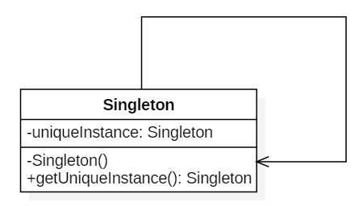

## 单例（Singleton）

### Intent

确保一个类只有一个实例，并提供该实例的全局访问点。

### Class Diagram

使用一个私有构造函数、一个私有静态变量以及一个公有静态函数来实现。

私有构造函数保证了不能通过构造函数来创建对象实例，只能通过公有静态函数返回唯一的私有静态变量。



 

### Implementation

#### Ⅰ 懒汉式-线程不安全

以下实现中，私有静态变量 uniqueInstance 被延迟实例化，这样做的好处是，如果没有用到该类，那么就不会实例化 uniqueInstance，从而节约资源。

这个实现在多线程环境下是不安全的，如果多个线程能够同时进入 `if (uniqueInstance == null)` ，并且此时 uniqueInstance 为 null，那么会有多个线程执行 `uniqueInstance = new Singleton();` 语句，这将导致实例化多次 uniqueInstance。

```java
public class Singleton {
	// 静态是因为getUniqueInstance()是静态的
    // 静态的表示和实例无关，只跟类有关
    private static Singleton uniqueInstance;

    private Singleton() {
    }

    public static Singleton getUniqueInstance() {
        if (uniqueInstance == null) {
            uniqueInstance = new Singleton();
        }
        return uniqueInstance;
    }
}
```

#### Ⅱ 饿汉式-线程安全

线程不安全问题主要是由于 uniqueInstance 被实例化多次，采取直接实例化 uniqueInstance 的方式就不会产生线程不安全问题。

但是直接实例化的方式也丢失了延迟实例化带来的节约资源的好处。

```java
public class Singleton {

    private static Singleton uniqueInstance = new Singleton();

    private Singleton() {
    }

    public static Singleton getUniqueInstance() {
        return uniqueInstance;
    }
}
```

#### Ⅲ 懒汉式-线程安全

只需要对 getUniqueInstance() 方法加锁，那么在一个时间点只能有一个线程能够进入该方法，从而避免了实例化多次 uniqueInstance。

但是当一个线程进入该方法之后，其它试图进入该方法的线程都必须等待，即使 uniqueInstance 已经被实例化了。这会让线程阻塞时间过长，因此该方法有性能问题，不推荐使用。

```java
public static synchronized Singleton getUniqueInstance() {
    if (uniqueInstance == null) {
        uniqueInstance = new Singleton();
    }
    return uniqueInstance;
}
```

#### Ⅳ 双重校验锁-线程安全

uniqueInstance 只需要被实例化一次，之后就可以直接使用了。**加锁操作只需要对实例化那部分的代码进行**，只有当 uniqueInstance 没有被实例化时，才需要进行加锁。

双重校验锁先判断 uniqueInstance 是否已经被实例化，如果没有被实例化，那么才对实例化语句进行加锁。

```java
public class Singleton {
    private volatile static Singleton uniqueInstance;
    private Singleton() {
    }
    public static Singleton getUniqueInstance() {
        if (uniqueInstance == null) {
            synchronized (Singleton.class) {
                if (uniqueInstance == null) {
                    uniqueInstance = new Singleton();
                }
            }
        }
        return uniqueInstance;
    }
}
```

考虑下面的实现，也就是**只使用了一个 if 语句**。在 uniqueInstance == null 的情况下，如果两个线程都执行了 if 语句，那么两个线程都会进入 if 语句块内。虽然在 if 语句块内有加锁操作，但是两个线程都会执行 `uniqueInstance = new Singleton();` 这条语句，**只是先后的问题**，那么就**会进行两次实例化**。

因此必须使用双重校验锁，也就是需要使用两个 if 语句：第一个 if 语句用来避免 uniqueInstance 已经被实例化之后的加锁操作，而第二个 if 语句进行了加锁，所以只能有一个线程进入，就不会出现 uniqueInstance == null 时两个线程同时进行实例化操作。

```java
if (uniqueInstance == null) {
    synchronized (Singleton.class) {
        uniqueInstance = new Singleton();
    }
}
```

uniqueInstance 采用 **volatile** 关键字修饰也是很有必要的， `uniqueInstance = new Singleton();` 这段代码其实是分为三步执行：

1. 为 uniqueInstance 分配内存空间
2. 初始化 uniqueInstance
3. 将 uniqueInstance 指向分配的内存地址

但是由于 JVM 具有指令重排的特性，执行顺序有可能变成 1>3>2。指令重排在单线程环境下不会出现问题，但是在多线程环境下会导致一个线程获得还没有初始化的实例。例如，线程 T<sub>1</sub> 执行了 1 和 3，此时 T<sub>2</sub> 调用 getUniqueInstance() 后发现 uniqueInstance 不为空，因此返回 uniqueInstance，但此时 uniqueInstance 还未被初始化。

使用 volatile 可以**禁止 JVM 的指令重排**，保证在多线程环境下也能正常运行。

#### Ⅴ 静态内部类实现

当 Singleton 类被加载时，静态内部类 SingletonHolder 没有被加载进内存（使用静态内部类的时候才会加载，且只会加载一次）。

只有当调用 `getUniqueInstance()` 方法从而触发 `SingletonHolder.INSTANCE` 时 SingletonHolder 才会被加载，此时初始化 INSTANCE 实例，并且 JVM 能确保 INSTANCE 只被实例化一次。

这种方式不仅具有**延迟初始化**的好处，而且**由 JVM 提供了对线程安全的支持**。

```java
public class Singleton {

    private Singleton() {
    }

    // 静态内部类只会在调用的时候加载
    private static class SingletonHolder {
        // 只会初始化一次
        // 第二个线程拿到的也是这个
        private static final Singleton INSTANCE = new Singleton();
    }
	// 加了final
    public static final Singleton getUniqueInstance() {
        return SingletonHolder.INSTANCE;
    }
}
```

#### Ⅵ 枚举实现

**不会延迟加载，懒汉**

不仅能避免多线程同步问题，而且还自动支持序列化机制，**防止反序列化重新创建新的对象**，绝对防止多次实例化。

Java虚拟机会保证**枚举对象的唯一性**，因此每一个枚举类型和定义的枚举变量在JVM中都是唯一的。

```java
public enum Singleton {
    INSTANCE;
    // 一些方法之类的
    public void doSomething() {
        System.out.println("doSomething");
    }
}

// 调用
Singleton.INSTANCE.doSomething();
```

### Conclusion

枚举类 优于 饿汉式

- 适用于单例对象占用资源少，不需要延迟加载

静态内部类 优于 懒汉式

- 适用于单例对象占用资源多，需要延迟加载

### Examples

- Logger Classes
- Configuration Classes
- Accesing resources in shared mode
- Factories implemented as Singletons

### JDK

- [java.lang.Runtime#getRuntime()](http://docs.oracle.com/javase/8/docs/api/java/lang/Runtime.html#getRuntime%28%29)
- [java.awt.Desktop#getDesktop()](http://docs.oracle.com/javase/8/docs/api/java/awt/Desktop.html#getDesktop--)
- [java.lang.System#getSecurityManager()](https://docs.oracle.com/javase/8/docs/api/java/lang/System.html#getSecurityManager--)


### 枚举单例之外的弊端

#### 1、反射攻击---有私有构造函数的

**通过 setAccessible() 方法可以将私有构造函数的访问级别设置为 public**，然后调用构造函数从而实例化对象，如果要防止这种攻击，需要在构造函数中添加防止多次实例化的代码。该实现是由 JVM 保证只会实例化一次，因此不会出现上述的反射攻击。

```java
class ReflectAttackTest {
 
    public static void main(String[] args) {
 
        Singleton singleton = Singleton.getInstance();
        Class clazz = singleton.getClass();
 
        try {
            Constructor<Singleton> constructor = clazz.getDeclaredConstructors()[0];
            //设置允许访问私有的构造器
            constructor.setAccessible(true);
            Singleton singleton1 = constructor.newInstance();
 
            if (singleton1 != null && singleton1.getClass().equals(singleton.getClass())) {
                System.out.println("通过反射构造了对象");
            }
 
            if (singleton == singleton1) {
                System.out.println("是同一个对象");
            } else {
                System.out.println("是两个不同的对象");
            }
        } catch (IllegalAccessException e) {
            e.printStackTrace();
        } catch (InstantiationException e) {
            e.printStackTrace();
        } catch (InvocationTargetException e) {
            e.printStackTrace();
        }
    }
}
 
// 输出
通过反射构造了对象
是两个不同的对象
```

##### 预防手段

抛异常、枚举单例

```java
// 在私有构造方法里抛异常
private Singleton() {
    //如果已存在，直接抛出异常，保证只会被new一次
    if (INSTANCE != null) {
        throw new RuntimeException("对象已存在不可重复创建");
    }
}
// 枚举类通过反射创建对象的时候会报错
```

##### NOTE：错误举例

```java
// 这样的枚举和静态内部类没有区别，只要有私有构造方法就能被反射创建出来
public class Singleton {
    // 私有构造函数
    private Singleton(){
    }
    // 枚举本身就是静态的, 一种特殊的类
    private enum SingletonEnum {
        INSTANCE;
        private Singleton instance;
        private SingletonEnum(){
            instance = new Singleton();
        }
        public Singleton getInstance(){
            return instance;
        }
    }
    // 对外暴露一个获取Singleton对象的静态方法
    public static Singleton getUniqueInstance() {
        return SingletonEnum.INSTANCE.getInstance();
    }
}
```


#### 2、序列化和反序列化

```java
public static void main(String[] args) throws Exception {
    Singleton sc1 = Singleton.getInstance();
    Singleton sc2 = Singleton.getInstance();
    System.out.println(sc1); // sc1，sc2是同一个对象
    System.out.println(sc2);

    // 通过反序列化的方式构造多个对象（类需要实现Serializable接口）

    // 1. 把对象sc1写入硬盘文件
    FileOutputStream fos = new FileOutputStream("object.out");
    ObjectOutputStream oos = new ObjectOutputStream(fos);
    oos.writeObject(sc1);
    oos.close();
    fos.close();

    // 2. 把硬盘文件上的对象读出来
    ObjectInputStream ois = new ObjectInputStream(new FileInputStream("object.out"));
    // 如果对象定义了readResolve()方法，readObject()会调用readResolve()方法。从而解决反序列化的漏洞
    Singleton sc5 = (Singleton) ois.readObject();
    // 反序列化出来的对象，和原对象，不是同一个对象。如果对象定义了readResolve()方法，可以解决此问题。
    System.out.println(sc5); 
    ois.close();
}
```


- 通过枚举

枚举类的反序列化在底层做了特殊的处理

```java
Enum<?> en = Enum.valueOf((Class)cl, name);
```


- readResolve()方法

当JVM从内存中反序列化地"组装"一个新对象时，就会自动调用这个 readResolve方法来返回我们指定好的对象了，单例规则也就得到了保证 。

```java
 public final class MySingleton implements Serializable{  
     private MySingleton() { }  
     private static final MySingleton INSTANCE = new MySingleton();  
     public static MySingleton getInstance() { 
         return INSTANCE; 
     } 
     // 防止反序列化获取多个对象的漏洞。
     // 无论是实现Serializable接口，或是Externalizable接口，
     // 当从I/O流中读取对象时，readResolve()方法都会被调用到。
     // 实际上就是用readResolve()中返回的对象直接替换在反序列化过程中创建的对象。
     private Object readResolve() throws ObjectStreamException {  
		// 这个INSTANCE是创建的单例
     	return INSTANCE;  
     }  
}  
```

