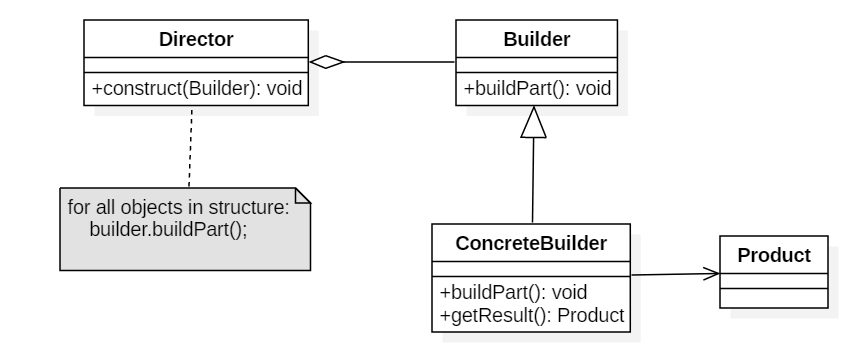

##  5. 生成器/建造者（Builder）

### Intent

封装一个对象的构造过程，并允许按步骤构造。

使用多个简单的对象一步一步构建成一个复杂的对象。

### Class Diagram

 

### Implementation

通常各个部分的子对象用一定的算法构成；由于需求的变化，这个复杂对象的各个部分经常面临着剧烈的变化，但是将它们组合在一起的算法却相对稳定。

简易形式

```java
public class BuilderPattern {
    public static void main(String[] args) {
        House house = new House.Builder()
            .setWindow("window")
            .setDoor("door")
            .setWall("wall")
            .build();
        System.out.println(house);
    }
}

@Data
class House {
    private String window;
    private String door;
    private String wall;

    public House(Builder builder) {
        this.window = builder.window;
        this.door = builder.door;
        this.wall = builder.wall;
    }

    static final class Builder {
        private String window;
        private String door;
        private String wall;

        public Builder setWindow(String window) {
            this.window = window;
            return this;
        }

        public Builder setDoor(String door) {
            this.door = door;
            return this;
        }

        public Builder setWall(String wall) {
            this.wall = wall;
            return this;
        }

        public House build() {
            return new House(this);
        }
    }
}
```


以下是一个简易的 StringBuilder 实现，参考了 JDK 1.8 源码。

```java
public class AbstractStringBuilder {
    protected char[] value;

    protected int count;

    public AbstractStringBuilder(int capacity) {
        count = 0;
        value = new char[capacity];
    }

    public AbstractStringBuilder append(char c) {
        ensureCapacityInternal(count + 1);
        value[count++] = c;
        return this;
    }

    private void ensureCapacityInternal(int minimumCapacity) {
        // overflow-conscious code
        if (minimumCapacity - value.length > 0)
            expandCapacity(minimumCapacity);
    }

    void expandCapacity(int minimumCapacity) {
        int newCapacity = value.length * 2 + 2;
        if (newCapacity - minimumCapacity < 0)
            newCapacity = minimumCapacity;
        if (newCapacity < 0) {
            if (minimumCapacity < 0) // overflow
                throw new OutOfMemoryError();
            newCapacity = Integer.MAX_VALUE;
        }
        value = Arrays.copyOf(value, newCapacity);
    }
}
```

```java
public class StringBuilder extends AbstractStringBuilder {
    public StringBuilder() {
        super(16);
    }

    @Override
    public String toString() {
        // Create a copy, don't share the array
        return new String(value, 0, count);
    }
}
```

```java
public class Client {
    public static void main(String[] args) {
        StringBuilder sb = new StringBuilder();
        final int count = 26;
        for (int i = 0; i < count; i++) {
            // 比如append，内部可能会牵扯扩容，扩容的过程是不变的
            sb.append((char) ('a' + i));
        }
        System.out.println(sb.toString());
    }
}
```

```html
abcdefghijklmnopqrstuvwxyz
```

### JDK

- [java.lang.StringBuilder](http://docs.oracle.com/javase/8/docs/api/java/lang/StringBuilder.html)
- [java.nio.ByteBuffer](http://docs.oracle.com/javase/8/docs/api/java/nio/ByteBuffer.html#put-byte-)
- [java.lang.StringBuffer](http://docs.oracle.com/javase/8/docs/api/java/lang/StringBuffer.html#append-boolean-)
- [java.lang.Appendable](http://docs.oracle.com/javase/8/docs/api/java/lang/Appendable.html)
- [Apache Camel builders](https://github.com/apache/camel/tree/0e195428ee04531be27a0b659005e3aa8d159d23/camel-core/src/main/java/org/apache/camel/builder)
