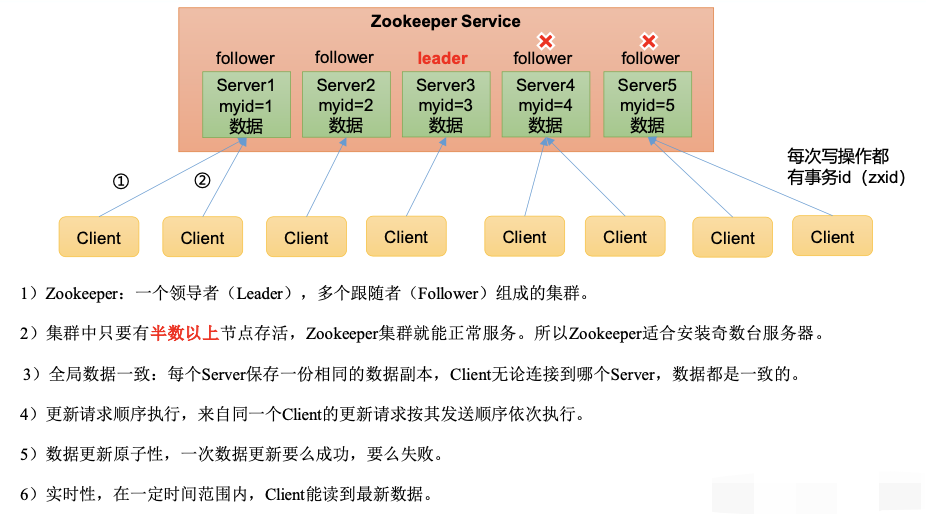

[zookeeper-in-action.md](./zookeeper-in-action.md)

[zookeeper-intro.md](./zookeeper-intro.md)

[zookeeper-plus.md](./zookeeper-plus.md)

[Zookeeper的选举机制.md](./Zookeeper的选举机制.md)

# 简介

分布式应用程序协调软件

ZooKeeper 是一个开放源码的分布式协调服务，它是集群的**管理者**，监视着集群中各个节点的状态根据节点提交的反馈进行下一步合理操作。最终，将简单易用的接口和性能高效、功能稳定的系统提供给用户。

**简单的说就是**：负责存储和管理大家都关心的数据，然后接受观察者的注册，一旦这些数据的状态发生变化，zookeeper就负责通知已经在zookeeper上注册的观察者做出相应的反应。

Zookeeper = 文件系统 + 通知机制】

### 1、特点

- **顺序一致性：** 从同一客户端发起的事务请求，最终将会严格地按照顺序被应用到 ZooKeeper 中去。
- **原子性：** 所有事务请求的处理结果在整个集群中所有机器上的应用情况是一致的，也就是说，要么整个集群中所有的机器都成功应用了某一个事务，要么都没有应用。
- **单一系统映像 ：** 无论客户端连到哪一个 ZooKeeper 服务器上，其看到的服务端数据模型都是一致的。
- **可靠性：** 一旦一次更改请求被应用，更改的结果就会被持久化，直到被下一次更改覆盖。

### 2、典型应用场景

1. **分布式锁** ： 通过创建唯一节点获得分布式锁，当获得锁的一方执行完相关代码或者是挂掉之后就释放锁。
2. **命名服务** ：可以通过 ZooKeeper 的顺序节点生成全局唯一 ID
3. **数据发布/订阅** ：通过 **Watcher 机制** 可以很方便地实现数据发布/订阅。当你将数据发布到 ZooKeeper 被监听的节点上，其他机器可通过监听 ZooKeeper 上节点的变化来实现配置的动态更新。
4. 负载均衡
5. 分布式协调/通知
6. 集群管理
7. Master选举
8. 分布式队列

> **Kafka** : ZooKeeper 主要为 Kafka 提供 Broker 和 Topic 的注册以及多个 Partition 的负载均衡等功能。

### 3、角色

