[zookeeper-in-action.md](./zookeeper-in-action.md)

[zookeeper-intro.md](./zookeeper-intro.md)

[zookeeper-plus.md](./zookeeper-plus.md)

# 简介

分布式应用程序协调软件

ZooKeeper 是一个开放源码的分布式协调服务，它是集群的**管理者**，监视着集群中各个节点的状态根据节点提交的反馈进行下一步合理操作。最终，将简单易用的接口和性能高效、功能稳定的系统提供给用户。

**简单的说就是**：负责存储和管理大家都关心的数据，然后接受观察者的注册，一旦这些数据的状态发生变化，zookeeper就负责通知已经在zookeeper上注册的观察者做出相应的反应。

Zookeeper = 文件系统 + 通知机制

### 1、特点

- **全局数据一致性**：每个server都保存一份相同的数据副本。

- **更新请求顺序性**：来自同一个Client的更新请求按其发送顺序依次执行。

- **数据更新原子性**：所有事务请求的处理结果在整个集群中所有机器上的应用情况是一致的，也就是说，要么整个集群中所有的机器都成功应用了某一个事务，要么都没有应用。每次写操作都有事物id（zxid）。

- **实时性**：在一定时间范围内，Client能读到最新数据。

### 2、典型应用场景(详情见下文)

1. **分布式锁** ： 通过创建唯一节点获得分布式锁，当获得锁的一方执行完相关代码或者是挂掉之后就释放锁。
2. **命名服务** ：对应用/服务进行统一命名，便于识别；比如，访问域名，zk可以分配给各个ip地址，nginx、nacos都可以。**注册中心**
3. **数据发布/订阅** ：通过 **Watcher 机制** 可以很方便地实现数据发布/订阅。当你将数据发布到 ZooKeeper 被监听的节点上，其他机器可通过监听 ZooKeeper 上节点的变化来实现配置的动态更新。
4. **统一配置管理**：配置中心
	- 分布式环境下，一个集群所有节点的配置信息一直，比如kafka
	- 配置管理交由Zk实现：将配置信息写入Zk的一个Znode，各个客户端服务器监听这个Znode。
4. 负载均衡
5. 分布式协调/通知
6. 集群管理
7. Master选举
8. 分布式队列

> **Kafka** : ZooKeeper 主要为 Kafka 提供 Broker 和 Topic 的注册以及多个 Partition 的负载均衡等功能。

### 3、角色

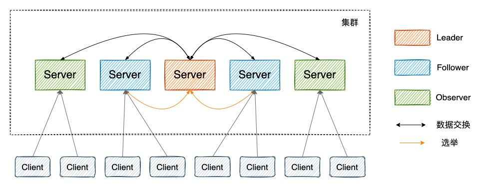

> ZooKeeper 集群中的所有机器通过一个 **Leader 选举过程** 来选定一台称为 “**Leader**” 的机器。集群由一个Leader和多个Follower、Observer组成。

| 角色     | 说明                                                         |
| -------- | ------------------------------------------------------------ |
| Leader   | 为客户端提供读和写的服务，负责投票的发起和决议，更新系统状态。 |
| Follower | 为客户端提供**读服务**，如果是写服务则转发给 Leader。参与选举过程中的投票。 |
| Observer | 为客户端提供**读服务**，如果是写服务则转发给 Leader。**不参与选举过程**，也不参与写操作的“过半写成功”策略。在不影响写性能的情况下**提升集群的读性能**。此角色于 ZooKeeper3.3 系列新增的角色。 |

Note：

- 集群只要有**半数以上节点存活**，Zk集群就能正常服务，所以适合安装**奇数集群**。

> 剩下的服务数必须大于 n/2，假如，有5台，最大允许宕机2台，6台的话也是两台，所以没必要多安装那一台。

# 重要概念

### 1、数据模型 Data model

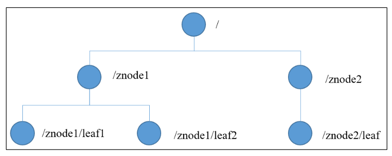

ZooKeeper 数据模型的结构与 Unix 文件系统很类似，树形结构，每个节点称做一个 ZNode。每一个 ZNode 默认能够存储 **1MB** 的数据，每个 ZNode 都可以通过其路径唯一标识。

> Zk是用来协调服务的，不是存储业务数据的。

每个 `znode` 都有自己所属的 **节点类型** 和 **节点状态**。

其中节点类型可以分为 **持久节点**、**持久顺序节点**、**临时节点** 和 **临时顺序节点**。

* 持久节点：一旦创建就一直存在，直到将其删除。
* 持久顺序节点：一个父节点可以为其子节点 **维护一个创建的先后顺序** ，这个顺序体现在 **节点名称** 上，是节点名称后自动添加一个由 10 位数字组成的数字串，从 0 开始计数。
* 临时节点：临时节点的生命周期是与 **客户端会话** 绑定的，**会话消失则节点消失** 。临时节点 **只能做叶子节点** ，不能创建子节点。
* 临时顺序节点：父节点可以创建一个维持了顺序的临时节点(和前面的持久顺序性节点一样)。

节点状态中包含了很多节点的属性比如 `czxid` 、`mzxid` 等等，在 `zookeeper` 中是使用 `Stat` 这个类来维护的。下面我列举一些属性解释。

* `czxid`：`Created ZXID`，该数据节点被 **创建** 时的事务ID。
* `mzxid`：`Modified ZXID`，节点 **最后一次被更新时** 的事务ID。
* `ctime`：`Created Time`，该节点被创建的时间。
* `mtime`： `Modified Time`，该节点最后一次被修改的时间。
* `version`：节点的版本号。
* `cversion`：**子节点** 的版本号。
* `aversion`：节点的 `ACL` 版本号。
* `ephemeralOwner`：创建该节点的会话的 `sessionID` ，如果该节点为持久节点，该值为0。
* `dataLength`：节点数据内容的长度。
* `numChildre`：该节点的子节点个数，如果为临时节点为0。
* `pzxid`：该节点子节点列表最后一次被修改时的事务ID，注意是子节点的 **列表** ，不是内容。

### 2、事件监听器 Watcher

`Watcher` 为事件监听器，是 `zk` 非常重要的一个特性，很多功能都依赖于它，它有点类似于订阅的方式，即客户端向服务端 **注册** 指定的 `watcher` ，当服务端符合了 `watcher` 的某些事件或要求则会 **向客户端发送事件通知** ，客户端收到通知后找到自己定义的 `Watcher` 然后 **执行相应的回调方法** 。

### 3、权限控制 ACL

ZooKeeper 采用 ACL（AccessControlLists）策略来进行权限控制，类似于 UNIX 文件系统的权限控制。

对于 znode 操作的权限，ZooKeeper 提供了以下 5 种：

- **CREATE** : 能创建子节点
- **READ** ：能获取节点数据和列出其子节点
- **WRITE** : 能设置/更新节点数据
- **DELETE** : 能删除子节点
- **ADMIN** : 能设置节点 ACL 的权限

其中尤其需要注意的是，**CREATE** 和 **DELETE** 这两种权限都是针对 **子节点** 的权限控制。

对于身份认证，提供了以下几种方式：

- **world** ： 默认方式，所有用户都可无条件访问。
- **auth** :不使用任何 id，代表任何已认证的用户。
- **digest** :用户名:密码认证方式： _username:password_ 。
- **ip** : 对指定 ip 进行限制。

# Zk选举机制

当 Zookeeper 集群中的一台服务器出现以下两种情况之一时，需要进入 `Leader 选举`。

（1）服务器初始化启动。

（2）服务器运行期间 Leader 故障。

## 核心概念

**（1）Server id（或sid）：服务器ID**

比如有三台服务器，编号分别是1,2,3。编号越大在选择算法中的权重越大，比如初始化启动时就是根据服务器ID进行比较。

**（2）Zxid：事务ID**

服务器中存放的数据的事务ID，值越大说明数据越新，在选举算法中数据越新权重越大。

**（3）Epoch：逻辑时钟**

每个leader任期的代号。没有 Leader时同一轮投票过程中的逻辑时钟值是相同的。也叫投票的次数，同一轮投票过程中的逻辑时钟值是相同的，每投完一次票这个数据就会增加。

**（4）Server状态：选举状态**

`LOOKING`，竞选状态。

`FOLLOWING`，随从状态，同步leader状态，参与投票。

`OBSERVING`，观察状态,同步leader状态，不参与投票。

`LEADING`，领导者状态。

## 启动时

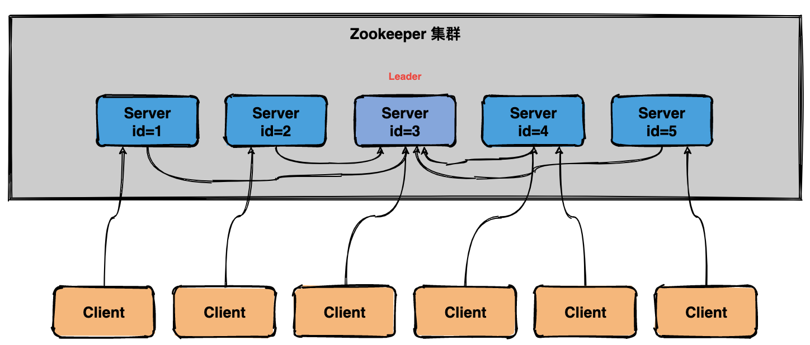

**（1）服务器1启动**

发起一次选举，服务器1投自己一票，此时服务器1票数一票，不够半数以上（3票），选举无法完成。

投票结果：服务器1为1票。

服务器1状态保持为`LOOKING`。

**（2）服务器2启动**

发起一次选举，服务器1和2分别投自己一票，此时服务器1发现服务器2的id比自己大，更改选票投给服务器2。

投票结果：服务器1为0票，服务器2为2票。

服务器1，2状态保持`LOOKING`

**（3）服务器3启动**

发起一次选举，服务器1、2、3先投自己一票，然后因为服务器3的id最大，两者更改选票投给为服务器3；

投票结果：服务器1为0票，服务器2为0票，服务器3为3票。 此时服务器3的票数已经超过半数（3票），**服务器3当选`Leader`**。

服务器1，2更改状态为`FOLLOWING`，服务器3更改状态为`LEADING`。

**（4）服务器4启动**

发起一次选举，此时服务器1，2，3已经不是LOOKING 状态，不会更改选票信息。交换选票信息结果：服务器3为3票，服务器4为1票。此时服务器4服从多数，更改选票信息为服务器3。

服务器4并更改状态为`FOLLOWING`。

**（5）服务器5启动**

与服务器4一样投票给3，此时服务器3一共5票，服务器5为0票。

服务器5并更改状态为`FOLLOWING`。

**最终的结果**：

服务器3是 `Leader`，状态为 `LEADING`；其余服务器是 `Follower`，状态为 `FOLLOWING`。

## 运行时

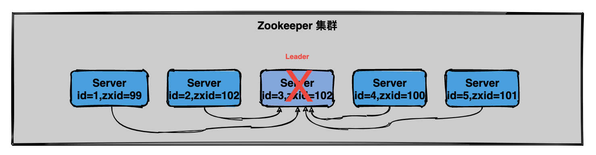

在 Zookeeper运行期间 `Leader` 和 `非 Leader` 各司其职，当有非 Leader 服务器宕机或加入不会影响 Leader，但是一旦 Leader 服务器挂了，那么整个 Zookeeper 集群将暂停对外服务，会触发新一轮的选举。

初始状态下服务器3当选为`Leader`，假设现在服务器3故障宕机了，此时每个服务器上zxid可能都不一样，server1为99，server2为102，server4为100，server5为101

运行期选举与初始状态投票过程基本类似，大致可以分为以下几个步骤：

（1）状态变更。Leader 故障后，余下的`非 Observer` 服务器都会将自己的服务器状态变更为`LOOKING`，然后开始进入`Leader选举过程`。

（2）每个Server会发出投票，先给自己，然后广播自己的投票信息。

（3）接收来自各个服务器的投票信息，如果**其他服务器的数据比自己的新(zxid大)会改投票**。

（4）处理和统计投票，超过半数即可当选。

（5）改变服务器的状态，宣布当选。

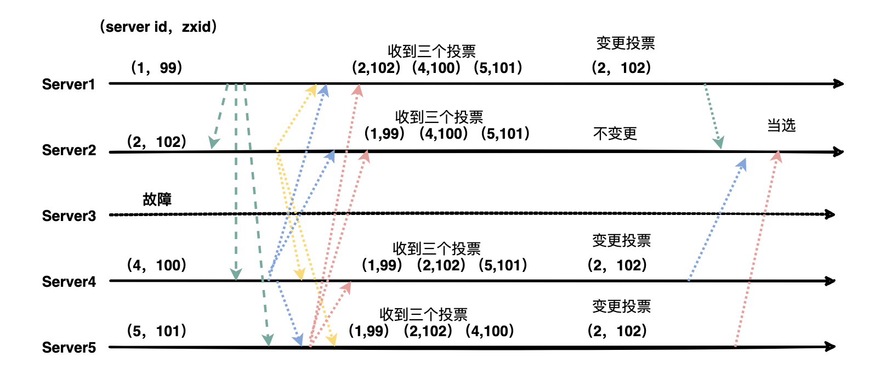

s1给自己投(1,99)，然后**广播**给其他server。s2、s4、s5同样。

图上收到的投票是指收到的投票信息。

> 从选举结果看：
>
> 1. EPOCH大大直接胜出。
> 2. EPOCH相同，zxid大的胜出。
> 3. zxid相同，sid大的胜出。
>

## Zk选举的过半机制防止脑裂

**何为集群脑裂？**

对于一个集群，通常多台机器会部署在不同机房，来提高这个集群的可用性。保证可用性的同时，会发生一种机房间网络线路故障，导致机房间网络不通，而集群被割裂成几个小集群。这时候子集群各自选主导致“脑裂”的情况。

> 举例说明：比如现在有一个由 6 台服务器所组成的一个集群，部署在了 2 个机房，每个机房 3 台。正常情况下只有 1 个 leader，但是当两个机房中间网络断开的时候，每个机房的 3 台服务器都会认为另一个机房的 3 台服务器下线，而选出自己的 leader 并对外提供服务。若没有过半机制，当网络恢复的时候会发现有 2 个 leader。仿佛是 1 个大脑（leader）分散成了 2 个大脑，这就发生了脑裂现象。脑裂期间 2 个大脑都可能对外提供了服务，这将会带来数据一致性等问题。

**过半机制是如何防止脑裂现象产生的？**

ZooKeeper 的过半机制导致不可能产生 2 个 leader，因为少于等于一半是不可能产生 leader 的，这就使得不论机房的机器如何分配都不可能发生脑裂。

## 总结

（1）Zookeeper 选举会发生在服务器初始状态和运行状态下。

（2）初始状态下，依次启动服务器，根据服务器sid的编号对比，编号越大权值越大，投票过半数即可选出Leader。

（3）Leader 故障会触发新一轮选举，`zxid` 代表数据越新，权值也就越大。选出zxid和sid最大的。

# Paxos算法

`Paxos` 算法是基于**消息传递且具有高度容错特性的一致性算法**，是目前公认的解决分布式一致性问题最有效的算法之一，**其解决的问题就是在分布式系统中如何就某个值（决议）达成一致** 。

在 `Paxos` 中主要有三个角色，分别为 `Proposer提案者`、`Acceptor表决者`、`Learner学习者`。`Paxos` 算法和 `2PC` 一样，也有两个阶段，分别为 `Prepare` 和 `accept` 阶段。

#### 1、prepare 阶段

* `Proposer提案者`：负责提出 `proposal`，每个提案者在提出提案时都会首先获取到一个 **具有全局唯一性的、递增的提案编号N**，即在整个集群中是唯一的编号 N，然后将该编号赋予其要提出的提案，在**第一阶段是只将提案编号发送给所有的表决者**。
* `Acceptor表决者`：每个表决者在 `accept` 某提案后，会将该提案编号N记录在本地，这样每个表决者中保存的已经被 accept 的提案中会存在一个**编号最大的提案**，其编号假设为 `maxN`。每个表决者仅会 `accept` 编号大于自己本地 `maxN` 的提案，在批准提案时表决者会将以前接受过的最大编号的提案作为响应反馈给 `Proposer` 。

#### 2、accept 阶段

当一个提案被 `Proposer` 提出后，如果 `Proposer` 收到了超过半数的 `Acceptor` 的批准（`Proposer` 本身同意），那么此时 `Proposer` 会给所有的 `Acceptor` 发送真正的提案（你可以理解为第一阶段为试探），这个时候 `Proposer` 就会发送提案的内容和提案编号。

表决者收到提案请求后会再次比较本身已经批准过的最大提案编号和该提案编号，如果该提案编号 **大于等于** 已经批准过的最大提案编号，那么就 `accept` 该提案（此时执行提案内容但不提交），随后将情况返回给 `Proposer` 。如果不满足则不回应或者返回 NO 。

当 `Proposer` 收到超过半数的 `accept` ，那么它这个时候会向所有的 `acceptor` 发送提案的提交请求。需要注意的是，因为上述仅仅是超过半数的 `acceptor` 批准执行了该提案内容，其他没有批准的并没有执行该提案内容，所以这个时候需要**向未批准的 `acceptor` 发送提案内容和提案编号并让它无条件执行和提交**，而对于前面已经批准过该提案的 `acceptor` 来说 **仅仅需要发送该提案的编号** ，让 `acceptor` 执行提交就行了。

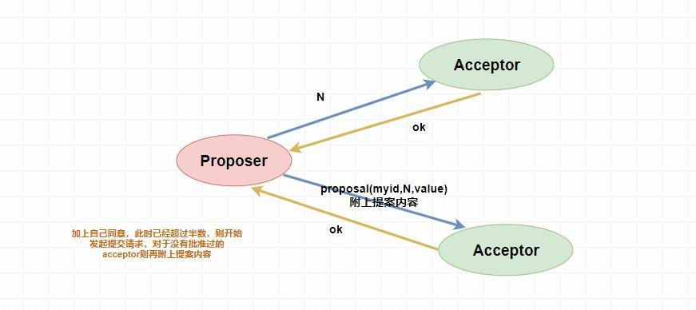

而如果 `Proposer` 如果没有收到超过半数的 `accept`  那么它将会将 **递增** 该 `Proposal` 的编号，然后 **重新进入 `Prepare` 阶段** 。

#### 3、`paxos` 算法的死循环问题（活锁）

系统中有一个以上的 Proposer，**多个 Proposers 相互争夺 Acceptor**， **造成迟迟无法达成一致的情况**。

比如说，此时提案者 P1 提出一个方案 M1，完成了 `Prepare` 阶段的工作，这个时候 `acceptor` 则批准了 M1，但是此时提案者 P2 同时也提出了一个方案 M2，它也完成了 `Prepare` 阶段的工作。然后 P1 的方案已经不能在第二阶段被批准了（因为 `acceptor` 已经批准了比 M1 更大的 M2），所以 P1 自增方案变为 M3 重新进入 `Prepare` 阶段，然后 `acceptor` ，又批准了新的 M3 方案，它又不能批准 M2 了，这个时候 M2 又自增进入 `Prepare` 阶段。。。

就这样无休无止的永远提案下去，这就是 `paxos` 算法的死循环问题。

针对这种情况，一种改进的 Paxos 算法被提出：从系统中选 出一个节点作为 Leader，只有 Leader 能够发起提案。这样，**一次 Paxos 流程中只有一个 Proposer**，不会出现活锁的情况

=> 引出ZAB协议。

# ZAB协议

ZAB协议是Zookeeper用来实现一致性的原子广播协议，分为三个阶段：

1. 领导者选举阶段：从Zookeeper集群中选出一个节点作为Leader，所有的写请求都会由Leader节点来处理
2. 数据同步阶段：集群中所有节点中的数据要和Leader节点保持一致，如果不一致则要进行同步
3. 请求广播阶段：当Leader节点接收到写请求时，会利用**两阶段提交**来广播该写请求，使得写请求像事务一样在其他节点上执行，达到节点上的数据实时一致但值得注意的是，Zookeeper只是尽量的在达到强一致性，实际上仍然只是最终一致性的。

## 消息广播

第一步需要 `Leader` 将写请求 **广播** 出去呀，让 `Leader` 问问 `Followers` 是否同意更新，如果超过半数以上的同意那么就进行 `Follower` 和 `Observer` 的更新（和 `Paxos` 一样）。

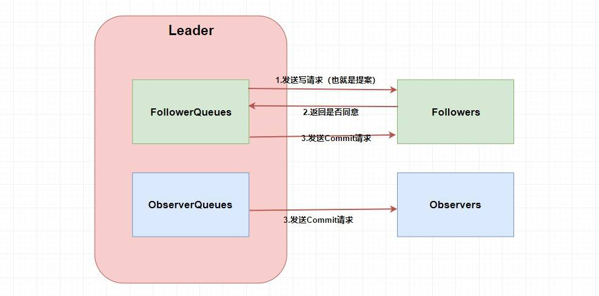

这两个 `Queue` 是 **`ZAB` 需要让 `Follower` 和 `Observer` 保证顺序性** 。何为顺序性，比如我现在有一个写请求A，此时 `Leader` 将请求A广播出去，因为只需要半数同意就行，所以可能这个时候有一个 `Follower` F1因为网络原因没有收到，而 `Leader` 又广播了一个请求B，因为网络原因，F1竟然先收到了请求B然后才收到了请求A，这个时候请求处理的顺序不同就会导致数据的不同，从而 **产生数据不一致问题** 。

所以在 `Leader` 这端，它为每个其他的 `zkServer` 准备了一个 **队列** ，采用先进先出的方式发送消息。由于协议是 **通过 `TCP` **来进行网络通信的，保证了消息的发送顺序性，接受顺序性也得到了保证。

此外，在 `ZAB` 中还定义了一个 **全局单调递增的事务ID `ZXID`** ，它是一个64位long型，其中高32位表示 `epoch` 年代，低32位表示事务id。`epoch` 是会根据 `Leader` 的变化而变化的，当一个 `Leader` 挂了，新的 `Leader` 上位的时候，年代（`epoch`）就变了。而低32位可以简单理解为递增的事务id。

定义这个的原因也是为了顺序性，每个 `proposal` 在 `Leader` 中生成后需要 **通过其 `ZXID` 来进行排序** ，才能得到处理。

## 崩溃恢复

其实主要就是 **当集群中有机器挂了，我们整个集群如何保证数据一致性？**

如果只是 `Follower` 挂了，而且挂的没超过半数的时候，因为我们一开始讲了在 `Leader` 中会维护队列，所以不用担心后面的数据没接收到导致数据不一致性。

如果 `Leader` 挂了那就麻烦了，我们肯定需要先暂停服务变为 `Looking` 状态然后进行 `Leader` 的重新选举（上面我讲过了），但这个就要分为两种情况了，分别是 **确保已经被Leader提交的提案最终能够被所有的Follower提交** 和 **跳过那些已经被丢弃的提案** 。

1、确保已经被Leader提交的提案最终能够被所有的Follower提交是什么意思呢？

假设 `Leader (server2)` 发送 `commit` 请求，他发送给了 `server3`，然后要发给 `server1` 的时候突然挂了。这个时候重新选举的时候我们如果把 `server1` 作为 `Leader` 的话，那么肯定会产生数据不一致性，因为 `server3` 肯定会提交刚刚 `server2` 发送的 `commit` 请求的提案，而 `server1` 根本没收到所以会丢弃。

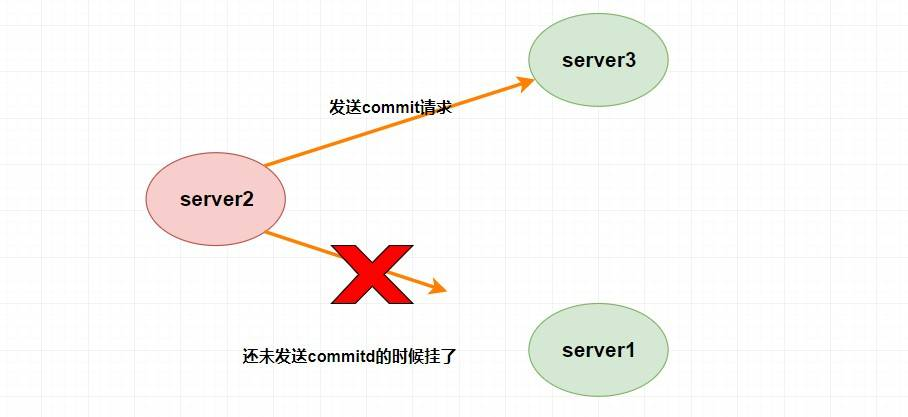

那怎么解决呢？

- **这个时候 `server1` 已经不可能成为 `Leader` 了，因为 `server1` 和 `server3` 进行投票选举的时候会比较 `ZXID` ，而此时 `server3` 的 `ZXID` 肯定比 `server1` 的大了**。(选举算法)

2、那么跳过那些已经被丢弃的提案又是什么意思呢？

假设 `Leader (server2)` 此时同意了提案N1，自身提交了这个事务并且要发送给所有 `Follower` 要 `commit` 的请求，却在这个时候挂了，此时肯定要重新进行 `Leader` 的选举，比如说此时选 `server1` 为 `Leader` （这无所谓）。但是过了一会，这个 **挂掉的 `Leader` 又重新恢复了** ，此时它肯定会作为 `Follower` 的身份进入集群中，需要注意的是刚刚 `server2` 已经同意提交了提案N1，但其他 `server` 并没有收到它的 `commit` 信息，所以其他 `server` 不可能再提交这个提案N1了，这样就会出现数据不一致性问题了，所以 **该提案N1最终需要被抛弃掉** 。

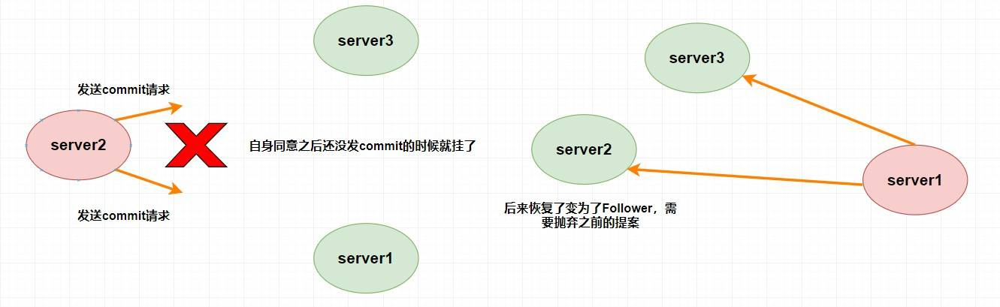

# Zk的使用场景

### 1、选主

还记得上面我们的所说的临时节点吗？因为 `Zookeeper` 的强一致性，能够很好地在保证 **在高并发的情况下保证节点创建的全局唯一性** (即无法重复创建同样的节点)。

利用这个特性，我们可以 **让多个客户端创建一个指定的节点** ，创建成功的就是 `master`。

但是，如果这个 `master` 挂了怎么办？？？

你想想为什么我们要创建临时节点？还记得临时节点的生命周期吗？`master` 挂了是不是代表会话断了？会话断了是不是意味着这个节点没了？还记得 `watcher` 吗？我们是不是可以 **让其他不是 `master` 的节点监听节点的状态** ，比如说我们监听这个临时节点的父节点，如果子节点个数变了就代表 `master` 挂了，这个时候我们 **触发回调函数进行重新选举** ，或者我们直接监听节点的状态，我们可以通过节点是否已经失去连接来判断 `master` 是否挂了等等。

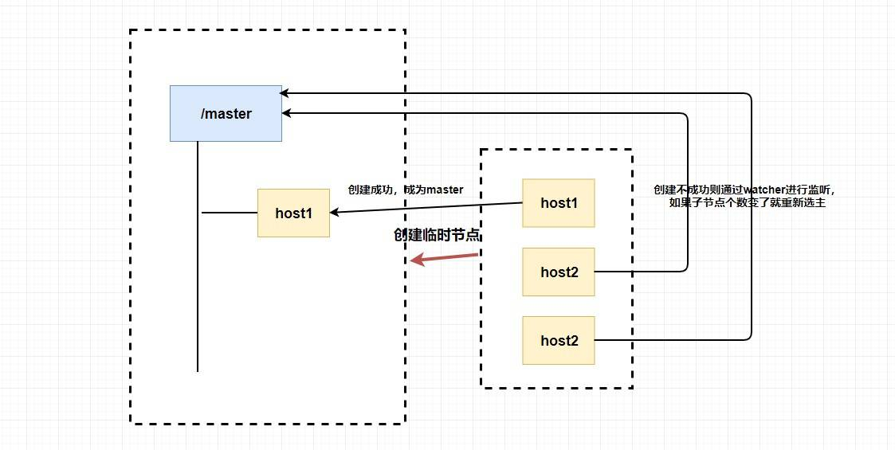

总的来说，我们可以完全 **利用 临时节点、节点状态 和 `watcher` 来实现选主的功能**，临时节点主要用来选举，节点状态和`watcher` 可以用来判断 `master` 的活性和进行重新选举。

### 2、分布式锁

分布式锁的实现方式有很多种，比如 `Redis` 、数据库 、`zookeeper` 等。个人认为 `zookeeper` 在实现分布式锁这方面是非常非常简单的。

上面我们已经提到过了 **zk在高并发的情况下保证节点创建的全局唯一性**，这玩意一看就知道能干啥了。实现互斥锁呗，又因为能在分布式的情况下，所以能实现分布式锁呗。

如何实现呢？这玩意其实跟选主基本一样，我们也可以利用临时节点的创建来实现。

首先肯定是如何获取锁，因为创建节点的唯一性，我们可以让多个客户端同时创建一个临时节点，**创建成功的就说明获取到了锁** 。然后没有获取到锁的客户端也像上面选主的非主节点创建一个 `watcher` 进行节点状态的监听，如果这个互斥锁被释放了（可能获取锁的客户端宕机了，或者那个客户端主动释放了锁）可以调用回调函数重新获得锁。

> `zk` 中不需要向 `redis` 那样考虑锁得不到释放的问题了，因为当客户端挂了，节点也挂了，锁也释放了。是不是很简单？                                               

那能不能使用 `zookeeper` 同时实现 **共享锁和独占锁** 呢？答案是可以的，不过稍微有点复杂而已。

还记得 **有序的节点** 吗？

这个时候我规定所有创建节点必须有序，当你是读请求（要获取共享锁）的话，如果 **没有比自己更小的节点，或比自己小的节点都是读请求** ，则可以获取到读锁，然后就可以开始读了。**若比自己小的节点中有写请求** ，则当前客户端无法获取到读锁，只能等待前面的写请求完成。

如果你是写请求（获取独占锁），若 **没有比自己更小的节点** ，则表示当前客户端可以直接获取到写锁，对数据进行修改。若发现 **有比自己更小的节点，无论是读操作还是写操作，当前客户端都无法获取到写锁** ，等待所有前面的操作完成。

这就很好地同时实现了共享锁和独占锁，当然还有优化的地方，比如当一个锁得到释放它会通知所有等待的客户端从而造成 **羊群效应** 。此时你可以通过让等待的节点只监听他们前面的节点。

具体怎么做呢？其实也很简单，你可以让 **读请求监听比自己小的最后一个写请求节点，写请求只监听比自己小的最后一个节点** ，感兴趣的小伙伴可以自己去研究一下。                                                                                                                                                                                                                                                                                       

### 3、命名服务

如何给一个对象设置ID，大家可能都会想到 `UUID`，但是 `UUID` 最大的问题就在于它太长了。。。(太长不一定是好事，嘿嘿嘿)。那么在条件允许的情况下，我们能不能使用 `zookeeper` 来实现呢？

我们之前提到过 `zookeeper` 是通过 **树形结构** 来存储数据节点的，那也就是说，对于每个节点的 **全路径**，它必定是唯一的，我们可以使用节点的全路径作为命名方式了。而且更重要的是，路径是我们可以自己定义的，这对于我们对有些有语意的对象的ID设置可以更加便于理解。

### 4、集群管理和注册中心

看到这里是不是觉得 `zookeeper` 实在是太强大了，它怎么能这么能干！

别急，它能干的事情还很多呢。可能我们会有这样的需求，我们需要了解整个集群中有多少机器在工作，我们想对集群中的每台机器的运行时状态进行数据采集，对集群中机器进行上下线操作等等。

而 `zookeeper` 天然支持的 `watcher` 和 临时节点能很好的实现这些需求。我们可以为每条机器创建临时节点，并监控其父节点，如果子节点列表有变动（我们可能创建删除了临时节点），那么我们可以使用在其父节点绑定的 `watcher` 进行状态监控和回调。

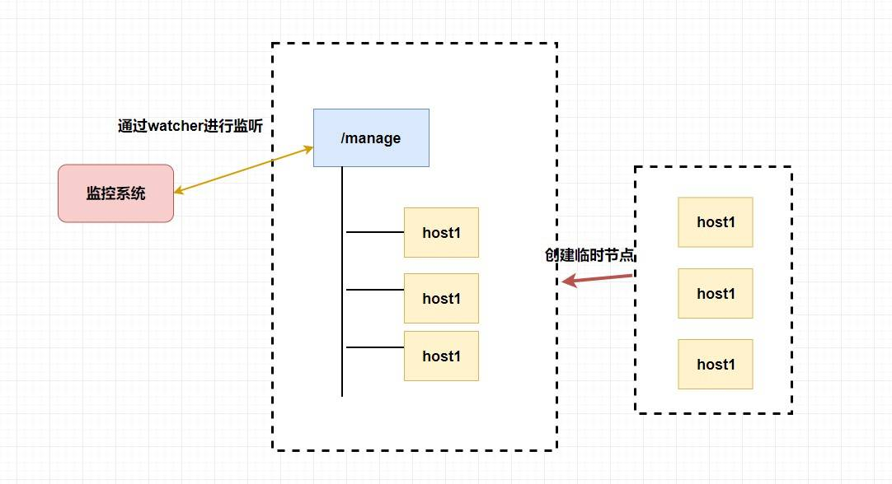

至于注册中心也很简单，我们同样也是让 **服务提供者** 在 `zookeeper` 中创建一个临时节点并且将自己的 `ip、port、调用方式` 写入节点，当 **服务消费者** 需要进行调用的时候会 **通过注册中心找到相应的服务的地址列表(IP端口什么的)** ，并缓存到本地(方便以后调用)，当消费者调用服务时，不会再去请求注册中心，而是直接通过负载均衡算法从地址列表中取一个服务提供者的服务器调用服务。

当服务提供者的某台服务器宕机或下线时，相应的地址会从服务提供者地址列表中移除。同时，注册中心会将新的服务地址列表发送给服务消费者的机器并缓存在消费者本机（当然你可以让消费者进行节点监听，我记得 `Eureka` 会先试错，然后再更新）。

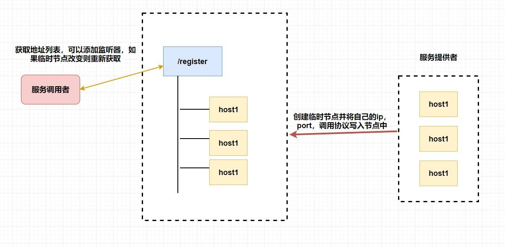