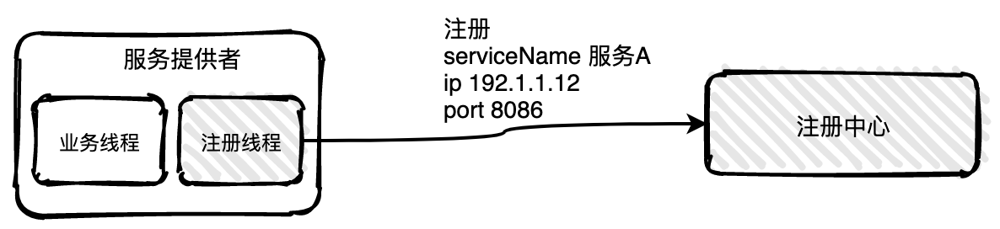
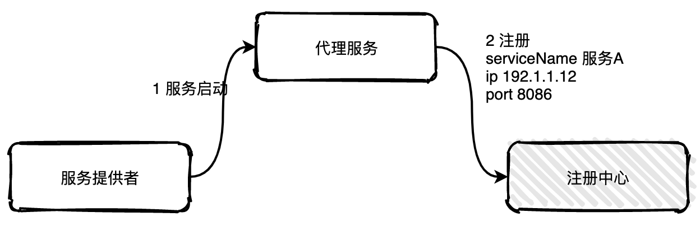
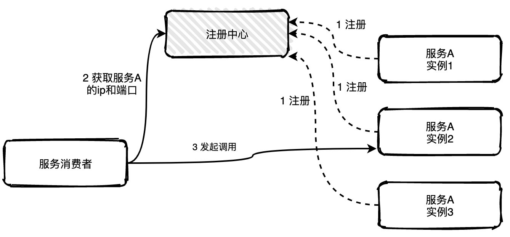
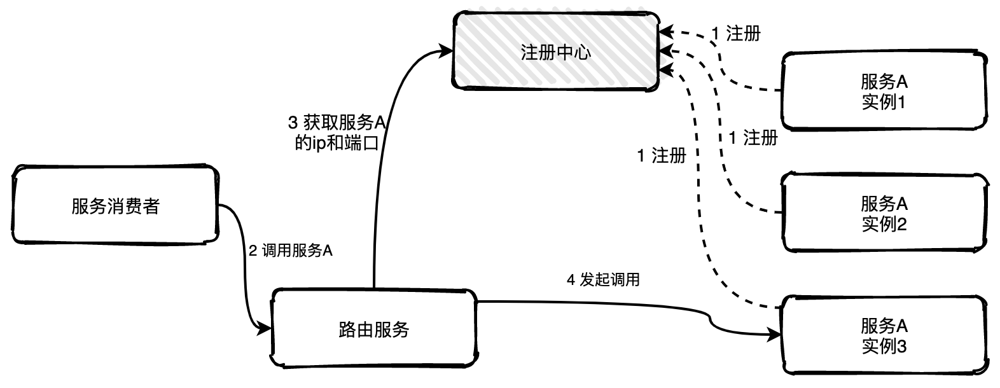
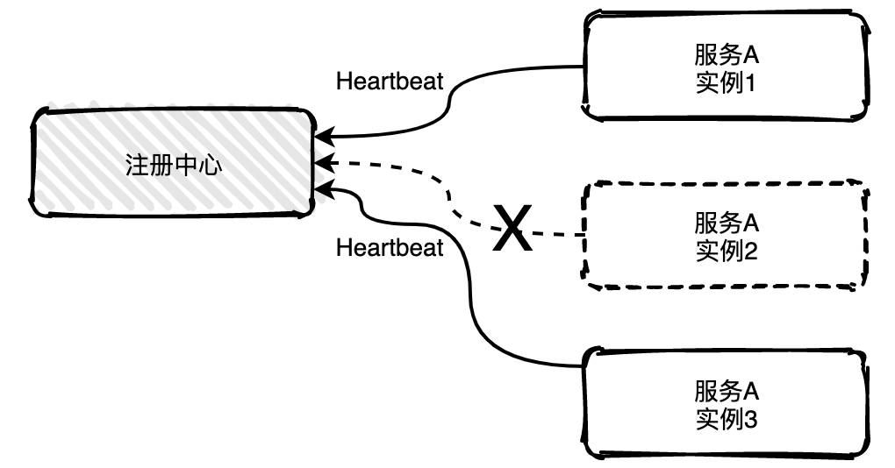
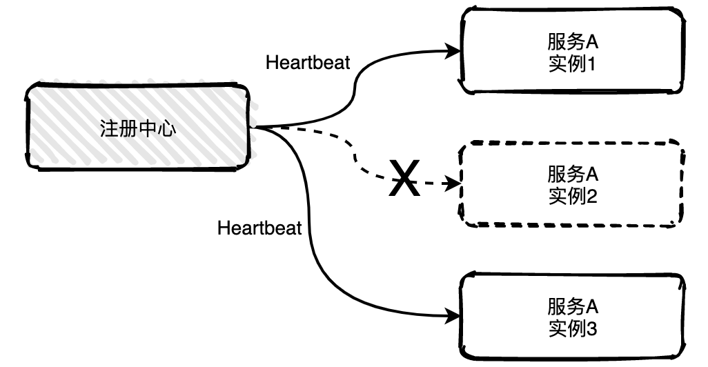

# 分布式系统的CAP原理

### CAP原理

- Consistency (一致性)

- Availability (可用性)

- Partition tolerance (分区容错性)

由于硬件条件，一个分布式系统必须保证分区容错性，要么CP要么AP，三者不可同时获得。

**一致性**(C)：一个分布式系统中各个节点之间能及时的同步数据，在数据同步过程中，是不能对外提供服务的

**可用性**(A)：负载过大后，集群整体是否还能响应客户端的读写请求。(服务对外要保证可用，而且是正常响应时间)

**分区容错性**(P)：分区容错性，就是高可用性，一个节点崩了，并不影响其它的节点(100个节点，挂了几个，不影响服务，越多机器越好)

### CA 满足的情况下，P不能满足的原因

数据同步(C)需要时间，也要正常的时间内响应(A)，那么机器数量就要少，所以P就不满足

### CP 满足的情况下，A不能满足的原因

数据同步(C)需要时间, 机器数量也多(P)，但是同步数据需要时间，所以不能再正常时间内响应，所以A就不满足

### AP 满足的情况下，C不能满足的原因

机器数量也多(P)，正常的时间内响应(A)，那么数据就不能及时同步到其他节点，所以C不满足

### 注册中心选择的原则

Zookeeper：CP设计，保证了一致性，集群搭建的时候，某个节点失效，则会进行选举行的leader，或 者半数以上节点不可用，则无法提供服务，因此可用性没法满足

Eureka：AP原则，无主从节点，一个节点挂了，自动切换其他节点可以使用，去中心化

分布式系统中P肯定要满足，所以我们只能在一致性和可用性之间进行权衡 

- 如果要求一致性，则选择zookeeper，如金融行业 

- 如果要求可用性，则Eureka，如教育、电商系统 

没有最好的选择，最好的选择是根据业务场景来进行架构设计

# BASE理论

由于不能同时满⾜CAP，所以出现了BASE理论： 

1. BA：Basically Available，表示基本可⽤，表示可以允许⼀定程度的不可⽤，⽐如由于系统故障， 请求时间变⻓，或者由于系统故障导致部分⾮核⼼功能不可⽤，都是允许的 
2. S：Soft state：表示分布式系统可以处于⼀种中间状态，⽐如数据正在同步 
3. E：Eventually consistent，表示最终⼀致性，不要求分布式系统数据实时达到⼀致，允许在经过⼀ 段时间后再达到⼀致，在达到⼀致过程中，系统也是可⽤的

# 什么是RPC

RPC (Remote Procedure Call)，表示远程过程调⽤，对于Java这种⾯试对象语⾔，也可以理解为远程⽅法调⽤。

RPC 调⽤和 HTTP 调⽤是有区别的，RPC 表示的是⼀种调⽤远程⽅法的⽅式，可以使⽤HTTP协议、或直接基于 TCP 协议来实现 RPC。

在 Java 中，我们可以通过直接使⽤某个服务接⼝的代理对象来执⾏⽅法，⽽底层则通 过构造HTTP请求来调⽤远端的⽅法，所以，有⼀种说法是RPC协议是HTTP协议之上的⼀种协议，也是 可以理解的。

---

# 服务注册与发现

服务注册与发现是分为注册和发现两个关键的步骤。

**服务注册**：服务进程在注册中心注册自己的元数据信息。通常包括主机和端口号，有时还有身份验证信息，协议，版本号，以及运行环境的信息。

**服务发现**：客户端服务进程向注册中心发起查询，来获取服务的信息。服务发现的一个重要作用就是提供给客户端一个可用的服务列表。

## 服务注册

服务注册有两种形式：客户端注册和代理注册。

**客户端注册**

客户端注册是服务自己要负责注册与注销的工作。当服务启动后注册线程向注册中心注册，当服务下线时注销自己。

这种方式的缺点是注册注销逻辑与服务的业务逻辑耦合在一起，如果服务使用不同语言开发，那需要适配多套服务注册逻辑。

**代理注册**

代理注册由一个单独的代理服务负责注册与注销。当服务提供者启动后以某种方式通知代理服务，然后代理服务负责向注册中心发起注册工作。

这种方式的缺点是多引用了一个代理服务，并且代理服务要保持高可用状态。

## 服务发现

服务发现也分为客户端发现和代理发现。

**客户端发现**

客户端发现是指客户端负责向注册中心查询可用服务地址，获取到所有的可用实例地址列表后客户端根据负载均衡算法选择一个实例发起请求调用。

这种方式非常直接，客户端可以控制负载均衡算法。但是缺点也很明显，获取实例地址、负载均衡等逻辑与服务的业务逻辑耦合在一起，如果服务发现或者负载平衡有变化，那么所有的服务都要修改重新上线。

**代理发现**

代理发现是指新增一个路由服务负责服务发现获取可用的实例列表，服务消费者如果需要调用服务A的一个实例可以直接将请求发往路由服务，路由服务根据配置好的负载均衡算法从可用的实例列表中选择一个实例将请求转发过去即可，如果发现实例不可用，路由服务还可以自行重试，服务消费者完全不用感知。

## 心跳机制

如果服务有多个实例，其中一个实例出现宕机，注册中心是可以实时感知到，并且将该实例信息从列表中移出，也称为摘机。

如何实现摘机？业界比较常用的方式是通过心跳检测的方式实现，心跳检测有**主动**和**被动**两种方式。

**被动检测**是指服务主动向注册中心发送心跳消息，时间间隔可自定义，比如配置5秒发送一次，注册中心如果在三个周期内比如说15秒内没有收到实例的心跳消息，就会将该实例从列表中移除。

上图中服务A的实例2已经宕机不能主动给注册中心发送心跳消息，15秒之后注册就会将实例2移除掉。

**主动检测**是注册中心主动发起，每隔几秒中会给所有列表中的服务实例发送心跳检测消息，如果多个周期内未发送成功或未收到回复就会主动移除该实例。

