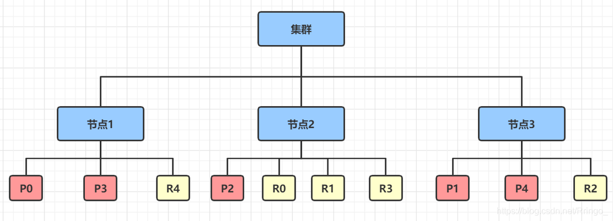
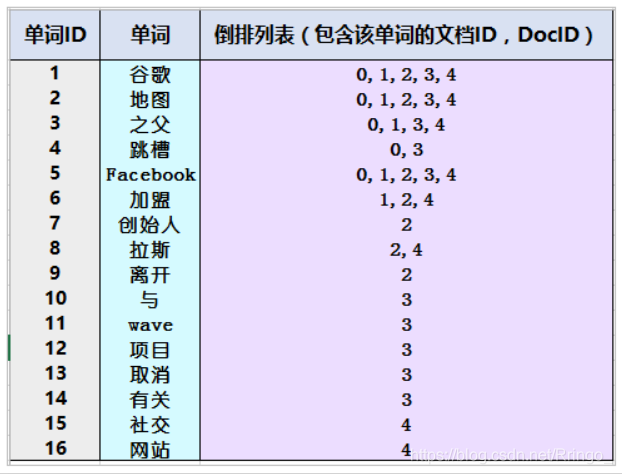
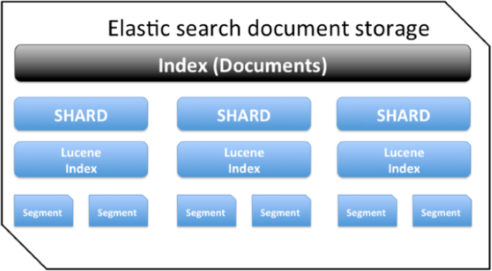
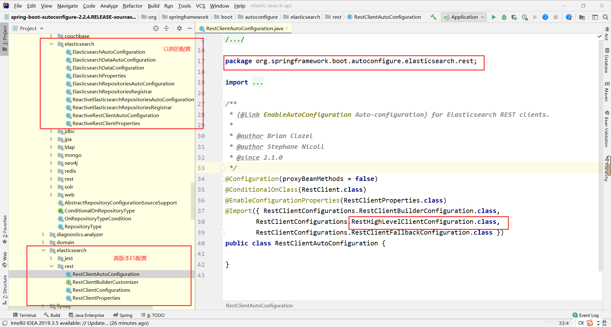

# 1.elasticsearch概述

Elasticsearch 是一个**分布式、高扩展、高实时**的搜索与数据分析引擎。它能很方便的使大量数据具有搜索、分析和探索的能力。它提供**可扩展**的搜索，具有**接近实时**的搜索。


# 2.ES环境

略

# 3.ES核心概念

## 3.1.基本介绍

**elasticsearch是面向文档的。**

关系型数据库 和 elasticsearch客观对比！一切都是JSON！

| Relational DB    | Elasticsearcg |
| :--------------- | :------------ |
| 数据库(database) | 索引(index)   |
| 表(tables)       | types         |
| 行(rows)         | documents     |
| 字段(columns)    | fields        |

elasticsearch(集群)中可以包含多个索引(数据库)，每个索引中可以包含多个类型(表)，每个类型下又包含多个文档(行)，每个文档中又包含多个字段(列)。

**物理设计：**

elasticsearch在后台把每个索引划分成多个分片，每分分片可以在集群中的不同服务器之间迁移！

**一个elasticsearch就是一个集群**。默认的集群名称就是`elasticsearch`。

**逻辑设计：**

一个索引类型中，包含多个文档，比如说文档1，文档2。当我们索引一篇文档时，可以通过这样的一个序列找到它：`索引>类型>文档ID`，通过这个组合我们就能索引到某个具体的文档。**注意：ID不必是整数，实际上它是个字符串！**

## 3.2.文档

**文档就类比表中的一条条数据。**

```md
user
1      zangsan     18
2      lisi        3
```

之前说`elasticsearch`是面向文档的，那么就意味着索引和搜索数据的最小单位是文档，`elasticsearch`中，文档有几个重要的属性：

- 自我包含，一篇文档同时包含字段和对应的值，也就是同时包含`key-value`。
- 可以是层次型的，一个文档中包含自文档，复杂的逻辑实体就是这么来的！
- 灵活的结构，文档不依赖预先定义的模式，我们知道关系型数据库中，要提前定义字段才能使用，在`elasticsearch`中，对于字段是非常灵活的，有时候，我们可以忽略该字段，或者动态的添加一个新的字段。

## 3.3.类型

类型是文档的逻辑容器，就像关系型数据库一样，表格是行的容器。类型中对于字段的定义成为映射，比如`name`映射为字符串类型。我们说文档是无模式的，他们不需要拥有映射中所定义的所有字段，比如新增一个字段，那么`elasticsearch`是怎么做的呢？`elasticsearch`会自动的将新字段加入映射，但是这个字段的不确定它是什么类型，`elasticsearch`就开始猜，如果这个值是18，那么`elasticsearch`就会认为它是整型，但是`elasticsearch`也可能猜不对，所以最安全的办法的是提前定义好所需要的映射，这点跟关系型数据库殊途同归了，先是定义好字段，然后再使用。

## 3.4.索引

**索引就类比数据库！**

索引是映射类型的容器，`elasticsearch`中的索引是一个非常大的文档集合。索引存储了映射类型的字段和其他设置。然后它们被存储到了各个分片上。我们来研究下分片是如何工作的。


**物理设计：节点和分片 如何工作**

一个集群至少有一个节点，而一个节点就是一个`elasticsearch`进程，节点可以有多个索引，如果创建索引，那么索引将会有5个分片(`primary shard`，又称主分片)构成，每一个主分片会有一个副本（`replica shard`，又称复制分片）。



上图是一个有3个节点的集群，可以直接看到主分片[P]和对应的复制分片[R]都不会在同一个节点内，这样有利于某个节点挂掉了，数据也不会丢失。实际上，一个分片是一个`Lucene`索引，一个包含__倒排索引__的文件目录，倒排索引的结构使得`elasticsearch`在不扫描全部文档的情况下，就能告诉你哪些文档包含特定的关键字。不过，倒排索引是什么？

## 3.5.倒排索引

> 倒排索引基本介绍

`elasticsearch`使用的是一种称为倒排索引的结构，采用`Lucene`倒排索引作为底层。这种结构适用于快速的全文检索，一个索引由文档中所有不重复的列表构成，对于每一个词，都有一个包含它的文档列表。例如，现在有两个文档，每个文档包含如下内容：

```shell
Study every day,good good up to forever # 文档1包含的内容
To forever,study every day, good good up # 文档2包含的内容
```

为了创建倒排索引，我们首先要将每个文档拆分成独立的词(或称为词条或者tokens)，然后创建一个包含所有不重复的词条的排序列表，然后列出每个词条出现在哪个文档！

| term    | doc.1 | doc.2 |
| ------- | ----- | ----- |
| Study   | √     | ×     |
| To      | ×     | √     |
| every   | √     | √     |
| forever | √     | √     |
| day     | √     | √     |
| study   | ×     | √     |
| good    | √     | √     |
| every   | √     | √     |
| to      | √     | ×     |
| up      | √     | √     |

现在我们试图搜索to forever，只需要查看包含每个词条的文档

| term    | doc.1 | doc.2 |
| ------- | ----- | ----- |
| to      | √     | ×     |
| forever | √     | √     |
| total   | 2     | 1     |

两个文档都匹配，但是第一个文档比第二个匹配程度更高。如果没有别的条件，现在，这两个包含关键字的都将返回。

- 正排索引：文档 -> 词条1、词条2、...
- 倒排索引：词条1 -> 文档1、文档2、...

> 创建倒排索引步骤

1、创建文档列表：`Lucene`首先对原始文档数据进行编号，形成列表，就是一个文档列表。


2、创建倒排索引列表：対原始文档中的数据进行**分词**，得到词条。対词条进行编号，以词条创建索引。然后记录下包含该词条的所有文档编号及其他信息。




- **搜索的过程：**

当用户输入任意的词条时，首先对用户输入的数据进行分词，得到用户要搜索的所有词条，然后拿着这些词条去倒排索引列表中进行匹配。找到这些词条就能找到包含这些词条的所有文档的编号。

然后根据这些编号去文档列表中找到文档。


## 3.6 段



- 一个集群包含1个或多个节点；
- 一个节点包含1个或多个索引；
- 一个索引：类似 Mysql 中的数据库；
- 每个索引又由一个或多个分片组成；
- 每个分片都是一个 Lucene 索引实例，您可以将其视作一个独立的搜索引擎，它能够对 Elasticsearch 集群中的数据子集进行索引并处理相关查询；
- 每个分片包含多个segment (段)，每一个segment都是一个倒排索引。


# 5.关于索引的基本操作

## 5.1.Rest模板

| method |                     url地址                     |         描述         |
| :----: | :---------------------------------------------: | :------------------: |
|  PUT   |     localhost:9200/索引名称/类型名称/文档id     | 创建文档(指定文档id) |
|  POST  |        localhost:9200/索引名称/类型名称         | 创建文档(随机文档id) |
|  POST  | localhost:9200/索引名称/类型名称/文档id/_update |       修改文档       |
| DELETE |     localhost:9200/索引名称/类型名称/文档id     |       删除文档       |
|  GET   |     localhost:9200/索引名称/类型名称/文档id     |  通过文档id查询文档  |
|  POST  |    localhost:9200/索引名称/类型名称/_search     |     查询所有数据     |

> types类型名称在7.x后彻底去除，默认使用_doc，一个index中只包含一个类型

## 5.2.添加索引

```shell
# 使用Postman测试 

# 基本语法
POST请求 http://39.97.3.60:9200/索引名/~类型名~/文档id
{请求体}

# 1、测试创建索引(添加了文档)
POST请求 http://39.97.3.60:9200/test1/_doc/1
{
   "name": "Ringo",
   "age": 3
}

# 2、测试创建索引规则(不添加文档)
PUT请求 http://39.97.3.60:9200/test2
{
   "mappings": {
      "properties": {
         "name": {
            "type": "text"           
         },
         "age": {
            "type": "long"
         },
         "birthday": {
            "type": "date"
         }
      }
   }
}

# 3、获取索引具体的信息
GET请求 http://39.97.3.60:9200/test2
```

## 5.3.查看索引默认信息

```shell
# 1、创建索引并添加数据
POST请求 http://39.97.3.60:9200/test3/_doc/1
{
	"name": "Ringo",
	"age": 18,
	"birth": "1997-11-13"
}

# 2、我们自己没有为索引写mapping映射查看索引默认的信息
GET请求 http://39.97.3.60:9200/test3

# 返回的结果，ES给我们的字段自动加上了类型
{
    "test3": {
        "aliases": {},
        "mappings": {
            "properties": {
                "age": {
                    "type": "long"
                },
                "birth": {
                    "type": "date"
                },
                "name": {
                    "type": "text",
                    "fields": {
                        "keyword": {
                            "type": "keyword",
                            "ignore_above": 256
                        }
                    }
                }
            }
        },
    }
}
```

如果自己的文档字段没有指定类型，那么`elasticsearch`就会给我们默认配置字段类型！


## 5.4.扩展命令

```shell
# 1、查看ElasticSearch健康状态
GET请求 http://39.97.3.60:9200/_cat/health

# 2、查看ElasticSearch详细信息
GET请求 http://39.97.3.60:9200/_cat/indices?v
```

## 5.5.修改索引

```shell
# 方式一：修改文档
PUT请求 http://39.97.3.60:9200/test3/_doc/1

{
	"name": "Ringo",
	"age": 18,
	"birth": "1997-11-13"
}

# 返回结果
{
    "_index": "test3",
    "_type": "_doc",
    "_id": "1",
    "_version": 3,     # 发现修改一次之后版本号会增加1
    "result": "updated",
    "_shards": {
        "total": 2,
        "successful": 1,
        "failed": 0
    },
}

# 方式二：修改文档
POST请求 http://39.97.3.60:9200/test3/_doc/1/_update

{
	"doc": {
		"name": "Ringo",
		"age": 19,
		"birth": "1997-11-13"
	}
}

# 返回结果
{
    "_index": "test3",
    "_type": "_doc",
    "_id": "1_update",
    "_version": 3,
    "result": "updated",
    "_shards": {
        "total": 2,
        "successful": 1,
        "failed": 0
    },
}
```

## 5.6.删除索引

```shell
# 1、删除索引
DELETE请求 http://39.97.3.60:9200/test1

# 2、删除文档
DELETE请求 http://39.97.3.60:9200/test3/_doc/1
```


# 6.关于文档的基本操作

## 6.1.基本操作

```shell
# 1、创建文档
POST请求 http://39.97.3.60:9200/ringo/_doc/1
{
  "name": "RingoTangs",
  "age": 18,
  "describe": "铃铃铃",
  "tags": ["阳光","喜欢篮球","喜欢学习"]
}

# 2、获取数据
GET请求 http://39.97.3.60:9200/ringo/_doc/1

# 3、更新数据,PUT如果不写全字段就会被覆盖
PUT请求 http://39.97.3.60:9200/ringo/_doc/3

{
  "name": "李四233",
  "age": 30,
  "describe": "法外狂徒，李四",
  "tags": ["靓仔","喜欢唱歌","喜欢学习"]
}

# 4、推荐使用POST来更新,自由度很高，携带的JSON可以只写修改字段
POST请求 http://39.97.3.60:9200/ringo/_doc/3/_update

{
   "doc": {
      "name": "李四999"
	}
}
```


## 6.2.简单查询

```shell
# 1、简单的条件查询
GET请求 http://39.97.3.60:9200/ringo/_search?q=name:张三

GET请求 http://39.97.3.60:9200/ringo/_search?q=tags:篮球
```


## 6.3.复杂查询

```shell
# 1、带上查询条件，match只要名字中有"张三"的都会被检索出来
POST请求 http://39.97.3.60:9200/ringo/_search

{
	"query": {
		"match": {
			"name": "张三"
		}
	}
}

# 2、查询结果返回具体的字段,使用"_source"
POST请求 http://39.97.3.60:9200/ringo/_search

{
	"query": {
		"match": {
			"name": "张三"
		}
	},
	"_source": ["name", "age"]
}


# 3、查询结果排序,使用"sort",通过某个字段进行排序
POST请求 http://39.97.3.60:9200/ringo/_search

{
	"query": {
		"match": {
			"name": "张三"
		}
	},
	"_source": ["name", "age"],
	"sort": [{
		"age": {
			"order": "asc"
		}
	}]
}

# 4、分页查询 "from"从哪里开始,“size"每页显示几条数据
POST请求 http://39.97.3.60:9200/ringo/_search

{
	"query": {
		"match": {
			"name": "张三"
		}
	},
	"_source": ["name", "age"],
	"from": 0,
	"size": 1
}

# 5、通过"bool"和"must"组合使用，可以多条件组合查询,等价于and
# 会把name="张三"和age=30的文档查出来
POST请求 http://39.97.3.60:9200/ringo/_search
{
	"query": {
		"bool": {
			"must": [{
				"match": {
					"name": "张三"
				}
			}, {
				"match": {
					"age": 30
				}
			}]
		}
	}
}

# 4、"should"有一个条件符合即可，等价于or
# 会把name="张三"或者age=18的文档查出来
POST请求 http://39.97.3.60:9200/ringo/_search

{
	"query": {
		"bool": {
			"should": [{
				"match": {
					"name": "张三"
				}
			}, {
				"match": {
					"age": 18
				}
			}]
		}
	}
}


# 5、"must_not"查询年龄不是18岁的人
POST请求 http://39.97.3.60:9200/ringo/_search

{
	"query": {
		"bool": {
			"must_not": [{
				"match": {
					"age": 18
				}
			}]
		}
	}
}

# 6、查询结果过滤，范围查询
# gt：大于
# gte：大于等于
# lt：小于
# lte：小于等于
POST请求 http://39.97.3.60:9200/ringo/_search

{
	"query": {
		"bool": {
			"must":[{
				"match": {
					"name": "张三"
				}
			}],
			"filter": {
				"range": {
					"age": {
						"gt": 19
					}
				}
			}
		}
	}
}

# 7、多条件使用空格隔开，只要满足其中一个结果就可以被查出
POST请求 http://39.97.3.60:9200/ringo/_search

{
  "query": {
    "match": {
      "tags": "喜欢 阳光"
    }
  }
}

# 8、精确查询term  "term"输入的词不会被分词，"match"会使用分词器解析
# term查询是直接通过倒排索引指定的词条进行精确查找的！
# 注意：keyword类型的字段不会被分词器解析！！！
PUT /testdb
{
  "mappings": {
    "properties": {
      "name": {
        "type": "text"   # text类型会走分词器
      },
      "describe": {
        "type": "keyword"  # keyword不会走分词器，当成一个整体
      }
    }
  }
}

GET /testdb/_search
{
  "query": {
    "term": {
      "describe": "Ringo 每天都要好好学习"
    }
  }
}

# 9、高亮查询
# 测试样例
GET /testdb/_search
{
  "query": {
    "match": {
      "name": "棠时"
    }
  },
  "highlight": {
    "pre_tags": "<p class='key' style='color:red'>", 
    "post_tags": "</p>", 
    "fields": {
      "name": {}
    }
  }
}

# 结果
"highlight" : {
    "name" : [
        "<p class='key' style='color:red'>棠</p><p class='key' style='color:red'>时</p>每天都要开心"
    ]
}
```


# 7.SpringBoot整合ES

**官方文档地址：https://www.elastic.co/guide/en/elasticsearch/client/index.html**

## 7.1.基本环境和配置

> pom

```xml
<?xml version="1.0" encoding="UTF-8"?>
<project xmlns="http://maven.apache.org/POM/4.0.0"
         xmlns:xsi="http://www.w3.org/2001/XMLSchema-instance"
         xsi:schemaLocation="http://maven.apache.org/POM/4.0.0 http://maven.apache.org/xsd/maven-4.0.0.xsd">
    <modelVersion>4.0.0</modelVersion>

    <groupId>com.ymy</groupId>
    <artifactId>elastic-search-api</artifactId>
    <version>1.0-SNAPSHOT</version>

    <properties>
        <!--重点：注意这里要和我们Linux上安装的客户端版本对应-->
        <elasticsearch.version>7.8.0</elasticsearch.version>
    </properties>

    <parent>
        <groupId>org.springframework.boot</groupId>
        <artifactId>spring-boot-starter-parent</artifactId>
        <version>2.2.4.RELEASE</version>
    </parent>

    <dependencies>
        <!--web-->
        <dependency>
            <groupId>org.springframework.boot</groupId>
            <artifactId>spring-boot-starter-web</artifactId>
        </dependency>

        <!--elasticsearch 注意elasticsearch的jar要和Linux上装的客户端版本对应-->
        <dependency>
            <groupId>org.springframework.boot</groupId>
            <artifactId>spring-boot-starter-data-elasticsearch</artifactId>
        </dependency>

        <!--test-->
        <dependency>
            <groupId>org.springframework.boot</groupId>
            <artifactId>spring-boot-starter-test</artifactId>
            <scope>test</scope>
        </dependency>

    </dependencies>

    <build>
        <plugins>
            <plugin>
                <groupId>org.springframework.boot</groupId>
                <artifactId>spring-boot-maven-plugin</artifactId>
                <version>2.2.6.RELEASE</version>
                <configuration>
                    <fork>true</fork>
                    <addResources>true</addResources>
                </configuration>
            </plugin>
        </plugins>
    </build>
</project>
```


`SpringBoot`的依赖中，默认用的`elasticsearch`版本还是6.8.6。我们只需要在我们自己的`pom`文件的`<properties>`修改`elasticsearch`版本为`Linux`服务器上的版本即可。

```xml
<!--这是SpringBoot依赖管理中使用的ES版本-->
<properties>
	<elasticsearch.version>6.8.6</elasticsearch.version>
</properties>

<dependencyManagement>
    <dependencies>
        <dependency>
            <groupId>org.elasticsearch</groupId>
            <artifactId>elasticsearch</artifactId>
            <version>${elasticsearch.version}</version>
        </dependency>
        <dependency>
            <groupId>org.elasticsearch.client</groupId>
            <artifactId>transport</artifactId>
            <version>${elasticsearch.version}</version>
        </dependency>
        ....
    </dependencies>
</dependencyManagement>
```


> elasticsearch配置

```java
import org.apache.http.HttpHost;
import org.elasticsearch.client.RestClient;
import org.elasticsearch.client.RestHighLevelClient;
import org.springframework.context.annotation.Bean;
import org.springframework.context.annotation.Configuration;

@Configuration
public class ElasticSearchConf {
    @Bean(name = "client")
    public RestHighLevelClient restHighLevelClient() {
        RestHighLevelClient client = new RestHighLevelClient(RestClient.builder(new HttpHost("39.97.3.60", 9200, "http")));
        return client;
    }
}
```


> ES自动配置




`SpringBoot`默认将`RestHighLevelClient`加到了容器中，详情见`org.springframework.boot.autoconfigure.elasticsearch.rest.RestClientConfigurations`。

```java
package org.springframework.boot.autoconfigure.elasticsearch.rest;
class RestClientConfigurations {
    
    @Configuration(proxyBeanMethods = false)
    @ConditionalOnClass(RestHighLevelClient.class)
    static class RestHighLevelClientConfiguration {

        @Bean
        @ConditionalOnMissingBean
        RestHighLevelClient elasticsearchRestHighLevelClient(RestClientBuilder restClientBuilder) {
            return new RestHighLevelClient(restClientBuilder);
        }
    }   
}
```


## 7.2.关于索引的API操作

```java
import org.elasticsearch.action.admin.indices.delete.DeleteIndexRequest;
import org.elasticsearch.action.support.master.AcknowledgedResponse;
import org.elasticsearch.client.RequestOptions;
import org.elasticsearch.client.RestHighLevelClient;
import org.elasticsearch.client.indices.CreateIndexRequest;
import org.elasticsearch.client.indices.CreateIndexResponse;
import org.elasticsearch.client.indices.GetIndexRequest;
import org.elasticsearch.client.indices.GetIndexResponse;
import org.junit.Test;
import org.junit.runner.RunWith;
import org.springframework.boot.test.context.SpringBootTest;
import org.springframework.test.context.junit4.SpringRunner;

import javax.annotation.Resource;

/**
 * ES关于索引的操作
 */
@RunWith(SpringRunner.class)
@SpringBootTest
public class TestESIdxAPI {

    @Resource
    private RestHighLevelClient client;

    public static final String INDEX_NAME = "test_es_idx_api";

    /**
     * 1、创建索引
     */
    @Test
    public void createIndex() throws Exception {
        // 1、创建索引请求
        CreateIndexRequest request = new CreateIndexRequest(INDEX_NAME);

        // 2、执行请求 client.indices()返回対索引操作的对象
        CreateIndexResponse response = client.indices().create(request, RequestOptions.DEFAULT);

        // 3、打印响应
        System.out.println(response.isAcknowledged());
    }

    /**
     * 2、获取索引
     */
    @Test
    public void getIndex() throws Exception {
        // 1、获取索引请求
        GetIndexRequest request = new GetIndexRequest(INDEX_NAME);

        // 2、判断索引是否存在
        boolean exists = client.indices().exists(request, RequestOptions.DEFAULT);
        System.out.println(exists);

        // 3、执行请求
        GetIndexResponse response = client.indices().get(request, RequestOptions.DEFAULT);

        // 4、获得索引信息
        System.out.println(response.getSettings());
    }

    /**
     * 3、删除索引
     */
    @Test
    public void deleteIndex() throws Exception{
        // 1、删除索引请求
        DeleteIndexRequest request = new DeleteIndexRequest(INDEX_NAME);

        // 2、执行请求
        AcknowledgedResponse response = client.indices().delete(request, RequestOptions.DEFAULT);

        // 3、返回结果
        System.out.println(response.isAcknowledged());
    }
}
```

## 7.3.关于文档的API操作

```java
import com.fasterxml.jackson.databind.ObjectMapper;
import com.ymy.elasticsearch.entity.User;
import org.elasticsearch.action.bulk.BulkRequest;
import org.elasticsearch.action.bulk.BulkResponse;
import org.elasticsearch.action.delete.DeleteRequest;
import org.elasticsearch.action.delete.DeleteResponse;
import org.elasticsearch.action.get.GetRequest;
import org.elasticsearch.action.get.GetResponse;
import org.elasticsearch.action.index.IndexRequest;
import org.elasticsearch.action.index.IndexResponse;
import org.elasticsearch.action.search.SearchRequest;
import org.elasticsearch.action.search.SearchResponse;
import org.elasticsearch.action.update.UpdateRequest;
import org.elasticsearch.action.update.UpdateResponse;
import org.elasticsearch.client.RequestOptions;
import org.elasticsearch.client.RestHighLevelClient;
import org.elasticsearch.common.unit.TimeValue;
import org.elasticsearch.common.xcontent.XContentType;
import org.elasticsearch.index.query.QueryBuilders;
import org.elasticsearch.search.SearchHit;
import org.elasticsearch.search.builder.SearchSourceBuilder;
import org.junit.Test;
import org.junit.runner.RunWith;
import org.springframework.beans.factory.annotation.Autowired;
import org.springframework.boot.test.context.SpringBootTest;
import org.springframework.test.context.junit4.SpringRunner;

import javax.annotation.Resource;
import java.util.ArrayList;
import java.util.Arrays;
import java.util.List;


/**
 * ES关于文档的操作
 */
@RunWith(SpringRunner.class)
@SpringBootTest
public class TestESDocAPI2 {

    @Resource
    private RestHighLevelClient client;

    @Autowired
    private ObjectMapper objectMapper;

    public static final String INDEX_NAME = "test_es_idx_api";

    /**
     * 1、添加文档
     */
    @Test
    public void addDocument() throws Exception {
        // 1、创建对象
        User user = new User("张三", "234");

        // 2、创建请求
        IndexRequest request = new IndexRequest(INDEX_NAME);

        // 3、设置规格
        request.id("1").timeout(TimeValue.timeValueSeconds(5));

        // 4、将数据放入请求
        request.source(objectMapper.writeValueAsString(user), XContentType.JSON);

        // 5、发送请求
        IndexResponse response = client.index(request, RequestOptions.DEFAULT);

        // 6、打印响应
        System.out.println(response.status());  // CREATED 创建成功
        System.out.println(response.toString());
    }

    /**
     * 2、获取文档信息
     */
    @Test
    public void getDocument() throws Exception {
        // 1、创建请求
        GetRequest request = new GetRequest(INDEX_NAME, "1");

        // 不获取"_source"的上下文
        //request.fetchSourceContext(new FetchSourceContext(false));

        // 2、判断文档是否存在
        boolean exists = client.exists(request, RequestOptions.DEFAULT);
        System.out.println(exists);

        // 3、执行请求
        GetResponse response = client.get(request, RequestOptions.DEFAULT);

        // 4、打印响应结果
        System.out.println(response.isExists());
        System.out.println(response.getSourceAsMap()); // {password=234, username=张三}
        System.out.println(response.getSource()); // {password=234, username=张三}
        System.out.println(response.getSourceAsString()); // {"username":"张三","password":"234"}
    }

    /**
     * 3、更新文档信息
     */
    @Test
    public void updateDocument() throws Exception {
        // 1、创建请求
        UpdateRequest request = new UpdateRequest(INDEX_NAME, "1");

        // 2、创建更新的对象
        User user = new User("李四44", "234");

        // 3、将更新对象放入请求
        request.doc(objectMapper.writeValueAsString(user), XContentType.JSON);

        // 4、执行请求
        UpdateResponse response = client.update(request, RequestOptions.DEFAULT);

        // 5、打印结果
        System.out.println(response.status()); // OK 表示修改成功！
        System.out.println(response.toString());
    }

    /**
     * 4、删除文档信息
     */
    @Test
    public void deleteDocument() throws Exception {
        // 1、创建请求
        DeleteRequest request = new DeleteRequest(INDEX_NAME, "1");
        request.timeout(TimeValue.timeValueSeconds(2));

        // 2、执行请求
        DeleteResponse response = client.delete(request, RequestOptions.DEFAULT);

        // 3、打印结果
        System.out.println(response.status()); // OK 删除成功
        System.out.println(response.toString());
    }

    /**
     * 5、批量插入数据
     */
    @Test
    public void bulkAddDocs() throws Exception {
        // 1、创建请求
        BulkRequest request = new BulkRequest();
        request.timeout("10s");

        // 2、创建数据
        List<User> users = new ArrayList<>();
        users.add(new User("张三", "123"));
        users.add(new User("李四", "123"));
        users.add(new User("王五", "123"));
        users.add(new User("赵六", "123"));
        users.add(new User("王二狗", "123"));

        // 3、将数据放到请求中
        for (int i = 0; i < users.size(); i++) {
            request.add(new IndexRequest(INDEX_NAME)
                    .id(String.valueOf(i + 1))
                    .source(objectMapper.writeValueAsString(users.get(i)), XContentType.JSON)
            );
        }

        // 4、执行请求
        BulkResponse response = client.bulk(request, RequestOptions.DEFAULT);

        // 5、打印结果
        System.out.println(response.status()); // OK 批量插入成功！
        System.out.println(response.hasFailures()); // false 表示批量插入成功！
    }

    /**
     * 6、查询
     */
    @Test
    public void query() throws Exception {
        // 1、创建请求
        SearchRequest request = new SearchRequest(INDEX_NAME);

        // 2、构建搜索条件
        SearchSourceBuilder searchSourceBuilder = new SearchSourceBuilder()
                .query(QueryBuilders.matchQuery("username", "张三"))// 查询条件
                .timeout(TimeValue.timeValueSeconds(5)) // 设置超时时间
                .from(0) // 分页查询
                .size(3);

        // 3、请求中添加搜索条件
        request.source(searchSourceBuilder);

        // 4、执行请求
        SearchResponse response = client.search(request, RequestOptions.DEFAULT);

        // 5、打印结果
        System.out.println(response.status()); // OK

        /**
         * {
         *   "_index" : "test_es_idx_api",
         *   "_type" : "_doc",
         *   "_id" : "1",
         *   "_score" : 2.8796844,
         *   "_source" : {
         *     "username" : "张三",
         *     "password" : "123"
         *   }
         * }
         */
        response.getHits().forEach(System.out::println);
        // 这个SearchHits是返回的全部信息
        // System.out.println(objectMapper.writeValueAsString(response.getHits())); 

        
        // SearchHit主要包装"_source"
        SearchHit[] hits = response.getHits().getHits(); 
        // {"username":"张三","password":"123"}
        Arrays.stream(hits).forEach(hit -> System.out.println(hit.getSourceAsString()));
    }
}
```

