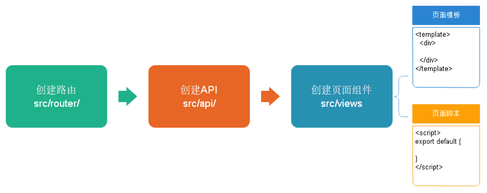

es6

vue

axios

element-ui


# JavaScript

## 事件

### onload

onload事件是浏览器解析完页面之后就会自动触发的事件

```javascript
// onload事件动态注册。是固定写法
window.onload = function () {
    alert("动态注册的onload事件");
}
```

### onclick点击事件

```javascript
// 动态注册onclick事件
window.onload = function () {
    // 1 获取标签对象
    /*
    * document 是JavaScript语言提供的一个对象（文档）<br/>
    * get           获取
    * Element       元素（就是标签）
    * By            通过。。   由。。经。。。
    * Id            id属性
    *
    * getElementById通过id属性获取标签对象
    **/
    document.getElementById("btn01").onclick = function () {
        alert("动态注册的onclick事件");
    }
}
```

### onblur失去焦点事件

```javascript
// 动态注册 onblur事件
window.onload = function () {
    //1 获取标签对象
   var passwordObj = document.getElementById("password");
   // alert(passwordObj);
    //2 通过标签对象.事件名 = function(){};
    passwordObj.onblur = function () {
        console.log("动态注册失去焦点事件");
    }
}
```

### onchange发生改变事件

```javascript
window.onload = function () {
    //1 获取标签对象
    var selObj = document.getElementById("sel01");
    // alert( selObj );
    //2 通过标签对象.事件名 = function(){}
    selObj.onchange = function () {
        alert("已经改变了");
    }
}
```

### onsubmit提交事件

```javascript
window.onload = function () {
    //1 获取标签对象
    var formObj = document.getElementById("form01");
    //2 通过标签对象.事件名 = function(){}
    formObj.onsubmit = function () {
        // 要验证所有表单项是否合法，如果，有一个不合法就阻止表单提交,
        // return false阻止提交
        alert("动态注册表单提交事件----发现不合法");
        return false;
    }
}
```

```html
<form action="http://localhost:8080" id="form01">
    <input type="submit" value="动态注册"/>
</form>
```


# ECMAScript 6

ECMAScript 6.0(简称 ES6)是 JavaScript 语言的下一代标准（规范）

## 基本语法

### let 声明变量

```javascript
// var 声明的变量没有局部作用域
// let 声明的变量  有局部作用域
{
    var a = 1;
    let b = 2;
}
console.log(a)	// 0
console.log(b)  // b is not defined;在代码块外部里，就不是局部了
```

```javascript
// var 可以声明多次
// let 只能声明一次
var m = 1;
var m = 2;
let n = 10;
let n = 20;  
console.log(m) // 2
console.log(n) //'n' has already been declared
```


### const 声明常量（只读变量）

```javascript
// 1、声明之后不允许改变    
const PI = "3.1415926"
PI = 3     // TypeError: Assignment to constant variable.
// 2、一但声明必须初始化，否则会报错
const MY_AGE  // Missing initializer in const declaration

```


### 解构赋值

解构赋值是对赋值运算符的扩展。

他是一种针对数组或者对象进行模式匹配，然后对其中的变量进行赋值。

```javascript
//1、数组解构
// 传统
let a = 1, b = 2, c = 3
//console.log(a, b, c)
// ES6
let [x, y, z] = [1, 2, 3]
//console.log(x, y, z)

```

```javascript
//2、对象解构(取到对象中的属性值)
let user = {name: 'Helen', age: 18}
// 传统
let name1 = user.name
let age1 = user.age
console.log(name1, age1)
// ES6
// 将user中对应的属性赋值给name和age
let { name, age } =  user  
//注意：结构的变量必须是user中的属性
console.log(name, age)

```


### 模板字符串

模板字符串相当于加强版的字符串，用反引号 `，除了作为普通字符串，还可以用来定义多行字符串，还可以在字符串中加入变量和表达式。

```javascript
//字符串插入变量和表达式。变量名写在 ${} 中，${} 中可以放入 JavaScript 表达式。
let name = "lucy"
let age = 20
let info = `My name is ${name} ,I am ${age+1}`
// My name is lucy, I am 21
let info = `My name is ${name} ,
I am ${age+1}`
// My name is lucy, 
// I am 21
console.log(info)

```


### 声明对象

```javascript
// 传统方式定义对象
const name = "lucy"
const age = 20
const user1 = {name:name,age:age}
// console.log(user1)
// es6
const user2 = {name,age}
console.log(user2)

```


### 对象拓展运算符

拓展运算符（...）用于取出参数对象所有可遍历属性然后拷贝到当前对象。

```javascript
//对象复制
let person1 = {name: "Amy", age: 15}
let someone1 = { ...person1}
// console.log(someone1)
// person1里的内容到someone1
// = 只是引用相同，...只是单纯的属性值复制

//对象合并
let age = {age: 15}
let name = {name: "Amy"}
let person2 = {...age, ...name}
console.log(person2)

```


### 箭头函数

参数 => 函数体

箭头函数多用于匿名函数的定义

```javascript
//传统方式定义函数
var f1 = function(a) {
    return a
}
//console.log(f1(3))

//es6使用箭头函数定义
//参数 => 函数体
var f2 = a => a
//console.log(f2(4))

```

```javascript
// 当箭头函数没有参数或者有多个参数，要用 () 括起来。
// 当箭头函数函数体有多行语句，用 {} 包裹起来，表示代码块，
// 当只有一行语句，并且需要返回结果时，可以省略 {} , 结果会自动返回。
var f3 = function(m,n) {
    return m+n
}
//es6 
var f4 = (m,n) => m+n
console.log(f4(4,5))

```


# [Vue](./Vue.md)


# Axios

## Ajax : 异步的 JavaScript and XML

**目的**： 用来发送**异步的请求**，然后当服务器给我响应的时候再进行回调操作

好处：**局部刷新**：降低服务器负担、减轻浏览器压力、减轻网络带宽压力

开发步骤：

1) 创建XMLHttpRequest
2) 调用open进行设置："GET" , URL , true
3) 绑定状态改变时执行的回调函数 - onreadystatechange
4) 发送请求 - send()
5) 编写回调函数，在回调函数中，我们只对XMLHttpRequest的readystate为4并且status为200的时候感兴趣

```
0: (Uninitialized) the send( ) method has not yet been invoked.
1: (Loading) the send( ) method has been invoked, request in progress.
2: (Loaded) the send( ) method has completed, entire response received.
3: (Interactive) the response is being parsed.
4: (Completed) the response has been parsed, is ready for harvesting.
```

```
0 － （未初始化）还没有调用send()方法
1 － （载入）已调用send()方法，正在发送请求
2 － （载入完成）send()方法执行完成，已经接收到全部响应内容
3 － （交互）正在解析响应内容
4 － （完成）响应内容解析完成，可以在客户端调用了
```


## Axios是Ajax的一个框架,简化Ajax操作

Axios执行Ajax操作的步骤：

### 1、添加并引入axios的js文件

### 2-1、客户端向服务器端异步发送普通参数值

基本格式： 

```
1、
axios().then().catch()
2、
get是提交方式
axios.get("请求路径").then().catch() 
```


示例：
```javascript
axios({
    method:"POST",
    url:"....",
    params:{
        uname:"lina",
        pwd:"ok"
    }
})
	.then(function(value){})          
	// 成功响应时执行的回调        
	// value.data可以获取到服务器响应内容
	.catch(function(reason){});       
	// 有异常时执行的回调          
	// reason.response.data可以获取到响应的内容
	// reason.message / reason.stack 可以查看错误的信息
```


### 2-2、客户端向服务器发送 JSON 格式的数据

```
XML格式表示两个学员信息的代码如下：
<students>
  <student sid="s001">
      <sname>jim</sname>
      <age>18</age>
  </student>
  <student sid="s002">
      <sname>tom</sname>
      <age>19</age>
  </student>
</students>

JSON格式表示两个学员信息的代码如下：
[{sid:"s001",age:18},{sid:"s002",age:19}]

```

 

> 客户端中params需要修改成：  data:  
>
> 不用json时是params


```javascript
// 演示Axios发送异步请求给服务器端，服务器响应json格式的数据给客户端
window.onload=function(){
    var vue = new Vue({
        "el":"#div0",
        data:{
            uname:"lina",
            pwd:"ok"
        },
        methods:{
            axios03:function(){
                axios({
                    method:"POST",
                    url:"axios03.do",
                    data:{
                        uname:vue.uname,
                        pwd:vue.pwd
                    }
                })
                .then(value => {
                    var data = value.data;
                    // data对应的数据：
                    // {uname:"神经病",pwd:"123123"}
                    vue.uname=data.uname;
                    vue.pwd=data.pwd;

                    // 此处value中的data返回的是 js object，因此可以直接点出属性
                    // 如果我们获取的是一个字符串：  
                    // "{uname:\"神经病\",pwd:\"123123\"}"

                    // js语言中 也有字符串和js对象之间互转的API
                    // string JSON.stringify(object)     object->string
                    // object JSON.parse(string)         string->object
                })
                .catch(reason => {
                    console.log(reason);
                });
            }
        }
    });
}
    
```


# element-ui

element-ui 是饿了么前端出品的基于 Vue.js的 后台组件库，方便程序员进行页面快速布局和构建

官网： http://element-cn.eleme.io/#/zh-CN

使用的时候在官网中查找就可以


# Node.js

1、javascript 运行环境

2、模拟服务端效果

### nvm

Node 的版本管理工具

```shell
nvm on       #启用版本管理
nvm off      #禁用版本管理

#查看本地 Node 版本
nvm ls        
#查看官网 Node 版本
nvm ls-remote   
#查看官网 Node LTS 版本
nvm ls-remote --lts     

#显示当前的版本
nvm current             
#安装指定版本
nvm install 10.14.2     
#卸载指定版本
nvm uninstall 10.14.2   
#使用指定版本
nvm use 10.14.2        

#设置默认使用版本
nvm alias default 10.14.2  
```


### BFF

即 Backend For Frontend（服务于前端的后端），通俗的说是一个专门用于为前端业务提供数据的后端程序

Node.js 可以将后台数据进行自由组装，然后传给前端


官网：https://nodejs.org/en/

中文网：http://nodejs.cn/


## npm 包管理器

Node.js的包管理工具，相当于前端的Maven

不需要额外安装，安装nodejs的时候附带

```shell
#建立一个空文件夹，在命令提示符进入该文件夹  执行命令初始化
npm init
#按照提示输入相关信息，如果是用默认值则直接回车即可。
#name: 项目名称
#version: 项目版本号
#description: 项目描述
#keywords: {Array}关键词，便于用户搜索到我们的项目

#最后会生成package.json文件，这个是包的配置文件，相当于maven的pom.xml

#我们之后也可以根据需要进行修改。
#如果想直接生成 package.json 文件，那么可以使用命令
npm init -y

```

### 修改 npm 镜像

```shell
#经过下面的配置，以后所有的 npm install 都会经过淘宝的镜像地址下载
npm config set registry https://registry.npm.taobao.org 
#查看npm配置信息
npm config list

```


### Install 基本命令

```
npm install 依赖名
```

根据配置文件下载依赖

```shell
#npm管理的项目在备份和传输的时候一般不携带node_modules文件夹
#安装会自动在项目目录下添加 package-lock.json文件，这个文件帮助锁定安装包的版本
npm install 
#根据package.json中的配置下载依赖，初始化项目

```


# 模块化开发

文件之间方法的调用

01.js 定义两个方法

02.js 调用01.js中的两个方法

```javascript
// 01.js
export default {
    list() {
        console.log('list...')
    },
    save() {
        console.log('save...')
    }
}
```


```javascript
// 02.js
// user是给文件起的别名
import user from "./01.js"
user.list()
user.save()
```


### Babel

> ES6的某些高级语法在浏览器环境甚至是Node.js环境中无法执行。
>
> Babel是一个广泛使用的转码器，可以将ES6代码转为ES5代码，从而在现有环境执行执行。
>
> **ES6的模块化无法在Node.js中执行，需要用Babel编辑成ES5后再执行。**


```
npm install -g babel-cli
#查看是否安装成功
babel --version

```


#### 初始化项目

#### 配置.babelrc

Babel的配置文件是.babelrc，存放在项目的根目录下，该文件用来设置转码规则和插件，presets字段设定转码规则

```json
{
 "presets": ["es2015"],
 "plugins": []
}

```


#### 安装转码器

在项目根目录下安装

```
npm install -D babel-preset-es2015
```


#### 转码

```
# 整个目录转码
# --out-dir 或 -d 参数指定输出目录
babel src -d dist
# 将src转码到dist目录下
```


#### 写法二

```javascript
export function list() {
	console.log('list...')
}
export function save() {
	console.log('save...')
}

```

```javascript
import {list, save} from"./01.js"
list()
save()

```


# Webpack

打包工具，合并静态资源，j s、css

安装

```
npm install -g webpack webpack-cli
```


# vue-element-admin

vue-element-admin是基于element-ui 的一套后台管理系统集成方案。

GitHub地址：https://github.com/PanJiaChen/vue-element-admin

项目在线预览：https://panjiachen.gitee.io/vue-element-admin

```
npm install --registry=https://registry.npm.taobao.org
```

解压后复制到工作区，然后npm install

清空缓存

```
npm cache clean --force
```


由于版本过高引起的下载失败可以尝试

```
降级安装，忽略编译过程
npm i --legacy-peer-deps --ignore-scripts
```


Fail to compile解决方法

```
先卸载再安装
npm uninstall node-sass
npm install node-sass
```


- Network Error

后端接口问题


# 模板框架的开发过程



## 路由分析

入口文件 src/main.js 中调用路由

- 添加路由

	路由模块 src/router/index.js 中定义路由

- 设置跳转页面路径（加载Vue组件）

```js
component: () => import('@/views/table/index'),
```

table/index.vue 中引入了 api/table.js

- 在api文件夹中创建js文件，定义接口路径

```js
url: '/table/list',
```

- 在页面引入is文件，使用axios进行接口调用，把接口返回数据在页面显示


```vue
// views中的vue的格式
<template>
    <div class="app-container">
        医院设置的列表
    </div>
</template>

<script>
// 引入接口定义的js文件
import hospset from '@/api/hospset'

export default {
    // 定义变量和初始值
    data() {
        return {

        }
    },
    created() { // 在页面渲染之前执行
        // 一般调用methods定义的方法，得到数据

    },
    methods: { // 定义方法，进行请求接口调用

    }
    
}
</script>
```


- config/dev.env.js 中

```js
BASE_API: '"http://localhost:8201"',
```

BASE_API 改成需要访问的后端地址


- 路由跳转

```js
back() {
    this.$router.push({ path: '/hospSet/hosp/list' })
}
```

- 获取路由中的信息

```js
const id = this.$route.params.id
```


## 组件重用问题

**问题**：vue-router导航切换时，如果两个路由都渲染同个组件，

组件的生命周期方法（created或者mounted）不会再被调用, 组件会被重用，显示上一个路由渲染出来的组件

**解决方案**：可以简单的在 router-view上加上一个唯一的key，来保证路由切换时都会重新触发生命周期方法，确保组件被重新初始化。

修改 src/views/layout/components/AppMain.vue 文件如下：

```vue
<router-view:key="key"></router-view>
```


```js
computed: {
key() {
returnthis.$route.name !== undefined? this.$route.name + +newDate(): this.$route + +newDate()
    }
 }

```


**方案2**

vue监听

```js
created() {
    this.init()
},
watch: {
    $route(to, from) {
        // 路由发生变化，方法就会执行
        this.init()
    }
},
```


