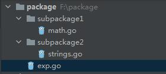

# 参考文档

[网址](https://github.com/jincheng9/golang-cheat-sheet-cn)

# Go的程序结构

* 包声明

* 引入包

* 函数

* 变量

* 语句和表达式

* 注释

	```go
	// hello.go
	// package declaration
	package main
	
	// import package
	import "fmt"
	
	// function
	func add(a, b int) int {
	  return a+b
	}
	// global variable
	var g int = 100
	
	func main() {
	  a, b := 1, 2
	  res := add(a, b)
	  fmt.Println("a=", a, "b=", b, "a+b=", res)
	  fmt.Println("g=", g)
	  fmt.Println("hello world!")
	}
	```

	

## 注意事项

* func main()是程序开始执行的函数(但是如果有func init()函数，则会先执行init函数，再执行main函数)

* 源程序文件所在的目录名称与包名称没有直接关系，不需要一致。不过通常保持一致，这符合Go的编码规范。

* 源程序文件名与包名没有直接关系，不需要将源程序文件名与文件开头申明的包名保持一样，通常这2者是不一样的。

* 只有在源程序文件开头声明package main，并且有func main()定义，才能生成可执行程序，否则go run file.go会报错，报错内容:

	```package command-line-arguments is not a main packagego
	package command-line-arguments is not a main package
	和
	runtime.main_main·f: function main is undeclared in the main package
	```

## 编译和运行

Go是编译型语言

* 编译+运行分步执行 
	* go build hello.go
	* ./hello
* 编译+运行一步到位
	* go run hello.go 


# 包package和模块Module

## package定义

package本质上就是一个目录，目录里包含有一个或者多个Go源程序文件，或者package。也就是说package里面还可以嵌套包含子package。

每个Go源文件都属于一个package，在源文件开头指定package名称

```go
package package_name
```

package的代码结构示例如下：



package里的变量、函数、结构体、方法等如果要被本package外的程序引用，需要在命名的时候首字母大写。

如果首字母小写，那就只能在同一个package里面被使用。

**注意**：这里说的是同一个package，不是同一个文件。同一个package下，如果有多个源程序文件是声明的该package，那这些源程序文件里的变量、函数、结构体等，即使不是首字母大写，也可以互相跨文件直接调用，不用额外import。

package的使用分为4类情况：

* 使用Go标准库自带的package，比如fmt。
* 使用go get获取到的第三方package/module
* 使用项目内部的package
* 使用其它项目的package/module


## import语法示例

### 普通

```go
import (
	"fmt"                           // 标准库
	"sync/atomic"                   // 标准库sync的atomic子package
	"package1"                      // 自开发的package
	"package2/package21"            // 自开发package，嵌套子package
	"package2/package22"            // 自开发package，嵌套子package
	"package3/package31/package311" // 自开发package，多重嵌套
)
```

使用import路径里面定义的**package名称**来访问package里的方法，结构体等，而不是路径名称。

举个例子，假设上面import的路径package2/package21这个目录下的Go源程序文件开头声明的package名称是realpackage，那访问这个package里的方法，结构体等要用realpackage.xxx来访问，而不是用package21.xxx来访问。

一句话总结：**import的是路径，访问用package名称**。最佳实践就是让两者保持一致。

### 别名

```go
import (
    "fmt"
    newName "package2/package21"
)
```

可以用别名newName来访问package里的成员，newName.xxx。这个在包名很长或者包名有重复的时候可以用到。

### 点操作

```go
import (
    "fmt"
    . "package2/package21"
)
```

` . `可以让后面的package里的成员注册到当前包的上下文，这样就可以直接调用成员名，不需要加包前缀了。

比如以前要用package21.Hello()来调用package21这个包里的函数Hello，用了点操作后，可以直接调用函数Hello()，前面不用跟package名称。


### 下划线

```go
import (
    "fmt"
    _ "package2/package21"
)
```

下划线` _ `的效果：只会执行包里各个源程序文件的init方法，没法调用包里的成员。


## Go如何寻找import的package

在代码里import某个package的时候，Go是如何去寻找对应的package呢？这个和Go环境变量GO111MODULE有关系。GO111MODULE的值可以通过如下命令查到

```go
go env | grep GO111MODULE
```

on表示开启，off表示关闭。GO111MODULE是从Go 1.11开始引入，在随后的Go版本中Go Modules的行为有一些变化，具体可以参考[GO111MODULE and Go Modules](https://maelvls.dev/go111module-everywhere/#go111module-with-go-116)。

下面以Go1.16及以上版本详细讲下GO111MODULE关闭和开启的情况下，Go是如何寻找import的package的。

### 关闭GO111MODULE

* 先从$GOROOT/src里找。$GOROOT是Go的安装路径，$GOROOT/src是Go标准库存放的路径，比如fmt, strings等package都存放在$GOROOT/src里。$GOROOT的路径可以通过下面的命令查看到：

	```go
	go env | grep ROOT // linux or mac
	go env | findstr ROOT // windows
	```

* 如果从$GOROOT/src找不到，再从$GOPATH/src里找。$GOPATH是安装Go后就会有的一个环境变量，Linux和Mac的默认路径是/Users/用户名/go，WIndows默认路径是C:/Users/用户名/go

	```go
	go env | grep PATH // linux or mac
	go env | findstr PATH // windows
	```

	在Go 1.11之前，还没有Go Modules，如果想import一些自己开发的package，被import的package必须建在$GOPATH/src路径下。一般而言，一个工程项目一定会有自己写的若干个package，因此这也导致工程项目本身也通常建在了$GOPATH/src路径下。

### 开启GO111MODULE

Go 1.11开始，有了Go Modules，工程项目可以建在任何地方，代码在import某个package的时候，会按照如下顺序寻找package：

* 先从$GOROOT/src/路径找。(Go标准库会在这个路径找到)

* 再从$GOPATH/pkg/mod/路径找。(Go第三方库会在这个路径找到)

* 如果都找不到，再看当前项目有没有go.mod文件，有的话就从go.mod文件里指定的模块所在路径往下找。如果没有go.mod文件，那就直接提示package xxx is not in GOROOT。(自己开发的本地库可以通过这个方式找到)

	

官方推荐使用Go Modules，从Go1.16版本开始，GO111MODULE环境变量默认开启为on模式。


## 使用示例

### 不开启GO111MODULES时import package

1. 项目建在$GOPATH/src下面
2. import package的时候路径从$GOPATH/src往下找

使用说明参考[gopath package demo](https://github.com/jincheng9/go-tutorial/tree/main/workspace/lesson27/gopath/)


### 开启GO111MODULES时import本项目里的package

1. 项目可以建在任何地方

2. 在项目所在根目录创建go.mod文件, module_name是模块名称

	```go
	go mod init module_name
	```

3. import项目本地的package时指定go.mod文件里的模块名称

	比如module_name叫project，在这个模块里，main.go使用了本项目里的util包，那在main.go里按照如下格式import这个package

	```go
	import "project/util" // project是模块名称, util是这个模块下的本地package
	```

使用说明参考[module package demo](https://github.com/jincheng9/go-tutorial/tree/main/workspace/lesson27/module)


### 开启GO111MODULES时import第三方开发的Module

1. 项目可以建在任何地方

2. 在项目所在根目录创建go.mod文件

	```go
	go mod init module_name
	```

3. 下载所需第三方Module，比如gin

  ```go
  go get -u github.com/gin-gonic/gin
  // 指定特定分支的版本
  go get -u github.com/gin-gonic/gin@branchName
  ```

4. 代码里import对应的Module

	```go
	import "github.com/gin-gonic/gin"
	```

**tips**: `go mod tidy`命令可以更新go.mod里的依赖内容，比如go.mod里少写了依赖的module，就可以执行该命令自动更新go.mod，在go.mod所在目录执行如下命令即可：

```go
go mod tidy
```


###  开启GO111MODULES时import本地的Module

首先，Go官方并不推荐这种用法。import本地的module需要借助`replace`指令来实现。

举个例子，本地有2个模块`module1`和`module2`，`module1`要使用`module2`里的`Add`函数，目录结构为：

```
replace_module_demo
|
|------module1
|        |---main.go
|        |---go.mod        
|------module2
|        |---func.go
|        |---go.mod
```

`module1`要使用`module2`里的`Add`函数，需要做2个事情：

* 在`module1`代码里添加对 `module2`的import。具体表现为下面的代码示例里module1/main.go里import了`module2`。
* 在`module1`的`go.mod`里添加`require`和`replace`指令，把对`module2`的import通过`replace`指令指向本地的`module2`路径。具体参考module1/go.mod里的require和replace指令。

代码如下：

module1/main.go

```go
package main

import (
	"fmt"
	// 模块module1要使用本地模块module2里的Add函数
	// 这里被import的本地模块的名称要和module2/go.mod里保持一致
	"module2"
)

func main() {
	a := 1
	b := 2
	sum := module2.Add(a, b)
	fmt.Printf("sum of %d and %d is %d\n", a, b, sum)
}
```

module1/go.mod，**注意require后面的module必须指定版本号**，版本号以 `v`开头，后面是由`.`分隔的3个整数组成，比如`v1.0.0`。3个整数从左往右，分别表示大版本号(major version)，小版本号(minor version)和补丁版本(patch version)。

```go
module module1

go 1.16

require module2 v1.0.0

replace module2 => ../module2

```

module2/func.go

```go
package module2

func Add(a, b int) int {
	return a + b
}
```

module2/go.mod

```go
module module2

go 1.16
```

在module1路径下执行`go run main.go`，结果为

```markdown
sum of 1 and 2 is 3
```

代码开源地址：[demo for using local module](https://github.com/jincheng9/go-tutorial/tree/main/workspace/lesson27/replace_module_demo)


## init函数

init函数没有参数，没有返回值。

* 一个package里可以有多个init函数(分布在单个源程序文件中或者多个源程序文件中)，并且按照它们呈现给编译器的顺序被调用。
* init函数不能被显式调用，在main()函数执行之前，自动被调用
* 同一个pacakge里的init函数调用顺序不确定
* 不同package的init函数，根据package import的依赖关系来决定调用顺序，比如package A里import了package B，那package B的init()函数就会比package A的init函数先调用。
* **无论package被import多少次，package里的init函数只会执行一次**

## replace

replace顾名思义，就是用新的package去替换另一个package，他们可以是不同的package，也可以是同一个package的不同版本。

```shell
go mod edit -replace=old[@v]=new[@v]
```


## 注意事项

* package目录名和package目录下的Go源程序文件开头声明的包名可以不一样，不过一般还是写成一样，避免出错。

* 禁止循环导入package。

* Go Module版本号规则：[https://go.dev/ref/mod#versions](https://go.dev/ref/mod#versions)，版本号不符合规则就是非法版本，会导致编译失败。

	

## References

* https://www.callicoder.com/golang-packages/
* https://www.liwenzhou.com/posts/Go/import_local_package_in_go_module/
* https://maelvls.dev/go111module-everywhere/#go111module-with-go-116
* https://go.dev/ref/mod#go-mod-file-replace
* https://go.dev/ref/mod#versions


# 基础数据类型

## 数字

* 整数：int, uint8, uint16, uint32, uint64, int8, int16, int32, int64

* 浮点数：float32, float64

* 复数：

	* complex64：实部和虚部都是float32类型的值

		```go
		var v complex64 = 1 + 0.5i
		```

	* complex128：实部和虚部都是float64类型的值

		```go
		var v complex128 = 1 + 0.5i
		```

	* **注意**：虚部为1的情况，1不能省略，否则编译报错

		```go
		var v complex64 = 1 + i // compile error: undefined i
		var v complex64 = 1 + 1i // correct
		```

		

## 字符串：string

* len(str)函数可以获取字符串长度

	```go
	package main
	
	import "fmt"
	
	func main() {
	    str := "abcdgfg"
	    fmt.Println(len(str)) // 7
	}
	```

* **注意**：string是immutable的，不能在初始化string变量后，修改string里的值，除非对string变量重新赋值

	```go
	package main
	
	import "fmt"
	
	func main() {
	    str := "abc"
	    str = "def" // ok
	    /* 下面的就不行，编译报错：cannot assign to str[0] (strings are immutable)
	    str[0] = "d"
	    */
	    fmt.Println(str)
	}
	```

* 字符串里字符的访问可以通过str[index]下标索引或者range迭代的方式进行访问

	```go
	package main
	
	import "fmt"
	
	func main() {
	    str := "abc"
	    /*下标访问*/
	    size := len(str)
	    for i:=0; i<size; i++ {
	        fmt.Printf("%d ", str[i])
	    }
	    fmt.Println()
	    
	    /*range迭代访问*/
	    for _, value := range str {
	        fmt.Printf("%d ", value)
	    }
	    fmt.Println()
	}
	```

* 不能对string里的某个字符取地址：如果s[i]是字符串s里的第i个字符，那&s[i]这种方式是非法的

	```go
	// string3.go
	package main
	
	import "fmt"
	
	func main() {
		str := "abc"
		/*
		the following code has compile error:
		cannot take the address of str[0]
		*/
		fmt.Println(&str[0])
	}
	```

* string可以使用 `:` 来做字符串截取

	**注意**：这里和[切片slice](../lesson13/readme.md)的截取有区别

	* 字符串截取后赋值给新变量，对新变量的修改不会影响原字符串的值
	* 切片截取后复制给新变量，对新变量的修改会影响原切片的值

	```go
	// string4.go
	package main
	
	import "fmt"
	
	func strTest() {
		s := "abc"
		fmt.Println(len(s)) // 3
		s1 := s[:]
		s2 := s[:1]
		s3 := s[0:]
		s4 := s[0:2]
		fmt.Println(s, s1, s2, s3, s4) // abc abc a abc ab
	}
	
	func main() {
		strTest()
	}
	```

* string可以用`+`做字符串拼接

	```go
	// string5.go
	package main
	
	import "fmt"
	
	func main() {
		a := "ch"
		b := "ina"
		c := a + b
		fmt.Println(c) // china
	}
	```

* string的更多用法可以参考：https://yourbasic.org/golang/string-functions-reference-cheat-sheet/

## bool

值只能为`true`或`false`。


## 其它数字类型

* byte：等价于uint8，数据范围0-255，定义的时候超过这个范围会编译报错

* rune：等价于int32，数据范围-2147483648-2147483647

	* 字符串里的每一个字符的类型就是rune类型，或者说int32类型

* uint：在32位机器上等价于uint32，在64位机器上等价于uint64

* uintptr: 无符号整数，是内存地址的十进制整数表示形式，应用代码一般用不到（https://stackoverflow.com/questions/59042646/whats-the-difference-between-uint-and-uintptr-in-golang）

* reflect包的`TypeOf`函数或者`fmt.Printf`的`%T`可以用来获取变量的类型

	```go
	var b byte = 10
	var c = 'a'
	fmt.Println(reflect.TypeOf(b)) // uint8
	fmt.Println(reflect.TypeOf(c)) // int32
	fmt.Printf("%T\n", c) // int32
	```


## %

| 格  式 | 描  述                                   |
| :----- | :--------------------------------------- |
| %v     | 按值的本来值输出                         |
| %+v    | 在 %v 基础上，对结构体字段名和值进行展开 |
| %#v    | 输出 Go 语言语法格式的值                 |
| %T     | 输出 Go 语言语法格式的类型和值           |
| %%     | 输出 % 本体                              |
| %b     | 整型以二进制方式显示                     |
| %o     | 整型以八进制方式显示                     |
| %d     | 整型以十进制方式显示                     |
| %x     | 整型以十六进制方式显示                   |
| %X     | 整型以十六进制、字母大写方式显示         |
| %U     | Unicode 字符                             |
| %f     | 浮点数                                   |
| %p     | 指针，十六进制方式显示                   |


## References

* https://gfw.go101.org/article/basic-types-and-value-literals.html
* https://www.callicoder.com/golang-basic-types-operators-type-conversion/
* https://yourbasic.org/golang/string-functions-reference-cheat-sheet/


# 变量定义

## 全局变量

函数外定义的变量叫全局变量，以下是全局变量的定义方法。

* 方法1

```go 
var name type = value
```

* 方法2：注意，全局变量如果采用这个方式定义，那不能在全局范围内赋值，只能在函数体内给这个全局变量赋值

```go
var name type // value will be defaulted to 0, false, "" based on the type

/* 如果定义上面的全局变量，就不能紧接着在下一行通过name=value的方式对变量name做赋值，
比如name = 10，会编译报错：
 syntax error: non-declaration statement outside function body
*/
```

* 方法3

```go
var name = value 
```

* 方法4

```go
var (
	v1 int = 10
	v2 bool = true
)
var (
	v5 int   // the value will be defaulted to 0
	v6 bool  // the value will be defaulted to false
)
var (
	v3 = 20
	v4 = false
)
```

* **全局变量允许声明后不使用**，编译不会报错。

	

## 局部变量

函数内定义的变量叫局部变量。

* 和全局变量的定义相比，多了以下定义方法

	* 方法5

	```go
	name := value
	```

	* 方法6

	```go
	var name type
	name = value
	```

* **局部变量定义后必须要被使用，否则编译报错**，报错内容为`declared but not used`。

	

## 多变量定义：

一次声明和定义多个变量

* 全局变量

	* 方法1

		```go
		var a, b, c int = 1, 2, 3
		```

	* 方法2

		```go
		var a, b, c bool
		```

	* 方法3

		```go
		var a, b, c = 1, 2, "str"
		```

* 局部变量：和全局变量相比，多了以下定义方法

	* 方法4

		```go
		var a, b int
		a, b = 1, 2
		
		var c, d int
		c = 10
		d = 20
		```

	* 方法5

		```go
		a, b := 1, 2
		a1, b1 := 1, "str"
		```


## 变量类型及其零值

* 零值：英文叫[zero vaue](https://go.dev/ref/spec#The_zero_value)，没有显式初始化的变量，Go编译器会给一个默认值，也叫零值。

* 数值：所有数值类型的零值都是0

	* 整数，零值是0。byte, rune, uintptr也是整数类型，所以零值也是0。
	* 浮点数，零值是0
	* 复数，零值是0+0i

* bool，零值是false

* 字符串，零值是空串""

* 指针：var a *int，零值是nil

	```go
	num := 100
	var a * int = &num
	```

* 切片：var a []int，零值是nil

	```go
	var a []int = []int{1,2}
	list := [6]int{1,2} //size为6的数组，前面2个元素是1和2，后面的是默认值0
	```

* map：var a map[string] int，零值是nil

	```go
	dict := map[string] int{"a":1, "b":2}
	```

* 函数：var a func(string) int，零值是nil

	```go
	function := func(str string) string {
	  return str
	}
	result := function("hello fans")
	fmt.Println("result=", result)
	```

* channel：var a chan int，通道channel，零值是nil

	```go
	var a chan int = make(chan int)
	var b = make(chan string)
	c := make(chan bool)
	```

* 接口：var a interface_type，接口interface，零值是nil

	```go
	type Animal interface {
	  speak()
	}
	
	type Cat struct {
	  name string
	  age int
	}
	
	func(cat Cat) speak() {
	  fmt.Println("miao...")
	}
	
	// 定义一个接口变量a
	var a Animal = Cat{"gaffe", 1}
	a.speak() // miao...
	```

* 结构体:  var instance StructName，结构体里每个field的零值是对应field的类型的零值

	```go
	type Circle struct {
	  radius float64
	}
	
	var c1 Circle
	c1.radius = 10.00
	```


## References

* https://go.dev/ref/spec#The_zero_value


# 常量与枚举

* 常量定义的时候必须赋值，定义后值不能被修改

* 常量(包括全局常量和局部常量)可以定义后不使用，局部变量定义后必须使用，否则编译报错

* 常量可以用来定义枚举

* iota，特殊常量，可以理解为const语句块里的行索引，值从0开始

* 常量的定义方法

	* 方法1

		```go
		const a int = 10
		const b bool = false
		```

	* 方法2

		```go
		const a = 10
		const b = false
		```

	* 多个常量同时定义

		```go
		const a, b int = 1, 2
		```

	* iota，特殊常量，可以理解为每个独立的const语句块里的行索引

		```go
		const a int = iota // the value of a is 0
		const b = iota // the value of b is still 0
		```

	* 定义枚举方法1

		```go
		const (
		  unknown = 0
		  male = 1
		  female = 2
		)
		```

	* 定义枚举方法2

		```go
		const (
		  unknown = iota // the value of unknown is 0
		  male // the value of male is 1
		  female // the value of female is 2
		)
		const (
		  c1 = iota // the value of c1 is 0
		  c2 = iota // the value of c2 is 1
		  c3 = iota // the value of c3 is 2
		)
		```

	* 注意事项

		* iota的值是const语句块里的行索引，行索引从0开始
		* const语句块里，**如果常量没赋值**，**那它的值和上面的保持一样**，比如下面的例子里class2=0, class6="abc"
		* 某个常量赋值为iota后，紧随其后的常量如果没赋值，那后面常量的值是自动+1，比如下面的例子里，class3的值是iota，该行的行索引是2，所以class3=2， class4常量紧随其后没有赋值，那class4=class3+1=3

		```go
		const (
			class1 = 0
			class2 // class2 = 0
			class3 = iota  //iota is 2, so class3 = 2
			class4 // class4 = 3
			class5 = "abc" 
			class6 // class6 = "abc"
			class7 = iota // class7 is 6
		)
		```

		

# 运算符

## 算术运算符

* 加+, 减-, 乘*,除 /, 模%, 自增++, 自减--

* go里的除法/和C++里一样，如果是2个整数相除，结果还是整数

	```go
	fmt.Println("6/5=", 6/5) // 结果是1
	```

## 关系运算符

* 相等==
* 不等!=
* 大于>，大于等于>=
* 小于<，小于等于<=

## 逻辑运算符

* 与&&
* 或||
* 非!

## 位运算符

* 按位与`&`
* 按位或`|`
* 按位异或`^`
* 左移`<<`
* 右移`>>`
* 取反`^`

## 赋值运算符

* =, +=, -=, *=, /=, %=, <<=, >>=, &=, ^=, |=

## 其它运算符

* 返回变量的内存地址&
	* &a给出变量a的内存地址
* 指针操作`*`，取指针指向的变量的值
	* *a中a是一个指针类型的变量

* Go没有三目运算符`?:`

## 运算符优先级

参考：https://go.dev/ref/spec#Operator_precedence

## References

* https://github.com/jincheng9/golang-cheat-sheet-cn#%E6%93%8D%E4%BD%9C%E7%AC%A6

* https://go.dev/ref/spec#Operator_precedence

	

# 条件语句

## If

布尔表达式可以不加括号

* if/else

	```go
	if expression {
	  do sth1
	} else {
	  do sth2
	}
	```

* if/else if/else

	```go
	if expression1 {
	  do sth1
	} else if expression2 {
	  do sth2
	} else {
	  do sth3
	}
	```

* if/else嵌套

	```go
	if expression1 {
	  if expression11 {
	    do sth11
	  } else {
	    do sth12
	  }
	} else if expression2 {
	  do sth2
	} else {
	  do sth3
	}
	```

## switch

* 每一个case分支都是唯一的，从上往下逐一判断，直到匹配为止。如果某些case分支条件重复了，编译会报错

* 默认情况下每个case分支最后自带break效果，匹配成功就不会执行其它case。

	如果需要执行后面的case，可以使用**fallthrough**。

	使用 fallthrough 会强制执行紧接着的下一个 case 语句，不过fallthrough **不会去分析紧接着的下一条 case 的表达式结果是否满足条件**，而是**直接执行case里的语句块**。

	```go
	// Foo prints and returns n.
	func Foo(n int) int {
	    fmt.Println(n)
	    return n
	}
	
	func main() {
	    switch Foo(2) {
	    case Foo(1), Foo(2), Foo(3):
	        fmt.Println("First case")
	        fallthrough
	    case Foo(4):
	        fmt.Println("Second case")
	    }
	}
	```

	比如上面的例子，执行结果如下，并不会去执行`fallthrough`的下一个case分支里的表达式`Foo(4)`

	```markdown
	2
	1
	2
	First case
	Second case
	```

* switch使用方法1

	```go
	switch variable {
	  case value1:
	    do sth1
	  case value2:
	    do sth2
	  case value3, value4: // 可以匹配多个值，只要一个满足条件即可
	    do sth34
	  case value5:
	    do sth5
	  default:
	  	do sth
	}
	```

* switch使用方法2

	```go
	switch os := runtime.GOOS; os {
		case "darwin":
			fmt.Println("OS X.")
		case "linux":
			fmt.Println("Linux.")
		default:
			// freebsd, openbsd,
			// plan9, windows...
			fmt.Printf("%s.\n", os)
	}
	
	// 上面的写法和这个等价
	os := runtime.GOOS
	switch os {
		case "darwin":
			fmt.Println("OS X.")
		case "linux":
			fmt.Println("Linux.")
		default:
			// freebsd, openbsd,
			// plan9, windows...
			fmt.Printf("%s.\n", os)
	}
	```

* switch使用方法3。case分支的每个condition结果必须是一个bool值，要么为true，要么为false

	```go
	switch {
	  case condition1:
	  	do sth1
	  case condition2:
	  	do sth2
	  case condition3, condition4:
	  	do sth34
	  default:
	  	do sth
	}
	```

* switch使用方法4。只适用于`interface`的类型判断，而且`{`要和`switch`在同一行，`{`前面不能有分号`;`

	```go
	package main
	
	import "fmt"
	
	func main() {
		var i interface{} = 10
		switch t := i.(type) {
		case bool:
			fmt.Println("I'm a bool")
		case int:
			fmt.Println("I'm an int")
		default:
			fmt.Printf("Don't know type %T\n", t)
		}
	}
	```

## References

* https://yourbasic.org/golang/switch-statement/


# select语义

## 含义

select语义是和channel绑定在一起使用的，select可以实现从多个channel收发数据。

语法上和switch类似，有case分支和default分支，只不过select的每个case后面跟的是channel的收发操作。

在执行select语句的时候，如果当下那个时间点没有一个case满足条件，就会走default分支。

至多只能有一个 default分支。

如果没有default分支，select语句就会阻塞，直到某一个case满足条件。

如果select里任何case和default分支都没有，就会一直阻塞。

- 如果多个case同时满足，select会随机选一个case执行，其他的不执行。

## 语法

```go
func d() {
	select {
	case ch1 <- data1: // send data to channel
		do sth
	case var_name = <-ch2 : // receive data from channel
		do sth
	case data, ok := <-ch3:
		do sth
	default:
		do sth
	}
}
```

语法上和[switch](../lesson6/readme.md)的一些区别：

* select关键字和后面的{ 之间，不能有表达式或者语句。
* 没有fallthrough语句
* 每个case关键字后面跟的必须是channel的发送或者接收操作
* 允许多个case分支使用相同的channel，case分支后的语句甚至可以重复

## 示例

```go
func b() {
	ch1 := make(chan int, 10)
	ch2 := make(chan int, 10)
	go func() {
		for i:=0; i<10; i++ {
			ch1 <- i
			ch2 <- i
		}
	}()
	for i := 0; i < 10; i++ {
		select {
		case x := <-ch1:
			fmt.Printf("receive %d from channel 1\n", x)
		case y := <-ch2:
			fmt.Printf("receive %d from channel 2\n", y)
		}
	}
}
```

上面的示例里，select语句会for循环执行10次，每次select语句都会随机从channel1或者channel2里接收一个值并打印。可以把[示例代码](./select.go)下载到本地运行看结果。

## References

* https://golang.google.cn/ref/spec#Select_statements
* https://gobyexample.com/select
* https://go101.org/article/channel.html
* https://medium.com/a-journey-with-go/go-ordering-in-select-statements-fd0ff80fd8d6


# 循环控制

## for的4种用法

* 用法1: 类似C++的`for(int i=0; i<100; i++)`

	```go
	for init; condition; post {
	  do sth
	}
	
	for init; condition; {
	  do sth
	}
	
	for ; condition; { // 类似下面的用法2
	  do sth
	}
	```

* 用法2：类似C++的while循环

	```go
	for condition {
	  do sth
	}
	```

* 用法3: 死循环，类似C++的`for(;;)`

	```go
	for {
	  do sth
	}
	```

* 用法4: For-each range循环, 类似python的` for k,v in dict.items()`

	可以对slice，map，数组和字符串等数据类型进行For-each迭代循环

	```go
	for key, value := range map1 { // 遍历map
	  do sth
	}
	for index, value := range list { // 遍历数组
	  do sth
	}
	for index, character := range str { // 遍历字符串
	  do sth
	}
	```

* break：跳出当前for循环或者switch控制逻辑

* continue：结束当前循环，继续下一轮for循环

## goto：

类似C++里的goto

* 语法

```go
label: statement
goto label
```

* 代码示例1

```go
package main

import "fmt"

func main() {
	LOOP: 
		println("Enter your age:")
		var age int
		_, err := fmt.Scan(&age) // 接受控制台输入
		if err != nil {
			println("error:", err)
			goto LOOP
		}
		if age < 18 {
			println("You are not eligible to vote!")
			goto LOOP
		} else {
			println("You are eligible to vote!")
		}
		println("all finish")
}
```


## break和label结合

break和label结合使用，可以跳出二重或者多重for循环。

例1：`break A`直接跳出整个外层for循环，所以下面的例子只执行`i=0, j=0`这一次循环。

```go
package main
import "fmt"

// 最终输出 0 0 Hello, 世界
func main() {
A:
	for i := 0; i < 2; i++ {
		for j := 0; i < 2; j++ {
			print(i, " ", j, " ")
			break A
		}

	}
	fmt.Println("Hello, 世界")
}
```

例2：下面的例子，break只能跳出位于里层的for循环，会执行`i=0, j=0`和`i=1, j=0`这2次循环。

```go
package main

import "fmt"
// 输出 0 0 1 0 Hello, 世界
func main() {
	for i := 0; i < 2; i++ {
		for j := 0; i < 2; j++ {
			print(i, " ", j, " ")
			break
		}

	}
	fmt.Println("Hello, 世界")
}
```


# 函数，闭包和方法

## 函数定义

```go
func name([parameter list]) [return_types] {
  do sth
}
```


### 无参数

```go
func name() int {
  do sth
}
```


### 无返回值

```go
func name(a int) {
  do sth
}
```


### 返回1个值

```go
func name(a int) int {
  do sth
}
```


### 返回多个值

```go
func name(a int) (int, string) {
  do sth
}
func name(a, b int) (int, string) {
  do sth
}
func name(a int, b string)(int, string) {
  do sth
}
func name(a, b int, c, d string) (int, string) {
  do sth
}
```

### 给返回值命名

```go
// func2.go
package main

import "fmt"

/*
函数add的返回值有2个，类型是int，标识符分别是c和d
可以在函数体内直接给c和d赋值，return后面可以带，也可以不带返回值
*/
func addAndSub(a int, b int) (c int, d int) {
	c = a + b
	d = a - b
	return // 这一行写为 return c, d 也可以
}

func main() {
	a1, b1 := 1, 2
	c1, d1 := addAndSub(a1, b1)
	/*输出结果是：3 -1*/
	fmt.Println(c1, d1)
}
```

**注意**：

* 函数的参数列表不允许部分形参有命名，部分形参没命名，如果违背这个原则，就会报如下的编译错误。
* 函数的返回值列表不允许部分返回值变量有命名，部分返回值变量没命名，如果违背这个原则，就会报如下的编译错误。

```bash
syntax error: mixed named and unnamed function parameters
```

一句话总结：要么都不命名，要么都命名(都命名的情况下，允许形参或者返回值变量使用`_`作为命名)。


## nil函数

函数也是一种类型，函数变量的默认值是`nil`，执行`nil`函数会引发panic

```go
var f func()
// f是一个函数类型，值是nil
// 编译正常，运行报错panic: runtime error: invalid memory address or nil pointer dereference
f() 
```


## 函数参数传递

**Go里的函数传参只有值传递这一种方式**：和C++里的传值一样，参加下例里的swap

```go
package main


func add(a, b int, c, d string) (int, string) {
	return a+b, c+d
}

func swap(a int, b int) {
	println("[func|swap]a=", a, "b=", b)
	a, b = b, a
	println("[func|swap]a=", a, "b=", b)
}

func swapRef(pa *int, pb *int) {
	println("[func|swapRef]a=", *pa, "b=", *pb)
	var temp = *pa
	*pa = *pb
	*pb = temp
	println("[func|swapRef]a=", *pa, "b=", *pb)
}

func main() {
	a, b := 1, 2
	c, d := "c", "d"
	res1, res2 := add(a, b, c, d)
	println("res1=", res1, "res2=", res2)

	println("[func|main]a=", a, "b=", b)
	swap(a, b)
	println("[func|main]a=", a, "b=", b)

	println("[func|main]a=", a, "b=", b)
	swapRef(&a, &b)
	println("[func|main]a=", a, "b=", b)	
}
```

虽然swap函数无法改变外部实参的值，swapRef函数可以改变外部实参的值，但是swap和swapRef函数其实都是值传递，细节区别是：

* swap是直接把变量a和b的值拷贝一份给形参
* swapRef是把变量a和b的地址拷贝一份给形参

所以，要清楚这2个其实都是值传递，Go里的函数传参也只有值传递这一种方式，并没有像C++那样的引用变量和引用传递。

后续学习了Go里的map等变量类型，可以参考这篇文章[Go有引用变量和引用传递么？](../senior/p3)

## 函数高级用法

函数作为其它函数的实参：函数定义后可以作为另一个函数的实参，比如下例的函数realFunc作为函数calValue的实参

```go
package main

import "fmt"
import "math"

// define function getSquareRoot1
func getSquareRoot1(x float64) float64 {
	return math.Sqrt(x)
}

// deffine a function variable
var getSquareRoot2 = func(x float64) float64 {
	return math.Sqrt(x)
}

// define a function type
type callback_func func(int) int


// function calValue accepts a function variable cb as its second argument
func calValue(x int, cb callback_func) int{
	fmt.Println("[func|calValue]")
	return cb(x)
}

func realFunc(x int) int {
	fmt.Println("[func|realFunc]callback function")
	return x*x
}

func main() {
	num := 100.00
	result1 := getSquareRoot1(num)
	result2 := getSquareRoot2(num)
	fmt.Println("result1=", result1)
	fmt.Println("result2=", result2)

	value := 81
	result3 := calValue(value, realFunc) // use function realFunc as argument of calValue
	fmt.Println("result3=", result3)
}
```

### 闭包：匿名函数。顾名思义就是没有函数名。

参考下面的代码示例：

```go
// func3.go
package main

import "fmt"

func main() {
	/*
		定义2个匿名函数，也就是闭包。
		闭包可以直接调用，也可以赋值给一个变量，后续调用
	*/
	result1 := func(a int, b int) int {
		return a + b
	}(1, 2)

	var sub = func(a int, b int) int {
		return a - b
	}
	result2 := sub(1, 2)
	/*输出结果：3 -1*/
	fmt.Println(result1, result2)
}
```

## 方法：类似C++ class里的方法，只是go没有class的概念。

* 定义：function_name是类型var_data_type的实例的方法

	```go
	func (var_name var_data_type) function_name([parameter_list])[return type] {
	  do sth
	}
	```

	

* 示例：getArea是Circle的方法，Circle的实例可以调用该方法

```go
package main

import "fmt"

type Circle struct {
	radius float64
}

func (c Circle) getArea() float64 {
	return 3.14 * c.radius * c.radius
}

/*
changeRadius和changeRadius2的区别是后者可以改变变量c的成员radius的值，前者不能改变
*/
func (c Circle) changeRadius(radius float64) {
	c.radius = radius
}

func (c *Circle) changeRadius2(radius float64) {
	c.radius = radius
}

func (c Circle) addRadius(x float64) float64{
	return c.radius + x
}

func main() {
	var c Circle
	c.radius = 10
	fmt.Println("radius=", c.radius, "area=", c.getArea())	//10, 314

	c.changeRadius(20)
	fmt.Println("radius=", c.radius, "area=", c.getArea())	//10, 314	

	c.changeRadius2(20)
	fmt.Println("radius=", c.radius, "area=", c.getArea())	//20, 1256

	result := c.addRadius(3.6)
	fmt.Println("radius=", c.radius, "result=", result) // 20, 23.6
}
```


## References

* https://yourbasic.org/golang/named-return-values-parameters/
* https://golangshowcase.com/question/mixed-named-and-unnamed-parameters-in-golang
* https://www.geeksforgeeks.org/named-return-parameters-in-golang/

# 变量作用域

* 局部变量

	* 函数内声明的变量，作用域只在函数体内。函数的参数和返回值也是局部变量

* 全局变量

	* 函数外声明的变量，全局变量作用域可以在当前的整个包甚至外部包(被导出后)使用

	* 全局变量和局部变量名称可以相同，但是函数内的局部变量会被优先考虑

		```go
		package main
		
		import "fmt"
		
		
		var g int = 10
		
		func main() {
			var g int = 20
			fmt.Println("g=",g)	 // g=20
		}
		```

		

* 函数形参

	* 函数定义中的参数，作为函数的局部变量来使用

* 花括号{}可以控制变量的作用域：和C++类似

	```go
	package main
	
	import "fmt"
	
	func main() {
		a := 10
		{
			a := 5
			fmt.Println("a=", a) // a=5
		}
		fmt.Println("a=", a) // a=10
	}
	```

	

# 数组

## 一维数组

* 声明：数组的大小必须是常量，不能是变量，比如下面的语法里的size必须是常量

	* 语法

		```go
		var variable_name [size] variable_type
		```

	* 示例

		```go
		var num_list [10] int
		```

* 初始化

	* 指定数组大小

		```go
		var float_num_list1 [5]float32 = [5]float32{1.0, 2.0, 3.0, 4.0, 5.0}
		var float_num_list2 = [5]float32{1.0, 2.0, 3.0, 4.0, 5.0}
		int_num_list := [3]int{1, 2, 3}
		for index, value := range float_num_list1 {
			fmt.Println("[float_num_list1]index=", index, "value=", value)
		}
		
		for index, value := range float_num_list2 {
			fmt.Println("[float_num_list2]index=", index, "value=", value)
		}
		
		for index, value := range int_num_list {
			fmt.Println("[int_num_list]index=", index, "value=", value)
		}
		```

	* 不显式指定数组大小，编译器根据赋的值自行推导

		```go
		var balance1 []int = [...]int{1,2} // 等价于[2]int{1,2}
		var balance2 = [...]int{1,2,3}
		balance3 := [...]int{1, 2}
		fmt.Println("balance1=", balance1)
		fmt.Println("balance2=", balance2)
		fmt.Println("balance3=", balance3)
		```

	* 指定数组大小情况下，特殊的初始化方式

		```go
		balance := [5]int{1:10, 3:30} // 将数组下标为1和3的元素分别初始化为10和30
		fmt.Println(balance) // [0, 10, 0, 30, 0]
		```

* 访问数组

	* 使用下标访问

		```go
		balance := [5]int{1:10, 3:30} // 将数组下标为1和3的元素分别初始化为10和30
		fmt.Println(balance)
		
		num := balance[1]
		fmt.Println("num=", num)
		for i:=0; i<5; i++ {
			fmt.Printf("balance[%d]=%d\n", i, balance[i])
		}
		```

	* range遍历 

		```go
		var float_num_list1 [5]float32 = [5]float32{1.0, 2.0, 3.0, 4.0, 5.0}
		for index := range float_num_list1 {
		    // index是数组下标
		    fmt.Println("[float_num_list1]index=", index) 
		}
		
		for index, value := range float_num_list1 {
		    // index是数组下标，value是对应的数组元素
			fmt.Println("[float_num_list1]index=", index, "value=", value)
		}
		```

	* 获取数组长度len(array)

		```go
		a := [...]int {1, 2, 3, 4, 5} 
		fmt.Println("array length=", len(a)) // array length=5
		```

## 多维数组

* 声明：数组的大小必须是常量，不能是变量，比如下面语法里的size1，size2，...，sizeN必须是常量

	* 语法

		```go
		var variable_name [size1][size2]...[sizeN] variable_type
		```

	* 示例

		```go
		var threeDimArray [2][3][4]int // 三维数组，大小是 2x3x4
		var twoDimArray [2][3] // 二维数组，大小是2x3
		```

* 初始化

	* 初始化直接赋值

		```go
		array1 := [2][3]int {
		    {0, 1, 2},
		    {3, 4, 5}, // 如果花括号}在下一行，这里必须有逗号。如果花括号在这一行可以不用逗号
		}
		```

	* 初始化默认值，后续再赋值

		```go
		array2 := [2][3]int{}
		array2[0][2] = 1
		array2[1][1] = 2
		fmt.Println("array2=", array2)
		```

	* append赋值，只能对slice切片类型使用append，不能对数组使用append。参见后面lesson13里的[slice类型介绍](../lesson13)

		```go
		twoDimArray := [][]int{}
		row1 := []int{1,2,3}
		row2 := []int{4,5}
		twoDimArray = append(twoDimArray, row1)
		fmt.Println("twoDimArray=", twoDimArray)
		
		twoDimArray = append(twoDimArray, row2)
		fmt.Println("twoDimArray=", twoDimArray)
		```

* 访问二维数组

	* 数组下标遍历具体的元素

		```go
		array1 := [2][3]int {
		    {0, 1, 2},
		    {3, 4, 5}}
		for i:=0; i<2; i++ {
		    for j:=0; j<3; j++ {
		        fmt.Printf("array1[%d][%d]=%d ", i, j, array1[i][j])
		    }
		    fmt.Println()
		}
		```

	* 数组下标遍历某行元素

		```go
		package main
		
		import "fmt"
		import "reflect"
		
		func main() {
		    array := [2][3]int{{1, 2, 3}, {4, 5, 6}}
		    for index := range array {
		        // array[index]类型是一维数组
		        fmt.Println(reflect.TypeOf(array[index])) 
		        fmt.Printf("index=%d, value=%v\n", index, array[index])
		    }
		}
		```

		

	* range遍历

		```go
		twoDimArray := [2][3]int {
		    {0, 1, 2},
		    {3, 4, 5}}
		for index := range twoDimArray {
		    fmt.Printf("row %d is ", index) //index的值是0,1，表示二维数组的第1行和第2行
		    fmt.Println(twoDimArray[index]) //twoDimArray[index]类型就是一维数组
		}
		 for row_index, row_value := range twoDimArray {
		    for col_index, col_value := range row_value {
		        fmt.Printf("twoDimArray[%d][%d]=%d ", row_index, col_index, col_value)
		    }
		    fmt.Println()
		}
		```

* 注意事项

	* slice类型的每一维度的大小可以不相同，比如下例里的第0行size是3，第1行size是2。如果直接访问twoDimArray\[2][2]会报错。slice类型的介绍参见[lesson13](../lesson13)

		```go
		twoDimArray := [][]int{}
		row1 := []int{1,2,3}
		row2 := []int{4,5}
		twoDimArray = append(twoDimArray, row1)
		fmt.Println("twoDimArray=", twoDimArray)
		
		twoDimArray = append(twoDimArray, row2)
		fmt.Println("twoDimArray=", twoDimArray)
		```

* 数组作为函数参数进行传递

	* 如果数组作为函数参数，实参和形参的定义必须相同，要么都是长度相同的数组，要么都是slice类型。如果实参和形参的类型一个是数组，一个是slice，或者实参和形参都是数组但是长度不一致都会编译报错

		```go
		package main
		
		import "fmt"
		import "reflect"
		
		func sum(array [5]int, size int) int{
		    sum := 0
		    for i:=0; i<size; i++ {
		        sum += array[i]
		    }
		    return sum
		}
		
		func sumSlice(array []int, size int) int{
		    sum := 0
		    for i:=0; i<size; i++ {
		        sum += array[i]
		    }
		    return sum
		}
		
		func main() {
		    a := [5]int {1, 2, 3, 4, 5} // a := [...]int{1, 2, 3, 4, 5}也可以去调用sum，编译器会自动推导出a的长度5
		    fmt.Println("type of a:", reflect.TypeOf(a)) // type of a: [5]int
		    ans := sum(a, 5)
		    fmt.Println("ans=", ans)
		    
		    b := []int{1, 2, 3, 4, 5}
		    ans2 := sumSlice(b, 5)
		    fmt.Println("ans2=", ans2)
		    
		    array := [...]int {1}
		    fmt.Println("type of array:", reflect.TypeOf(array)) // type of array: [1]int，是一个数组类型
		    fmt.Println("array=", array)
		}
		```

	* 值传递和引用传递

		* **Go语言里只有值传递，没有引用传递**。可以参考进阶篇文章[Go有引用传递么?](../senior/p3)。

		* 如果数组作为函数参数，在函数体内不能改变外部实参的值。如果使用数组作为形参，想修改实参的值，那就要传指向数组的指针

		* 如果slice作为函数参数，在函数体内可以改变外部实参的值，**但是这并不意味着slice是引用传递**，slice传参也是值传递。只不过slice这个结构里有一个指针指向底层的数组，实参把值拷贝给形参的时候，形参slice里的指针和外部实参slice的指针的值相同，也就指向了同一块数组内存空间，所以形参slice对数组元素做修改也会影响外部实参的值。

			```go
			// changeArray无法改变实参数组的值
			func changeArray(array [3]int) {
			    array[0] = 10
			}
			
			// changeArray2可以改变实参的值
			func changeArray2(array *[3]int) {
			    array[0] = 10
			}
			
			// changeArray3可以改变实参的值
			func changeArray3(array []int) {
			    array[0] = 10
			}
			
			param := [3]int{1,2,3}
			changeArray(param)
			fmt.Println("param=", param) // param= [1 2 3]
			changeArray2(&param)
			fmt.Println("param=", param) // param= [10 2 3]
			
			sliceArray := []int{1,2,3}
			changeArray3(sliceArray)
			fmt.Println("sliceArray=", sliceArray) // sliceArray= [10 2 3]
			```

			


​		


# 指针

## 指针的基础语法 

指针的值是指向的变量的内存地址。

* 语法

	```go
	var var_name *var_type
	```

* 示例

	```go
	var intPtr *int
	```

* 初始化

	```go
	package main
	
	import "fmt"
	import "reflect"
	
	func main() {
	    i := 10
	    // 方式1
	    var intPtr *int = &i
	    fmt.Println("pointer value:", intPtr, " point to: ", *intPtr)
	    fmt.Println("type of pointer:", reflect.TypeOf(intPtr))
	    
	    // 方式2
	    intPtr2 := &i
	    fmt.Println(*intPtr2)
	    fmt.Println("type of pointer:", reflect.TypeOf(intPtr2))
	    
	    // 方式3
	    var intPtr3 = &i;
	    fmt.Println(*intPtr3)
	    fmt.Println("type of pointer:", reflect.TypeOf(intPtr3))
	    
	    // 方式4
	    var intPtr4 *int
	    intPtr4 = &i
	    fmt.Println(*intPtr4)
	    fmt.Println("type of pointer:", reflect.TypeOf(intPtr4))
	}
	```


## 默认值

* 不赋值的时候，默认值是nil

	```go
	var intPtr5 *int    
	fmt.Println("intPtr5==nil:", intPtr5==nil) // intPtr5==nil: true
	```


## 指向数组的指针

* 注意这里和C++不一样，C++的数组名就是指向数组首元素的地址，Go不是

	```go
	array := [3]int{1,2,3}
	var arrayPtr *[3]int = &array // C++赋值就不用加&
	for i:=0; i<len(array); i++ {
	  // arrayPtr[i]的值就是数组array里下标索引i对应的值
		fmt.Printf("arrayPtr[%d]=%d\n", i, arrayPtr[i])
	}
	```


## 指针数组

* 定义

	```go
	var ptr [SIZE]*int // 指向int的指针数组，数组里有多个指针，每个都指向一个int
	```

* 使用

	```go
	package main
	
	import "fmt"
	
	const SIZE = 5
	
	func main() {
	    var ptrArray [SIZE]*int
	    a := [5]int{1,2,3,4,5}
	    for i:=0; i<SIZE; i++ {
	        ptrArray[i] = &a[i]
	    }
	    
	    for i:=0; i<SIZE; i++ {
	        fmt.Printf("%d ", *ptrArray[i])
	    }
	    fmt.Println()
	}
	```

	

## 指向指针的指针

* 定义

	```go
	var a int = 100
	var ptr1 *int = &a
	var ptr2 **int = &ptr1
	var ptr3 ***int = &ptr2
	```

	

* 使用

	```go
	package main
	
	import "fmt"
	
	func main() {
	    var a int = 100
	    var ptr1 *int = &a
	    var ptr2 **int = &ptr1
	    var ptr3 ***int = &ptr2
	    
	    fmt.Println("*ptr1=", *ptr1)
	    fmt.Println("**ptr2=", **ptr2)
	    fmt.Println("***ptr3=", ***ptr3)
	}
	```

	

## 向函数传递指针参数

* 示例：通过指针参数修改实参的值

	```go
	package main
	
	import "fmt"
	
	// 这个可以交换外部传入的2个实参的值
	func swap(a *int, b *int) {
	    *a, *b = *b, *a
	}
	
	// 这个无法交换外部传入的2个实参的值
	func swap2(a *int, b *int) {
	    a, b = b, a
	}
	
	
	func main() {
	    a, b := 1, 2
	    swap(&a, &b)
	    fmt.Println("a=", a, " b=", b) // a= 2  b= 1
	    
	    swap2(&a, &b)
	    fmt.Println("a=", a, " b=", b) // a= 2  b= 1
	}
	```


## 指向结构体的指针

指向结构体的指针在访问结构体成员的时候使用点`.`，和C++里用箭头->不一样。具体参见[指向结构体的指针](./workspace/lesson12)


# 结构体

## 定义

* 语法

	```go
	type struct_type struct {
	    member_name1 data_type1
	    member_name2 data_type2
	    member_name3, member_name4 data_type3
	}
	
	// 方式1：必须给结构体里每个成员赋值，如果只给部分成员赋值会编译报错
	struct_var := struct_type{value1, value2, value3, value4}
	// 方式2：可以给部分或者全部成员赋值，没有赋值的成员的值是成员所属类型的零值
	struct_var2 := struct_type{member_name1:value1, member_name2:value2}
	```

	

* 示例

	```go
	type Book struct {
	    id int
	    title string
	    author string
	}
	
	book1 := Book{1, "go tutorial", "jincheng9"}
	book2 := Book{id:2, title:"day day up", author:"unknown"}
	```

	

## 访问结构体内的成员

访问结构体内的成员使用点`.`   ，格式为：**结构体变量`.`成员**

```go
package main

import "fmt"

type Book struct {
    id int
    author string
    title string
}

var book Book

func printBook(book Book) {
    fmt.Println("id:", book.id)
    fmt.Println("author:", book.author)
    fmt.Println("title:", book.title)
}

func main() {
    book1 := Book{1, "go tutorial", "jincheng9"}
    book2 := Book{id:2, title:"day day up", author:"unknown"}
    printBook(book1)
    printBook(book2)
    
    book.id = 10
    book.author = "test"
    book.title = "test"
    printBook(book)
}
```

## 匿名字段

Go语言支持直接将类型作为结构体的字段，而不需要取变量名，这种字段叫`匿名字段`

通过匿名字段组合其他类型，而后访问匿名字段类型所带的方法和字段时，不需要使用叶子属性。

```go
type Animal struct {
    Name   string  //名称
    Color  string  //颜色
    Height float32 //身高
    Weight float32 //体重
    Age    int     //年龄
}
//奔跑
func (a Animal)Run() {
    fmt.Println(a.Name + "is running")
}

type Lion struct {
	Animal //匿名字段
}

func main(){
    var lion = Lion{
        Animal{
            Name:  "小狮子",
            Color: "灰色",
        },
    }
    lion.Run()
    fmt.Println(lion.Name)
}


```

hera-go中

```go
type MetricManager struct {
	*Exporter
}

func NewMetricManager(options ...Option) *MetricManager {
	return &MetricManager{
		Exporter: NewExporter(options...),
	}
}
```


## 结构体指针

* 语法。**注意**:结构体指针访问结构体里的成员，也是用点`.`，这个和C++用`->`不一样

	```go
	var struct_pointer *struct_type // 指针struct_pointer指向结构体struct_type
	struct_var := struct_type{} // 结构体变量
	struct_pointer = &struct_var // 指针赋值
	```

	

* 示例

	```go
	package main
	
	import "fmt"
	
	type Book struct {
	    id int
	    author string
	    title string
	}
	
	func printBook(book *Book) {
	    fmt.Println("id:", book.id)
	    fmt.Println("author:", book.author)
	    fmt.Println("title:", book.title)
	}
	
	func main() {
	    book := Book{1, "expert", "go"}
	    bookPtr := &book
	    printBook(bookPtr)
	}
	```

	

## 方法

* Go没有C++的class概念，但是可以对struct结构体类型定义方法，结构体对象调用该方法，来达到类似效果

	```go
	package main
	
	import "fmt"
	
	type Book struct {
	    id int
	    author string
	    title string
	}
	
	
	func (book Book) printBook() {
	    fmt.Printf("id:%d, author:%s, title:%s\n", book.id, book.author, book.title)
	}
	
	// 这个可以改变结构体变量中的成员的值
	func (book *Book) changeTitle1() {
	    book.title = "new title1"
	}
	
	// 这个无法改变调用该方法的结构体变量里的成员的值
	func (book Book) changeTitle2() {
	    book.title = "new title2"
	}
	5
	func main() {
	    book := Book{1, "expert", "go"}
	    book.printBook()
	    
	    book.changeTitle1() // 会修改变量book里的成员title的值
	    book.printBook()
	    
	    book.changeTitle2() // 不会对book的值有任何影响
	    book.printBook()
	    
	}
	```


## 可见性

* 结构体标识符和结构体的成员标识符可见性
	* 如果结构体要被其它package使用，那结构体的标识符或者说结构体的名称首字母要大写
	* 如果结构体的成员要被其它package使用，那结构体和结构体的成员标识符首字母都要大写，否则只能在当前包里使用


# 切片Slice

## 概念

切片slice：切片是对数组的抽象。Go数组的长度在定义后是固定的，不可改变的。

切片的长度和容量是不固定的，可以动态增加元素，切片的容量也会根据情况自动扩容

* 切片的底层数据结构

	```go
	type slice struct {
		array unsafe.Pointer
		len   int
		cap   int
	}
	```

	切片slice是个struct结构体，里面实际有个指针array，类型是unsafe.Pointer，也就是个指针，指向存放数据的数组。

	len是切片的长度，cap是切片的容量。

* 定义和初始化

	* 语法

		```go
		var slice_var []data_type // 元素类型为data_type的切片
		var slice_var []data_type = make([]data_type, len, cap)// cap是切片容量，是make的可选参数
		var slice_var []data_type = make([]data_type, len)
		slice_var := []data_type{}
		slice_var := make([]data_type, len)
		```

	* 示例

		```go
		package main
		
		import "fmt"
		
		func printSlice(param []int) {
		    fmt.Printf("slice len:%d, cap:%d, value:%v\n", len(param), cap(param), param)
		}
		
		func main() {
		    slice1 := []int{1}
		    slice2 := make([]int, 3, 100)
		    printSlice(slice1)
		    printSlice(slice2)
		}
		```

* 零值nil

	* 如果slice类型的变量定义后没有初始化赋值，那值就是默认值nil。对于nil切片，len和cap函数执行结果都是0。

		**注意**：下例里的slice有赋值，所以slice!=nil。slice2没有赋值，slice2==nil

		```go
		package main
		
		import "fmt"
		
		func printSlice(param []int) {
		    fmt.Printf("param len:%d, cap:%d, value:%v\n", len(param), cap(param), param)
		}
		
		func main() {
		    slice := []int{}
		    var slice2 []int
		    
		    fmt.Println("slice==nil", slice==nil) // false
		    printSlice(slice)
		    
		    fmt.Println("slice2==nil", slice2==nil) // true
		    printSlice(slice2)
		}
		```

## 切片的使用

切片访问：对切片的访问，类似数组一样，可以用下标索引或者range迭代的方式进行。

```go
package main

import "fmt"

func main() {
	slice := make([]int, 3, 10)
	/*下标访问切片*/
	slice[0] = 1
	slice[1] = 2
	slice[2] = 3
	for i:=0; i<len(slice); i++ {
		fmt.Printf("slice[%d]=%d\n", i, slice[i])		
	}

	/*range迭代访问切片*/
	for index, value := range slice {
		fmt.Printf("slice[%d]=%d\n", index, value)
	}
}
```

### 切片截取

切片截取`:`类似Python，使用冒号`:`来对数组或者切片做截取。

冒号`:`截取后的新slice变量底层有个指针，会指向原数组或者原切片的数组空间，对新切片的修改也会影响原数组或者原切片。

```go
package main

import "fmt"
import "reflect"


func printSlice(param []int) {
    fmt.Printf("param len:%d, cap:%d, value:%v\n", 
               len(param), cap(param), param)
}

func main() {
    slice := []int{}
    var slice2 []int
    
    fmt.Println("slice==nil", slice==nil) // false
    printSlice(slice)
    
    fmt.Println("slice2==nil", slice2==nil) // true
    printSlice(slice2)
    
    // 对数组做切片
    array := [3]int{1,2,3} // array是数组
    slice3 := array[1:3] // slice3是切片
    fmt.Println("slice3 type:", reflect.TypeOf(slice3))
    fmt.Println("slice3=", slice3) // slice3= [2 3]
    
    slice4 := slice3[1:2]
    fmt.Println("slice4=", slice4) // slice4= [3]
    
    /* slice5->slice4->slice3->array
    对slice5的修改，会影响到slice4, slice3和array
    */
    slice5 := slice4[:]
    fmt.Println("slice5=", slice5) // slice5= [3]
    
    slice5[0] = 10
    fmt.Println("array=", array) // array= [1 2 10]
    fmt.Println("slice3=", slice3) // slice3= [2 10]
    fmt.Println("slice4=", slice4) // slice4= [10]
    fmt.Println("slice5=", slice5) // slice5= [10]
}
```

### 切片常用的几个函数

len()和cap()函数：类似C++的vector里的size和capacity

* len()：获取切片的长度，也就是实际存储了多少个元素
* cap(): 获取切片的容量。如果切片的元素个数要超过当前容量，会自动扩容

append()：通过append函数给切片加元素6

* append不改变原切片的值，比如下例里的append(slice, 4)并不会改变slice的值

* 只能对切片使用append()函数，不能对数组使用append()

	```go
	package main
	
	import "fmt"
	
	func main() {
	    slice := []int{1, 2, 3}
	    // 往原切片里加一个元素
	    test := append(slice, 4)
	    // append不会改变slice的值，除非把append的结果重新赋值给slice
	    fmt.Println(slice) // [1 2 3]
	    fmt.Println(test) // [1 2 3 4]
	    
	    // 通过append给切片添加切片
	    temp := []int{1,2}
	    test = append(test, temp...) // 注意，第2个参数有...结尾
	    fmt.Println(test) // [1 2 3 4 1 2]
	    
	    /*下面对array数组做append就会报错:  first argument to append must be slice; have [3]int
	    array := [3]int{1, 2, 3}
	    array2 := append(array, 1)
	    fmt.Println(array2)
	    */
	}
	```


copy()：拷贝一个切片里的数据到另一个切片

* 语法

	```go
	copy(dstSlice, srcSlice) // 把srcSlice切片里的元素拷贝到dstSlice切片里
	```


​	**注意事项**：只从源切片srcSlice拷贝min(len(srcSlice), len(dstSlice))个元素到目标切片dstSlice里。如果dstSlice的长度是0，那一个都不会从srcSlice拷贝到dstSlice里。如果dstSlice的长度M小于srcSlice的长度N，则只会拷贝srcSlice里的前M个元素到目标切片dstSlice里。

```go
package main

import "fmt"


func main() {
	a := []int{1, 2}
	b := make([]int, 1, 3) // 切片b的长度是1

	copy(b, a) // 只拷贝1个元素到b里
	fmt.Println("a=", a) // a= [1 2]
	fmt.Println("b=", b) // b= [1]
}
```

### 函数传参

* slice切片如果是函数参数，函数体内对切片底层数组的修改会影响到实参。比如下例里的change1函数第一行

* **如果在函数体内通过append直接对切片添加新元素，不会改变外部切片的值**，比如下例里的change1函数第2行。但是如果函数使用切片指针作为参数，在函数体内可以通过切片指针修改外部切片的值，比如下例里的change2函数

	```go
	package main
	
	import "fmt"
	
	
	func change1(param []int) {
		param[0] = 100 // 这个会改变外部切片的值
		param = append(param, 200) // append不会改变外部切片的值
	}
	
	func change2(param *[]int) {
	    // 传切片指针，通过这种方式append可以改变外部切片的值
		*param = append(*param, 300) 
	}
	
	func main() {
		slice := make([]int, 2, 100)
		fmt.Println(slice) // [0, 0]
	
		change1(slice)
		fmt.Println(slice) // [100, 0]
	
		change2(&slice)
		fmt.Println(slice) // [100, 0, 300]
	}
	```


## 切片的底层原理

1. [Go Quiz: 从Go面试题看slice的底层原理和注意事项](https://github.com/jincheng9/go-tutorial/blob/main/workspace/senior/p8)
2. [Go Quiz: 从Go面试题搞懂slice range遍历的坑](

# map集合

## 定义

Go语言里的map底层是通过**hash**实现的，是一种**无序**的基于<key, value>对组成的数据结构，key是唯一的，类似python的dict。

map必须初始化后才能写map。

如果只是声明map，但没有初始化，只能读，不能写。参考下面的例子的说明：

```go
package main

import "fmt"

func main() {
	var counter map[string]int
	/*
	map没有初始化，读map相当于读了一个空map
	下例中：value是int的零值0，ok是false
	*/
	value, ok := counter["a"]
	fmt.Println(value, ok)

	/*counter没有初始化，给counter赋值会在运行时报错
	  panic: assignment to entry in nil map
	*/
	counter["a"] = 1
	fmt.Println(counter)
}
```


* 语法

	```go
	var map_var map[key_data_type]value_data_type = map[key_data_type]value_data_type{}
	
	var map_var = map[key_data_type]value_data_type{}
	
	map_var := map[key_data_type]value_data_type{}
	
	/*cap是map容量，超过后会自动扩容*/
	map_var := make(map[key_data_type]value_data_type, [cap]) 
	```

* 示例

	```go
	package main
	
	import "fmt"
	
	func main() {
	    var dict map[string]int = map[string]int{}
	    dict["a"] = 1
	    fmt.Println(dict)
	    
	    var dict2 = map[string]int{}
	    dict2["b"] = 2
	    fmt.Println(dict2)
	    
	    dict3 := map[string]int{"test":0}
	    dict3["c"] = 3
	    fmt.Println(dict2)
	    
	    dict4 := make(map[string]int)
	    dict4["d"] = 4
	    fmt.Println(dict4)
	}
	```

	

## 使用

* 判断key在map里是否存在

	* 语法。

		```go
		value, is_exist := map[key]
		```

		如果key存在，那is_exist就是true, value是对应的值。否则is_exist就是false, value是map的value数据类型的零值。

		**注意**: 如果key不存在，通过map[key]访问不会给map自动插入这个新key。C++是会自动插入新key的，两个语言不一样。如果确定key存在，可以直接使用map[key]拿到value。

	* 示例

		```go
		package main
		
		import "fmt"
		
		func main() {
		    // 构造一个map
		    str := "aba"
		    dict := map[rune]int{}
		    for _, value := range str{
		        dict[value]++
		    }
		    fmt.Println(dict) // map[97:2 98:1]
		    
		    // 访问map里不存在的key，并不会像C++一样自动往map里插入这个新key
		    value, ok := dict['z']
		    fmt.Println(value, ok) // 0 false
		    fmt.Println(dict) // map[97:2 98:1]
		    
		    // 访问map里已有的key
		    value2 := dict['a']
		    fmt.Println(value2) // 2
		}
		```

* 遍历map：使用range迭代，参见[lesson14](../lesson14)

* len(map)：通过内置的len()函数可以获取map里<key, value>对的数量

	```go
	counter := make(map[string]int)
	fmt.Println(len(counter))
	counter["a"] = 1
	fmt.Println(len(counter))
	```

	

* map作为函数形参，可以在函数体内部改变外部实参的值，原理参见[Go有引用传递么？](../senior/p3)。示例如下：

	```go
	package main
	
	import "fmt"
	
	func buildMap(str string, m map[rune]int) {
		/*函数内对map变量m的修改会影响main里的实参mapping*/
		for _, value := range str {
			m[value]++
		}
	}
	
	func main() {
		mapping := map[rune]int{}
		str := "abc"
		buildMap(str, mapping)
	
		/*
		mapping的值被buildMap修改了
		*/
		for key, value := range mapping {
			fmt.Printf("key:%v, value:%d\n", key, value)
		}
	}
	```

	

## delete函数

* 删除key，参数为map和对应的key。允许删除一个不存在的key，对map无任何影响。

	```go
	package main
	
	import "fmt"
	
	func main() {
	    dict :=  map[string]int{"a":1, "b":2}
	    fmt.Println(dict) // map[a:1 b:2]
	    
	    // 删除"a"这个key
	    delete(dict, "a")
	    fmt.Println(dict) // map[b:2]
	    
	    // 删除"c"这个不在的key，对map结果无影响
	    delete(dict, "c")
	    fmt.Println(dict) // map[b:2]
	}
	```

	

## 注意事项

* key必须支持==和!=比较，才能用作map的key。

	因此切片slice，函数类型function，集合map，不能用作map的key

* map不是并发安全的，并发读写要加锁

	

# 递归函数

* 和C++的递归一样

	```go
	package main
	
	import "fmt"
	
	
	// 计算n的阶乘
	func factorial(n int) int {
	    if n == 0 || n == 1 {
	        return 1
	    } else {
	        return n * factorial(n-1)
	    }
	}
	
	func main() {
	    sum := factorial(5)
	    fmt.Println("5!=", sum)
	}
	```


# 类型转换

* 语法

	```go
	type_name(expression)
	```

* 示例

	```go
	package main
	
	import "fmt"
	
	func main() {
	    total_weight := 100
	    num := 12
	    // total_weight和num都是整数，相除结果还是整数
	    fmt.Println("average=", total_weight/num) //  average= 8
	    
	    // 转成float32再相除，结果就是准确值了
	    fmt.Println("average=", float32(total_weight)/float32(num)) // average= 8.333333
	    
	    /* 注意，float32只能和float32做运算，否则会报错，比如下例里float32和int相加，编译报错:
	    invalid operation: float32(total_weight) + num (mismatched types float32 and int)
	   
	    res := float32(total_weight) + num
	    fmt.Println(res)
	    */
	}
	```

	

* **注意**：Go不支持隐式类型转换，要做数据类型转换必须按照type_name(expression)方式做显式的类型转换

	```go
	package main
	
	import "fmt"
	
	
	func main() {
	    num := 10
	    var f float32 = float32(num)
	    fmt.Println(f) // 10
	    
	    /*
	    不支持隐式类型转换，比如下例想隐式讲num这个int类型转换为float32就会编译报错:
	     cannot use num (type int) as type float32 in assignment
	     
	    var f float32 = num
	    */
	}
	```

	

# 接口interface

* 定义：接口是一种抽象的类型，是一组method的集合，里头只有method方法，没有数据成员。当两个或两个以上的类型都有相同的处理方法时才需要用到接口。先定义接口，然后多个struct类型去实现接口里的方法，就可以通过接口变量去调用struct类型里实现的方法。

	比如动物都会叫唤，那可以先定义一个名为动物的接口，接口里有叫唤方法speak，然后猫和狗这2个struct类型去实现各自的speak方法。

* 语法：

	```go
	// 定义接口
	type interface_name interface {
	  method_name1([参数列表]) [返回值列表]
	  method_name2([参数列表]) [返回值列表]
	  method_nameN([参数列表]) [返回值列表]
	}
	
	// 定义结构体类型
	type struct_name struct {
	    data_member1 data_type
	    data_member2 data_type
	    data_memberN data_type
	}
	
	// 实现接口interface_name里的方法method_name1
	func(struct_var struct_name) method_name1([参数列表])[返回值列表] {
	    /*具体方法实现*/
	}
	
	// 实现接口interface_name里的方法method_name2
	func(struct_var struct_name) method_name2([参数列表])[返回值列表] {
	    /*具体方法实现*/
	}
	
	/* 实现接口interface_name里的方法method_name3
	注意：下面用了指针接受者。函数可以使用值接受者或者指针接受者，
	上面的method_name1和method_name1使用的是值接受者。
	如果用了指针接受者，那给interface变量赋值的时候要传指针
	*/
	func(struct_var *struct_name) method_name3([参数列表])[返回值列表] {
	    /*具体方法实现*/
	}
	
	```

	

* 示例：

	```go
	package main
	
	import "fmt"
	
	// all animals can speak
	type Animal interface {
	    speak()
	}
	
	// cat
	type Cat struct {
	    name string
	    age int
	}
	
	func(cat Cat) speak() {
	    fmt.Println("cat miaomiaomiao")
	}
	
	// dog
	type Dog struct {
	    name string
	    age int
	}
	
	func(dog *Dog) speak() {
	    fmt.Println("dog wangwangwang")
	}
	
	
	func main() {
	    var animal Animal = Cat{"gaffe", 1}
	    animal.speak() // cat miaomiaomiao
	    
	    /*
	    因为Dog的speak方法用的是指针接受者，
	    因此给interface赋值的时候，要赋指针
	    */
	    animal = &Dog{"caiquan", 2}
	    animal.speak() // dog wangwangwang
	}
	
	```

* struct结构体类型在实现interface里的所有方法时，关于interface变量赋值有2个点要**注意**

	* 只要有某个方法的实现使用了**指针接受者**，那给包含了这个方法的interface变量赋值的时候要**使用指针**。比如上面的Dog类型要赋值给Animal，必须使用指针，因为Dog实现speak方法用了指针接受者。

	* 如果全部方法都使用的是值接受者，那给interface变量赋值的时候用值或者指针都可以。比如上面的例子，animal的初始化用下面的方式一样可以：

		```go
		var animal Animal = &Cat{"gaffe", 1}
		```

* **多个struct类型可以实现同一个interface**：多个类型都有共同的方法(行为)。比如上面示例里的猫和狗都会叫唤，猫和狗就是2个类型，叫唤就是speak方法。

* **一个struct类型可以实现多个interface**。比如猫这个类型，既是猫科动物，也是哺乳动物。猫科动物可以是一个interface，哺乳动物可以是另一个interface，猫这个struct类型可以实现猫科动物和哺乳动物这2个interface里的方法。

	```go
	package main
	
	import "fmt"
	
	
	// interface1，猫科动物的共同行为
	type Felines interface {
	    feet() 
	}
	
	// interface2, 哺乳动物的共同行为
	type Mammal interface {
	    born()
	}
	
	// 猫既是猫科动物也是哺乳动物，2个行为都实现
	type Cat struct {
	    name string
	    age int
	}
	
	func(cat Cat) feet() {
	    fmt.Println("cat feet")
	}
	
	func(cat *Cat) born() {
	    fmt.Println("cat born")
	}
	
	func main() {
	    cat := Cat{"rich", 1}
	    var a Felines = cat
	    a.feet()
	    
	    var b Mammal = &cat
	    b.born()
	}
	```

	

* interface可以嵌套：一个interface里包含其它interface

	```go
	package main
	
	import "fmt"
	
	
	// interface1
	type Felines interface {
	    feet() 
	}
	
	// interface2, 嵌套了interface1
	type Mammal interface {
	    Felines
	    born()
	}
	
	// 猫实现Mammal这个interface里的所有方法
	type Cat struct {
	    name string
	    age int
	}
	
	func(cat Cat) feet() {
	    fmt.Println("cat feet")
	}
	
	func(cat *Cat) born() {
	    fmt.Println("cat born")
	}
	
	func main() {
	    cat := Cat{"rich", 1}
	    /*Mammal有feet和born方法，2个都可以调用*/
	    var a Mammal = &cat
	    a.feet()
	    a.born()
	    
	    var b Felines = cat
	    b.feet()
	    // b.born() 调用这个会编译报错，因为Felines没有born方法
	}
	```

	

* 空接口interface

	* 如果空interface作为函数参数，可以接受任何类型的实参

		* 语法

			```go
			func function_name(x interface{}) {
			    do sth
			}
			```

			

		* 示例

			```go
			package main
			
			import "fmt"
			
			
			type Cat struct {
			    name string
			    age int
			}
			
			// 打印空interface的类型和具体的值
			func print(x interface{}) {
			    fmt.Printf("type:%T, value:%v\n", x, x)
			}
			
			func main() {
			    // 传map实参给空接口
			    dict := map[string]int{"a":1}
			    print(dict) // type:map[string]int, value:map[a:1]
			    
			    // 传struct实参给空接口
			    cat := Cat{"nimo", 2}
			    print(cat) // type:main.Cat, value:{nimo 2}
			}
			```

			

	* 如果空interface作为变量，可以把任何类型的变量赋值给空interface

		* 语法 

			```go
			var x interface{} // 空接口x
			```

		* 示例

			```go
			package main
			
			import "fmt"
			
			
			type Cat struct {
			    name string
			    age int
			}
			
			// 打印空interface的类型和具体的值
			func print(x interface{}) {
			    fmt.Printf("type:%T, value:%v\n", x, x)
			}
			
			func main() {
			    // 定义空接口x
			    var x interface{}
			    // 将map变量赋值给空接口x
			    x = map[string]int{"a":1}
			    print(x) // type:map[string]int, value:map[a:1]
			    
			    // 传struct变量估值给空接口x
			    cat := Cat{"nimo", 2}
			    x = cat
			    print(x) // type:main.Cat, value:{nimo 2}
			}
			```

	* 空接口作为map的值，可以实现map的value是不同的数据类型

		* 语法

			```go
			// 定义一个map类型的变量，key是string类型，value是空接口类型
			dict := make(map[string]interface{}) 
			```

			

		* 示例

			```go
			package main
			
			import "fmt"
			
			func main() {
			    // 定义一个map类型的变量，key是string类型，
			    // value是空接口类型
			    dict := make(map[string]interface{})
			    // value可以是int类型
			    dict["a"] = 1 
			    // value可以是字符串类型
			    dict["b"] = "b"
			    // value可以是bool类型
			    dict["c"] = true
			    fmt.Println(dict) // map[a:1 b:b c:true]
			    fmt.Printf("type:%T, value:%v\n", dict["b"], dict["b"]) 
			    // type:string, value:b
			}
			```

			

	* x.(T)

		* 断言：断言接口变量x是T类型

			* 语法：value是将x转化为T类型后的变量，ok是布尔值，true表示断言成功，false表示断言失败

				```go
				// x是接口变量，如果要判断x是不是
				value, ok := x.(string)
				```

			* 示例

				```go
				var x interface{}
				x = "a"
				// 断言接口变量x的类型是string
				v, ok := x.(string)
				if ok {
				    // 断言成功
				    fmt.Println("assert true, value:", v)
				} else{
				    // 断言失败
					fmt.Println("assert false")
				}
				```

		* 动态判断数据类型

			```go
			package main
			
			import "fmt"
			
			func checkType(x interface{}) {
			    /*动态判断x的数据类型*/
			    switch v := x.(type) {
			    case int:
			        fmt.Printf("type: int, value: %v\n", v)
			    case string:
			        fmt.Printf("type: string，value: %v\n", v)
			    case bool:
			        fmt.Printf("type: bool, value: %v\n", v)
			    case Cat:
			        fmt.Printf("type: Cat, value: %v\n", v)
			    case map[string]int:
			        fmt.Printf("type: map[string]int, value: %v\n", v)
			        v["a"] = 10
			    default:
			        fmt.Printf("type: %T, value: %v\n", x, x)
			    }
			}
			
			type Cat struct {
			    name string
			    age int
			}
			
			func main() {   
			    var x interface{}
			    x = "a"
			    checkType(x) //type: string，value: a
			    
			    x = Cat{"hugo", 3}
			    checkType(x) // type: Cat, value: {hugo 3}
			
			    /*在checkType里对map做修改
			    会影响外面的实参x
			    */
			    x = map[string]int{"a":1}
			    checkType(x) // type: map[string]int, value: map[a:1]
			    fmt.Println(x) // map[a:10]
			}
			```

			

* **注意事项**

	* 如果把一个结构体变量赋值给interface变量，那结构体需要实现interface里的所有方法，否则会编译报错：xx does not implement yy，表示结构体xx没有实现接口yy

## 注意

```go
//T is a struct
var _ I = T{}       // Verify that T implements I.
var _ I = (*T)(nil) // Verify that *T implements I.
```

其中，`I` 是接口，`T` 是结构体，上述代码说明，`T` 必须实现接口 `I`，否则编译不通过，可以提醒用户使用。


# 范型

## 定义

定义一个叫做 `T` 的 `占位符类型` 作为值的类型。请注意，这段代码还不会通过编译。

```go
type Node[T] struct {
    value T
}
```

首先需要声明泛型类型 `T`，这是在结构或函数名称后面方括号里面使用的。

`T` 可以是任何类型，只有在实例化一个具有明确类型的 `Node` 时，`T` 才会被推导为该类型。

```go
n := Node[int]{
    value: 5,
}
```

泛型 `Node` 被实例化为 `Node[int]`（整数节点），所以 `T` 是一个 `int`。

## 类型约束

上面的实现里，`T` 的声明缺少一个必要的信息：类型约束。

类型约束用于进一步限制可以作为 `T` 的可能类型。Go 本身提供了一些预定义的类型约束，但也可以使用自定义的类型约束。

```go
type Node[T any] struct {
    value T
}
```

任意类型（any）约束允许 `T` 实际上是任何类型。如果节点值需要进行比较，有一个 `comparable` 类型约束，满足这个预定义约束的类型可以使用 `==` 进行比较。

```go
type Node[T comparable] struct {
    value T
}
```

任何类型都可以作为一个类型约束。Go 1.18 引入了一种新的 `interface` 语法，可以嵌入其他数据类型。

```go
type Numeric interface {
    int | float32 | float64
}
```

这意味着一个接口不仅可以定义一组方法，还可以定义一组类型。使用 `Numeric` 接口作为类型约束，意味着值可以是整数或浮点数。

```go
type Node[T Numeric] struct {
    value T
}
```

## 重获类型安全

相对于使用 `interface{}`，泛型类型参数的巨大优势在于，`T` 的最终类型在编译时就会被推导出来。为 `T` 定义一个类型约束，完全消除了运行时检查。如果用作 `T` 的类型不满足类型约束，代码就不会编译通过。

在编写泛型代码时，你可以像已经知道 `T` 的最终类型一样写代码。

```go
func (n Node[T]) Value() T {
    return n.value
}
```

上面的函数返回 `n.Value`，它的类型是 `T`。因此，返回值是 `T`，如果 `T` 是一个整数，那么返回类型就已知是 `int`。因此，返回值可以直接作为一个整数使用，不需要任何类型断言。

```go
n := Node[int]{
    value: 5,
}

double := n.Value() * 2
```

在编译时恢复类型安全使 Go 代码更可靠，更不容易出错。


# goroutine和channel

## goroutine

### 概念和语法

* 定义：goroutine是轻量级的用户态线程，可以在代码里创建成千上万个goroutine来并发工作。如此多的goroutine是Go运行时来调度的。Go运行时会把goroutine的任务分配给CPU去执行。**注意**，goroutine不是我们通常理解的线程，线程是操作系统调度的。

* Go编程里不需要自己在代码里写线程和协程，想让某个任务并发执行，就把这个任务封装为一个函数，然后启动一个goroutine去执行这个函数就行了。

* 语法：go 函数名([参数列表])，示例代码如下：

	```go
	package main
	
	import "fmt"
	
	func hello() {
	    fmt.Println("hello")
	}
	
	func main() {
	  	/*开启一个goroutine去执行hello函数*/
			go hello()
			fmt.Println("main end")
	}
	```

	

* Go会为main()函数创建一个默认的goroutine，如果main()函数结束了，那所有在main()中启动的goroutine都会立马结束。比如下面的例子：

	```go
	package main
	
	import "fmt"
	
	func hello() {
	    fmt.Println("hello")
	}
	
	func main() {
		/*开启一个goroutine去执行hello函数*/
	    go hello()
	    fmt.Println("main end")
	}
	```

	执行结果可能有以下3种：

	* main end // 只打印main end

	* main end // 先打印main end，再打印hello

		hello

	* hello // 先打印hello，再打印main end

		main end

	这是因为main函数的goroutine和hello这个goroutine是并发执行的，有可能main执行完了，hello还没执行，这个时候只打印main end。有可能hello先执行完，main的print后执行完，也可能反过来。所以共有3种情况。

### goroutine注意事项

**goroutine和闭包closure一起使用时要注意**，避免多个goroutine闭包使用同一个变量，否则goroutine执行的时候，这个变量的值可能已经被改了，和原来预期不符。比如下面例子：

```go
package main

import (
    "fmt"
    "sync"
    "time"
)


func worker(id int) {
    fmt.Printf("worker %d starting\n", id)
    time.Sleep(time.Second)
    fmt.Printf("worker %d done\n", id)
}

func main() {
    var wg sync.WaitGroup
    /* wg跟踪10个goroutine */
    size := 10
    wg.Add(size)
    /* 开启10个goroutine并发执行 */
    for i:=0; i<size; i++ {
        go func() {
            defer wg.Done()
            worker(i)
        }()
    }
    /* Wait会一直阻塞，直到wg的计数器为0*/
    wg.Wait()
    fmt.Println("end")
}
```

在for循环里，用到了goroutine和闭包，每个闭包共享变量`i`，在闭包真正执行的时候，闭包里面用到的变量 **i** 的值可能已经被改了，所以闭包里调用worker的时候的传参i就不是想象中的从0到9。

有2种方法规避

* 方法1，把变量作为闭包的参数传给闭包

	```go
	package main
	
	import (
	    "fmt"
	    "sync"
	    "time"
	)
	
	func worker(id int) {
	    fmt.Printf("worker %d starting\n", id)
	    time.Sleep(time.Second)
	    fmt.Printf("worker %d done\n", id)
	}
	
	func main() {
	    var wg sync.WaitGroup
	    /* wg跟踪10个goroutine */
	    size := 10
	    wg.Add(size)
	    /* 开启10个goroutine并发执行 */
	    for i:=0; i<size; i++ {
	        go func(id int) {
	            defer wg.Done()
	            worker(id)
	        }(i)
	    }
	    /* Wait会一直阻塞，直到wg的计数器为0*/
	    wg.Wait()
	    fmt.Println("end")
	}
	```

	

* 方法2，在启动goroutine执行闭包前，定义一个新的变量**i**，这样每个闭包就可以用各自预期的变量值了

	```go
	package main
	
	import (
	    "fmt"
	    "sync"
	    "time"
	)
	
	
	func worker(id int) {
	    fmt.Printf("worker %d starting\n", id)
	    time.Sleep(time.Second)
	    fmt.Printf("worker %d done\n", id)
	}
	
	func main() {
	    var wg sync.WaitGroup
	    /* wg跟踪10个goroutine */
	    size := 10
	    wg.Add(size)
	    /* 开启10个goroutine并发执行 */
	    for i:=0; i<size; i++ {
	        /*定义一个新的变量*/
	        i := i
	        go func() {
	            defer wg.Done()
	            worker(i)
	        }()
	    }
	    /* Wait会一直阻塞，直到wg的计数器为0*/
	    wg.Wait()
	    fmt.Println("end")
	}
	```

* 多个goroutine之间可以通过channel来通信

## channel

### 概念和语法

* 定义：channel是一种类型，零值是nil。

	多个goroutine之间，可以通过channel来通信，一个goroutine可以发送数据到指定channel，其它goroutine可以从这个channel里接收数据。

	**channel就像队列**，满足FIFO原则，定义channel的时候必须指定channel要传递的元素类型。

* 语法：

	**未初始化的channel变量的值是nil，为nil的channel不能用于通信**。nil channel收发消息都会阻塞，可能引起死锁。

	```go
	/*channel_name是变量名，data_type是通道里的数据类型
	channel_size是channel通道缓冲区的容量，
	表示最多可以存放的元素个数，这个参数是可选的，
	不给就表示没有缓冲区，通过cap()函数可以获取channel的容量
	*/
	var channel_name chan data_type 
		= make(chan data_type, [channel_size])
	```

	```go
	var ch1 chan int 
	var ch2 chan string
	var ch3 chan []int
	var ch4 chan struct_type // 可以往通道传递结构体变量
	
	ch5 := make(chan int)
	ch6 := make(chan string, 100)
	ch7 := make(chan []int)
	ch8 := make(chan struct_type)
	```

### channel三种操作

channel有3种操作，**发送**数据，**接收**数据和**关闭**channel。发送和接收都是用`<-`符号

* 发送值到通道：channel <- value

	```go
	ch := make(chan int)
	ch <- 10 // 把10发送到ch里
	```

* 从通道接收值：value <- channel

	```go
	ch := make(chan int)
	
	x := <-ch // 从通道ch里接收值，并赋值给变量x
	<-ch // 从通道里接收值，不做其它处理
	
	var y int
	y = <-ch // 从通道ch里接收值，并赋值给变量y
	```

* 关闭通道: close(channel)，关闭nil channel会触发`panic: close of nil channel `

	```go
	ch := make(chan int)
	close(ch) // 关闭通道
	```

### channel缓冲区

channel默认没有缓冲区，可以在定义channel的时候指定缓冲区容量，也就是缓冲区最多可以存储的元素个数，通过内置函数**cap**可以获取到channel的容量。

#### 无缓冲区情况

channel无缓冲区的时候，往channel发送数据和从channel接收数据都会**阻塞**。

往channel发送数据的时候，必须有其它goroutine从channel里接收了数据，发送操作才可以成功，发送操作所在的goroutine才能继续往下执行。从channel里接收数据也是同理，必须有其它goroutine往channel里发送了数据，接收操作才可以成功，接收操作所在的goroutine才能继续往下执行。

```go
package main

import "fmt"
import "time"

type Cat struct {
	name string
	age int
}

func fetchChannel(ch chan Cat) {
	value := <- ch
	fmt.Printf("type: %T, value: %v\n", value, value)
}


func main() {
	ch := make(chan Cat)
	a := Cat{"yingduan", 1}
	// 启动一个goroutine，用于从ch这个通道里获取数据
	go fetchChannel(ch)
	// 往cha这个通道里发送数据
	ch <- a
	// main这个goroutine在这里等待2秒
	time.Sleep(2*time.Second)
	fmt.Println("end")
}
```

对于上面的例子，有2个点可以**思考**下

* 如果go fetchChannel(ch)和下面的 ch<-a这2行交换顺序会怎么样？

	Answer: 如果交换了顺序，main函数就会堵塞在ch<-a这一行，因为这个发送是阻塞的，不会往下执行，这个时候没有任何goroutine会从channel接收数据，错误信息如下：

	```go
	fatal error: all goroutines are asleep - deadlock!
	```

* 如果没有time.Sleep(2*time.Second)这一行，那程序运行结果会是怎么样？

	Answer: 可能main函数里的end和函数fetchChannel里的print内容都打印，**也可能只会打印main函数里的end**。因为fetchChannel里的value := <-ch执行之后，main里的ch<-a就不再阻塞，继续往下执行了，所以可能main里最后的fmt.Println比fetchChannel里的fmt.Printf先执行，main执行完之后程序就结束了，所有goroutine自动结束，就不再执行fetchChannel里的fmt.Printf了。main里加上time.Sleep就可以允许fetchChannel这个goroutine有足够的时间执行完成。

#### 有缓冲区情况

可以在初始化channel的时候通过make指定channel的缓冲区容量。

```go
ch := make(chan int, 100) // 定义了一个可以缓冲区容量为100的channel
```

对于有缓冲区的channel，对发送方而言：

* 如果缓冲区未满，那发送方发送数据到channel缓冲区后，就可以继续往下执行，不用阻塞等待接收方从channel里接收数据。
* 如果缓冲区已满，那发送方发送数据到channel会阻塞，直到接收方从channel里接收了数据，这样缓冲区才有空间存储发送方发送的数据，发送方所在goroutine才能继续往下执行。

对于接收方而言，在有值可以从channel接收之前，会一直阻塞。

```go
package main

import "fmt"

func main() {
	ch := make(chan int, 2)
	// 下面2个发送操作不用阻塞等待接收方接收数据
	ch <- 10
	ch <- 20
	/*
	如果添加下面这行代码，就会一直阻塞，因为缓冲区已满，运行会报错
	fatal error: all goroutines are asleep - deadlock!
	
	ch <- 30
	*/
	
	fmt.Println(<-ch) // 10
	fmt.Println(<-ch) // 20
}
```

### 遍历通道channel

* range迭代从channel里不断取数据

	```go
	package main
	
	import "fmt"
	import "time"
	
	
	func addData(ch chan int) {
		/*
		每3秒往通道ch里发送一次数据
		*/
		size := cap(ch)
		for i:=0; i<size; i++ {
			ch <- i
			time.Sleep(3*time.Second)
		}
		// 数据发送完毕，关闭通道
		close(ch)
	}
	
	
	func main() {
		ch := make(chan int, 10)
		// 开启一个goroutine，用于往通道ch里发送数据
		go addData(ch)
	
		/* range迭代从通道ch里获取数据
		通道close后，range迭代取完通道里的值后，循环会自动结束
		*/
		for i := range ch {
			fmt.Println(i)
		}
	}
	```

	对于上面的例子，有个点可以思考下：

	* 如果删掉close(ch)这一行代码，结果会怎么样？

		Answer: 如果通道没有close，采用range从channel里循环取值，当channel里的值取完后，range会阻塞，如果没有继续往channel里发送值，go运行时会报错

		```go
		fatal error: all goroutines are asleep - deadlock!
		```

		

* for死循环不断获取channel里的数据，如果channel的值取完后，继续从channel里获取，会存在2种情况

	* 如果channel已经被close了，继续从channel里获取值会拿到对应channel里数据类型的零值
	* 如果channel没有被close，也不再继续往channel里发送数据，接收方会阻塞报错

	```go
	package main
	
	import "fmt"
	import "time"
	
	
	func addData(ch chan int) {
		/*
		每3秒往通道ch里发送一次数据
		*/
		size := cap(ch)
		for i:=0; i<size; i++ {
			ch <- i
			time.Sleep(3*time.Second)
		}
		// 数据发送完毕，关闭通道
		close(ch)
	}
	
	
	func main() {
		ch := make(chan int, 10)
		// 开启一个goroutine，用于往通道ch里发送数据
		go addData(ch)
	
		/* 
		for循环取完channel里的值后，因为通道close了，
		再次获取会拿到对应数据类型的零值
		如果通道不close，for循环取完数据后就会阻塞报错
		*/
		for {
			value, ok := <-ch
			if ok {
				fmt.Println(value)
			} else {
				fmt.Println("finish")
				break
			}
		}
	}
	```


### 单向通道

如果channel作为函数的形参，可以控制限制数据和channel之间的数据流向，控制只能往channel发送数据或者只能从channel接收数据。

不做限制的时候，channel是双向的，既可以往channel写数据，也可以从channel读数据。

* 语法

	```go
	chan <- int // 只写，只能往channel写数据，不能从channel读数据
	<- chan int // 只读，只能从channel读数据，不能往channel写数据
	```

* 实例

	```go
	package main
	
	import "fmt"
	import "time"
	
	
	func write(ch chan<-int) {
		/*
		参数ch是只写channel，不能从channel读数据，否则编译报错
		receive from send-only type chan<- int
		*/
		ch <- 10
	}
	
	
	func read(ch <-chan int) {
		/*
		参数ch是只读channel，不能往channel里写数据，否则编译报错
		send to receive-only type <-chan int
		*/
		fmt.Println(<-ch)
	}
	
	func main() {
		ch := make(chan int)
		go write(ch)
		go read(ch)
	
		// 等待3秒，保证write和read这2个goroutine都可以执行完成
		time.Sleep(3*time.Second)
	}
	```


### channel注意事项

* channel被close后，如果再往channel里发送数据，会引发panic
* channel被close后，如果再次close，也会引发panic
* channel被close后，如果channel还有值，接收方可以一直从channel里获取值，直到channel里的值都已经取完。
* channel被close后，如果channel里没有值了，接收方继续从channel里取值，会得到channel里存的数据类型对应的默认零值，如果一直取值，就一直拿到零值。
* [从Go面试题看channel注意事项](https://github.com/jincheng9/go-tutorial/tree/main/workspace/senior/p9)


## References

* https://go.dev/doc/faq#closures_and_goroutines
* https://www.liwenzhou.com/posts/Go/14_concurrence/
* https://github.com/jincheng9/go-tutorial/tree/main/workspace/senior/p9


# range迭代

range可以用于for循环，对字符串，数组array，切片slice，集合map或通道channel进行迭代

## range对字符串string进行迭代

* 有2种方法可以对string进行range遍历，一种是只拿到字符串的下标索引，一种是同时拿到下标索引和对应的值

	```go
	package main
	
	import "fmt"
	
	func main() {
	    str := "abcdgfg"
	    // 方法1：可以通过range拿到字符串的下标索引
	    for index := range(str) {
	        fmt.Printf("index:%d, value:%d\n", index, str[index])
	    }
	    fmt.Println()
	    
	    // 方法2：可以通过range拿到字符串的下标索引和对应的值
	    for index, value := range(str) {
	        fmt.Println("index=", index, ", value=", value)
	    }
	    fmt.Println()
	    
	    // 也可以直接通过len获取字符串长度进行遍历
	    for index:=0; index<len(str); index++ {
	        fmt.Printf("index:%d, value:%d\n", index, str[index])
	    }
	}
	```

## range对数组array进行迭代

* 一维数组

	```go
	package main
	
	import "fmt"
	
	const SIZE = 4
	
	func main() {
	    /*
	    注意：数组的大小不能用变量，比如下面的SIZE必须是常量，如果是变量就会编译报错
	    non-constant array bound size
	    */
	    array := [SIZE]int{1, 2, 3} 
	    
	    // 方法1：只拿到数组的下标索引
	    for index := range array {
	        fmt.Printf("index=%d value=%d ", index, array[index])
	    }
	    fmt.Println()
	    
	    // 方法2：同时拿到数组的下标索引和对应的值
	    for index, value:= range array {
	        fmt.Printf("index=%d value=%d ", index, value)
	    }
	    fmt.Println()
	}
	```

	

* 二维数组

	```go
	package main
	
	import "fmt"
	import "reflect"
	
	func main() {
	    array := [2][3]int{{1, 2, 3}, {4, 5, 6}}
	    // 只拿到行的索引
	    for index := range array {
	        // array[index]类型是一维数组
	        fmt.Println(reflect.TypeOf(array[index]))
	        fmt.Printf("index=%d, value=%v\n", index, array[index])
	    }
	    
	    // 拿到行索引和该行的数据
	    for row_index, row_value := range array {
	        fmt.Println(row_index, reflect.TypeOf(row_value), row_value)
	    }
	    
	    // 双重遍历，拿到每个元素的值
	    for row_index, row_value := range array {
	        for col_index, col_value := range row_value {
	            fmt.Printf("array[%d][%d]=%d ", row_index, col_index, col_value)
	        }
	        fmt.Println()
	    }
	}
	```

	

## range对切片slice进行迭代

* 一维切片：会根据切片的长度len()进行遍历

	```go
	package main
	
	import "fmt"
	
	func main() {
	    slice := []int{1,2,3}
	    // 方式1
	    for index := range slice {
	        fmt.Printf("index=%d, value=%d\n", index, slice[index])
	    }
	    // 方式2
	    for index, value := range slice {
	        fmt.Printf("index=%d, value=%d\n", index, value)
	    }
	}
	```

	

* 二维切片：range遍历方式类似二维数组

	```go
	package main
	
	import "fmt"
	import "reflect"
	
	func main() {
	    slice := [][]int{{1,2}, {3, 4, 5}}
	    fmt.Println(len(slice))
	    // 方法1，拿到行索引
	    for index := range slice{
	        fmt.Printf("index=%d, type:%v, value=%v\n", index, reflect.TypeOf(slice[index]), slice[index])
	    }
	    
	    // 方法2，拿到行索引和该行的值，每行都是一维切片
	    for row_index, row_value := range slice{
	        fmt.Printf("index=%d, type:%v, value=%v\n", row_index, reflect.TypeOf(row_value), row_value)
	    }
	    
	    // 方法3，双重遍历，获取每个元素的值
	    for row_index, row_value := range slice {
	        for col_index, col_value := range row_value {
	            fmt.Printf("slice[%d][%d]=%d ", row_index, col_index, col_value)
	        }
	        fmt.Println()
	    }
	}
	```

	

## range对集合map进行迭代

* 有如下2种方法可以遍历map，一种是拿到key，一种是拿到key,value

	```go
	package main
	
	import "fmt"
	
	func main() {
	    hash := map[string]int{"a":1}
	    // 方法1，拿到key，再根据key获取value
	    for key := range hash{
	        fmt.Printf("key=%s, value=%d\n", key, hash[key])
	    }
	    
	    // 方法2，同时拿到key和value
	    for key, value := range hash{
	        fmt.Printf("key=%s, value=%d\n", key, value)
	    }
	    
	    /* nil map不能存放key-value键值对，比如下面的方式会报错：panic: assignment to entry in nil map
	    var hash2 map[string]int 
	    hash2["a"] = 1
	    */
	}
	```

	

## range对通道channel进行迭代

对channel进行range迭代，会循环从channel里取数据

```go
package main

import "fmt"
import "time"


func addData(ch chan int) {
	/*
	每3秒往通道ch里发送一次数据
	*/
	size := cap(ch)
	for i:=0; i<size; i++ {
		ch <- i
		time.Sleep(3*time.Second)
	}
	// 数据发送完毕，关闭通道
	close(ch)
}


func main() {
	ch := make(chan int, 10)
	// 开启一个goroutine，用于往通道ch里发送数据
	go addData(ch)

	/* range迭代从通道ch里获取数据
	通道close后，range迭代取完通道里的值后，循环会自动结束
	*/
	for i := range ch {
		fmt.Println(i)
	}
}
```


# defer语义

## defer含义

* defer是延迟的意思，在Go里可以放在某个函数或者方法调用的前面，让该函数或方法延迟执行

* 语法：

	```go
	defer function([parameter_list]) // 延迟执行函数
	defer method([parameter_list]) // 延迟执行方法
	```

	defer本身是在某个函数体内执行，比如在函数A内调用了defer func_name()，只要defer func_name()这行代码被执行到了，那func_name这个函数就会**被延迟到函数A return或者panic之前执行**。

	**注意**：如果是函数是因为调用了`os.Exit()`而退出，那`defer`就不会被执行了。参见[Go语言里被defer的函数一定会执行么？](https://github.com/jincheng9/go-tutorial/tree/main/workspace/senior/p2) 

	```go
	defer func_name([parameter_list])
	defer package_name.func_name([parameter_list]) 
	// 例如defer fmt.Println("blabla")
	```

* 如果在函数内调用了**多次defer**，那在函数return之前，defer的函数调用满足LIFO原则，先defer的函数后执行，后defer的函数先执行。比如在函数A内先后执行了defer f1(), defer f2(), defer f3()，那函数A return之前，会按照f3(), f2(), f1()的顺序执行，再return。

## defer的用途？

Answer：defer常用于成对的操作，比如文件打开后要关闭、锁的申请和释放、sync.WaitGroup跟踪的goroutine的计数器的释放等。为了确保资源被释放，可以结合defer一起使用，避免在代码的各种条件分支里去释放资源，容易遗漏和出错。

* 示例1

	```go
	package main
	
	import (
		"fmt"
		"sync"
	)
	
	var wg sync.WaitGroup
	
	func sumN(N int) {
		// 调用defer wg.Done()确保sumN执行完之后，可以对wg的计数器减1
		defer wg.Done()
		sum := 0
		for i:=1; i<=N; i++ {
			sum += i
		}
		fmt.Printf("sum from 1 to %d is %d\n", N, sum)
	}
	
	func main() {
		// 设置wg跟踪的计数器数量为1
		wg.Add(1)
		// 开启sumN这个goroutine去计算1到100的和
		go sumN(100)
		// Wait会一直等待，直到wg的计数器为0
		wg.Wait()
		
		fmt.Println("finish")		
	}
	```

* defer结合goroutine和闭包一起使用，可以让任务函数内部不用关心Go并发里的同步原语，更多内容可以参考[goroutine](../lesson19/readme.md)和[sync.WaitGroup](./workspace/lesson21)

	```go
	package main
	
	import (
	    "fmt"
	    "sync"
	)
	
	func worker(id int) {
	    fmt.Println(id)
	}
	
	func main() {
	    var wg sync.WaitGroup
	    size := 10
	    wg.Add(size)
	    
	    for i:=0; i<size; i++ {
	        i := i 
	        /*把worker的调用和defer放在一个闭包里
	        这样worker函数内部就不用使用WaitGroup了
	        */
	        go func() {
	            defer wg.Done()
	            worker(i)
	        }()
	    }
	    
	    wg.Wait()
	}
	```


## 注意事项

1. defer后面跟的必须是函数或者方法调用，defer后面的表达式不能加括号。

	```go
	defer (fmt.Println(1)) // 编译报错，因为defer后面跟的表达式不能加括号
	```

2. 被defer的函数的参数在执行到defer语句的时候就被确定下来了。

	```go
	func a() {
	    i := 0
	    defer fmt.Println(i) // 最终打印0
	    i++
	    return
	}
	```

	上例中，被defer的函数fmt.Println的参数**i**在执行到defer这一行的时候，**i**的值是0，fmt.Println的参数就被确定下来是0了，因此最终打印的结果是0，而不是1。

3. 被defer的函数执行顺序满足LIFO原则，后defer的先执行。

	```go
	func b() {
	    for i := 0; i < 4; i++ {
	        defer fmt.Print(i)
	    }
	}
	```

	上例中，输出的结果是3210，后defer的先执行。

4. 被defer的函数可以对defer语句所在的函数的命名返回值做读取和修改操作。

	```go
	// f returns 42
	func f() (result int) {
		defer func() {
			// result is accessed after it was set to 6 
	        // by the return statement
			result *= 7
		}()
		return 6
	}
	```

	上例中，被defer的函数func对defer语句所在的函数**f**的命名返回值result做了修改操作。

	调用函数**f**，返回的结果是42。

	执行顺序是函数**f**先把要返回的值6赋值给result，然后执行被defer的函数func，result被修改为42，然后函数**f**返回result，也就是返回了42。

	官方说明如下：

	```go
	Each time a "defer" statement executes, the function value and parameters to
	the call are evaluated as usual and saved anew but the actual function is not 
	invoked. Instead, deferred functions are invoked immediately before the 
	surrounding function returns, in the reverse order they were deferred. That
	is, if the surrounding function returns through an explicit return statement, 
	deferred functions are executed after any result parameters are set by that 
	return statement but before the function returns to its caller. If a deferred
	function value evaluates to nil, execution panics when the function is 
	invoked, not when the "defer" statement is executed.
	```


## References

* https://go.dev/blog/defer-panic-and-recover
* https://golang.google.cn/ref/spec#Defer_statements

* https://stackoverflow.com/questions/52718143/is-golang-defer-statement-execute-before-or-after-return-statement


# 函数式编程Functional Options

[参考](https://coolshell.cn/articles/21146.html)

```go
type Option interface {
	apply(c *config)
}

type optionFunc func(c *config)

func (fn optionFunc) apply(c *config) {
	fn(c)
}
```


```go
type Server struct {
    Addr string
    Port int
    Conf *Config
}

type Config struct {
    Protocol string
    Timeout  time.Duration
    Maxconns int
    TLS      *tls.Config
}

// 创建一个函数类型，名为Option，这个名字随意
type Option func(s *Server)

func MaxConns(maxconns int) Option {
    return func(s *Server) {
        s.MaxConns = maxconns
    }
}
// 上面这组代码传入一个参数，然后返回一个函数，
// 返回的这个函数会设置自己的 Server 参数。例如：
// - 当我们调用其中的一个函数用 MaxConns(30) 时
// - 其返回值是一个 func(s* Server) { s.MaxConns = 30 } 的函数。
func Protocol(p string) Option {
    return func(s *Server) {
        s.Protocol = p
    }
}
func Timeout(timeout time.Duration) Option {
    return func(s *Server) {
        s.Timeout = timeout
    }
}
func MaxConns(maxconns int) Option {
    return func(s *Server) {
        s.MaxConns = maxconns
    }
}
func TLS(tls *tls.Config) Option {
    return func(s *Server) {
        s.TLS = tls
    }
}

func NewServer(addr string, port int, options ...func(*Server)) (*Server, error) {
  srv := Server{
    Addr:     addr,
    Port:     port,
    Protocol: "tcp",
    Timeout:  30 * time.Second,
    MaxConns: 1000,
    TLS:      nil,
  }
  for _, option := range options {
    option(&srv)
  }
  //...
  return &srv, nil
}


s1, _ := NewServer("localhost", 1024)
s2, _ := NewServer("localhost", 2048, Protocol("udp"))
s3, _ := NewServer("0.0.0.0", 8080, Timeout(300*time.Second), MaxConns(1000))


```


# panic和recover

panic和recover是Go的2个内置函数，用于程序运行期抛出异常(panic的功能)和处理异常(recover的功能)。

## panic

引发panic可以是程序显式调用panic函数，也可以是**运行期错误**，比如数组越界访问，除0等。

* 定义

	```go
	func panic(interface{}) // 入参是一个空interface，无返回值
	```

* 示例

	```go
	panic(12)
	panic("invalid parameter")
	panic(Error("cannot parse"))
	```

* 如果在函数F里，显式调用了panic或者函数F执行过程中出现运行期错误，那F的执行会终止，接下来会有以下行为依次产生：

	* F里被defer的函数会执行。
	* F的上一级函数，也就是调用F的函数，假设是函数E。对函数E而言，对F的调用就等同于调用了panic，函数E里被defer的函数被执行
	* 如果函数E还有上一级函数，就继续往上，每一级函数里被defer的函数都被执行，直到没有上一级函数。
	* 经过了以上步骤，panic的错误就会被抛出来，整个程序结束。

* 既然可以用panic来抛运行期异常，那就有相应办法可以捕获异常，让程序正常往下执行。Go通过结合内置函数recover和defer语义，来实现捕获运行期异常。

* **对于标准Go编译器，有些致命错误是无法被recover捕捉的，比如栈溢出(stack overflow)或者内存超限(out of memory)，遇到这种情况程序就会crash。**

## recover

recover是Go的内置函数，可以捕获panic异常。recover必须结合defer一起使用才能生效。

程序正常执行过程中，没有panic产生，这时调用recover函数会返回nil，除此之外，没有其它任何效果。

如果当前goroutine触发了panic，可以在代码的适当位置调用recover函数捕获异常，让程序继续正常执行，而不是异常终止。

* 定义

	```go
	func recover() interface{} // 返回值是一个空interface，无入参
	```

* 示例

	```go
	package main
	
	import (
		"fmt"
	)
	
	func a() {
		defer func() {
			/*捕获函数a内部的panic*/
			r := recover()
			fmt.Println("panic recover", r)
		}()
		panic(1)
	}
	
	func main() {
		defer func() {
			/*因为函数a的panic已经被函数a内部的recover捕获了
			所以main里的recover捕获不到异常，r的值是nil*/
			r := recover()
			fmt.Println("main recover", r)
		}()
		a()
		fmt.Println("main")
	}
	
	```

	上例的执行结果是：

	```go
	panic recover 1
	main
	main recover <nil>
	```

	

* recover在以下几种情况返回nil

	* panic的参数是nil。这种情况recover捕获后，拿到的返回值也是nil。
	* goroutine没有panic产生。没有panic，那当然recover拿到的也就是nil了。
	* recover不是**在被defer的函数里面**被**直接调用**执行。

* 一个更复杂的示例

	```go
	package main
	
	import "fmt"
	
	func main() {
	    f()
	    fmt.Println("Returned normally from f.")
	}
	
	func f() {
	    defer func() {
	        if r := recover(); r != nil {
	            fmt.Println("Recovered in f", r)
	        }
	    }()
	    fmt.Println("Calling g.")
	    g(0)
	    // recover不是在被defer的函数里面被直接调用执行
	    fmt.Println("Returned normally from g.")
	}
	
	func g(i int) {
	    if i > 3 {
	        fmt.Println("Panicking!")
	        panic(fmt.Sprintf("%v", i))
	    }
	    defer fmt.Println("Defer in g", i)
	    fmt.Println("Printing in g", i)
	    g(i + 1)
	}
	```

- 执行结果

	```shell
	Calling g.
	Printing in g 0
	Printing in g 1
	Printing in g 2
	Printing in g 3
	Panicking!
	Defer in g 3
	Defer in g 2
	Defer in g 1
	Defer in g 0
	Recovered in f 4         # 在这个函数结束就执行了recover
	Returned normally from f.
	```


## error

Go 语言通过内置的错误接口提供了非常简单的错误处理机制。

error类型是一个接口类型，这是它的定义：

```go
type error interface {
    Error() string
}
```

我们可以在编码中通过实现 error 接口类型来生成错误信息。

## References

* https://go.dev/ref/spec#Run_time_panics
* https://go.dev/blog/defer-panic-and-recover
* https://go.dev/ref/spec#Handling_panics
* https://chai2010.gitbooks.io/advanced-go-programming-book/content/appendix/appendix-a-trap.html
* https://go101.org/article/control-flows-more.html
* https://go101.org/article/panic-and-recover-more.html
* https://draveness.me/golang/docs/part2-foundation/ch05-keyword/golang-panic-recover/


# Go单元测试

## 概念

Go语言有比较傲完善的工具链可以支持对Go程序做单元测试。

通过`go test`命令来运行单元测试用例。

## 语法

[参考](https://geektutu.com/post/quick-go-test.html)

```go
import "testing"
// 导包testing
// 函数名必须以大写Test开头, Xxx自定义
func TestXxx(t *testing.T) {
    
}

```


`go test`执行当前package下所有测试

`go test -run TestXxx`指定测试

## 

