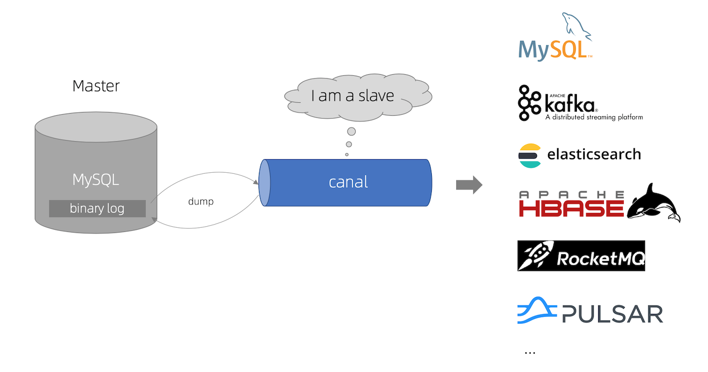
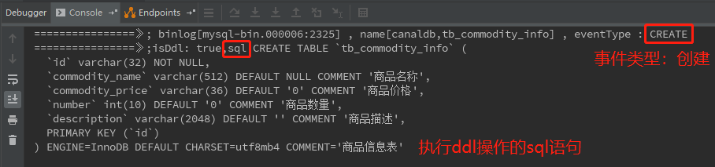
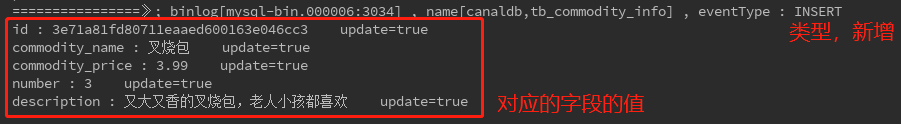

[官方](https://github.com/alibaba/canal)

# 概要

主要用途是基于 **MySQL 数据库增量日志解析**，提供**增量数据订阅和消费**。



canal的工作原理就是**把自己伪装成MySQL slave，模拟MySQL slave的交互协议向MySQL Mater发送 dump协议，MySQL mater收到canal发送过来的dump请求，开始推送binary log给canal，然后canal解析binary log，再发送到存储目的地**，比如MySQL，Kafka，Elastic Search等等。

canal的数据同步**不是全量的，而是增量**。基于binary log增量订阅和消费，canal可以做：

-   数据库镜像
-   数据库实时备份
-   索引构建和实时维护
-   业务cache(缓存)刷新
-   带业务逻辑的增量数据处理

# 使用示例

此处只显示效果，[使用参考](https://developer.aliyun.com/article/770496)

```java
// 略，见project中的
```


首先启动MySQL、Canal Server，还有Spring Boot项目。然后创建表：

```sql
CREATE TABLE `tb_commodity_info` (
  `id` varchar(32) NOT NULL,
  `commodity_name` varchar(512) DEFAULT NULL COMMENT '商品名称',
  `commodity_price` varchar(36) DEFAULT '0' COMMENT '商品价格',
  `number` int(10) DEFAULT '0' COMMENT '商品数量',
  `description` varchar(2048) DEFAULT '' COMMENT '商品描述',
  PRIMARY KEY (`id`)
) ENGINE=InnoDB DEFAULT CHARSET=utf8mb4 COMMENT='商品信息表';
```




```sql
INSERT INTO tb_commodity_info VALUES('3e71a81fd80711eaaed600163e046cc3','叉烧包','3.99',3,'又大又香的叉烧包，老人小孩都喜欢');
```




# Canal+Kafka实现MySQL与Redis同步

https://developer.aliyun.com/article/770659

见MyDemo中的canal


# Canal回传数据格式

[CommonMessage](https://github.com/alibaba/canal/blob/5cc85ff2ded1a88fbb13c80da2f72c0aa3306e3d/connector/core/src/main/java/com/alibaba/otter/canal/connector/core/consumer/CommonMessage.java)

```java
public class CommonMessage implements Serializable {

    private static final long         serialVersionUID = 2611556444074013268L;

    private String                    database;                               // 数据库或schema
    private String                    table;                                  // 表名
    private List<String>              pkNames;
    private Boolean                   isDdl;
    // 类型:INSERT/UPDATE/DELETE
    private String                    type;
    // binlog executeTime, 执行耗时
    private Long                      es;
    // dml build timeStamp, 同步时间
    private Long                      ts;
    // 执行的sql,dml sql为空
    private String                    sql;
    // 数据列表
    private List<Map<String, Object>> data;
    // 旧数据列表,用于update,size和data的size一一对应
    private List<Map<String, Object>> old;
    
    // 省略get/set
}
```


举例

```json
{
  "data": [
    {
      "id": "10001",
      "name": "葛秋红",
      "tel": null,
      "mobile": "17*******47",
      "detail_addr": "恒大影城南侧小金庄",
      "area_id": "130903",
      "gis_addr": null,
      "cdt": "2020-02-02 18:51:39",
      "udt": "2020-02-02 18:51:39",
      "remark": null
    }
  ],
  "database": "crm",
  "es": 1615794443000,
  "id": 2,
  "isDdl": false,
  "mysqlType": {
    "id": "bigint(20)",
    "name": "varchar(50)",
    "tel": "varchar(20)",
    "mobile": "varchar(20)",
    "detail_addr": "varchar(100)",
    "area_id": "bigint(20)",
    "gis_addr": "varchar(20)",
    "cdt": "datetime",
    "udt": "datetime",
    "remark": "varchar(100)"
  },
  "old": null,
  "sql": "",
  "sqlType": {
    "id": -5,
    "name": 12,
    "tel": 12,
    "mobile": 12,
    "detail_addr": 12,
    "area_id": -5,
    "gis_addr": 12,
    "cdt": 93,
    "udt": 93,
    "remark": 12
  },
  "table": "crm_address",
  "ts": 1615794443644,
  "type": "INSERT"
}

```

>   es 是数据库里面的执行时间(executeTime)， 而 ts 是解析时间(timeStamp)
>
>   一般 es < ts


# 总结

canal的好处在于**对业务代码没有侵入**，因为是**基于监听binlog日志去进行同步数据的**。

实际项目一般是**配置MQ模式，配合RocketMQ或者Kafka，canal会把数据发送到MQ的topic中，然后通过消息队列的消费者进行处理**。
