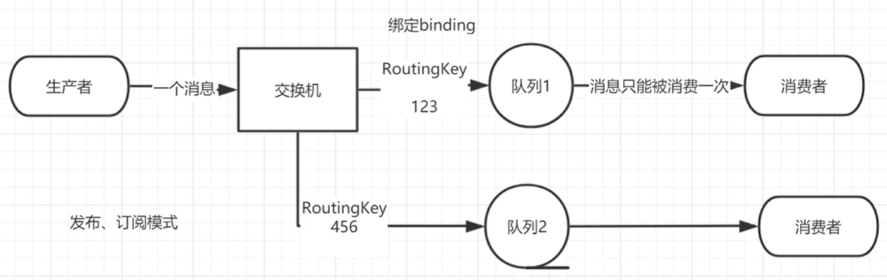

- [Exchanges](#exchanges)
- [临时队列](#%E4%B8%B4%E6%97%B6%E9%98%9F%E5%88%97)
- [绑定 bindings](#%E7%BB%91%E5%AE%9A-bindings)
- [Fanout exchange](#fanout-exchange)
  - [Fanout 介绍](#fanout-%E4%BB%8B%E7%BB%8D)
  - [Fanout 实战](#fanout-%E5%AE%9E%E6%88%98)
- [Direct exchange](#direct-exchange)
  - [Direct 介绍](#direct-%E4%BB%8B%E7%BB%8D)
  - [多重绑定](#%E5%A4%9A%E9%87%8D%E7%BB%91%E5%AE%9A)
  - [Direct 实战](#direct-%E5%AE%9E%E6%88%98)
- [Topics exchange](#topics-exchange)
  - [Topic 的介绍](#topic-%E7%9A%84%E4%BB%8B%E7%BB%8D)
  - [Topic 匹配案例](#topic-%E5%8C%B9%E9%85%8D%E6%A1%88%E4%BE%8B)
  - [Topic 实战](#topic-%E5%AE%9E%E6%88%98)

前面假设的是工作队列背后，每个任务都恰好交付给一个消费者(工作进程)。在这一部分中，将做一些完全不同的事情-将消息传达给多个消费者。这种模式 称为 ”发布/订阅”。


## Exchanges

RabbitMQ 消息传递模型的核心思想是: **生产者生产的消息从不会直接发送到队列**。实际上，通常生产者甚至都不知道这些消息传递传递到了哪些队列中。

相反，**生产者只能将消息发送到交换机(exchange)**，交换机工作的内容非常简单，一方面它接收来自生产者的消息，另一方面将它们推入队列。交换机必须确切知道如何处理收到的消息。是应该把这些消息放到特定队列还是说把他们到许多队列中还是说应该丢弃它们。这就的由交换机的类型来决定。


**Exchanges 的类型：**

​	直接(direct), 主题(topic) ,标题(headers) , 扇出(fanout)

**无名exchange：**

​	在前面部分我们对 exchange 一无所知，但仍然能够将消息发送到队列。之前能实现的 原因是因为我们使用的是默认交换，我们通过空字符串(“”)进行标识。

```java
channel.basicPublish("", "hello", null, message.getBytes());
```

第一个参数是交换机的名称。空字符串表示默认或无名称交换机：消息能路由发送到队列中其实是由 routingKey(bindingkey)绑定 key 指定的，如果它存在的话，`hello`的位置放的就是key了


## 临时队列

之前的章节我们使用的是具有特定名称的队列(还记得 hello 和 ack_queue 吗？)。队列的名称我们来说至关重要，我们需要指定我们的消费者去消费哪个队列的消息。

每当我们连接到 Rabbit 时，我们都需要一个全新的空队列，为此我们可以创建一个具有**随机名称的队列**，或者能让服务器为我们选择一个随机队列名称那就更好了。其次一旦我们断开了消费者的连接，队列将被自动删除。

创建临时队列的方式如下: 

```java
String queueName = channel.queueDeclare().getQueue();
```


## 绑定 bindings

binding 其实是 exchange 和 queue 之间的桥梁，它告诉我们 exchange 和那个队列进行了绑定关系。比如说下面这张图告诉我们的就是 X 与 Q1 和 Q2 进行了绑定




## Fanout exchange 发布订阅

### Fanout 介绍

Fanout **将接收到的所有消息广播到绑定的所有Queue中**，此时routingKey不起作用。系统中默认有些 exchange 类型。


### Fanout 实战 


Logs 和临时队列的绑定关系如下图


为了说明这种模式，我们将构建一个简单的日志系统。启动两个消费者，一个打印在控制台，一个写入文件。

ReceiveLogs01 将接收到的消息打印在控制台

```java
import com.oddfar.utils.RabbitMqUtils;
import com.rabbitmq.client.Channel;
import com.rabbitmq.client.DeliverCallback;

public class ReceiveLogs01 {
    private static final String EXCHANGE_NAME = "logs";

    public static void main(String[] args) throws Exception {

        Channel channel = RabbitMqUtils.getChannel();
        channel.exchangeDeclare(EXCHANGE_NAME, BuiltinExchangType.FANOUT);
        /**
         * 生成一个临时的队列 队列的名称是随机的
         * 当消费者断开和该队列的连接时 队列自动删除
         */
        String queueName = channel.queueDeclare().getQueue();
        // 将该临时队列绑定我们的 exchange 
        // 其中 routingkey(也称之为 binding key)为空字符串，
        // 因为fanout下的exchange会广播给所有绑定的队列，所以key为空
        channel.queueBind(queueName, EXCHANGE_NAME, "");
        System.out.println("等待接收消息,把接收到的消息打印在屏幕........... ");

        //发送回调
        DeliverCallback deliverCallback = (consumerTag, delivery) -> {
            String message = new String(delivery.getBody(), "UTF-8");
            System.out.println("控制台打印接收到的消息" + message);
        };
        channel.basicConsume(queueName, true, deliverCallback, consumerTag -> {});

    }
}
```

ReceiveLogs02 把消息写出到文件

```java
public class ReceiveLogs02 {
    private static final String EXCHANGE_NAME = "logs";

    public static void main(String[] args) throws Exception {

        Channel channel = RabbitMqUtils.getChannel();
        channel.exchangeDeclare(EXCHANGE_NAME, BuiltinExchangType.FANOUT);
        /**
         * 生成一个临时的队列 队列的名称是随机的
         * 当消费者断开和该队列的连接时 队列自动删除
         */
        String queueName = channel.queueDeclare().getQueue();
        //把该临时队列绑定我们的 exchange 其中 routingkey(也称之为 binding key)为空字符串
        channel.queueBind(queueName, EXCHANGE_NAME, "");
        System.out.println("等待接收消息,把接收到的消息写到文件........... ");

        //发送回调
        DeliverCallback deliverCallback = (consumerTag, delivery) -> {
            String message = new String(delivery.getBody(), "UTF-8");
            File file = new File("D:\\test\\rabbitmq_info.txt");
            FileUtils.writeStringToFile(file,message,"UTF-8");
            System.out.println("数据写入文件成功");
        };
        channel.basicConsume(queueName, true, deliverCallback, consumerTag -> {});

    }
}
```


EmitLog 发送消息给两个消费者接收：

```java
public class EmitLog {
    private static final String EXCHANGE_NAME = "logs";

    public static void main(String[] args) throws Exception {
        Channel channel = RabbitMqUtils.getChannel();

        /**
         * 声明一个 exchange, 
         * 大部分时候是消费者先上线，生产者多声明不会出问题的，幂等性
         * 1.exchange 的名称
         * 2.exchange 的类型
         */
        channel.exchangeDeclare(EXCHANGE_NAME, BuiltinExchangType.FANOUT);
        Scanner sc = new Scanner(System.in);
        System.out.println("请输入信息");
        while (sc.hasNext()) {
            String message = sc.nextLine();
            channel.basicPublish(EXCHANGE_NAME, "", null, message.getBytes("UTF-8"));
            System.out.println("生产者发出消息" + message);
        }
    }
    
}
```

## Direct exchange

在本节将添加一些特别的功能——让某个消费者订阅发布的部分消息。例如我们只把严重错误消息定向存储到日志文件(以节省磁盘空间)，同时仍然能够在控制台上打印所有日志消息。

**队列只对它绑定的交换机的消息感兴趣**。

绑定用参数：routingKey 来表示也可称该参数为 binding key， 创建绑定我们用代码:`channel.queueBind(queueName, EXCHANGE_NAME, "routingKey");`

绑定之后的意义由其交换类型决定。

### Direct 介绍

上一节中的我们的日志系统将所有消息广播给所有消费者，对此我们想做一些改变，例如将日志消息写入磁盘的程序仅接收严重错误(errros)，而不存储警告(warning)或信息(info)日志消，避免浪费磁盘空间。


在上面这张图中，我们可以看到 X 绑定了两个队列，绑定类型是 direct。队列Q1 绑定键为 orange， 队列 Q2 绑定键有两个:一个绑定键为 black，另一个绑定键为 green.

在这种绑定情况下，生产者发布消息到 exchange 上，绑定键为 orange 的消息会被发布到队列 Q1。绑定键为 black 和 green 的消息会被发布到队列 Q2，其他消息类型的消息将被丢弃。

### 多重绑定 


当然如果 exchange 的绑定类型是direct，**但是它绑定的多个队列的 key 如果都相同**，在这种情况下虽然绑定类型是 direct **但是它表现的就和 fanout 有点类似了**，就跟广播差不多，如上图所示。

### Direct 实战

关系：


交换机：


c2：绑定disk，routingKey为error

c1：绑定console，routingKey为info、warning

1、

```java
import com.yienx.utils.RabbitMqUtils;
import com.rabbitmq.client.BuiltinExchangeType;
import com.rabbitmq.client.Channel;
import com.rabbitmq.client.DeliverCallback;


public class ReceiveLogsDirect01 {
    private static final String EXCHANGE_NAME = "direct_logs";

    public static void main(String[] args) throws Exception {
        Channel channel = RabbitMqUtils.getChannel();
        channel.exchangeDeclare(EXCHANGE_NAME, BuiltinExchangeType.DIRECT);

        String queueName = "disk";
        //队列声明
        channel.queueDeclare(queueName, false, false, false, null);
        //队列绑定
        channel.queueBind(queueName, EXCHANGE_NAME, "error");
        System.out.println("等待接收消息...");

        //回调
        DeliverCallback deliverCallback = (consumerTag, delivery) -> {
            String message = new String(delivery.getBody(), "UTF-8");
            message = "接收绑定键:" + delivery.getEnvelope().getRoutingKey() + ",消息:" + message;
            System.out.println("error 消息已经接收：\n" + message);
        };
        channel.basicConsume(queueName, true, deliverCallback, consumerTag -> {
        });
    }
}
```

2、

```java
public class ReceiveLogsDirect02 {
    private static final String EXCHANGE_NAME = "direct_logs";

    public static void main(String[] args) throws Exception {
        Channel channel = RabbitMqUtils.getChannel();
        channel.exchangeDeclare(EXCHANGE_NAME, BuiltinExchangeType.DIRECT);

        String queueName = "console";
        //队列声明
        channel.queueDeclare(queueName, false, false, false, null);
        //队列绑定
        channel.queueBind(queueName, EXCHANGE_NAME, "info");
        channel.queueBind(queueName, EXCHANGE_NAME, "warning");

        System.out.println("等待接收消息...");

        //回调
        DeliverCallback deliverCallback = (consumerTag, delivery) -> {
            String message = new String(delivery.getBody(), "UTF-8");
            message = "接收绑定键:" + delivery.getEnvelope().getRoutingKey() + ",消息:" + message;
            System.out.println("info和warning 消息已经接收：\n" + message);
        };
        channel.basicConsume(queueName, true, deliverCallback, consumerTag -> {
        });
    }
}
```

3、

```java
public class EmitLogDirect {
    private static final String EXCHANGE_NAME = "direct_logs";

    public static void main(String[] args) throws Exception {
        Channel channel = RabbitMqUtils.getChannel();
        channel.exchangeDeclare(EXCHANGE_NAME, BuiltinExchangeType.DIRECT);

        //创建多个 bindingKey
        Map<String, String> bindingKeyMap = new HashMap<>();
        bindingKeyMap.put("info", "普通 info 信息");
        bindingKeyMap.put("warning", "警告 warning 信息");
        bindingKeyMap.put("error", "错误 error 信息");
        //debug 没有消费这接收这个消息 所有就丢失了
        bindingKeyMap.put("debug", "调试 debug 信息");

        for (Map.Entry<String, String> bindingKeyEntry : bindingKeyMap.entrySet()) {
            //获取 key value
            String bindingKey = bindingKeyEntry.getKey();
            String message = bindingKeyEntry.getValue();

            channel.basicPublish(EXCHANGE_NAME, bindingKey, null, message.getBytes("UTF-8"));
            System.out.println("生产者发出消息:" + message);
        }
    }
}
```


## Topics exchange

### Topic 的介绍

在上一个小节中，使用了 direct 交换机，从而有能实现有选择性地接收日志。

仍然存在局限性——比方说想接收的日志类型有 info.base 和 info.advantage，某个队列只想 info.base 的消息，那这个时候direct 就办不到了。这个时候就只能使用 **topic** 类型

> **Topic的要求**

发送到类型是 topic 交换机的消息的 routing_key 不能随意写，必须满足一定的要求，它必须是**一个单词列表**，**以点号分隔开**。这些单词可以是任意单词

比如说："stock.usd.nyse", "nyse.vmw", "quick.orange.rabbit".这种类型的。

当然这个单词列表最多不能超过 255 个字节。

在这个规则列表中，其中有两个替换符是大家需要注意的：

- ***(星号)可以代替一个单词**
- **\#(井号)可以替代零个或多个单词**


### Topic 匹配案例

下图绑定关系如下


- Q1-->绑定的是
  - 中间带 orange 带 3 个单词的字符串 `(*.orange.*)`

- Q2-->绑定的是
  - 最后一个单词是 rabbit 的 3 个单词 `(*.*.rabbit)`
  - 第一个单词是 lazy 的多个单词 `(lazy.#)`

上图是一个队列绑定关系图，我们来看看他们之间数据接收情况是怎么样的

| 例子                     | 说明                                       |
| ------------------------ | ------------------------------------------ |
| quick.orange.rabbit      | 被队列 Q1Q2 接收到                         |
| lazy.orange.elephant     | 被队列 Q1Q2 接收到                         |
| quick.orange.fox         | 被队列 Q1 接收到                           |
| lazy.brown.fox           | 被队列 Q2 接收到                           |
| lazy.pink.rabbit         | 虽然满足两个绑定但只被队列 Q2 接收一次     |
| quick.brown.fox          | 不匹配任何绑定不会被任何队列接收到会被丢弃 |
| quick.orange.male.rabbit | 是四个单词不匹配任何绑定会被丢弃           |
| lazy.orange.male.rabbit  | 是四个单词但匹配 Q2                        |

注意：

- 当一个队列绑定键是#，那么这个队列将接收所有数据，就有点像 fanout 了
- 如果队列绑定键当中没有#和*出现，那么该队列绑定类型就是 direct 了

### Topic 实战 


代码如下：

```java
import com.rabbitmq.client.BuiltinExchangeType;
import com.rabbitmq.client.Channel;

import java.util.HashMap;
import java.util.Map;

/**
 * 发送端
 *
 */
public class EmitLogTopic {
    private static final String EXCHANGE_NAME = "topic_logs";

    public static void main(String[] args) throws Exception {
        Channel channel = RabbitMqUtils.getChannel();
        channel.exchangeDeclare(EXCHANGE_NAME, BuiltinExchangeType.TOPIC);

        /**
         * Q1-->绑定的是
         *      中间带 orange 带 3 个单词的字符串(*.orange.*)
         * Q2-->绑定的是
         *      最后一个单词是 rabbit 的 3 个单词(*.*.rabbit)
         *      第一个单词是 lazy 的多个单词(lazy.#)
         *
         */
        Map<String, String> bindingKeyMap = new HashMap<>();
        bindingKeyMap.put("quick.orange.rabbit", "被队列 Q1Q2 接收到");
        bindingKeyMap.put("lazy.orange.elephant", "被队列 Q1Q2 接收到");
        bindingKeyMap.put("quick.orange.fox", "被队列 Q1 接收到");
        bindingKeyMap.put("lazy.brown.fox", "被队列 Q2 接收到");
        bindingKeyMap.put("lazy.pink.rabbit", "虽然满足两个绑定但只被队列 Q2 接收一次");
        bindingKeyMap.put("quick.brown.fox", "不匹配任何绑定不会被任何队列接收到会被丢弃");
        bindingKeyMap.put("quick.orange.male.rabbit", "是四个单词不匹配任何绑定会被丢弃");
        bindingKeyMap.put("lazy.orange.male.rabbit", "是四个单词但匹配 Q2");
        for (Map.Entry<String, String> bindingKeyEntry : bindingKeyMap.entrySet()) {
            String bindingKey = bindingKeyEntry.getKey();
            String message = bindingKeyEntry.getValue();

            channel.basicPublish(EXCHANGE_NAME, bindingKey, null, message.getBytes("UTF-8"));
            System.out.println("生产者发出消息：" + message);
        }
    }
}
```


```java
public class ReceiveLogsTopic01 {
    private static final String EXCHANGE_NAME = "topic_logs";

    public static void main(String[] args) throws Exception {
        Channel channel = RabbitMqUtils.getChannel();
        channel.exchangeDeclare(EXCHANGE_NAME, BuiltinExchangeType.TOPIC);
        //声明 Q1 队列与绑定关系
        String queueName = "Q1";
        //声明
        channel.queueDeclare(queueName, false, false, false, null);
        //绑定
        channel.queueBind(queueName, EXCHANGE_NAME, "*.orange.*");
        System.out.println("等待接收消息........... ");

        DeliverCallback deliverCallback = (consumerTag, delivery) -> {
            String message = new String(delivery.getBody(), "UTF-8");
            System.out.println(" 接收队列:" + queueName + " 绑定键:" + delivery.getEnvelope().getRoutingKey() + ",消息:" + message);
        };
        channel.basicConsume(queueName, true, deliverCallback, consumerTag -> {
        });
    }
}
```


```java
public class ReceiveLogsTopic02 {
    private static final String EXCHANGE_NAME = "topic_logs";

    public static void main(String[] args) throws Exception {
        Channel channel = RabbitMqUtils.getChannel();
        channel.exchangeDeclare(EXCHANGE_NAME, BuiltinExchangeType.TOPIC);
        //声明 Q2 队列与绑定关系
        String queueName = "Q2";
        //声明
        channel.queueDeclare(queueName, false, false, false, null);
        //绑定
        channel.queueBind(queueName, EXCHANGE_NAME, "*.*.rabbit");
        channel.queueBind(queueName, EXCHANGE_NAME, "lazy.#");

        System.out.println("等待接收消息........... ");

        DeliverCallback deliverCallback = (consumerTag, delivery) -> {
            String message = new String(delivery.getBody(), "UTF-8");
            System.out.println(" 接收队列:" + queueName + " 绑定键:" + delivery.getEnvelope().getRoutingKey() + ",消息:" + message);
        };
        channel.basicConsume(queueName, true, deliverCallback, consumerTag -> {
        });
    }
}
```

