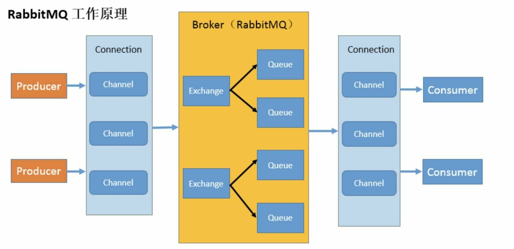
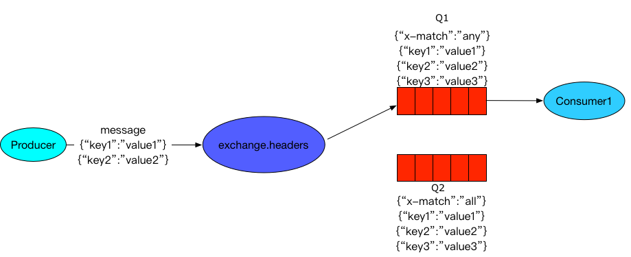

https://note.oddfar.com/pages/95ce73/#hello-world

# AMQP协议

## 简介

**AMQP协议简介**：

- AMQP全称：`Advanced Message Queuing Protocol` 高级消息队列协议。
- AMQP定义：是具有现代特征的二进制协议。是一个提供统一消息服务的应用层标准高级消息队列协议，是**应用层协议的一个开放标准，为面向消息的中间件设计**。


## 核心概念

**AMQP概念**：

- **Server**：又称作**Broker**，接收客户端的连接，实现AMQP实体服务。
- **Connection**：连接，应用程序与Broker的网络连接， TCP/IP 三次握手和四次挥手。
- **Channel**：网络信道，几乎所有的操作都在Channel中进行，Channel是进行消息读写的通道。客户端可以建立多个Channel，每个Channel代表一个会话任务。
- **Message**：消息。服务器和应用程序之间传送的数据，由Properties和Body组成。
	- Properties可以对消息进行修饰，比如消息的优先级、延迟等高级特性；
	- Body就是消息体内容。
- **Virtual Host**：虚拟主机，用于进行逻辑隔离，最上层的消息路由。
	- 一个Virtual Host里面可以有若干个Exchange和Queue；
	- 同一个Virtual Host里面不能有相同名称的Exchange和Queue。
- **Exchange**：交换机，接收消息。根据Routing Key转发消息到绑定的队列。
- **Binding**：Exchange和Queue之间的虚拟连接，Binding中可以包含Routing Key。
- **Routing Key**：一个路由规则，虚拟机可以用它来确定如何路由一个特点消息。
- **Queue**：也成为了Message Queue，消息队列，保存消息并转发给消费者。


# RabbitMQ架构



> ① 生产者将消息(msg)和路由键(routekey)发送指定的交换机(exchange)上
>
> ② 交换机(exchange)根据路由键(routekey)找到绑定自己的队列(queue)并把消息给它
>
> ③ 队列(queue)再把消息发送给监听它的consumer

**Broker**：rabbitmq的服务节点

**Queue**：队列，是RabbitMQ的内部对象，用于存储消息。RabbitMQ中消息只能存储在队列中。**生产者投递消息到队列，消费者从队列中获取消息井消费**。

**Exchange**：交换机。生产者将消息发送到Exchange，由交换器根据Routing Key将消息路由到一个或多个队列中。如果路由不到，或返回给生产者，或直接丢弃，或做其它处理。

**Routingkey**：路由Key。生产者将消息发送给交换器的时候，一般会指定一个Routingkey，**用来指定这个消息的路由规则**。这个路由Key需要与交换器类型和绑定键(BindingKey)联合使用才能最终生效。在交换器类型和绑定键固定的情况下，生产者可以在发送消息给交换器时**通过指定Routingkey来决定消息流向哪里**。

**Binding**：exchange 和 queue 之间的虚拟连接，binding 中可以包含 routing key，Binding 信息被保存到 exchange 中的查询表中，用于 message 的分发依据。

> **交换器和队列实际上是多对多关系。**就像关系数据库中的两张表。他们通过Bindingkey做关联(多对多关系表)。在投递消息时，可以通过Exchange和Routingkey(对应Bindingkey)就可以找到相对应的队列。

**Connection**：publisher／consumer 和 broker 之间的 TCP 连接

**Channel**：Channel 是在 connection 内部建立的逻辑连接。如果应用程序支持多线程，通常每个 thread 创建单独的 channel 进行通讯，当应用程序与Rabbit Broker建立TCP连接的时候，客户端紧接着可以创建一个 AMQP 信道(Channel)，每个信道都会被指派一个唯一的ID。**RabbitMQ 处理的每条 AMQP 指令都是通过信道完成的。**

> 有了Channel，每次不需要每次访问MQ都建立一个connection。
>
> Channel 作为轻量级的 Connection 极大减少了操作系统建立 TCP connection 的开销 

# 基于信道传输***

由于 **TCP 连接的创建和销毁开销较大**，且并发数受系统资源限制，会造成性能瓶 颈。

RabbitMQ 使用信道的方式来传输数据。

信道是建立在真实的 TCP 连接内的**虚拟连接**，且每条 TCP 连接上的信道数量没有限制。

# RabbitMQ的消息模式

**基本消息模式/点对点**：就是说一个「消息生产者」一个「消息队列」一个「消息消费者」，但消息过多，消费不过来，可能会导致消息堆积。

**工作模式**：当一个消费者消费不过来的时候我们就可以用多个消息消费者进行消费从而解决这个问题。

**发布订阅模式**：生产者和消息队列之间有一个交换机，生产者发送消息给交换机，交换机负责传递给对应的消息队列。


以下都是发布订阅的模式的分类：

**广播Fanout**：生产者和消息队列之间有一个交换机，生产者发送消息给交换机，交换机负责传递给所有绑定该交换机的消息队列。

**定向Direct**：也称路由模式，不同的消息根据路由键进行分配。


P：生产者，向Exchange发送消息，发送消息时，会指定一个routing key。

X：Exchange（交换机），接收生产者的消息，然后把消息递交给 与routing key完全匹配的队列

C1：消费者，其所在队列指定了需要routing key 为 error 的消息

C2：消费者，其所在队列指定了需要routing key 为 info、error、warning 的消息。

**通配符/主题Topic**：路由键可以使用通配符进行绑定


# 应答机制

### 1、自动应答

消息发送后**立即**被认为已经传送成功，这种模式需要在**高吞吐量**和**数据传输安全性**方面做权衡

### 2、手动应答

如果消费者由于某些原因失去连接(其通道已关闭，连接已关闭或 TCP 连接丢失)，导致消息未发送 ACK 确认，RabbitMQ 将了解到消息未完全处理，并将对其重新排队。如果此时其他消费者可以处理，它将很快将其重新分发给另一个消费者。这样，即使某个消费者偶尔死亡，也可以确保不会丢失任何消息。

# [交换机](./RabbitMQ-交换机.md)

Exchange属性：

- **Name**：Exchange名称。
- **Type**：Exchange的类型。`direct、topic、fanout、headers`。
- **Durability**：是否需要持久化，true为持久化。false代表重启服务器后该交换机会被删除。
- **Auto Delete**：当最后一个绑定到Exchange上的队列删除后，自动删除该Exchange。
- **Internal**：当前Exchange是否用于RabbitMQ内部使用，默认为false。**(很少使用)**
- **Arguments**：扩展参数，用于扩展AMQP协议自制定化使用。

## Direct Exchange

- 所有发送到Direct Exchange的消息被转发到Routing key中指定的Queue。
- 一句话：直连的方式，生产者发送消息的Routing Key和Direct Exchange的Routing Key必须完全匹配，才会路由到绑定的Queue。


## Topic Exchange

- 所有发送到Topic Exchange的消息被转发到所有关系Routing Key中指定Topic的Queue上。
- Exchange将Routing Key和某个Topic进行**模糊匹配**，此时队列需要绑定一个Topic。
- 一句话：Topic Exchange和Queue绑定Routing Key可以使用通配符，生产者发送消息的Routing Key只要和Topic Exchange的Routing Key匹配就能路由到Topic Exchange绑定的队列。


比如要传送item的增删改查信息，创建四个队列复杂，使用通配符，item.*就可以传递

> 模糊匹配可以使用通配符
>
> - **符号 "#" 匹配0个或多个词。**
> - **符号 "*" 匹配一个词。**
> - **例如："log.#" 能够匹配到 "log.info.aa"。"log.*" 只能匹配到 "log.err"。**

## Fanout Exchange

- Fanout广播
- Fanout Exchange不处理Routing Key，只需要简单的将Queue绑定到Exchange上。
- 发送到Exchange的消息都会被转发到与该Exchange绑定的所有Queue上。
- Fanout Exchange转发消息是最快的。


## Headers Exchange

**1: 不处理路由键**。而是根据发送的消息内容中的 `headers`属性进行匹配。

- 在绑定Queue与Exchange时指定一组键值对；
- 当消息发送到RabbitMQ时会取到该消息的headers与Exchange绑定时指定的键值对进行匹配；
- 如果完全匹配则消息会路由到该队列，否则不会路由到该队列。
- headers属性是一个键值对，可以是Hashtable，键值对的值可以是任何类型。而fanout，direct，topic 的路由键都需要要字符串形式的。

**2: 匹配规则x-match有下列两种类型**：

- x-match = all ：表示所有的键值对都匹配才能接受到消息；
- x-match = any ：表示只要有键值对匹配就能接受到消息。



# 如何保证消息发送？消息接收？

## 一、消息发送：发送方确认机制

信道需要设置为 contirm 模式，则所有在信道上发布的消息都会分配一个唯一D。

1. 一旦消息**被投递到queue**（可持久化的消息需要写入磁盘），信道会发送一个确认**ack**给生产者（包含消息唯一ID）。如果 RabbitMQ 发生内部错误从而导致**消息丟失**，会发送一条 **nack**（未确认）消息给生产者。
	
2. 所有被发送的消息都将被 contirm（即ack） 或者被nack一次。
3. 但是没有对消息被 confirm 的快慢做任何保证，井且**同一条消息不会既被 confirm又被 nack**。

> 发送方确认模式是**异步的**，生产者应用程序在等待确认的同时，可以继续发送消息。当确认消息到达生产者，生产者的回调方法会被触发。

ConfirmCallback接口：只确认是否正确到达 Exchange 中，成功到达则回调

ReturnCallback接口：消息失败返回时回调

## 二、消息接收：接收方确认机制

消费者在声明队列时，可以**指定noAck參数**，当noAck=false时， RabbitMQ会**等待消费者显式发回ack**信号后**才从内存**(或者磁盘，持久化消息)中**移去消息**。否则，消息被消费后会被立即删除。

消费者接收每一条消息后都必须进行确认（消息接收和消息确认是两个不同操作)。**只有消费者确认了消息，RabbitMQ 才能安全地把消息从队列中删除**。

> RabbitMQ不会为未ack的消息设置超时时间，它判断此消息是否需要重新投递给消费者的唯一依据是消费该消息的消费者连接是否已经断开。这么设计的原因是RabbitMQ**允许消费者消费一条消息的时间可以很长**。保证数据的最终一致性。

如果消费者返回ack之前断开了链接，RabbitMQ 会重新分发给下一个订阅的消费者。（可能存在消息重复消费的隐患，需要去重）。

# 如何保证消息不会被重复发送和消费

在消息生产时，MQ 内部针对每条生产者发送的消息生成一个 **inner-msg-id**，作为去重的依据(消息投递失败并重传)，避免重复的消息进入队列；

在消息消费时，要求消息体中必须要有一个 **bizId**(对于同一业务全局唯一，如支付 ID、订单 ID、帖子 ID 等)作为去重的依据，避免同一条消息被重复消费。


# 消费者消费消息失败(确认模式)

RabbitMQ 中，消息消费确认模式有如下3种：

- AcknowledgeMode.NONE：不确认
- AcknowledgeMode.AUTO：自动确认
- AcknowledgeMode.MANUAL：手动确认

手动确认模式中，如果消息消费失败，可以选择是否将消息重新放入队列。

默认的确认模式为自动确认，如果消息消费的方法执行完成而未抛出异常，则会自动确认该消息消费成功；若抛出异常，则会自动确认**消费失败**，此时消息会**重新回到队列**中（按默认配置）。

消息消费失败后如果重新放入队列，RabbitMQ会立刻将消息重新推送给消费者，而没有延迟推送的机制。

此时很可能会出现一直失败并抛出异常的情况，浪费了资源，并导致日志爆满，并淹没最初几条有用的异常日志信息（Java中如果多次抛出同样的异常，打印日志时会省略部分异常堆栈）。

因此为了方便查看完整的异常堆栈，进程错误排查，建议在RabbitMQ消息消费失败时，不要无限次的放回队列。此时有以下两种场景：

#### 手动确认模式下

消费失败时，不将其重新放入队列（确认重试也不会成功的情形），打印错误信息后，通知相关人员，人工介入处理。

#### 自动确认模式下

在Spring Boot RabbitMQ中，可以通过以下几个配置参数，来调节消息消费失败时，消息重新投递的策略：

```properties
# 是否开启消费者重试（为false时关闭消费者重试）
spring.rabbitmq.listener.simple.retry.enabled=true
# 最大重试重新投递消息次数
spring.rabbitmq.listener.simple.retry.max-attempts=3
# 重试重新投递消息的间隔时间（单位毫秒）
spring.rabbitmq.listener.simple.retry.initial-interval=5000ms
# 重试次数超过上面的设置之后，是否丢弃(消费者listener抛出异常，是否重回队列（默认true：重回队列，false：不重回队列（可结合死信交换机））
spring.rabbitmq.listener.simple.default-requeue-rejected=false

```


# 高级特性

## 一、生存时间TTL

- TTL：`Time To Live`，也就是生存时间。
- RabbitMQ支持消息的过期时间，在消息发送时可以指定。
- RabbitMQ支持队列的过期时间，从消息入队开始计算，只要超过了队列的超时时间配置，那么消息会自动清除。

过期时间TTL表示可以对消息设置过期的时间，在这个时间内都可以被消费者接收获取，过了这段时间消息将会被自动删除。

RabbitMQ 可以对消息和队列设置TTL，目前有两种方式可以设置：

- **通过队列属性设置**，队列中每条消息都有相同的过期时间。
- **对消息进行单独设置**，每条消息TTL可以不同。

> **如果上述两种方法同时使用，则消息的过期时间以两者TTL较小的那个数值为准。**
>
> 消息在队列的生存时间一旦超过设置的TTL值，就成为 dead message 被投递到死信队列，消费者将无法收道该消息！


> **注意：**
>
> - 对消息单独设置TTL可以将消息转移到死信队列中；
>
> - 设置队列的TTL后消息过期会**直接被删除**。

## 二、死信队列DLX

**死信队列也是个消息队列，只是用来存放没有成功消费的消息，通常可以用来作为消息的重试。**

- 利用`DLX（Dead-Letter-Exchange）`，当消息在一个队列中变成Dead Message后，它会被重新publish到另一个Exchange，这个Exchange就是DLX。
- DLX也是一个正常的Exchange，和一般的Exchange没有区别，它能在任何的队列上被指定，实际上就是设置某个队列的属性。
- 当这个队列中有Dead Message时，RabbitMQ就会自动的将这个消息重新发布到设置的Exchange上去，进而被路由到另一个队列。
- 可以监听这个死信队列中消息做相应的处理，这个特性可以弥补RabbitMQ3.0以前支持的immediate参数的功能。

> **消息变成Dead Message的情况**：
>
> - 消息被消费者拒绝（basicReject/basicNack）并且不能重回队列requeue=false。
> - 消息TTL过期。
> - 队列达到最大长度。

如果队列设置了Dead Letter Exchange（DLX），那么这些Dead Letter就会被重新publish到Dead Letter Exchange，通过Dead Letter Exchange路由到其他队列。


## 三、延迟队列

延迟队列就是用来存放需要在指定时间被处理的元素的队列，通常可以用来处理一些具有过期性操作的业务，比如十分钟内未支付则取消订单。

https://blog.csdn.net/IT_hot_pot/article/details/113616967

RabbitMQ没有直接去实现延迟队列这个功能。而是需要通过**消息的TTL**和**死信Exchange**这两者的组合来实现。

# RabbitMQ的高可用

https://blog.csdn.net/xu_hui123/article/details/123014593

RabbitMQ的高可用主要是基于主从（非分布式）是架构做高可用；

RabbitMQ 有三种模式：单机模式、普通集群模式、镜像集群模式； 	

### 普通集群

普通集群模式简单的讲就是

1. 在多台机器上分别创建并启动rabbitmq实例。
2. 创建好的**queue**只会**放在其中一个**rabbitmq实例上，其他每个实例都会**同步这个queue上的元数据**（元数据可以认为是queue的一些配置信息，通过元数据可以找到queue所在的实例）。
3. **消费数据的时候**，如果是连接到了其他实例，那么该实例还是要**从queue所在的实例上拉取数据**。

这种方式并不能做到高可用，仅仅是个普通的集群，**只能提高吞吐量**。

缺点：1、集群内存在大量的数据传输；2、如果实例数据所在节点宕机，会导致丢失所有元数据。


这种集群消费者消费数据要么就是随机连接一个机器拉取数据，要么固定来接queue所在实例获取数据，但是都不能做到高可用，前者数据获取会产生大量的网络开销，后者会产生单节点性能瓶颈。如果放 queue 的实例宕机了，会导致接下来其他实例就无法从那个实例拉取，如果你开启了消息持久化，让 RabbitMQ 落地存储消息的话，消息不一定会丢，但是必须要等这个实例恢复了，才可以继续从这个 queue实例拉取数据。

### 镜像集群（高可用集群）

镜像集群才是RabbitMQ所谓的高可用集群模式，镜像集群与普通集群的区别就在于镜像集群模式下，创建的queue，**不管是元数据还是queue的data都会存在于多个实例节点上**，**每个RabbitMQ节点上都会有一个完整的queue镜像**，每次把数据写到queue里的时候，都会自动同步消息到每个queue的节点上。


缺点：

1. 所有机器之间进行数据同步，增加性能开销，网络带宽压力大。
2. 可扩展性差，如果某个queue负载很重，新增的机器也会包含了这个queue的所有数据。


# 使用

通过@RabbitListener和@RabbitHandler

RabbitListener是监听队列，只要有消息就去执行

