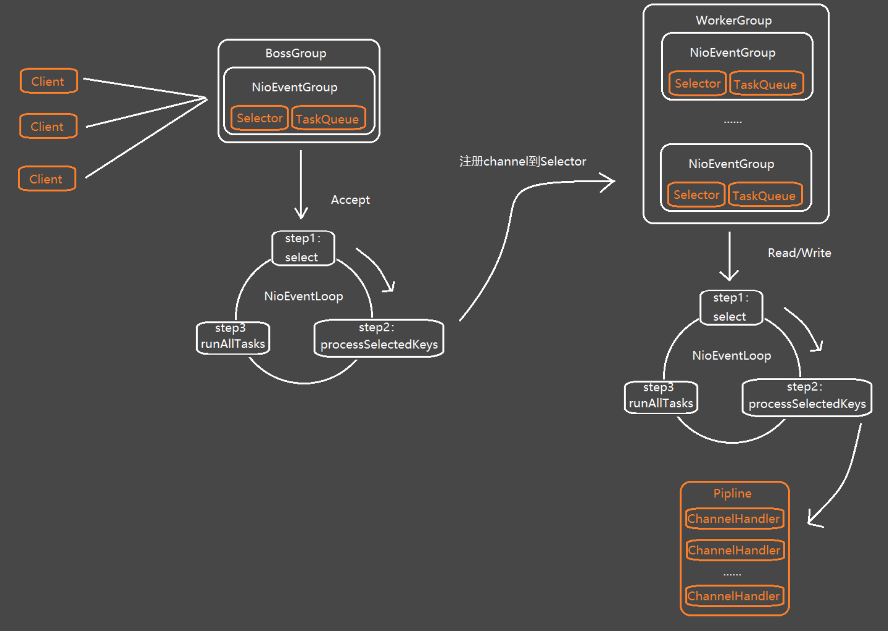
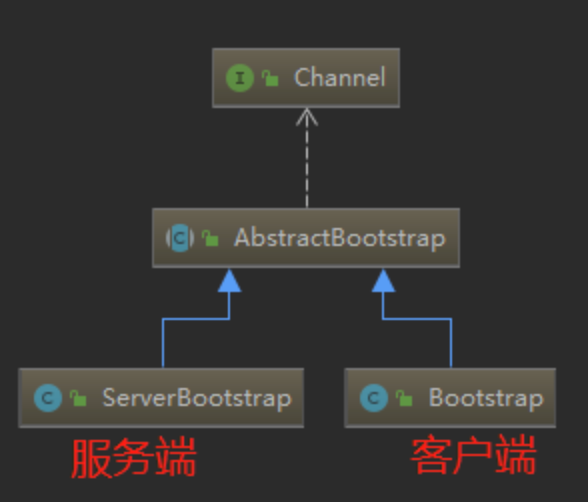

# 概述

**Netty**是 一个**异步事件驱动**的网络应用程序框架，用于**快速开发可维护的高性能协议服务器和客户端**。



# 简单demo

见NettyDemo


-   bossGroup（专门负责接收客户端的连接）

-   workerGroup（专门负责处理连接）


# 特性

## 1、taskQueue任务队列

如果Handler处理器有一些长时间的业务处理，可以交给**taskQueue异步处理**。

```java
public class MyServerHandler extends ChannelInboundHandlerAdapter {

    @Override
    public void channelRead(ChannelHandlerContext ctx, Object msg) throws Exception {
        //获取到线程池eventLoop，添加线程，执行
        ctx.channel().eventLoop().execute(new Runnable() {
            @Override
            public void run() {
                try {
                    //长时间操作，不至于长时间的业务操作导致Handler阻塞
                    Thread.sleep(1000);
                    System.out.println("长时间的业务处理");
                } catch (Exception e) {
                    e.printStackTrace();
                }
            }
        });
    }
}
```

debug的时候可以看到有个taskQueue


## 2、scheduleTaskQueue延时任务队列

```java
ctx.channel().eventLoop().schedule(new Runnable() {
    @Override
    public void run() {
        try {
            //长时间操作，不至于长时间的业务操作导致Handler阻塞
            Thread.sleep(1000);
            System.out.println("长时间的业务处理");
        } catch (Exception e) {
            e.printStackTrace();
        }
    }
},5, TimeUnit.SECONDS);//5秒后执行
```


## 3、Future异步机制

```java
ChannelFuture channelFuture = bootstrap.connect("127.0.0.1", 6666);
```

很多操作都会返回`ChannelFuture`

ChannelFuture提供操作完成时一种异步通知的方式。一般在Socket编程中，等待响应结果都是同步阻塞的，而Netty则不会造成阻塞，因为ChannelFuture是采取类似观察者模式的形式进行获取结果。

```java
//添加监听器
channelFuture.addListener(new ChannelFutureListener() {
    //使用匿名内部类，ChannelFutureListener接口
    //重写operationComplete方法
    @Override
    public void operationComplete(ChannelFuture future) throws Exception {
        //判断是否操作成功    
        if (future.isSuccess()) {
            System.out.println("连接成功");
        } else {
            System.out.println("连接失败");
        }
    }
});
```


## 4、Bootstrap和ServerBootstrap

Bootstrap和ServerBootStrap是Netty提供的一个创建客户端和服务端启动器的工厂类




使用Bootstrap创建启动器的步骤可分为以下几步：


https://developer.aliyun.com/article/769587#slide-15


