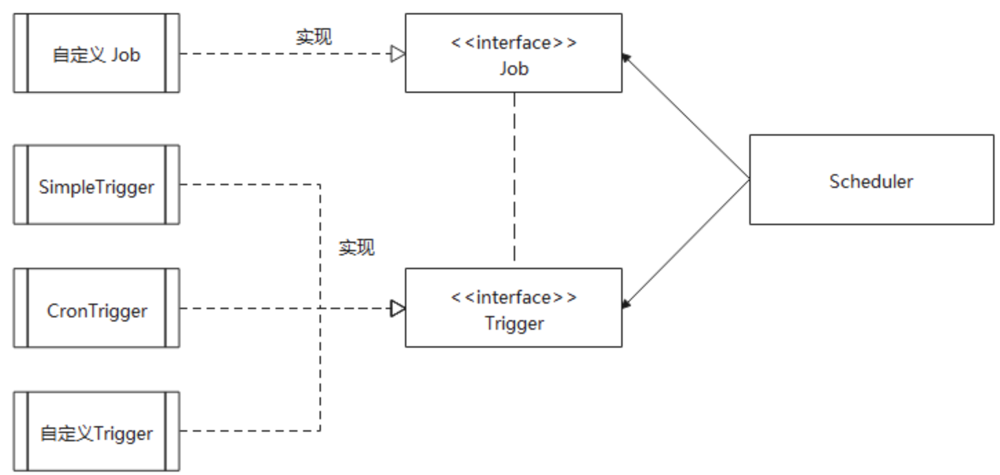

[官方文档](http://www.quartz-scheduler.org/documentation/)

# 基础使用

Quartz 的核心类有以下三部分：

- 任务 **Job** ：需要实现的任务类，实现 execute() 方法，执行后完成任务。

- 触发器 **Trigger** ：包括 SimpleTrigger 和 CronTrigger。

- 调度器 **Scheduler** ：任务调度器，负责基于 Trigger触发器，来执行 Job任务。



1、新建任务 MyJob 实现 Job

```java
public class MyJob implements Job {
    @Override
    public void execute(JobExecutionContext jobExecutionContext) throws JobExecutionException {
        System.out.println("执行任务");
    }
}
```

2、main 方法，创建调度器、JobDetail 实例、Trigger 实例、执行

```java
// 1、创建调度器 Scheduler
SchedulerFactory factory = new StdSchedulerFactory();
Scheduler scheduler = factory.getScheduler();

// 2、创建 JobDetail 实例，并与 MyJob 类绑定
JobDetail job = JobBuilder.newJob(MyJob.class)
        .withIdentity("job1", "group1")
        .build();

// 3、构建 Trigger 实例，每隔 30s 执行一次
Trigger trigger = TriggerBuilder.newTrigger()
        .withIdentity("trigger1", "group1")
        .startNow()
        .withSchedule(simpleSchedule()
                .withIntervalInSeconds(30)
                .repeatForever())
        .build();

// 4、执行，开启调度器
scheduler.scheduleJob(job, trigger);
System.out.println(System.currentTimeMillis());
scheduler.start();

// 主线程睡眠1分钟，然后关闭调度器
TimeUnit.MINUTES.sleep(1);
scheduler.shutdown();
System.out.println(System.currentTimeMillis());
```


# JobDetail

JobDetail 的作用是绑定 Job，是一个任务实例，它为 Job 添加了许多扩展参数。

| 主要字段   | 涵义、作用                                                   |
| ---------- | ------------------------------------------------------------ |
| name       | 任务名称                                                     |
| group      | 任务分组，默认分组 `DEFAULT`                                 |
| jobClass   | 任务类，就是上面 Demo 中的 `MyJob` 的路径                    |
| jobDataMap | 任务参数信息。JobDetail、Trigger 都可以使用 JobDataMap 来设置一些参数或信息。 |

每次Scheduler调度执行一个Job的时候，首先会拿到对应的Job，然后创建该Job实例，再去执行Job中的execute()的内容，任务执行结束后，关联的Job对象实例会被释放，且会被 JVM GC 清除。

### 为什么设计成JobDetail + Job，不直接使用Job？

> JobDetail 定义的是任务数据，而真正的执行逻辑是在Job中。
>
> 这是因为任务是有可能并发执行，如果Scheduler直接使用Job，就会存在对同一个Job实例并发访问的问题。
>
> 而JobDetail & Job 方式，Sheduler每次执行，都会根据JobDetail创建一个新的Job实例，这样就可以 规避并发访问 的问题。


# JobExecutionContext

- 当 Scheduler 调用一个 job，就会将 JobExecutionContext 传递给 Job 的 execute() 方法;
- Job 能通过 JobExecutionContext 对象访问到 Quartz 运行时候的环境以及 Job 本身的明细数据。

```java
public class MyJob implements Job {
    @Override
    public void execute(JobExecutionContext jobExecutionContext) throws JobExecutionException {
        System.out.println("执行任务");
    }
}
```

在 JobDetail 或 Trigger 的 Builder 建造过程中，可以使用如下方法：

```java
usingJobData("tiggerDataMap", "测试传参")
```

通过以下方法可以在 excute() 中获取

```java
context.getTrigger().getJobDataMap().get("tiggerDataMap");
context.getJobDetail().getJobDataMap().get("tiggerDataMap");
```


# Job 状态参数

有状态的 job 可以理解为多次 job调用期间可以持有一些状态信息，这些状态信息存储在 JobDataMap 中。

**而默认的无状态 job，每次调用时都会创建一个新的 JobDataMap。**

```java
//多次调用 Job 的时候，将参数保留在 JobDataMap
@PersistJobDataAfterExecution
public class JobStatus implements Job {
    @Override
    public void execute(JobExecutionContext context) throws JobExecutionException {
        long count = (long) context.getJobDetail()
            .getJobDataMap().get("count");
        System.out.println("当前执行，第" + count + "次");
        context.getJobDetail().getJobDataMap().put("count", ++count);
    }
}

```

JobDetail

```java
JobDetail job = JobBuilder.newJob(JobStatus.class)
                .withIdentity("statusJob", "group1")
                .usingJobData("count", 1L)
                .build();
```

输出结果

```
当前执行，第1次
[main] INFO org.quartz.core.QuartzScheduler - Scheduler DefaultQuartzScheduler_$_NON_CLUSTERED started.
当前执行，第2次
当前执行，第3次
```


# Trigger

Trigger 可以设置任务的开始结束时间， Scheduler 会根据参数进行触发。

```java
Calendar instance = Calendar.getInstance();
Date startTime = instance.getTime();
instance.add(Calendar.MINUTE, 1);
Date endTime = instance.getTime();

// 3.构建Trigger实例
Trigger trigger = TriggerBuilder.newTrigger()
    .withIdentity("trigger1", "group1")
    // 开始时间
    .startAt(startTime)
    // 结束时间
    .endAt(endTime)
    .build();

```

job中也可以取到具体时间

```java
public void execute(JobExecutionContext context) throws JobExecutionException {
    System.out.println("任务执行。。。");
    System.out.println(context.getTrigger().getStartTime());
    System.out.println(context.getTrigger().getEndTime());
}
```


## SimpleTrigger

1、**在指定时间段内，执行一次任务**

最基础的 Trigger 不设置循环，设置开始时间。

2、**在指定时间段内，循环执行任务**

在 1 基础上加上循环间隔。可以指定 *永远循环*、*运行指定次数*

```java
TriggerBuilder.newTrigger()
    .withSchedule(SimpleScheduleBuilder
                  .simpleSchedule()
                  .withIntervalInSeconds(30)
                  .repeatForever())

```

`withRepeatCount(count)` 是重复次数，实际运行次数为 `count+1`

```java
TriggerBuilder.newTrigger()
    .withSchedule(SimpleScheduleBuilder
                  .simpleSchedule()
                  .withIntervalInSeconds(30)
                  .withRepeatCount(5))

```

3、立即开始，指定时间结束


## ConTrigger

CronTrigger 是基于日历的任务调度器

```jaav
TriggerBuilder.newTrigger()
.withSchedule(CronScheduleBuilder.cronSchedule("* * * * * ?"))
```

[cron表达式](https://cron.qqe2.com/)


# [SpringBoot整合](./Quartz-SpringBoot整合)

参考RuoYi框架
